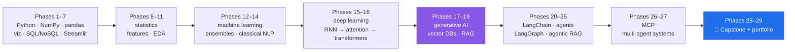

# 🌉 Project Setu

**240 days from `print("hello")` to a multi-agent research system that a human still approves.**

Data Science → Machine Learning → Deep Learning → Generative AI → RAG → **Agentic AI**, one
committed day at a time, on a **$0 budget**.

| | |
|---|---|
| **The plan** | [`docs/00_MASTER_PLAN_DS_GENAI.md`](docs/00_MASTER_PLAN_DS_GENAI.md) — 240 days, 30 phases, 276 IDs |
| **The day map** | [`docs/CURRICULUM_INDEX_DS.md`](docs/CURRICULUM_INDEX_DS.md) — every day, its IDs, its gate |
| **Progress** | [`docs/TRACKER.md`](docs/TRACKER.md) — auto-generated, never hand-edited |
| **The pins** | [`docs/PINS_DS.md`](docs/PINS_DS.md) — versions read from live PyPI, 2026-08-21 |
| **The capstone** | [`docs/CAPSTONE_SETU.md`](docs/CAPSTONE_SETU.md) — Days 225–238 |
| **Start here** | [`days/day-00-setup/LESSON.md`](days/day-00-setup/LESSON.md) |

---

## Where the curriculum comes from

The curriculum is **self-contained**: 27 modules plus an end-to-end projects section, all defined
in the plan. **Phase _N_ is Module _N_**, for N = 1…27, so every day traces back to a numbered module
one-to-one. Phase 0 is the foundry; Phases 28–29 are the capstone and the portfolio.

What this repo adds is the *engineering*: the pins, the tests that can fail, the leakage discipline,
the human approval gate, and a decision record at the end of every phase.

## The arc



## Getting started

```bash
git clone <your fork> setu && cd setu
# then follow days/day-00-setup/LESSON.md — it installs uv and Python 3.12
```

Once set up, the whole loop is five commands:

```bash
./m status         # how far along am I
./m start 4        # open today's lesson
./m scaffold 4     # create days/day-04/lab/
./m check          # ruff check + ruff format --check + offline pytest
./m done 4         # refuses to commit until the checklist is ticked and checks are green
```

`./m done` regenerates `docs/TRACKER.md` automatically, so progress can never drift from reality.

## The fifteen rules this repo runs on

The full list is Part 1 of the plan. The five that shape every file:

1. **Build daily.** Reading without a commit is not a completed day.
2. **From scratch before library.** Gradient descent before `LinearRegression`. Cosine similarity
   before Chroma. A chunker before `RecursiveCharacterTextSplitter`.
4. **Pin everything.** Exact `==` versions, a committed lockfile, `random_state=` on every estimator,
   `model=` typed out on every LLM call. Nothing floats, including randomness.
7. **Evals before features.** A behaviour is not done until a test can go red when it regresses.
8. **Leakage is the enemy.** The split comes *before* the scaler, the imputer, the encoder and the
   selector — every single time.

## Zero budget, seriously

No card on file anywhere, for 240 days. Free tiers only:

| Need | What we use |
|---|---|
| LLM calls | Gemini · Groq · OpenRouter `:free` · optional local Ollama, behind one fallback router |
| Embeddings | local `sentence-transformers` — no API at all |
| Postgres | Supabase free project |
| Documents | MongoDB Atlas M0 |
| Vectors | Chroma / FAISS, local on disk |
| CI | GitHub Actions free minutes — **every model call in CI is mocked** |
| Hosting | Streamlit Community Cloud + local Docker |

The budget is therefore **requests per day, not dollars**, and you cannot top that up at 11pm. Every
lab declares its request budget up front and logs actual usage in `docs/RATE_BUDGET_DS.md`.

## Stack currency

Versions were read from live PyPI on **2026-08-21**, not from memory. Three of them change what gets
taught, and each is handled head-on rather than in a footnote:

- **pandas 3.0** — Copy-on-Write is the only mode, so `df[col][mask] = v` silently does nothing;
  strings are an Arrow-backed `str` dtype, so `dtypes == "object"` finds no text columns.
  **Day 26 reproduces both failures on screen.**
- **NumPy 2.x** — the removed aliases appear in essentially every pre-2024 tutorial. Day 20 teaches
  only the current names.
- **transformers 5.x** — a major version. Every Phase-16 lesson ends with a live-docs verify link and
  no code block is written from memory.

Day 1's entire job is to regenerate the version table and freeze whatever *today* says.

## Writing the days that aren't written yet

`docs/TRACKER.md` shows exactly which days exist. To produce the next one:

```
/day-setu 12
```

That skill lives at [`.claude/skills/day-setu/SKILL.md`](.claude/skills/day-setu/SKILL.md) and
enforces the format: story → setup → per-ID sections with a line-by-line walkthrough of every code
block → build brief with `TODO(me)` markers → a test that must be able to fail → traps → live-docs
verification → the interview line.

## Repository layout

```
setu/
├── m                     # the daily driver (replaces make)
├── CLAUDE.md             # operating rules for the AI pair-programmer
├── pyproject.toml        # exact pins; dependencies added the day they are first used
├── docs/
│   ├── 00_MASTER_PLAN_DS_GENAI.md
│   ├── CURRICULUM_INDEX_DS.md
│   ├── TRACKER.md        # generated by scripts/tracker.py
│   ├── PINS_DS.md
│   ├── CAPSTONE_SETU.md
│   └── adr/              # thirteen decision records by Day 240
├── days/                 # day-00-setup … day-240
├── src/setu/             # deliberately almost empty — you type every line
├── tests/                # mirrors src/; offline by default, live tests opt-in
├── scripts/tracker.py    # regenerates docs/TRACKER.md from the index + disk
├── data/raw/SOURCE.md    # provenance record (the data itself is gitignored)
└── .github/workflows/    # lint + format + offline tests, no secrets, no quota spend
```
