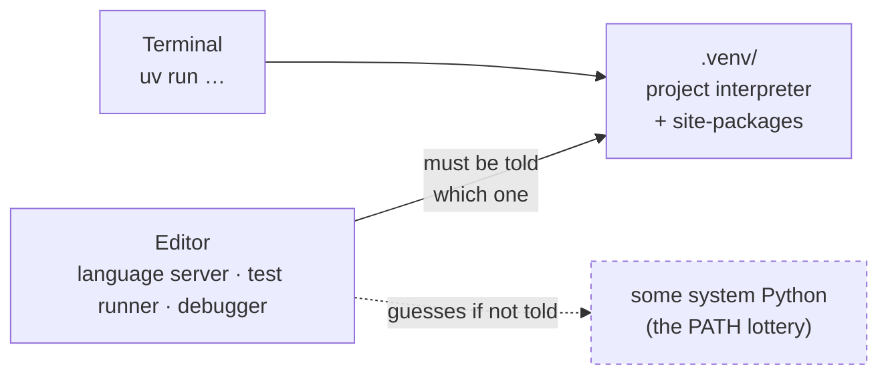

# 1.5 — The editor, and the interpreter trap inside it

## One-line answer

Your editor runs Python too — and it chooses its own interpreter, independently of your terminal, so
an editor pointed at the wrong one will underline correct code in red and run tests against a
different environment than the one you just installed into.

---

## The story

Someone finishes the setup you are doing today. Everything works: `uv run python` prints 3.12,
packages install, the terminal is happy.

They open their editor, open `analysis.py`, and the very first line is underlined in red:

> `Import "pandas" could not be resolved`

They have just installed pandas. They can prove it — they switch to the terminal *inside the same
editor window*, run the import, and it works. Back in the file: still red.

So they do what the red squiggle asks. They install pandas again, from the editor's terminal. It says
`Requirement already satisfied`. Still red. They restart the editor. Still red. They begin to
distrust the setup they completed twenty minutes ago and consider starting over.

The next day it gets worse, quietly. They click the editor's little ▷ button to run their tests. The
tests pass. They pass because the editor launched them with *its* interpreter — a system Python from
[1.1](1.1-why-one-tool-owns-the-environment.md) — which has an older pandas installed, and the
assertion they wrote happens to hold under the old behaviour. The terminal, running the project's
real environment, would have shown a failure.

The red squiggle was annoying. The green test was dangerous.

Nothing here is an editor bug. The editor is a separate program that must be *told* which interpreter
this project uses, and until it is told, it guesses — using the same `PATH` lottery you have already
learned to distrust.

---

## The idea in plain language

An **editor** is a text editor with programming features. An **IDE** — integrated development
environment — is the same idea with more of the toolchain bolted in: running, debugging, testing.
Modern editors sit somewhere between the two, and the distinction does not matter today. What matters
is one fact:

> **Your editor is a separate program that starts its own Python.**

It has to. To underline an unknown name, offer completions, or jump to a definition, it must inspect
the code the way Python would — which means it needs an interpreter and needs to know which
`site-packages` folder to look in. That work is done by a **language server**, a background process
that reads your code and answers the editor's questions about it. If the language server is pointed
at interpreter A while your terminal uses interpreter B, then everything the editor tells you is true
about a project you are not working on.

So there are now **two** environment selections to keep aligned, not one:



The good news is that the fix is one setting, and that once the project has a `.venv` folder
([2.5](2.5-the-venv-you-never-activate.md)), most editors find it automatically. The important part
is knowing that this selection *exists*, so that when the editor and the terminal disagree you
recognise the shape of the problem instead of reinstalling packages at it.

**Which editor?** Use one you already know — the concept above applies to all of them. If you have no
preference, VS Code (<https://code.visualstudio.com>) is the path of least friction here: it is free,
it renders these Markdown lessons in a side-by-side preview so you can read beside your terminal, and
its Python and Ruff extensions are maintained by the tools' own authors.

Two extensions are worth installing on day one, and it is worth knowing what each *does* rather than
just that it is recommended:

- **Python** — provides the language server (completions, go-to-definition, error underlines), the
  interpreter selector, and test discovery.
- **Ruff** — the same linter and formatter that `./m check` runs from
  [3.1](3.1-set-euo-pipefail.md) onward, shown live in the editor. Its value is that the editor and
  the gate agree: you fix things as you type rather than at commit time.

---

## Why Setu needs it

- **Principle 7 says a test must be able to go red.** A test that passes because the editor ran it
  against a different environment defeats that outright — and does so invisibly, which is worse than
  no test at all.
- **Day 26 depends on running pandas 3.x specifically.** That lesson's entire point is a behaviour
  that changed between major versions. An editor holding an older pandas will contradict the lesson
  and you will believe the editor.
- **`./m check` runs `ruff` and `pytest` in the project environment.** If your editor disagrees with
  `./m check`, one of them is lying — and this part is how you work out which.
- **240 days is long enough for small friction to compound.** Red squiggles you have learned to
  ignore are red squiggles you will ignore on the day they are right.

---

## The mechanism

Install the editor, then the two extensions. From the command line:

```bash
code --install-extension ms-python.python
code --install-extension charliermarsh.ruff
```

**Line by line:**

- `code` — VS Code's command-line entry point. On Windows the installer offers to add it to `PATH`;
  if `bash: code: command not found`, install the extensions from the Extensions panel in the
  editor's sidebar instead — the effect is identical.
- `--install-extension <publisher>.<name>` — installs by its unique marketplace identifier rather
  than its display name. The identifier is what to write down and share, because display names are
  ambiguous: several extensions call themselves "Python".

Now the setting that matters. Create the project's editor configuration:

```bash
mkdir -p .vscode
cat > .vscode/settings.json <<'EOF'
{
  "python.defaultInterpreterPath": "${workspaceFolder}/.venv/Scripts/python.exe",
  "python.terminal.activateEnvironment": false,
  "python.testing.pytestEnabled": true,
  "python.testing.unittestEnabled": false,
  "[python]": {
    "editor.defaultFormatter": "charliermarsh.ruff",
    "editor.formatOnSave": true,
    "editor.codeActionsOnSave": { "source.organizeImports.ruff": "explicit" }
  },
  "files.eol": "\n"
}
EOF
```

**Line by line:**

- `mkdir -p .vscode` — a folder the editor reads for **workspace** settings, which apply to this
  project only and are committed to Git. This is deliberate: the setting belongs to the project, not
  to your laptop, so the next person to clone it gets the same behaviour. Compare with *user*
  settings, which live in your home folder and follow you between projects.
- `cat > <file> <<'EOF' … EOF` — a **heredoc**. Everything between the marker lines is written to the
  file literally. The quotes around `'EOF'` matter: without them the shell would expand `$` and
  backticks inside the block, and this file contains `${workspaceFolder}` which must survive as text.
- `python.defaultInterpreterPath` — **the fix for the whole story above.** It tells the editor which
  interpreter this project uses, rather than letting it guess. `${workspaceFolder}` is a placeholder
  the editor expands to the project's root folder, so the path stays correct on every machine.
- `.venv/Scripts/python.exe` — the Windows layout. **On macOS and Linux this path is
  `.venv/bin/python`** — a real difference, not a cosmetic one, and the first thing to change if you
  are not on Windows. The folder does not exist yet; you create it in
  [2.4](2.4-uv-init-pyproject-and-the-lockfile.md), and the setting simply starts working then.
- `python.terminal.activateEnvironment: false` — stop the editor from auto-activating the environment
  in every terminal it opens. In this project every command goes through `uv run`
  ([2.5](2.5-the-venv-you-never-activate.md)), so auto-activation adds hidden state that can disagree
  with what `uv` does. One mechanism, not two.
- `python.testing.pytestEnabled` / `unittestEnabled` — use pytest for test discovery, and explicitly
  turn the other framework off. Setting both explicitly is Principle 4 applied to editor
  configuration: never leave a framework default to be guessed.
- `"[python]": { … }` — a **language-scoped** block: these settings apply only when editing Python
  files, so this does not change how the editor treats Markdown or JSON.
- `editor.defaultFormatter: charliermarsh.ruff` — format Python with Ruff, the same formatter
  `./m check` runs. If the editor formatted with a different tool, every save would create changes
  the gate then rejects.
- `formatOnSave: true` and `source.organizeImports.ruff` — reformat and sort imports on every save.
  This is why `ruff format --check` in `./m check` will essentially always pass: the work is already
  done by the time you commit.
- `files.eol: "\n"` — write Unix line endings, matching `core.autocrlf input` from
  [1.2](1.2-git-and-git-bash.md). The `^M` failure in that part is prevented in two places rather
  than one, because it is that annoying.

Verify the editor agrees with your terminal — this is the check worth remembering:

```bash
uv run python -c "import sys; print('terminal:', sys.executable)"
```

**Line by line:**

- Run this in your terminal, then run the *same* line in the editor's Python console or as a
  scratch file using the editor's run button. **The two paths must be identical strings.** If they
  differ, the editor is pointed elsewhere, and everything it tells you about imports is unreliable.
  This one comparison is the entire diagnostic for this part.

---

## When it breaks

**The red squiggle from the story:**

```text
Import "pandas" could not be resolved from source  Pylance(reportMissingModuleSource)
```

**What it means.** `Pylance` is the language server. It is reporting on the interpreter *it* was told
to use, and that interpreter's `site-packages` has no pandas. It is not a claim about your terminal,
your project, or reality — only about the environment the editor selected. Fix the interpreter path
(the setting above, or the interpreter picker in the editor's status bar) rather than installing the
package again. If the setting looks right and the squiggle persists, restart the language server —
in VS Code, the command palette's *Python: Restart Language Server* — because it caches its view of
the environment and does not always notice a newly created `.venv`.

**The dangerous one — a test that passes when it should fail:**

```text
# In the editor's Test Explorer
tests/test_stats.py::test_mean  PASSED

# In the terminal
$ uv run python -m pytest -q
tests/test_stats.py::test_mean FAILED
E   AssertionError: assert 3.0 == 2.5
```

**What it means.** Two interpreters, two versions of a library, two different behaviours — the exact
failure the story ended on. **When the editor and the terminal disagree, the terminal is right**, for
one specific reason: `./m check` and CI both run the terminal's path, so that is the environment that
decides whether your work is actually green. Treat the editor as a convenience and the terminal as
the source of truth, always in that order.

**Format-on-save fighting the gate:**

```text
$ ./m check
Would reformat: src/setu/stats.py
1 file would be reformatted
```

**What it means.** Something formatted that file with different rules than Ruff's — usually a second
formatter extension still installed and set as the default for Python, silently reformatting on save.
Two formatters with different opinions produce an infinite loop of diffs between editor and gate.
Disable the other one; the `"[python]"` block above exists precisely to make the choice explicit
rather than "whichever extension loaded first".

---

## In production

**The rule this part is really teaching: enforcement belongs to the repository, not to the editor.**
Format-on-save is a *convenience* so you rarely see a formatting failure. It is not a *guarantee*,
because a contributor without your extensions, an automated dependency-bump commit, or a merge can
all produce unformatted code. The guarantee is `ruff format --check` in `./m check` and in CI, which
fails the build. Every professional codebase has this pairing — a fast local convenience and a slow
authoritative gate — and the local one is never the thing you rely on. If you take one idea from
this part into a job, take that one.

**Committed editor configuration is a real practice, with limits.** Committing `.vscode/settings.json`
gives everyone consistent formatter, test runner and interpreter behaviour, which removes a class of
"works differently on your machine" arguments. What does *not* belong in it is anything personal —
themes, font sizes, keybindings — because that turns a shared file into a merge-conflict generator.
The editor-neutral version of the same idea is `.editorconfig`, which nearly every editor understands
and which is the right place for indentation and line-ending rules that must hold regardless of tool.

**Where teams take this further: development containers.** A `devcontainer.json` describes the whole
environment — base image, Python version, extensions, settings — so opening the repository builds an
identical, disposable environment for everyone, and a new contributor is productive without a setup
document at all. It is the logical end of today's argument (*something must own the environment*)
extended from packages to the entire machine. You do not need it for this project, but you should
recognise the file when you see it and know what problem it solves.

**Trust and extensions.** Editor extensions execute code with your permissions, and a project's
committed settings can point tooling at arbitrary paths. This is why editors ask whether you trust a
folder when you open a repository you did not write, and why professionals treat that prompt as a
real security decision rather than a dialog to dismiss. Install extensions from known publishers;
prefer the one maintained by the tool's own authors, which is why the Ruff extension identifier above
is worth checking rather than searching for "ruff" and picking the top result.

**The review comment a senior engineer leaves.** On a pull request adding `.vscode/settings.json`
with a personal colour theme and font size: *"Split this — project-level tool settings can be shared,
but personal preferences belong in user settings or we will be resolving conflicts on this file
forever."* And on a PR that adds format-on-save but no CI formatting check: *"This only helps people
who use this editor. Put the check in CI so it holds for everyone."*

**The interview question.** *"Your editor says the import is missing but the code runs fine in the
terminal. What is happening?"* This is a short question with a revealing answer: the interviewer wants
to hear "the editor's language server is using a different interpreter than my shell" — and, if you
are answering well, the follow-up that the same mismatch can make the editor's test runner green
while CI is red, which is the version of this bug that actually costs a team something.

---

## Check yourself

```bash
uv run python -c "import sys; print('terminal:', sys.executable)" && cat .vscode/settings.json
```

Then run the same one-line print from inside your editor, by whatever button or console it offers,
and compare the two paths character by character.

**Answer out loud, without scrolling up:**

> Why does an editor need to select an interpreter at all — what is it doing with it? Then: your
> editor's test run is green and your terminal's is red. Which do you believe, and why is that not
> just a matter of preference?

---

**Next:** [2.1 — The folder skeleton, and why each folder exists](../02/2.1-the-folder-skeleton.md)
