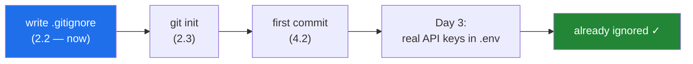

# 2.2 — `.gitignore`, written before anything secret exists

## One-line answer

`.gitignore` lists the files Git must never record, and it is written **now** — before the repository
exists and long before you have an API key — because a secret committed even once is in the history
permanently, and deleting it in a later commit does not remove it.

---

## The story

A developer is building a small service. Late in the evening they get their API key working, save it
in a file called `.env` beside the code so they stop pasting it into the terminal, and commit the
day's work with `git add -A`. The key goes with it. They do not notice; `git add -A` means *add
everything*, and everything included the file they had created ten minutes earlier.

The next morning they see it in the diff and fix it properly: delete the file, add `.env` to
`.gitignore`, commit again with the message "remove secrets". The working tree is clean. The file is
gone. Every listing of the project shows no key anywhere.

Three days later the key is used from an address on another continent, and the bill is not small.

Here is what they did not know. **Git does not store the current state of your project; it stores
every state your project has ever been in.** The commit from the previous evening still exists, still
contains `.env`, and still contains the key — that is the entire purpose of version control. The
"remove secrets" commit added a *new* state in which the file is absent. It did not, and could not,
alter the old one. Anyone with a clone of that repository has the key, and if the repository was ever
pushed to a public host, automated scanners find keys of that shape within minutes of them appearing.

The only real remedies are unpleasant: rewrite every commit from that point forward — changing every
commit identifier and requiring everyone to re-clone — **and rotate the key anyway**, because it must
be assumed to be compromised from the moment it was published.

All of which is avoided by four characters written before the mistake becomes possible: a line
reading `.env` in a file that exists first.

---

## The idea in plain language

Git divides every file in your project into one of three states:

- **Tracked** — Git knows about it and records its changes.
- **Untracked** — Git can see it but is not recording it, and mentions it every time you check status.
- **Ignored** — Git can see it, is not recording it, and does not mention it.

`.gitignore` is a plain text file, committed to the repository like any other, listing patterns for
that third state. One pattern per line. Any file matching a pattern is invisible to `git add`, absent
from `git status`, and never enters history.

Ignored files fall into two very different groups, and it is worth separating them in your head:

**Things that are regenerable.** `__pycache__/`, `.venv/`, `.pytest_cache/`, build outputs, processed
data. Committing these is not dangerous, just wrong: they bloat the repository, produce enormous
meaningless diffs, and conflict constantly, all to store something a command can rebuild in seconds.
The rule is *if a tool made it, a tool can remake it*.

**Things that must never be published.** `.env` and anything else holding a credential. Committing
one of these is not untidy; it is an incident, for the reason the story explains.

Now the single most important rule about this file, and the one that causes the most surprise:

> **`.gitignore` only affects files Git is not already tracking.**

Adding a pattern for a file Git has been tracking for a year changes nothing at all — Git keeps
recording it, because ignoring is about *whether to start*, not *whether to continue*. Untracking it
requires an explicit `git rm --cached`, and even that only stops future recording: **every past commit
still contains it.** History is append-only by design. That design is what makes Git trustworthy, and
it is exactly what makes a leaked secret permanent.

This is why the ordering in this day is deliberate rather than stylistic. You write `.gitignore`
before `git init` and long before `.env` exists, because the only reliable defence against a category
of permanent mistake is to make the mistake impossible before you are in a position to make it.



---

## Why Setu needs it

- **Day 3 puts three real API keys in `.env`** — Gemini, Groq and OpenRouter free tiers. That day
  assumes this file already exists and is already correct. It is a hundred hours too late to think
  about it then.
- **Principle 5 is zero budget.** A leaked key on a free tier does not produce a bill, but it does
  produce an exhausted quota and a suspended account — and the whole plan depends on those free
  tiers being available on the day you need them.
- **Principle 9 says data has provenance, not that data has a home in Git.** `data/raw/` and
  `data/processed/` from [2.1](2.1-the-folder-skeleton.md) are ignored here, while
  `data/raw/SOURCE.md` is deliberately kept.
- **`.venv/` is ignored from the first commit.** It contains thousands of files, is specific to your
  operating system, and is rebuilt exactly from `uv.lock`
  ([2.4](2.4-uv-init-pyproject-and-the-lockfile.md)) — the textbook example of "a tool made it, a tool
  can remake it".

---

## The mechanism

Still in the `setu/` folder from [2.1](2.1-the-folder-skeleton.md), and still **before** `git init`:

```bash
cat > .gitignore <<'EOF'
# --- secrets: never, under any circumstances ---
.env
.env.*
!.env.example
*.pem
*.key

# --- environments and caches: a tool made them, a tool can remake them ---
.venv/
__pycache__/
*.py[cod]
.pytest_cache/
.ruff_cache/
.ipynb_checkpoints/

# --- data: tracked by provenance, not by Git ---
data/raw/*
data/processed/*
!data/raw/SOURCE.md
!.gitkeep

# --- generated artifacts ---
mlruns/
.chroma/
*.db
dist/
build/
EOF
```

**Line by line:**

- `cat > .gitignore <<'EOF' … EOF` — the heredoc from [1.5](../01-toolchain/1.5-the-editor-and-the-interpreter-trap.md):
  everything between the markers is written to the file literally. The quotes around `'EOF'` matter
  here too — without them the shell would try to expand `$` and backticks inside the block.
- `# --- … ---` — comments. `.gitignore` treats `#` at the start of a line as a comment. Grouping with
  headings is not decoration: this file is read under pressure, usually by someone asking "why is my
  file not showing up?", and a grouped file answers that in seconds.
- `.env` — the exact filename. No slash, so it matches at any depth: `.env`, `config/.env`, anywhere.
- `.env.*` — `.env.local`, `.env.production`, and every other variant, because the leak usually
  happens in the file you did not think to list.
- `!.env.example` — the `!` is a **negation**: re-include a file an earlier pattern excluded.
  `.env.example` is the *template* — the same keys with empty values — and it is committed
  deliberately, so a new contributor can see which variables are needed without ever seeing a value.
  Order matters: a negation only works if the pattern it reverses came earlier.
- `*.pem`, `*.key` — `*` matches any run of characters within one path component. Private keys and
  certificates, ignored by extension.
- `.venv/` — the trailing slash means **directory only**, so a *file* named `.venv` would not be
  matched. Precision here prevents surprises later.
- `*.py[cod]` — a character class: matches `.pyc`, `.pyo` and `.pyd`, the compiled forms Python
  leaves behind. One line instead of three.
- `data/raw/*` — note this is `/*` (the contents) rather than `/` (the folder). The distinction is
  what makes the next line possible: Git cannot re-include a file inside an excluded *directory*,
  because it never descends into it — but it can re-include a file whose *siblings* were excluded.
- `!data/raw/SOURCE.md` — the provenance record from Principle 9, kept while the datasets beside it
  are dropped. This pairing is the whole reason the previous line is written the way it is.
- `!.gitkeep` — Git records files, not folders, so an empty folder cannot be committed. The
  convention is an empty file named `.gitkeep` inside it; this line makes sure the ignore rules do
  not swallow it.
- `mlruns/`, `.chroma/`, `*.db` — experiment tracking output, the local vector store, and SQLite
  files. Every one is generated by a later phase, and every one is regenerable.

Now create the template that gets committed in place of the real thing:

```bash
cat > .env.example <<'EOF'
# Copy to .env and fill in. .env is git-ignored; this file is not.
GEMINI_API_KEY=
GROQ_API_KEY=
OPENROUTER_API_KEY=
EOF
```

**Line by line:**

- Same heredoc mechanism. The value of this file is that it documents the *shape* of the secrets — the
  exact variable names the code will read — with no values in it. A new contributor copies it, fills
  it in, and the copy is ignored. The names are the interface; the values never enter the repository.
- The keys listed are the three free-tier providers Day 3 sets up. Empty now, filled then.

Verify the rules do what you expect, before you rely on them:

```bash
touch .env && git init -q 2>/dev/null; git check-ignore -v .env .env.example .venv README.md
```

**Line by line:**

- `touch .env` — create an empty `.env` purely to test the rule. There is nothing secret in it yet;
  that is the point of testing now.
- `git init -q` — a repository is needed for the next command to work. `-q` is quiet.
  [2.3](2.3-git-init-and-what-a-repo-is.md) covers what this actually did; running it here early is
  harmless because `.gitignore` was written first, which was the whole objective.
- `;` versus `&&` — a semicolon runs the next command **regardless** of whether the previous one
  succeeded, unlike `&&` from [1.3](../01-toolchain/1.3-uv-the-one-binary.md). Used here because `git init` in an
  existing repository is a harmless no-op you do not want stopping the check.
- `git check-ignore -v <paths>` — the command most people never learn and should. It answers "is this
  ignored, and **which line of which file** decided that?" `-v` is what adds the second half. Expect
  `.env` and `.venv` to be reported as ignored with the line that matched, and `.env.example` and
  `README.md` to produce nothing, because they are not ignored.

---

## When it breaks

**The classic: adding a pattern for a file Git already tracks.**

```text
$ echo ".env" >> .gitignore
$ git status
On branch main
Changes not staged for commit:
        modified:   .env
```

**What it means.** Git is still tracking `.env` and still reporting changes to it, because — as above
— ignore rules apply to *untracked* files only. The pattern you just added does nothing for this
file. To stop tracking it going forward:

```text
$ git rm --cached .env
$ git commit -m "stop tracking .env"
```

`--cached` removes it from Git's index while **leaving the file on disk** — without that flag, `git
rm` deletes your actual file, which is a bad way to discover the difference. But read this carefully:
**the previous commits still contain it.** This stops the bleeding; it does not undo the leak.

**The one that must be handled correctly, because the obvious fix does not work:**

```text
$ git log --oneline -- .env
a1b2c3d  add config
$ git rm .env && git commit -m "remove secret"
$ git log --all --oneline -- .env
a1b2c3d  add config      <- still there. still contains the key.
```

**What it means.** The file is gone from the latest state and fully present in commit `a1b2c3d`,
which anyone can check out. The response, in this order:

1. **Rotate the credential immediately.** Revoke the old one at the provider and issue a new one.
   This is the only step that actually makes you safe, and it is first for that reason — everything
   else is cleanup.
2. **Then** rewrite history if the repository was shared, with a purpose-built tool (`git filter-repo`
   is the current recommendation). This rewrites every affected commit, so every collaborator must
   re-clone, and any fork or cached copy on a hosting platform may retain the old objects regardless.
3. Assume the key was captured. Public repositories are scanned continuously by automation looking
   for exactly this; a key can be exercised within minutes of being pushed.

The order matters more than the tooling. People instinctively reach for step 2 first, because it feels
like undoing the mistake, and lose time during which the credential is live.

**The confusing one, when a whole folder is excluded:**

```text
$ git check-ignore -v data/raw/SOURCE.md
.gitignore:18:data/raw/    data/raw/SOURCE.md
```

**What it means.** If the pattern had been `data/raw/` (the directory) rather than `data/raw/*` (its
contents), Git would not descend into the folder at all and the `!data/raw/SOURCE.md` negation could
never take effect — a negation cannot rescue a file inside an excluded directory. This is why the
file above is written with `/*`. When a negation "does not work", this is nearly always the reason,
and `git check-ignore -v` names the offending line directly.

---

## In production

**Prevention is layered, because one layer always fails.** A professional setup has all four:

1. `.gitignore` in the repository, so the file is never staged.
2. A **pre-commit hook** running a secret scanner, so a credential pasted into an ordinary source
   file — the case `.gitignore` cannot catch — is blocked before the commit exists.
3. **Server-side secret scanning** on the hosting platform, which alerts (and can block the push) on
   recognised key formats.
4. **Short-lived credentials** so that a leaked secret expires on its own.

Notice that the last one is architectural rather than procedural. That is the direction the industry
moves in for everything on this list: the strongest control is the one that does not depend on
someone remembering.

**Secrets do not belong in files at all, once you are past a laptop.** `.env` is a local development
convenience. In production, credentials come from a secret manager or the platform's own mechanism,
injected as environment variables at start-up, never written to disk, rotated automatically, and
access-logged. The habit that transfers from today is `os.environ` (or `python-dotenv`, which reads
`.env` **into** `os.environ` for local runs only): your code reads configuration from the
environment, and where the environment gets it from is a deployment concern your code never knows
about. Write it that way from Day 3 and the same code runs unmodified on your laptop and in a
cluster.

**A global ignore file for personal noise.** Editor and OS artifacts — `.DS_Store`, `Thumbs.db`, an
editor's local folder — are *your* environment, not the project's, and adding them to a shared
`.gitignore` slowly turns it into a list of everyone's tooling. The convention is a personal global
ignore (`core.excludesFile`) for those, keeping the repository's file about the repository. There is
also `.git/info/exclude` for patterns local to one clone that you do not want to commit at all.

**Repository size is a permanent decision.** Because history is append-only, a large file committed
once is carried by every clone forever, and CI pays that cost on every run. This is why teams take
data and binary artifacts out of Git entirely, referencing object storage instead. The general
principle worth carrying: **anything you put into Git history, you are putting there permanently** —
treat `git add` as a decision, not a reflex.

**The review comment a senior engineer leaves.** On a pull request whose diff includes
`config/settings.local.json`: *"This looks machine-specific — should it be ignored rather than
committed?"* And, far more seriously, on any diff containing something shaped like a key: *"Stop —
rotate this credential now, then we will deal with the history. Do not just amend the commit."* The
insistence on rotating first is the professional instinct this whole part is teaching.

**The interview question.** *"You have accidentally committed and pushed an API key. What do you
do?"* This is asked constantly, and the ranking of answers is stark. Weakest: "delete it and commit
again" — reveals a misunderstanding of what a commit is. Adequate: "rewrite history with
`filter-repo` and force-push". Strong: "**rotate the key first**, because it must be assumed
compromised the moment it was pushed; then rewrite history and notify everyone to re-clone; then add
scanning so it cannot recur." They are testing whether you understand that history is immutable and
that the credential — not the commit — is the actual liability.

---

## Check yourself

```bash
git check-ignore -v .env .env.example .venv data/raw/SOURCE.md README.md; echo "exit: $?"
```

`.env` and `.venv` should be reported with the rule that matched. `.env.example`, `data/raw/SOURCE.md`
and `README.md` should produce no output at all — they are not ignored, which is exactly what you
want. (`$?` holds the previous command's exit status; `check-ignore` returns non-zero when *none* of
the paths were ignored, which is itself information.)

**Answer out loud, without scrolling up:**

> Why does adding `.env` to `.gitignore` do nothing if `.env` is already tracked, and what does it
> still not fix even after `git rm --cached`? Then: your key was pushed to a public repository an
> hour ago. What is the **first** thing you do, and why is it not rewriting history?

---

**Next:** [2.3 — `git init`, and what a repository actually is](2.3-git-init-and-what-a-repo-is.md)
