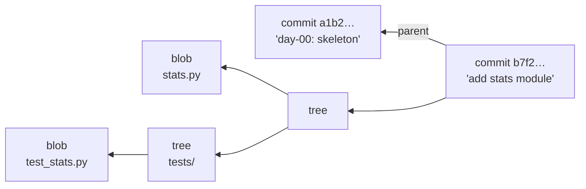

# 2.3 — `git init`, and what a repository actually is

## One-line answer

`git init` creates one hidden folder, `.git`, and everything Git does for the rest of your life is
reading and writing files inside it — a content-addressed store of snapshots, plus a few small text
files that point at which snapshot you are standing on.

---

## The story

Two people are asked the same question in an interview: *"What does `git commit` do?"*

The first has used Git daily for two years. They answer: "It saves your changes." Asked what happens
when they run `git checkout` on an old commit and their files change, they say the files are
"restored from GitHub". Asked what happens with no network, they hesitate — they have never tried.
Asked why `git log --oneline` shows `a1b2c3d` next to each commit, they say it is an ID the system
generates, like a row number.

The second answers: "It writes a few objects into `.git`, then moves a pointer." Asked the same
follow-ups, they explain that everything is local, that the network is only involved when you
explicitly push or fetch, and that `a1b2c3d` is not a row number at all — it is the beginning of a
hash of the commit's *content*, which is why two identical snapshots produce the same identifier and
why changing anything about a commit changes its name.

They have both been "using Git" for the same length of time. Only one of them can debug it. When a
rebase goes wrong at 6pm the day before a release, the first person searches for a command to paste
and hopes; the second asks where `HEAD` is pointing, checks the reflog, and moves a pointer back.

The difference is not experience. It is that one of them has looked inside `.git` once.

You are going to look inside it now, on a repository with nothing to lose.

---

## The idea in plain language

**A repository is a folder with a `.git` folder in it.** That is the whole definition. `git init`
creates `.git`; nothing else about your project changes. Delete `.git` and you have an ordinary
folder of files with no history — which is a useful thing to know, because it means "starting over"
is never dramatic.

Inside, Git stores your project as a **content-addressed database**. That phrase is worth unpacking,
because everything else follows from it.

Normally you name a thing and then look up its contents: "give me `report.py`". Content-addressed
means the opposite — **the content determines the name.** Git takes the bytes of a thing, runs them
through a hash function (a calculation that turns any input into a fixed-length string of hex
digits), and stores the thing under that hash. Identical content therefore always produces the same
name, and any change at all produces a completely different one.

There are three kinds of thing stored this way:

| Object | What it holds |
|---|---|
| **blob** | the contents of one file — just bytes, no filename |
| **tree** | a directory listing: names, permissions, and the hash of the blob or tree each name points to |
| **commit** | one tree hash (the whole project at that moment), the hash of the previous commit(s), the author, the timestamp, and the message |

So a commit points at a tree, which points at blobs and other trees. That is the complete snapshot.
And because a commit contains the hash of its parent, and the hashes are derived from content,
**a commit's identity depends on its entire history.** Change one character in a commit from last
year and every commit after it gets a new hash. This is exactly why the leaked secret in
[2.2](2.2-gitignore-before-secrets-exist.md) cannot be quietly edited out: history is not
append-only by policy, it is append-only by mathematics.



Then there is the part people find genuinely surprising: **a branch is not a container.** It is a
file containing one hash. `main` is literally a file at `.git/refs/heads/main` whose entire contents
are the hash of the newest commit on that branch. Creating a branch writes a 41-byte file; that is
why it is instant. And **`HEAD`** is another small file saying which branch you are currently on.
"Switching branches" means changing where `HEAD` points and updating your files to match.

Finally, the three places a file can be, which explains every `git status` message you will ever
read:

| Place | What it is |
|---|---|
| **working tree** | the actual files you edit |
| **index** (also called the *staging area*) | the snapshot being prepared for the next commit |
| **repository** | the committed objects in `.git`, permanent |

`git add` copies from the working tree into the index. `git commit` turns the index into a commit
object. The index existing as a separate step is what lets you commit *some* of your changes — and
it is why `git status` distinguishes "changes not staged for commit" from "changes to be committed".
Those two phrases are not jargon once you know there are two places.

---

## Why Setu needs it

- **Principle 1: no commit means the day is not done.** You will run `git commit` roughly 240 times.
  Understanding what it writes turns a ritual into a tool.
- **`./m done N` commits automatically** ([3.3](../03-m-script/3.3-the-done-gate.md)). When it refuses, or
  when it commits something you did not expect, the fix requires knowing what the index is.
- **[2.2](2.2-gitignore-before-secrets-exist.md) claimed history is permanent.** This part is the
  proof of that claim — content addressing is *why*, and a claim you can justify is one you will act
  on rather than nod at.
- **Day 2 adds GitHub Actions**, which checks out your repository by commit hash. Knowing that the
  hash names the content — not the moment — makes CI behaviour predictable rather than magical.

---

## The mechanism

In the `setu/` folder, after `.gitignore` exists ([2.2](2.2-gitignore-before-secrets-exist.md) —
the order matters):

```bash
git init
```

**Line by line:**

- `git init` — create `.git` in the current folder and initialise an empty repository. It touches
  none of your existing files; it only adds the database. It is also safe to run twice — on an
  existing repository it reinitialises the configuration without harming your history — though there
  is no reason to.
- Note what did **not** happen: no network, no account, no remote server. A Git repository is
  complete and fully functional offline. Hosting is something you may add later, not something Git
  requires.

Now look inside, which almost nobody does:

```bash
ls -A .git && cat .git/HEAD
```

**Line by line:**

- `ls -A` — list contents including dot-prefixed entries, but **not** `.` and `..`. (Plain `ls -a`
  includes those two and adds noise.)
- You will see `objects/` (the content-addressed database), `refs/` (branches and tags — the files
  containing hashes), `HEAD`, `config` (this repository's settings, the third level from
  [1.2](../01-toolchain/1.2-git-and-git-bash.md)), and `hooks/` (scripts Git can run at certain moments).
- `cat .git/HEAD` — prints `ref: refs/heads/main`. Read that carefully: `HEAD` does not contain a
  commit hash right now, it contains **the name of a branch**. That indirection is what makes commits
  advance the branch automatically. The branch file itself does not exist yet, because there are no
  commits to point at — which is the honest reason a fresh repository has "no commits yet".

Now make the abstraction concrete by putting one object in the database by hand:

```bash
echo "hello setu" | git hash-object -w --stdin
```

**Line by line:**

- `echo "hello setu"` — produce some content.
- `|` — the pipe from [1.2](../01-toolchain/1.2-git-and-git-bash.md): feed it to the next command's input.
- `git hash-object` — a **plumbing** command. Git's commands split into *porcelain* (the friendly
  ones: `add`, `commit`, `status`) and *plumbing* (the internals the porcelain is built on). This one
  computes the hash of some content and, with `-w`, **w**rites it into the object database.
- `--stdin` — read the content from the pipe rather than from a filename.
- The output is the hash — the object's name. Run the identical command again and you get the
  identical hash, because the content determines the name. That is content addressing, demonstrated
  in one line rather than asserted.

Read it back, and see how it is stored:

```bash
HASH=$(echo "hello setu" | git hash-object --stdin) && git cat-file -t "$HASH" && git cat-file -p "$HASH"
```

**Line by line:**

- `HASH=$(...)` — **command substitution**: run the command inside `$( )` and assign its output to a
  shell variable. No spaces around `=`; bash is strict about that.
- `git cat-file -t "$HASH"` — print the object's **t**ype. It says `blob`: a bare bag of bytes, with
  no filename attached. Filenames live in trees, not in blobs — which is why renaming a file in Git
  creates no new blob at all.
- `git cat-file -p "$HASH"` — **p**retty-print the object's contents. Your text comes back.
- The quotes around `"$HASH"` are habit worth forming: unquoted variables get split on spaces by the
  shell, which is a bug generator in every script you will ever write.

---

## When it breaks

**Running a Git command outside a repository:**

```text
$ git status
fatal: not a git repository (or any of the parent directories): .git
```

**What it means.** Git looked in the current folder for `.git`, did not find it, walked *upwards*
through each parent folder, and never found one. That upward walk is worth knowing about for its
own sake: it is why Git commands work from any subfolder of your project. If you see this, you are
either in the wrong directory or you have not run `git init` yet.

**The mirror-image mistake, which is worse:**

```text
$ cd ~
$ git init
Initialized empty Git repository in /c/Users/me/.git/
```

**What it means.** You have just made your entire home folder a repository. Every subsequent
`git status` anywhere beneath it — because of that upward walk — will report thousands of untracked
files, and a careless `git add -A` would try to commit your whole user profile. The fix is to remove
the accident:

```text
$ rm -rf ~/.git
```

Deleting `.git` deletes only the history, never your files — the definition at the top of this part
made that predictable rather than frightening. **Always check where you are before `git init`**;
`pwd` (print working directory) costs nothing.

**The one that looks like data loss and is not:**

```text
$ git checkout a1b2c3d
Note: switching to 'a1b2c3d'.

You are in 'detached HEAD' state. You can look around, make experimental
changes and commit them, and you can discard any commits you make in this
state without impacting any branches by switching back to a branch.
```

**What it means.** `HEAD` now contains a commit hash directly instead of `ref: refs/heads/main` — you
are standing on a commit rather than on a branch. Nothing is lost and nothing is broken; commits you
make here simply have no branch name pointing at them, so they are hard to find later. `git switch
main` reattaches. This message frightens people entirely because they have never been told that
`HEAD` normally holds a *branch name*; once you know that, "detached" is a precise and unalarming
description.

---

## In production

**Commit hashes are the identifier everything else builds on.** Container images are tagged with the
commit they were built from; deployments record it; error trackers map a stack trace back to it. This
works because the hash names the *content*, so "which code is running in production?" has an exact,
verifiable answer. Branch names cannot do this job — `main` means something different every day.
When you see `IMAGE_TAG=$GIT_SHA` in a pipeline, that is this property being used.

**Repositories get slow in specific, predictable ways.** Because every version of every file is
stored forever, a repository's cost is driven by its *history*, not its current size. Large binaries
committed once are carried forever ([2.2](2.2-gitignore-before-secrets-exist.md)). Teams manage this
with shallow clones (`--depth 1`) in CI, where only the latest state is needed, and with `git gc`,
which repacks loose objects into compressed packfiles. The reason a first clone of a mature
repository is slow is that you are downloading a decade of history, not a folder.

**The reflog is the safety net nobody knows about until they need it.** Git records every position
`HEAD` has held, locally, for weeks — including ones no branch points at any more. So a "lost"
commit after a bad rebase, reset or branch deletion is usually recoverable with `git reflog` and a
`git switch -c rescue <hash>`. This is the single highest-value fact in this part: **in Git,
committed work is almost never actually lost.** Uncommitted work, by contrast, genuinely can be — a
`git checkout --` over unstaged changes is unrecoverable, because those bytes were never written into
the object database. Commit early; committed things have names.

**Hooks are how teams enforce things locally.** `.git/hooks/` holds scripts Git runs at specific
moments — before a commit, before a push. This is where the secret scanner from
[2.2](2.2-gitignore-before-secrets-exist.md) lives. The important caveat, worth carrying into any
team: `.git/` is **not** committed, so hooks are per-clone and can be bypassed with `--no-verify`.
Local hooks are a convenience for developers; the authoritative check is always server-side, in CI.
Same shape as the format-on-save argument in [1.5](../01-toolchain/1.5-the-editor-and-the-interpreter-trap.md),
and the same conclusion.

**On hash algorithms.** Git historically used SHA-1, and SHA-1 collisions have been demonstrated,
which caused understandable alarm. In practice Git added collision detection, and the project has
been migrating toward SHA-256 repositories. You do not need to act on this, but you should be able to
say it if asked — "content-addressed with SHA-1, with hardening added and a SHA-256 migration path"
is the accurate sentence.

**The review comment a senior engineer leaves.** On a deployment script that deploys `main`:
*"Pin the deploy to a commit SHA — `main` is a moving target and we cannot roll back to 'main as of
Tuesday'."* And on a PR that force-pushes a shared branch: *"This rewrites hashes everyone else has
based work on — please open a new branch instead."*

**The interview question.** *"What is a branch in Git?"* If you answer "a copy of the code" or "a
separate version of the project", you have described a different tool. The answer that lands is "a
file containing a commit hash — which is why branching is instant and why deleting a branch does not
delete any commits." A good follow-up is *"then what is `HEAD`?"*, and the answer is usually a
pointer to a branch, occasionally a commit directly, which is what "detached" means.

---

## Check yourself

```bash
ls -A .git && cat .git/HEAD && git status --short && git count-objects -v
```

`git status --short` should print nothing but untracked files, and `git count-objects -v` shows how
many objects the database holds — one, if you ran the `hash-object` demonstration above.

**Answer out loud, without scrolling up:**

> What are the three places a change can be, and which command moves it between each pair? Then:
> why does editing a commit from last month change the hash of every commit made since — and what
> does that fact mean for a password committed by accident?

---

**Next:** [2.4 — `uv init`, `pyproject.toml`, and the lockfile](2.4-uv-init-pyproject-and-the-lockfile.md)
