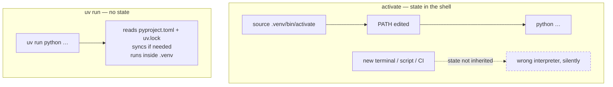

# 2.5 — The `.venv` you never activate

## One-line answer

A virtual environment is an ordinary folder holding one interpreter and its own `site-packages`, and
"activating" it just edits `PATH` in one shell — which is why this project skips activation entirely
and puts `uv run` in front of every command instead.

---

## The story

Someone is working on two projects on the same afternoon. Both are Python. One needs an older version
of a library because a colleague's code depends on it; the other is on the newest.

They open a terminal, activate the first project's environment, and work. Then they need to check
something in the second project, so they `cd` across and run the tests. They pass. They fix a small
thing and run them again. They pass. They commit.

The next morning CI fails on that commit, on a function that has nothing to do with the change.

What happened is invisible in every record they could look at. They never activated the second
project's environment — the first one was still active, because activation belongs to the *shell*,
not to the folder, and `cd` does not change it. So the tests ran against the wrong library version
all afternoon and passed under behaviour that does not exist in the project they were committing to.
Their terminal prompt did show `(project-one)` in small letters at the start of every line. They had
stopped seeing it hours earlier, the way you stop seeing anything that is always there.

This is a mode error: the same command means different things depending on invisible state, and
nothing warns you when the state is wrong. The fix is not to be more careful. It is to remove the
mode.

---

## The idea in plain language

Start with what a virtual environment actually is, because the word suggests something far grander
than the reality. It is **a folder**. Ordinarily called `.venv`, and it contains:

```text
.venv/
├── pyvenv.cfg              # a tiny text file naming the base interpreter and version
├── Scripts/  (Windows)     # python.exe, plus an executable for each installed tool
│   bin/      (macOS/Linux)
└── Lib/site-packages/      # this project's packages — and only this project's
```

No virtualisation, no container, no isolation enforced by the operating system. It is a directory
laid out so that the interpreter inside it looks for packages *beside itself* rather than in the
system's shared location. That is the entire mechanism, and it is enough to give every project its
own `site-packages` — the exact separation that
[1.1](../01-toolchain/1.1-why-one-tool-owns-the-environment.md) said the environment needs.

**Activation** is equally modest. The `activate` script does three things: it prepends
`.venv/Scripts` (or `bin`) to `PATH`, sets a variable called `VIRTUAL_ENV`, and changes your prompt
so you can tell. That is all. After activation, typing `python` finds the environment's interpreter
first, because of the `PATH` rule from [1.1](../01-toolchain/1.1-why-one-tool-owns-the-environment.md) — first
match wins.

Now the problem, stated precisely: **activation is state held in one shell.** It is not a property of
the folder you are standing in. Consequences:

- Opening a new terminal starts unactivated. Forgetting is silent.
- `cd`-ing to another project does **not** switch environments.
- A script you run, an editor's test runner ([1.5](../01-toolchain/1.5-the-editor-and-the-interpreter-trap.md)),
  a scheduled job, or a CI step each start their own shell — none of which inherited your activation.
- The only indicator is a prompt prefix you will stop noticing.

`uv run <command>` removes the mode. It means: *ensure this project's environment matches the
lockfile, then run this command inside it.* Per command, with no state to be in and none to forget:



Two properties fall out of this, and both matter more than the typing you save:

**It is self-healing.** `uv run` checks the environment against the lockfile before running. If a
teammate added a dependency and you pulled their commit, `uv run` installs it — you do not get a
`ModuleNotFoundError` for a package you never knew was added.

**It is honest across contexts.** The identical command works in your terminal, in a script, in
`./m check`, in a `Makefile`, and in CI, because none of them depend on a human having typed
`activate` first. A command that behaves the same everywhere is worth a great deal more than three
saved keystrokes.

And `.venv/` is in `.gitignore` ([2.2](2.2-gitignore-before-secrets-exist.md)) because it is
thousands of files, specific to your operating system and CPU, and rebuilt exactly from `uv.lock`
([2.4](2.4-uv-init-pyproject-and-the-lockfile.md)). It is generated output, not source.

---

## Why Setu needs it

- **`./m check` and `./m done` are shell scripts** ([3.2](../03-m-script/3.2-the-case-dispatcher.md)). A script
  runs in its own shell and inherits no activation. Every command inside them is `uv run <thing>`
  for exactly this reason.
- **Day 2 runs the same commands in GitHub Actions.** There is no interactive shell there and nobody
  to type `activate`. Commands that never needed it work unchanged — the same transfer argument as
  Git Bash in [1.2](../01-toolchain/1.2-git-and-git-bash.md).
- **Principle 7 needs tests you can trust.** The story's failure is a test suite that passed against
  the wrong environment, which is Principle 7 defeated silently — the worst way, because you believe
  the green.
- **240 days is long enough to forget.** A convention that depends on remembering will be broken;
  one that has nothing to remember will not.

---

## The mechanism

The environment already exists — `uv add` in [2.4](2.4-uv-init-pyproject-and-the-lockfile.md) created
it. Look at it rather than taking it on faith:

```bash
ls -A .venv && cat .venv/pyvenv.cfg
```

**Line by line:**

- `ls -A .venv` — the layout from the table above. On Windows you will see `Scripts/`; on
  macOS/Linux, `bin/`. This difference is why [1.5](../01-toolchain/1.5-the-editor-and-the-interpreter-trap.md)'s
  editor setting had a platform-specific path.
- `cat .venv/pyvenv.cfg` — a handful of lines naming the base interpreter this environment was built
  from and its version. Reading it is the fastest way to answer "what is actually in here?" and it
  makes the point that a virtual environment is configuration plus a folder, not a mechanism.

Now the command you will type for the rest of the project:

```bash
uv run python -c "import sys; print(sys.executable); print(sys.prefix)"
```

**Line by line:**

- `uv run <command>` — sync the environment against `pyproject.toml` and `uv.lock`, then execute the
  command inside it. Everything after `uv run` is the command; `uv` does not interpret it.
- `sys.executable` — from [1.1](../01-toolchain/1.1-why-one-tool-owns-the-environment.md): the interpreter
  actually running. It should now point **inside** `.venv`, not at the standalone 3.12 from
  [1.4](../01-toolchain/1.4-python-3-12-under-uv.md) and not at any system Python.
- `sys.prefix` — the environment root. Compare it with the path from `.venv/pyvenv.cfg`: this is the
  project's environment, and the base interpreter is a separate thing it was built from.

Prove the mode error cannot happen here:

```bash
env -u VIRTUAL_ENV -u PATH bash -c 'cd "'"$PWD"'" && uv run python -c "import dotenv; print(\"works with no PATH at all\")"'
```

**Line by line:**

- `env -u VIRTUAL_ENV -u PATH` — run a command with those two environment variables **u**nset. This
  is the strongest possible version of "no activation": not merely unactivated, but with the whole
  `PATH` removed.
- `bash -c '<command>'` — start a fresh shell to run the command, so nothing from your current shell
  leaks in.
- The nested quoting `'"'"$PWD"'"'` — closing the single-quoted string, inserting a double-quoted
  `$PWD` (**p**rint **w**orking **d**irectory), and reopening. Ugly, and shown deliberately: quoting
  in bash is where scripts break, and seeing the pattern once means recognising it later.
- If it prints, the point is proven: this project's commands do not depend on shell state. Under the
  activation workflow, the same test fails immediately.

Compare with what you are *not* doing:

```bash
source .venv/Scripts/activate 2>/dev/null || source .venv/bin/activate; echo "$VIRTUAL_ENV"; deactivate
```

**Line by line:**

- `source <file>` — run a script **in the current shell** rather than in a child. This is essential:
  a child shell's `PATH` edits die with it, so `activate` must be sourced, never executed. That
  subtlety is the reason `./activate` does nothing useful and confuses everyone once.
- `2>/dev/null` — discard error output. `2` is the file descriptor for standard error; `/dev/null`
  discards. Used here because the Windows path fails on macOS/Linux and vice versa.
- `|| source .venv/bin/activate` — `||` runs the right side only if the left **failed**, the mirror of
  `&&` from [1.3](../01-toolchain/1.3-uv-the-one-binary.md). Together they make one line work on both platforms.
- `echo "$VIRTUAL_ENV"` — the variable activation sets. This is the state in question: a string in
  one shell's memory, invisible unless you look for it.
- `deactivate` — undo it, restoring the saved `PATH`. Run this now; you will not use activation again
  in this project.

---

## When it breaks

**The story's failure, seen from inside:**

```text
$ cd ~/projects/project-two
$ pytest
============================= 12 passed =============================

$ echo "$VIRTUAL_ENV"
/home/me/projects/project-ONE/.venv
```

**What it means.** The tests ran, imported, and passed — using project **one**'s packages, because
`cd` changed the directory and not the shell's `PATH`. There is no error message anywhere; the only
evidence is the variable. `uv run pytest` would have been correct without anyone noticing there was a
question. **When two projects behave inexplicably, print `$VIRTUAL_ENV` before anything else.**

**The one that follows a `git pull`:**

```text
$ python -m pytest
ImportError while loading conftest: No module named 'httpx'
```

**What it means.** A teammate added a dependency; you pulled the commit; your `.venv` predates it.
Under activation you must notice and manually reinstall. `uv run pytest` reads the lockfile first and
installs the missing package before running — the self-healing property, doing the thing you would
otherwise have had to remember.

**The corrupted environment, and why it is a non-event here:**

```text
$ uv run python -c "import pandas"
ImportError: DLL load failed while importing _libs: The specified module could not be found.
```

**What it means.** The environment is damaged — an interrupted install, a moved folder, a partially
upgraded system library. On any other setup this is an afternoon. Here it is one line, because
`.venv` is disposable by design:

```text
$ rm -rf .venv && uv sync --locked
```

That works because `uv.lock` holds the complete resolution
([2.4](2.4-uv-init-pyproject-and-the-lockfile.md)). **"Delete it and rebuild" being a safe reflex is
the entire payoff of the previous part**, and it is worth noticing that the two parts combine into a
property neither has alone.

**And the one that catches everyone once:**

```text
$ ./venv/bin/activate
bash: ./venv/bin/activate: Permission denied
```

**What it means.** You executed it instead of sourcing it. Even with the permission fixed, executing
`activate` would achieve nothing: it would edit the `PATH` of a child shell that exits immediately.
`source` is required because the whole point is to modify *this* shell — which is, once again, the
observation that activation is shell state.

---

## In production

**In containers, the argument shifts and mostly disappears.** A container already provides isolation
— one image, one application — so a virtual environment inside it can look redundant. Two things are
still true. First, using one keeps the application's packages separate from the base image's system
Python, which is the [1.1](../01-toolchain/1.1-why-one-tool-owns-the-environment.md) rule holding inside the
image. Second, and more useful, a `.venv` is a single self-contained directory, which makes
multi-stage builds clean: install into `/app/.venv` in a builder stage, `COPY --from=builder
/app/.venv /app/.venv` into a slim runtime image, and the compilers and caches never ship. The
runtime image then invokes `/app/.venv/bin/python` **by absolute path** — no activation, no `PATH`
games, which is the same instinct as `uv run` expressed differently.

**Nobody activates in CI either.** A CI job is a sequence of non-interactive shell steps, each
potentially a fresh process. Pipelines therefore either call the interpreter by absolute path or
prefix commands with the tool, exactly as `./m check` does. If you ever see `source venv/bin/activate
&& pytest` in a CI file, it works only because both halves share one shell invocation — and it breaks
the moment someone splits them into two steps. That is a real, common, confusing failure, and it is
the same mode error as the story.

**Where teams do keep activation, they automate it.** Tools like `direnv` activate the right
environment automatically when you `cd` into a directory — turning shell state into a property of the
folder, which is the correct fix if you want activation at all. Worth knowing about, because a
colleague's terminal that "just knows" is running one of these rather than being disciplined.

**Multiple environments per project is a real requirement.** Libraries must be tested against several
Python versions and dependency combinations, which is what `tox` and `nox` orchestrate: many
environments, created and destroyed programmatically, none of them activated by a human. The
underlying idea is identical to this part's — an environment is a folder you point a command at,
not a mode you enter.

**The performance detail behind `uv run` in a hot loop.** `uv run` checks the environment against the
lockfile each time, which is fast but not free. In a script that shells out repeatedly, or in a
container where the environment is known to be correct, `uv run --no-sync` skips the check. Use it
when the environment is guaranteed by construction — a built image — and not on a developer's
machine, where the check is the feature.

**The review comment a senior engineer leaves.** On a `Dockerfile` with `RUN source venv/bin/activate
&& python app.py`: *"Each `RUN` is a separate shell — this activation does not survive to the next
layer. Call the venv's python by absolute path, or set the `PATH` in an `ENV` line."* And on a README
whose setup instructions begin "activate the virtualenv, then...": *"Can we make the commands work
without activation? Half the support questions we get are people who skipped that line."*

**The interview question.** *"What does activating a virtual environment actually do?"* The weak
answer is "it switches to the project's Python". The strong answer is "it prepends the environment's
script directory to `PATH` and sets `VIRTUAL_ENV` in the current shell — which is why it does not
survive into subprocesses, scripts, or the next terminal, and why CI and containers invoke the
interpreter by path instead." If you can then describe the failure mode — the wrong environment still
active after changing projects, tests passing against the wrong library — you have shown you have
been bitten by it, which is what they are actually checking.

---

## Check yourself

```bash
uv run python -c "import sys; print(sys.executable)" && echo "VIRTUAL_ENV is: '${VIRTUAL_ENV:-<unset, and that is correct>}'"
```

The first path should be inside `.venv`. The second should report **unset** — you are running the
project's interpreter without having activated anything, which is the entire point of this part.
(`${VAR:-default}` substitutes the default when the variable is unset or empty; a small piece of
shell you will use often.)

**Answer out loud, without scrolling up:**

> What are the three things the `activate` script actually does, and why must it be `source`d rather
> than executed? Then: your tests pass locally and fail in CI with an `ImportError`. Name two ways
> the activation workflow could produce that, and say why `uv run` prevents both.

---

**Next:** [3.1 — `set -euo pipefail`, the four characters that make bash safe](../03-m-script/3.1-set-euo-pipefail.md)
