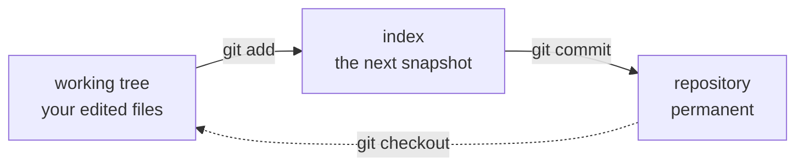

# 4.2 — The first commit, and reading a clean tree

## One-line answer

`git add -A` stages everything and `git commit` turns it into a permanent snapshot — and the habit
worth forming today is reading `git status --porcelain` **before** you commit, because that is the
last moment at which what you are about to record is still a question.

---

## The story

A developer commits at the end of a long day. `git add -A`, a message, done. It is the same three
seconds it always is.

The commit contains: the feature they were working on, a debugging `print` left in a file they had
forgotten they touched, a 40 MB profiling dump written into the project folder by a tool they ran
once, and a change to a config file they made hours earlier to test something and meant to revert.

None of it is caught in review, because the diff is large enough that the reviewer reads the parts
that look like the feature. The `print` reaches production and writes a customer identifier into the
logs. The profiling dump is now permanent — every clone of that repository, forever, downloads it
([2.3](../02-skeleton/2.3-git-init-and-what-a-repo-is.md) explains why it cannot simply be deleted). The config
change causes a puzzling failure three weeks later, and the person debugging it does not find the
cause quickly, because they are looking for a recent change and this one is old and is buried in a
commit whose message describes a feature.

Every one of those four things is visible in a listing that takes one command to produce and about
five seconds to read.

`git add -A` is a fine command. Running it without looking is the problem, and it stays a problem for
your whole career, because the cost of not looking is invisible on every day except the one where it
is not.

---

## The idea in plain language

You already have the model from [2.3](../02-skeleton/2.3-git-init-and-what-a-repo-is.md): three places — the
**working tree** (the files you edit), the **index** (the snapshot being prepared), and the
**repository** (committed objects, permanent). Committing is two moves through them:



`git add -A` means **stage everything**: new files, modified files, and deletions. The `-A` matters —
plain `git add .` historically behaved differently around deletions, and the distinction has caused
enough confusion that `-A` (all) is the version worth typing.

`git commit -m "message"` turns the index into a commit object: the tree, the parent, your identity
from [1.2](../01-toolchain/1.2-git-and-git-bash.md), and the message.

Now the part this document is really about. **A commit is a claim you are making about your work**,
and you have exactly one moment to check it. After the commit, the content is named by its hash and
is part of history — [2.3](../02-skeleton/2.3-git-init-and-what-a-repo-is.md) established why that cannot be
quietly undone, and [2.2](../02-skeleton/2.2-gitignore-before-secrets-exist.md) established what it costs when
the content is a secret.

The tool for that moment is `git status --porcelain`. The name is odd and the reason is worth
knowing: Git calls its human-friendly commands *porcelain* and its internals *plumbing*, and this
flag means "give me the porcelain command's output in a stable format a machine can parse" — short,
scriptable, and unchanging between Git versions. What you get is one line per file with a two-letter
status code:

| Code | Means |
|---|---|
| `A ` | **a**dded to the index |
| ` M` | **m**odified in the working tree, not staged |
| `M ` | modified and staged |
| `??` | untracked — Git has never seen this file |
| `!!` | ignored (only shown with `--ignored`) |

The two columns are **index** then **working tree**, which is the three-places model rendered as two
characters. And the single most useful property: **an empty output means a clean tree** — nothing
modified, nothing staged, nothing untracked. That is a state you can assert on. It is why `./m done`
can commit safely in [3.3](../03-m-script/3.3-the-done-gate.md), and it is the fastest way to answer "is there
anything here I have not dealt with?"

One more idea, which is the professional habit underneath the story: **commits should be atomic** —
one commit, one logical change. Not because tidiness is a virtue, but because every tool that reads
history assumes it. `git revert` undoes one commit; if that commit contains four unrelated things,
you cannot undo one of them. `git bisect` finds the commit that introduced a bug by binary search; if
your commits mix concerns, it tells you the bug is in a commit that did four things. `git blame`
attributes a line to a commit whose message should explain *why* that line exists. Every one of those
degrades in proportion to how much unrelated material you sweep in.

---

## Why Setu needs it

- **Principle 1: no commit, no day.** This is the command that makes a day exist, and you will run it
  roughly 240 times.
- **`./m done N` runs `git add -A` for you** ([3.3](../03-m-script/3.3-the-done-gate.md)). It stages
  everything, without looking, which is safe *only* because
  [2.2](../02-skeleton/2.2-gitignore-before-secrets-exist.md) was written first — and because you looked.
- **`docs/TRACKER.md` and `./m status` read commit messages** to report progress
  ([3.3](../03-m-script/3.3-the-done-gate.md)). The `day-NN: complete` convention is what makes that possible.
- **Principle 10 says the artifacts should survive an interview.** A history of 240 clean, dated,
  single-purpose commits is itself an artifact — one that is difficult to fake and easy to read.

---

## The mechanism

Everything from today is now in place. Before recording any of it, look:

```bash
git status --porcelain
```

**Line by line:**

- Every line is a file Git considers changed or new. Read the whole list — this is the five seconds
  the story was about. You expect to see `??` against `.gitignore`, `.env.example`, `README.md`, `m`,
  `pyproject.toml`, `uv.lock`, `.vscode/settings.json`, and your source folders. Everything is `??`
  because nothing has ever been committed, so no file is tracked yet.
- **What you must not see:** `.env`, anything under `.venv/`, or anything under `data/`. If any of
  those appear, stop and fix `.gitignore` before going further —
  [2.2](../02-skeleton/2.2-gitignore-before-secrets-exist.md) is the part to return to, and the fix is much
  cheaper now than after the commit.

Confirm the ignore rules are doing their job, explicitly:

```bash
git status --porcelain --ignored | grep '^!!' | head
```

**Line by line:**

- `--ignored` — additionally list ignored files, which are normally hidden. This is the positive
  check: not "I do not see `.env`" but "I can see that Git is deliberately ignoring `.env`". Those
  are different claims, and only the second one is evidence.
- `grep '^!!'` — keep only the ignored lines. `^` anchors to line start
  ([3.3](../03-m-script/3.3-the-done-gate.md)).
- `head` — first ten lines, because `.venv` alone contains thousands.

Now stage and commit:

```bash
git add -A
git status --short
```

**Line by line:**

- `git add -A` — stage all changes, including deletions and untracked files.
- `git status --short` — the same two-column format as `--porcelain`, but colourised and intended for
  humans (`--porcelain` is the one to use in scripts, because its format is guaranteed stable). Every
  line should now begin with `A` in the first column: added to the index. **Read it once more.** This
  is the last look.

```bash
git commit -m "day-00: toolchain, skeleton, ./m"
```

**Line by line:**

- `-m "<message>"` — supply the message inline rather than opening an editor. Longer messages
  deserve the editor (a short subject line, a blank line, then the body explaining *why*); a message
  this simple does not.
- `day-00:` — the convention `./m status` greps for ([3.3](../03-m-script/3.3-the-done-gate.md)). Zero-padded,
  so `day-04` sorts next to `day-05` — the same reason `pad()` exists in
  [3.2](../03-m-script/3.2-the-case-dispatcher.md).
- The message says what the *day* delivered, not what the command did. "Update files" is a message
  that tells a future reader nothing; a diff already shows *what* changed, so a message's only job is
  to say *why*.

Verify — this is the shape of every "did that work?" check you will do:

```bash
git status --porcelain; echo "porcelain exit: $?"; git log --oneline --stat -1
```

**Line by line:**

- `git status --porcelain` — should print **nothing at all**. Empty output is the clean tree, and it
  is the assertion you want after any commit.
- `git log --oneline --stat -1` — the last commit (`-1`), one line of summary (`--oneline`), plus a
  per-file list of how many lines changed (`--stat`). Read the file list: it is the definitive record
  of what you just made permanent, and if something unexpected is in it, *now* — before anyone else
  has the commit — is the cheapest moment to deal with it.

---

## When it breaks

**The gate refusing because the identity was never set:**

```text
$ git commit -m "day-00: toolchain, skeleton, ./m"
Author identity unknown

*** Please tell me who you are.
fatal: unable to auto-detect email address (got 'me@LAPTOP.(none)')
```

**What it means.** The `git config` commands from [1.2](../01-toolchain/1.2-git-and-git-bash.md) were skipped.
Nothing was lost — the commit simply was not created. Set the two values and re-run; the index still
holds everything you staged.

**The one you want to catch before committing, not after:**

```text
$ git status --porcelain
?? .env
?? data/raw/customers.csv
?? .venv/
```

**What it means.** Your ignore rules are not matching. `.env` is untracked *and visible*, which means
`git add -A` would stage it. Do not commit. Diagnose with the tool from
[2.2](../02-skeleton/2.2-gitignore-before-secrets-exist.md):

```text
$ git check-ignore -v .env
$
```

No output means no rule matched — the pattern is missing or misspelled, or `.gitignore` is not where
you think it is. Fix it, re-run `git status --porcelain`, and only then stage. **This is the entire
value of looking before committing**, in one exchange.

**Staging something you did not mean to, and undoing it safely:**

```text
$ git add -A
$ git status --short
A  notes-to-self.txt
A  README.md
...
$ git restore --staged notes-to-self.txt
$ git status --short
?? notes-to-self.txt
```

**What it means.** `git restore --staged <file>` removes a file from the index while leaving it
untouched on disk — it goes back to being untracked. This is the safe unstage. Be careful with its
sibling: `git restore <file>` **without** `--staged` discards your working-tree changes and is not
recoverable, because those bytes were never written into the object database
([2.3](../02-skeleton/2.3-git-init-and-what-a-repo-is.md)). The two commands differ by one flag and by whether
your work survives.

**The empty commit, which confuses people once:**

```text
$ git commit -m "day-00: toolchain, skeleton, ./m"
On branch main
nothing to commit, working tree clean
```

**What it means.** Everything you wanted to commit is already committed — you ran it twice. Git
refuses to create an empty commit by default, and its exit status is non-zero, which is why `./m done`
stops here rather than printing success ([3.3](../03-m-script/3.3-the-done-gate.md)). It is a refusal, not a
failure.

---

## In production

**Atomic commits are an operational capability, not an aesthetic.** The moment they pay off is an
incident: something is broken in production, and you need to find and undo the change that did it.
`git bisect` automates that search — it checks out commits by binary search and asks whether each is
good or bad, finding the culprit among a thousand commits in about ten steps. Its output is only as
precise as your commits: if the guilty commit did four unrelated things, you have narrowed the
problem to a haystack rather than a needle. Likewise `git revert` undoes exactly one commit; a
mixed commit cannot be partially reverted. **The five seconds of discipline at commit time buys back
hours at the worst possible moment.**

**Message conventions become automation.** Teams adopt structured messages — a type, an optional
scope, a subject, and a body explaining why — because tools then generate changelogs, decide semantic
version bumps, and link commits to tickets. The rule that makes any convention worth it is
consistency: `./m done` writing `day-NN: complete` every time is what lets `./m status` and the
tracker read progress with a single `grep`. Convention is what turns history into a queryable
database rather than a pile of prose.

**Review your own diff first.** The habit senior engineers have that juniors usually do not is
reading their own change as a reviewer before anyone else sees it — `git diff --staged` before
committing, and reading the whole pull request diff before requesting review. It catches the
debugging print, the commented-out block, the accidental whitespace reformat of an entire file that
buries three real lines. It also saves the reviewer's attention for the things only a human can
judge, which is the scarce resource in any team.

**Rewriting shared history is the one genuinely dangerous Git operation.** `git commit --amend`,
`git rebase` and `git push --force` all replace commits with new ones that have different hashes
([2.3](../02-skeleton/2.3-git-init-and-what-a-repo-is.md)). On your own unpublished branch this is routine and
useful — tidying a messy sequence before review is good practice. On a branch other people have
based work on, it detaches their history from yours and creates a confusing mess for everyone.
The safe middle ground most teams use is `--force-with-lease`, which refuses if the remote has moved
since you last fetched. The rule: **rewrite freely before sharing, never after.**

**Large repositories make commit hygiene load-bearing.** In a codebase with a decade of history and
hundreds of contributors, `git blame` and `git log -S` (search for when a string appeared or
disappeared) are the primary tools for understanding *why* code is the way it is. They work well when
each commit is one change with an explanatory message, and they are nearly useless against a history
of "fixes", "wip" and "update". The archaeology you can do in a codebase is determined by the
discipline of the people who committed to it, which includes you, starting today.

**The review comment a senior engineer leaves.** On a pull request whose diff touches 40 files where
36 are whitespace: *"Please split the reformat into its own commit — right now the four real changes
are unreviewable."* And on a commit message reading "fix": *"What was broken and why did this fix
it? In six months this line will be the only explanation anyone has."*

**The interview question.** *"Walk me through what happens between editing a file and having it in
your project's history."* They are checking the three-places model: working tree → index → repository,
what `add` and `commit` each do, and — the part that separates people who have read a tutorial from
people who have used Git under pressure — what you check before committing and how you undo each
step. If you mention `git status --porcelain` as a scriptable clean-tree assertion, and can say why
`git restore --staged` is safe while `git restore` is not, you have answered it more completely than
the question asked.

---

## Check yourself

```bash
git status --porcelain; echo "clean if empty -> exit $?"; git log --oneline --stat -1; git ls-files | head -20
```

`git ls-files` lists exactly what is **tracked**. Read it: `.env` must not be there, `.venv` must not
be there, nothing under `data/` must be there — and `.gitignore`, `.env.example`, `README.md`, `m`,
`pyproject.toml` and `uv.lock` must all be.

**Answer out loud, without scrolling up:**

> What do the two columns of `git status --porcelain` mean, and what does empty output prove? Then:
> you have staged a file by accident. Which command unstages it without losing your edits, and which
> nearly-identical command would destroy them?

---

**Next:** back to the hub — [`../../LESSON.md`](../../LESSON.md) — and then tick
[`../../CHECKLIST.md`](../../CHECKLIST.md).
