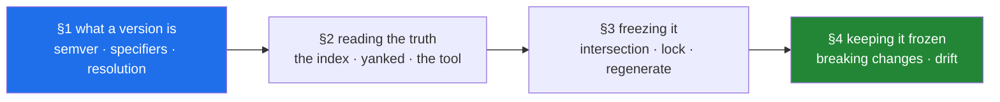

# Day 1 — Foundry I: the repo, the environment, and pins that don't float

**Phase 0 · Foundry** · No curriculum IDs. This day makes Principle 4 real: every version this
project will ever use becomes a decision you made from evidence, on a date you can name.

> **Yesterday:** four tools installed, a skeleton, a script that refuses, one commit.
> **Today:** every pin verified against the live index, frozen into two files, and recorded in a
> document that regenerates itself.
> **Tomorrow:** the quality machine — ruff, pytest and `./m check` running in CI, where nobody is
> watching.

> **Read this hub first**, then work through `parts/` in order. No time estimate here or anywhere —
> a day is a unit of subject, not of hours (Principle 17).

---

## §1 The story

A model is trained in March. It scores 0.91, the number goes in a report, and the work moves on.

In September someone retrains it on newer data. Same code — one docstring commit since March — and it
scores 0.87. Two libraries changed a default in the interim. Neither is a bug; both are documented
improvements. Together they moved the number, and now nobody can say whether 0.91 was real, whether
0.87 is, or which of a dozen packages is responsible.

They cannot go back either. The requirements file said `pandas`, `numpy`, `scikit-learn`, with no
versions, so what March actually installed was never recorded anywhere. That information does not
exist.

Here is the thing worth sitting with: **nobody was careless.** They pinned nothing because pinning
felt like premature rigidity, and by the time it mattered the evidence was gone. The cost was not one
bad afternoon — it was a number in a report that can no longer be defended.

Today is the opposite habit, and it has three moves. **Ask the index** what is actually current,
rather than trusting a table someone wrote months ago — including the one in this repository.
**Freeze the answer** into `pyproject.toml` and `uv.lock` together, so a machine can reproduce it
byte for byte. **Record how you asked**, with the date, so that in six months you can tell the
difference between a decision and a leftover.

Two smaller ideas make those stick. A "latest version" is three different questions wearing one
coat — latest published, latest not withdrawn, latest stable — and picking the wrong one pins you to
a release candidate. And a pin decays: the day you freeze something is the day it begins going
stale, which is why the day ends with the machinery for noticing (Principle 13) and the rule for
what to do about it (Principle 14).



---

## §2 The map

**What the section numbers mean today.** This is a `lab` day with no IDs, so the sections are the
*lifecycle of a pin*: **1.x** what a version and a specifier actually are, **2.x** how to read the
truth from the package index, **3.x** how to freeze that truth into files, **4.x** how to notice when
it decays.

### Section 1 — what a version is

| Part | What it answers | Level |
|---|---|---|
| [1.1 Semantic versioning, and what a major bump promises](parts/01-versions/1.1-semantic-versioning.md) | What is a version number actually claiming, and who enforces it? | `foundation` |
| [1.2 Version specifiers, and what each one costs](parts/01-versions/1.2-version-specifiers.md) | Why is `==` right in a service and harmful in a library? | `foundation` |
| [1.3 The resolution problem](parts/01-versions/1.3-the-resolution-problem.md) | Why can adding one package change five others, or fail outright? | `working` |

### Section 2 — reading the truth from the index

| Part | What it answers | Level |
|---|---|---|
| [2.1 PyPI's JSON API](parts/02-pypi-index/2.1-the-pypi-json-api.md) | Where does a version number come from, if not a tutorial? | `working` |
| [2.2 Yanked releases and pre-releases](parts/02-pypi-index/2.2-yanked-and-prerelease.md) | When is "latest" the wrong answer — and why does `==` install withdrawn releases? | `production` |
| [2.3 `scripts/check_pins.py`](parts/02-pypi-index/2.3-the-check-pins-script.md) | What turns a one-off command into a tool you still run in Phase 27? | `working` |

### Section 3 — freezing it

| Part | What it answers | Level |
|---|---|---|
| [3.1 The Python-version intersection](parts/03-freezing/3.1-the-python-version-intersection.md) | Is 3.12 still the right interpreter — computed, not inherited? | `production` |
| [3.2 Freezing — `uv lock`, `--locked`, `--frozen`](parts/03-freezing/3.2-freezing-into-pyproject-and-the-lock.md) | How do you prove intent and resolution still agree, and move one pin alone? | `working` |
| [3.3 Regenerating `docs/PINS_DS.md` from evidence](parts/03-freezing/3.3-regenerating-pins-from-evidence.md) | Why must a document of facts be generated rather than written? | `working` |

### Section 4 — keeping it frozen

| Part | What it answers | Level |
|---|---|---|
| [4.1 The three breaking changes already in this stack](parts/04-drift/4.1-the-three-breaking-changes.md) | Why is a *silent* breaking change more expensive than a loud one? | `production` |
| [4.2 Drift, the freshness check, and the amendment protocol](parts/04-drift/4.2-drift-and-the-amendment-protocol.md) | Principle 13 detects, Principle 14 responds — why does neither work alone? | `production` |

---

## §3 Setup — run this

**No new packages today.** Everything uses the standard library (`urllib.request`, `json`, `tomllib`)
plus `packaging`, which is already in your environment as a transitive dependency. That is
deliberate: packages arrive on the day they are first genuinely needed, and reading one JSON document
does not need an HTTP client.

```bash
mkdir -p scripts tests
touch scripts/check_pins.py tests/test_pins.py

# the cache from part 2.3 is generated output, not source
grep -q '^\.pins-cache\.json$' .gitignore || printf '\n# generated by scripts/check_pins.py\n.pins-cache.json\n' >> .gitignore

# confirm the tools this day leans on are already present
uv run python -c "import tomllib, urllib.request, json; from packaging.version import Version; print('stdlib + packaging: ok')"
uv lock --check && echo "pyproject and uv.lock agree"
```

| What | Where it comes from | Part |
|---|---|---|
| `urllib.request`, `json` | standard library | [2.1](parts/02-pypi-index/2.1-the-pypi-json-api.md) |
| `tomllib` | standard library since 3.11 | [1.2](parts/01-versions/1.2-version-specifiers.md) |
| `packaging` | already installed, transitively | [1.1](parts/01-versions/1.1-semantic-versioning.md) |

---

## §4 Build brief

Two files are yours. The parts contain every technique; assembling them is the rep, and the
`TODO(me)` bodies are deliberately unsolved.

**1. `scripts/check_pins.py`** — the freshness tool. It must satisfy the four properties from
[2.3](parts/02-pypi-index/2.3-the-check-pins-script.md): per-package error isolation, a cache with an expiry, a
meaningful exit status, and both a human table and `--json`/`--markdown` output.

```python
"""Compare this project's pins against the live package index.

    uv run python scripts/check_pins.py            # human table
    uv run python scripts/check_pins.py --markdown  # rows for docs/PINS_DS.md
    uv run python scripts/check_pins.py --json      # machine-readable

Exit status: 0 when every pin matches the index, 1 when anything drifted.
"""

from __future__ import annotations

import sys
from dataclasses import dataclass

CACHE_TTL_SECONDS = 6 * 60 * 60
USER_AGENT = "setu-pins/1.0 (learning project)"


@dataclass
class Pin:
    name: str
    pinned: str | None  # None when the dependency is not exactly pinned
    current: str | None = None
    yanked: bool = False
    error: str | None = None


def read_pins(pyproject_path: str) -> list[Pin]:
    """Parse pyproject.toml and return one Pin per declared dependency."""
    # TODO(me): read with tomllib, walk [project].dependencies AND every
    # dependency group, and use the regex from part 2.3 to split name from
    # version. A spec that is not an exact pin gets Pin(pinned=None).
    raise NotImplementedError


def fetch_current(name: str) -> tuple[str, bool]:
    """Return (latest_stable_version, is_yanked) for one package."""
    # TODO(me): part 2.1 for the request, part 2.2 for filtering pre-releases
    # and reading the yanked flag. Timeout. User-Agent. Raise on failure --
    # the CALLER decides what a failure means, not this function.
    raise NotImplementedError


def classify(pinned: str, current: str) -> str:
    """'none' | 'patch' | 'minor' | 'MAJOR' | 'BACKWARDS' — see part 4.2."""
    # TODO(me): parse both with packaging.version.Version and compare
    # major/minor/micro. Most specific condition first.
    raise NotImplementedError


def main(argv: list[str]) -> int:
    # TODO(me): read pins, fetch each one inside its own try/except so a
    # single failure cannot lose the run, classify, render, and return 1
    # if anything drifted.
    raise NotImplementedError


if __name__ == "__main__":
    sys.exit(main(sys.argv[1:]))
```

**2. Regenerate `docs/PINS_DS.md`** — replace its table with your tool's `--markdown` output, and set
`verified:` in the frontmatter to today's date. **Leave the authored "Python version reasoning"
section alone** — that is judgement, not fact
([3.3](parts/03-freezing/3.3-regenerating-pins-from-evidence.md)). If your computed intersection from
[3.1](parts/03-freezing/3.1-the-python-version-intersection.md) disagrees with what that section claims, do
not quietly edit it: that is an amendment ([4.2](parts/04-drift/4.2-drift-and-the-amendment-protocol.md)).

---

## §5 The eval that must be able to fail

Create `tests/test_pins.py`. Three of these run offline and belong in `./m check`; the fourth hits
the network and is marked `live`, so it is skipped by default and never spends anything in CI.

```python
"""Day 1: prove the pins are pins, and that drift classification is right."""

from __future__ import annotations

import re
import sys
import tomllib
from pathlib import Path

import pytest

ROOT = Path(__file__).resolve().parents[1]
sys.path.insert(0, str(ROOT / "scripts"))


def all_specs() -> list[str]:
    doc = tomllib.loads((ROOT / "pyproject.toml").read_text(encoding="utf-8"))
    specs = list(doc["project"].get("dependencies", []))
    for group in doc.get("dependency-groups", {}).values():
        specs += [s for s in group if isinstance(s, str)]
    return specs


def test_every_dependency_is_exactly_pinned() -> None:
    """Principle 4: no ranges anywhere. See part 1.2."""
    # TODO(me): assert every spec matches name==version, with no >=, ~=, or
    # bare name. Put the offending specs in the assertion message -- a failure
    # that does not say WHICH one is a failure you will resent.
    raise NotImplementedError


def test_python_requirement_is_exact() -> None:
    """requires-python is ==3.12.* -- patches yes, a minor jump no. Part 3.1."""
    # TODO(me): read [project].requires-python and assert it pins the minor.
    raise NotImplementedError


def test_classify_detects_a_major_bump() -> None:
    """The pure decision function from part 4.2, tested without a network."""
    from check_pins import classify

    # TODO(me): assert classify('3.0.5', '4.0.0') flags a MAJOR, that
    # ('3.0.5','3.0.6') is a patch, and that ('3.0.5','3.0.4') is BACKWARDS.
    raise NotImplementedError


@pytest.mark.live
def test_pins_match_the_index() -> None:
    """Hits PyPI. Skipped by default; this is Principle 13 as a test."""
    # TODO(me): for each exactly-pinned dependency, fetch the current version
    # and assert no MAJOR drift. Minor and patch drift should NOT fail here --
    # explain in a comment why you chose that threshold.
    raise NotImplementedError
```

Run them and watch all four fail before you write a line:

```bash
uv run python -m pytest tests/test_pins.py -v                 # 3 fail, 1 skipped
uv run python -m pytest tests/test_pins.py -v -m live         # the network one
```

Then implement, then **break each one on purpose**:

- Change a pin to `>=` → `test_every_dependency_is_exactly_pinned` goes red. Restore it.
- Change `requires-python` to `">=3.12"` → `test_python_requirement_is_exact` goes red. Restore it.
- Make `classify` return `'patch'` for everything → `test_classify_detects_a_major_bump` goes red.
  Restore it.

---

## §6 Request budget

| Resource | Today |
|---|---|
| LLM API calls | **0** — no model is called on this day |
| Network requests | one HTTPS `GET` to `pypi.org` per pinned package, plus a few by hand while reading. Roughly a dozen with today's three dependencies. |
| Caching | `.pins-cache.json`, expiry from [2.3](parts/02-pypi-index/2.3-the-check-pins-script.md) — a re-run should make **no** requests |
| Free-tier quota | none consumed; PyPI needs no key and the `live` test never runs in CI |
| Cost | **$0** (Principle 5) |

PyPI publishes no rate limit, which makes politeness your responsibility rather than the server's:
a `User-Agent` that names you, a timeout, sequential requests, and a cache
([2.1](parts/02-pypi-index/2.1-the-pypi-json-api.md)).

---

## §7 Traps

- **Comparing version strings as strings.** `'3.10' > '3.9'` is `False`. Sorting versions
  alphabetically works until a project reaches `.10` — [1.1](parts/01-versions/1.1-semantic-versioning.md).
- **Misreading `~=`.** `~=3.0` lets the *minor* move; `~=3.0.5` does not. Same operator, decided by
  whether you typed a third number — [1.2](parts/01-versions/1.2-version-specifiers.md).
- **Assuming `--frozen` verifies something.** It skips the check. `--locked` is the one that refuses
  — [3.2](parts/03-freezing/3.2-freezing-into-pyproject-and-the-lock.md).
- **Taking `info.version` as "safe to pin".** It does not promise to exclude yanked releases, and
  your `==` pin is exactly the form that installs them — [2.2](parts/02-pypi-index/2.2-yanked-and-prerelease.md).
- **Pinning a release candidate** because your script sorted versions without filtering pre-releases
  — [2.2](parts/02-pypi-index/2.2-yanked-and-prerelease.md).
- **Building on the `releases` key.** PyPI documents it as deprecated; use the Index API's `versions`
  — [2.1](parts/02-pypi-index/2.1-the-pypi-json-api.md).
- **Committing `pyproject.toml` without `uv.lock`.** Your machine works; everyone else's does not —
  [3.2](parts/03-freezing/3.2-freezing-into-pyproject-and-the-lock.md).
- **A `try` around the loop instead of inside it.** One bad package loses the whole run —
  [2.3](parts/02-pypi-index/2.3-the-check-pins-script.md).
- **Hand-editing a generated document.** The next regeneration destroys it —
  [3.3](parts/03-freezing/3.3-regenerating-pins-from-evidence.md).
- **Adopting a major version because the tests passed.** The dangerous changes are the silent ones —
  [4.1](parts/04-drift/4.1-the-three-breaking-changes.md).

---

## §8 Verify before you code

Written **2026-08-23**, against these pages, read live rather than recalled. The claims in
[2.1](parts/02-pypi-index/2.1-the-pypi-json-api.md), [2.2](parts/02-pypi-index/2.2-yanked-and-prerelease.md) and
[3.2](parts/03-freezing/3.2-freezing-into-pyproject-and-the-lock.md) come from them — re-check before you rely
on them, which is the entire habit of this day:

- <https://docs.pypi.org/api/json/> — the JSON API's fields, and which keys are deprecated.
- <https://docs.pypi.org/api/index-api/> — the Simple/Index API, its `Accept` header, and PEP 503/691.
- <https://peps.python.org/pep-0592/> — yanking, and the exact rule about `==` pins.
- <https://peps.python.org/pep-0440/> — version and specifier grammar.
- <https://docs.astral.sh/uv/concepts/projects/sync/> — `--locked`, `--frozen`, `--upgrade-package`.
- `uv lock --help` and `uv pip compile --help` — the authority on flags, ahead of any lesson.

---

## §9 Say it in an interview

> "Every dependency is pinned exactly, with a committed lockfile that records the full transitive
> tree and hashes, so any machine rebuilds the identical environment. The pins aren't copied from
> anywhere — there's a script that queries the package index, filters pre-releases and yanked
> releases, and regenerates the version table with the date it was verified, so the document can't
> silently go stale. I know exact pinning has a cost: `==` is the one specifier that will happily
> install a release its authors have withdrawn, so pinning hard only works if you also monitor
> continuously. That's the weekly check — and when it finds a major bump the rule is that the
> decision gets written down *before* the version moves, because a workaround nobody documented is
> one nobody can ever safely delete."

---

## §10 Done when

Every box in [`CHECKLIST.md`](CHECKLIST.md) is ticked, `./m check` is green, and
`docs/PINS_DS.md` carries today's verification date — not when a particular amount of time has
passed. Then:

```bash
./m done 1
```

Tomorrow is Foundry II: the same checks, running where nobody is watching.
