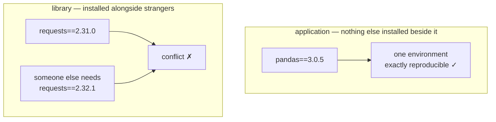

# 1.2 — Version specifiers, and what each one costs

> **The source.** This idea comes from one dated document, taught in full in
> [5.2 — *PEP 440*](../05-the-specs/5.2-pep-440.md).

## One-line answer

A specifier like `>=2.0` or `==3.0.5` is a **standing instruction to a resolver you will not be
present for**, so the only question that matters is: what will this sentence mean the next time
someone builds this project, possibly months from now, on a machine you have never seen?

---

## The story

A team ships two things from one repository: a service, and a small client library that other teams
install.

Both were set up by the same person on the same afternoon, with the same instinct — be safe, pin
everything — so both declare `requests==2.31.0`.

The service is fine. It is the only thing in its environment; nothing argues with it.

The library is a slow disaster. The first team to install it already depends on `requests==2.32.1`
for a security fix, and the two requirements cannot both be true, so the install fails outright. They
file an issue. The second team pins the library to an old release to avoid the conflict, and is now
stuck. The third writes their own copy of the three functions they needed. Within a quarter the
library has a reputation for being difficult to adopt, and the reason is one character: `==` where
it should have been `>=`.

The same instinct was correct in one place and destructive in the other. The specifier is not a
safety setting you turn up as far as it goes — it is a statement about **who is allowed to decide**,
and the right answer differs depending on whether anything else will ever be installed beside you.

---

## The idea in plain language

A **specifier** is the version condition attached to a dependency. The rules are standardised in
**PEP 440**, which every Python packaging tool implements — so this is one of the rare corners where
the syntax is genuinely the same everywhere.

Here is the whole vocabulary, with what each one delegates:

| Specifier | Matches | Who decides the version |
|---|---|---|
| `pandas` | anything at all | whoever publishes next |
| `pandas>=3.0` | 3.0 and everything after it, forever | whoever publishes next |
| `pandas<4` | anything below 4.0 | whoever publishes next, within a bound |
| `pandas>=3.0,<4` | 3.x only | the resolver, within your bound |
| `pandas~=3.0.5` | `>=3.0.5, <3.1.0` — patch upgrades only | the resolver, tightly |
| `pandas~=3.0` | `>=3.0, <4.0` — minor upgrades allowed | the resolver |
| `pandas==3.0.*` | any 3.0.x | the resolver, tightly |
| `pandas==3.0.5` | exactly this | **you** |
| `pandas!=3.0.4` | anything except that one | you, negatively |

Three of these deserve more than a table row.

**`~=` is the "compatible release" operator, and its meaning depends on how many numbers you
write.** `~=3.0.5` allows the last position to move (patch only). `~=3.0` allows the *minor* to move.
Same operator, two very different amounts of trust, decided by whether you typed a third number.
This trips people up constantly, and it is worth reading twice.

**`==3.12.*` is a wildcard, not a range**, and it is what
[Day 0's `requires-python`](../../../day-00-setup/parts/02-skeleton/2.4-uv-init-pyproject-and-the-lockfile.md)
uses: any patch of 3.12, never 3.13. That is exactly the semver line from
[1.1](1.1-semantic-versioning.md) drawn in a config file.

**`===` also exists** — arbitrary string equality, matching the version as literal text rather than
as a parsed PEP 440 version. It is for the rare package whose version does not follow the standard
at all. You will almost certainly never need it; knowing it exists prevents a confusing moment.

Now the decision the story turns on. **Application or library?**

An **application** is a thing that runs on its own: a service, a pipeline, this project. Nothing else
is installed beside it, so an exact pin costs nothing and buys reproducibility. Pin `==`.

A **library** is a thing other people install *alongside their own dependencies*. Your pins become
constraints on their entire environment. Pin exactly and you are not "safe", you are **unusable in
combination** — because two libraries with exact pins on the same package can simply be
irreconcilable. Declare the widest range you actually test.



And the reconciliation that makes both true at once: **pins live in `pyproject.toml`, resolutions
live in the lockfile.** An application can declare a range *and* still be perfectly reproducible,
because `uv.lock` records the exact resolution
([Day 0, 2.4](../../../day-00-setup/parts/02-skeleton/2.4-uv-init-pyproject-and-the-lockfile.md)). This
project pins exactly in both places — belt and braces, and because a pin you can read in one screen
is a teaching artifact as well as a control.

---

## Why Setu needs it

- **Principle 4 says exact `==`, no exceptions.** This part is why that is the right call *here* —
  and why it would be the wrong call in a library, which is the distinction that makes the principle
  a decision rather than a superstition.
- **`docs/PINS_DS.md` is a table of exact pins.** [3.3](../03-freezing/3.3-regenerating-pins-from-evidence.md)
  regenerates it, and the test in the hub's §5 fails if any `==` becomes a `>=`.
- **Phase 27 and the capstone build things with a real API surface.** When Setu itself becomes
  something someone else installs, this decision reverses — and you should be able to say why.
- **Day 3 adds three provider SDKs** whose free-tier behaviour changes without notice. Exact pins
  are what make "it worked yesterday" a checkable claim.

---

## The mechanism

Specifiers are executable, not decorative. Evaluate them:

```bash
uv run python -c "
from packaging.specifiers import SpecifierSet
from packaging.version import Version
cases = ['>=3.0', '~=3.0.5', '~=3.0', '==3.0.*', '==3.0.5']
versions = ['3.0.4', '3.0.5', '3.1.0', '4.0.0']
print(f'{\"specifier\":12}' + ''.join(f'{v:>9}' for v in versions))
for c in cases:
    s = SpecifierSet(c)
    print(f'{c:12}' + ''.join(f'{str(Version(v) in s):>9}' for v in versions))
"
```

**Line by line:**

- `SpecifierSet` — the PEP 440 implementation of a whole specifier expression, including
  comma-separated ones like `>=3.0,<4`. This is the same code the resolver uses, so the table it
  prints is authoritative rather than an approximation of the docs.
- `Version(v) in s` — membership. A specifier set is a *set of acceptable versions*, and `in` is
  exactly the right operator: the question is always "is this version acceptable?"
- `f'{v:>9}'` — right-align in a 9-character column (`>` means right, `<` left, `^` centre). Building
  a readable table with format specifications rather than manual spaces is a habit worth forming
  early; you will print a lot of tables in this project.
- `\"specifier\"` — the double quotes inside the f-string are escaped because the whole script is
  already inside a double-quoted shell argument. This awkwardness is the shell's, not Python's, and
  it is one more reason real code goes in a file ([2.3](../02-pypi-index/2.3-the-check-pins-script.md)).
- **Read the output rather than my description of it.** The row that surprises most people is
  `~=3.0`, which accepts `3.1.0`; compare it against `~=3.0.5`, which does not.

Now read what your own project currently declares:

```bash
uv run python -c "
import tomllib, pathlib
d = tomllib.loads(pathlib.Path('pyproject.toml').read_text(encoding='utf-8'))
print('requires-python:', d['project']['requires-python'])
print('runtime:', d['project']['dependencies'])
print('dev:', d.get('dependency-groups', {}).get('dev', []))
"
```

**Line by line:**

- `tomllib` — TOML parsing **in the standard library** since Python 3.11. No dependency needed to
  read `pyproject.toml`, which matters for [2.3](../02-pypi-index/2.3-the-check-pins-script.md): the tooling you
  build today adds nothing to the project.
- `tomllib.loads(...)` — parse a string. There is also `tomllib.load(f)` for a file object, which
  must be opened in **binary** mode (`"rb"`) — a small trap, since text mode raises a `TypeError`
  that does not obviously say so.
- `d['project']['dependencies']` — the standard location for runtime dependencies, and
  `dependency-groups.dev` for development ones. `.get(..., {})` on the second because a project may
  legitimately have no dev group, and a missing key should not crash a reporting script.
- `encoding='utf-8'` — always state it. The default encoding depends on the platform, which is a
  real source of "works on my machine".

Prove a specifier is doing what you think, against the real index:

```bash
uv run python -m pytest --version && uv pip list | head -5
```

**Line by line:**

- `uv pip list` — the versions actually installed in this environment, as opposed to the versions
  requested in `pyproject.toml`. **Those are different questions**, and confusing them is the
  beginning of most dependency confusion: the file is intent, the environment is fact, and the
  lockfile is the recorded agreement between them.
- `| head -5` — the pipe from [Day 0, 1.2](../../../day-00-setup/parts/01-toolchain/1.2-git-and-git-bash.md),
  trimming the output.

---

## When it breaks

**The library conflict from the story:**

```text
$ uv add our-internal-client
  × No solution found when resolving dependencies:
  ╰─▶ Because our-internal-client==1.4.0 depends on requests==2.31.0 and your project
      depends on requests==2.32.1, we can conclude that your project's requirements
      are unsatisfiable.
```

**What it means.** Two exact pins on the same package, both non-negotiable. The resolver is not being
awkward — there is genuinely no version of `requests` that satisfies both. Nothing can be installed.
The fix belongs to the **library**: relax to `requests>=2.31,<3`. The fix does *not* belong to the
application, and an application that works around this by pinning an old client is accumulating a
problem rather than solving one.

**The `~=` that let in more than expected:**

```text
$ uv add "pandas~=3.0"
Resolved 6 packages
 + pandas==3.1.2
```

**What it means.** You asked for "compatible with 3.0" and got 3.1, because with two numbers `~=`
allows the minor to move. If you meant patch-only, the specifier is `~=3.0.5` — three numbers. This
is not a bug in the tool; it is the operator's actual definition, and it is the single most commonly
misremembered piece of PEP 440.

**The specifier that quietly matches nothing:**

```text
$ uv add "ruff==0.16"
  × No solution found when resolving dependencies:
  ╰─▶ Because there is no version of ruff==0.16 and your project depends on ruff==0.16,
      we can conclude that your project's requirements are unsatisfiable.
```

**What it means.** `==0.16` is exact equality against a version that does not exist — the release is
`0.16.4`, and `0.16` is a different string. What you wanted was the wildcard `==0.16.*`, which
matches any `0.16.x`. `==` is literal; only `==X.Y.*` is a family.

**And the one with no error at all, which is the expensive one:**

```text
$ git diff pyproject.toml
-    "python-dotenv==1.2.3",
+    "python-dotenv>=1.2.3",
```

**What it means.** Nothing fails. The build is green. What changed is *who decides* the version from
now on — and the answer is no longer anyone on your team. This diff is why the hub's §5 test exists:
a change with no failure attached to it will not be caught by a test suite unless you write the test
that catches it.

---

## In production

**The application/library distinction is the whole of this subject, and it is asked about
constantly.** Say it precisely: an application owns its environment, so exact pins cost nothing and
buy reproducibility; a library shares an environment it does not control, so its pins are constraints
imposed on strangers, and over-tight pins make it uninstallable in combination. The refinement that
marks experience: **a library should pin as loosely as its tests justify** — the range you declare is
a claim about what you have actually verified, so widening it without widening your test matrix is
just a different way of guessing.

**Constraint files are how large organisations reconcile the two.** A shared constraints file pins
the whole estate's transitive versions, applied on top of each project's own looser declarations.
Libraries stay flexible, deployments stay reproducible, and one file is the place a CVE response gets
applied across dozens of services. If you see `-c constraints.txt` in a build, that is what it is
doing.

**Over-tight pinning has a cost that is invisible until you need it: the resolver's freedom.** Every
exact pin removes options from the search, and a tightly pinned tree can become unsolvable after one
transitive package publishes a new requirement — leaving you unable to apply a security fix without
untangling five unrelated pins first. This is why the professional pattern is *loose declarations
plus a lockfile* rather than *tight declarations everywhere*: the lockfile gives reproducibility
without removing the resolver's room to manoeuvre. This project pins exactly in both places for
teaching reasons, and that trade-off is worth being conscious of.

**Environment markers are part of the specifier grammar and worth recognising.** A dependency can be
conditional: `pywin32; sys_platform == "win32"` or `tomli; python_version < "3.11"`. That second one
is the standard way to depend on a backport only where the standard library lacks it — which is
exactly why the `tomllib` above needs no dependency on 3.12. When you see a semicolon in a
requirement, everything after it is a marker, not a version.

**The review comment a senior engineer leaves.** On a library declaring `numpy==2.5.2`: *"This makes
us uninstallable next to anything else that pins numpy. Widen to the range we actually test."* On an
application declaring `numpy`: *"Unpinned — this build is a function of the date."* And on
`~=3.0`: *"Did you mean patch-only? Two numbers lets the minor move; write `~=3.0.5` if you meant
the tighter one."*

**The interview question.** *"When would you pin a dependency exactly, and when would you not?"* This
is the most common dependency-management question there is, and the answer is one distinction plus
one nuance: exact for applications, ranges for libraries — and then, because they will push, that
reproducibility for an application comes from the *lockfile* rather than from tight declarations, so
the two goals are not actually in tension. If you can name what over-tight pinning costs — resolver
freedom, and therefore the ability to take a security patch quickly — you have answered it better
than the question was asked.

---

## Check yourself

```bash
uv run python -c "
from packaging.specifiers import SpecifierSet as S
from packaging.version import Version as V
print('~=3.0.5 accepts 3.1.0? ', V('3.1.0') in S('~=3.0.5'))
print('~=3.0   accepts 3.1.0? ', V('3.1.0') in S('~=3.0'))
print('==3.0.* accepts 3.0.9? ', V('3.0.9') in S('==3.0.*'))
print('==3.0.* accepts 3.1.0? ', V('3.1.0') in S('==3.0.*'))
"
```

Predict all four answers **before** you run it. If any surprises you, re-read the `~=` paragraph —
that is the one that will cost you an evening later.

**Answer out loud, without scrolling up:**

> Why is `requests==2.31.0` correct in a service and harmful in a library? Then: what is the
> difference between `~=3.0` and `~=3.0.5`, and how can an application declare a *range* and still
> be perfectly reproducible?

---

**Next:** [1.3 — The resolution problem](1.3-the-resolution-problem.md)
