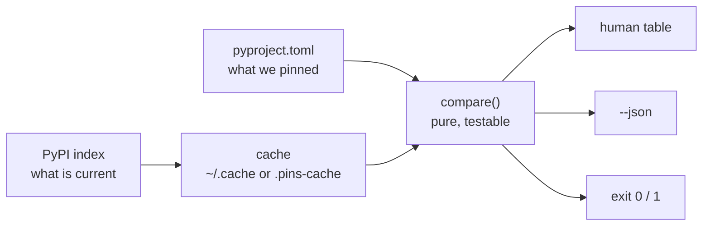

# 2.3 — `scripts/check_pins.py` — turning a one-liner into a tool you will still run in Phase 27

## One-line answer

The difference between a command you typed once and a tool you run every week is four things —
**it fails per item rather than all at once, it caches, it exits with a meaningful status, and it
prints something a machine can read** — and adding them is what makes Principle 13's freshness check
something you will actually keep doing.

---

## The story

Someone writes a checking script on a Friday afternoon. It works. They run it, read the output, fix
two pins, and feel good about it.

The following Friday they run it again. The eleventh package returns a 404 — a name typo they had
never noticed because that package had been fine — and the script raises, printing a traceback and
nothing else. The other forty-nine packages were never checked. They do not have the results and they
do not have the energy, so they make a note to look at it later.

The Friday after that, they do not run it.

Six weeks on, the script still exists in the repository. Nobody has run it since the second Friday.
When someone finally does, it reports thirty-one drifted pins, which is too many to act on, so it
gets a ticket that stays open.

The script was correct. It was correct in the way a demonstration is correct and a tool is not: it
assumed everything would go right, and the first time reality disagreed it produced a wall of red
instead of an answer. **A check that punishes you for running it will not be run**, and an unrun
check is worth less than no check, because it also carries the belief that you are covered.

---

## The idea in plain language

You already have every piece of the *logic* — [2.1](2.1-the-pypi-json-api.md) fetches metadata,
[2.2](2.2-yanked-and-prerelease.md) filters yanked and pre-release, [1.1](../01-versions/1.1-semantic-versioning.md)
compares versions correctly. None of that changes. What a tool adds is behaviour under conditions the
one-liner never met.

**1. Partial failure must stay partial.** Sixty network calls will not all succeed. A package is
renamed, a request times out, the index has a bad moment. The tool must record *that one* as an error
and keep going — because the value of the run is the other fifty-nine answers. This is the story's
whole failure, and it is one `try`/`except` inside the loop rather than around it.

**2. Repeated runs must be cheap.** Re-fetching everything on every run makes the check slow, makes
it rude to free infrastructure ([2.1](2.1-the-pypi-json-api.md)), and makes you reluctant to run it.
A small on-disk cache with an expiry turns a re-run into an instant one. Cheap tools get used.

**3. The exit status must mean something.** Zero for "everything matches", non-zero for "something
drifted" — the same contract as `./m check`
([Day 0, 3.3](../../../day-00-setup/parts/03-m-script/3.3-the-done-gate.md)). That single number is what lets
this script eventually become a scheduled job that opens an issue, rather than something a human must
read.

**4. The output must be readable by both audiences.** Humans want an aligned table. Machines want
JSON. A tool that only does the first can never be automated; one that only does the second is
annoying to use on a Friday. The convention is a human table by default and `--json` for the other
case.

Two supporting ideas that are easy to skip and cost you later.

**Separate fetching from deciding.** One function answers "what does the index say about this
package?" and returns data. A different function answers "does that disagree with what we pinned?".
Keeping them apart means the second is a pure function you can test without a network — which is what
makes the hub's §5 test possible at all. Mixing them produces code whose only test is an integration
test, and integration tests are the ones people stop running.

**Read the pins from `pyproject.toml`, never from a second list.** The moment the tool has its own
copy of the package list, that copy drifts from the real dependencies and the check starts reporting
on a project you do not have. `tomllib` from [1.2](../01-versions/1.2-version-specifiers.md) reads the real
source.



---

## Why Setu needs it

- **Principle 13 is a weekly freshness check** for 240 days. That is roughly thirty-four runs. The
  four properties above are the difference between thirty-four runs and two.
- **Principle 4 needs enforcing, not just declaring.** The hub's §5 test imports this script's
  comparison function and asserts against it, which is only possible because deciding is separated
  from fetching.
- **`docs/PINS_DS.md` is regenerated from this tool's output**
  ([3.3](../03-freezing/3.3-regenerating-pins-from-evidence.md)) — so its machine-readable mode is not a
  flourish, it is the input to the next part.
- **Day 2 puts checks into CI.** A script with a meaningful exit status is one CI can run; one that
  prints a table and always exits 0 is not.

---

## The mechanism

The pieces, each shown working. You assemble them into `scripts/check_pins.py` yourself — that is the
build brief in the hub's §4, and it is deliberately left to you.

**Reading what you actually pinned:**

```bash
uv run python -c "
import re, tomllib, pathlib
doc = tomllib.loads(pathlib.Path('pyproject.toml').read_text(encoding='utf-8'))
specs = list(doc['project'].get('dependencies', []))
for group in doc.get('dependency-groups', {}).values():
    specs += [s for s in group if isinstance(s, str)]
PIN = re.compile(r'^([A-Za-z0-9._-]+)\s*==\s*([^\s;]+)')
for s in specs:
    m = PIN.match(s)
    print(f'{s:32} -> ' + (f'{m.group(1)} pinned at {m.group(2)}' if m else 'NOT AN EXACT PIN'))
"
```

**Line by line:**

- `doc['project'].get('dependencies', [])` — runtime dependencies, defaulting to empty so a project
  without any does not raise ([1.2](../01-versions/1.2-version-specifiers.md)).
- `for group in doc.get('dependency-groups', {}).values()` — every dependency group, not just `dev`.
  Hard-coding `dev` works today and breaks the first time a `docs` group is added; iterating the
  values is the version that keeps being right.
- `isinstance(s, str)` — a dependency group entry can be a table (`{include-group = "..."}`) rather
  than a string, and running a regex over a dict raises. Defending against the shape you have not met
  yet is most of what turns a script into a tool.
- `r'^([A-Za-z0-9._-]+)\s*==\s*([^\s;]+)'` — a raw string (`r'...'`, so backslashes are literal)
  matching a name, `==`, and a version. `[A-Za-z0-9._-]+` is the set of characters a project name may
  contain; `\s*` allows optional spaces around the operator; `[^\s;]+` stops at whitespace or a `;`,
  which is where an environment marker begins ([1.2](../01-versions/1.2-version-specifiers.md)).
- `if m else 'NOT AN EXACT PIN'` — the branch that matters. A specifier that does not match this
  pattern is a floating dependency, and reporting it is half the tool's job.

**Failing per package instead of per run:**

```bash
uv run python -c "
import json, urllib.error, urllib.request
def latest(pkg):
    req = urllib.request.Request(f'https://pypi.org/pypi/{pkg}/json',
                                 headers={'User-Agent': 'setu-pins/1.0'})
    with urllib.request.urlopen(req, timeout=10) as r:
        return json.load(r)['info']['version']
for pkg in ('pytest', 'ruff', 'no-such-package-xyzzy', 'python-dotenv'):
    try:
        print(f'{pkg:22} {latest(pkg)}')
    except urllib.error.HTTPError as e:
        print(f'{pkg:22} ERROR http {e.code}')
    except urllib.error.URLError as e:
        print(f'{pkg:22} ERROR network: {e.reason}')
"
```

**Line by line:**

- The `try` is **inside** the loop. That is the entire lesson of this block: the third package fails
  and the fourth still gets checked. Put the `try` around the loop and you have written the story's
  script.
- `except urllib.error.HTTPError` — the server answered, with a failure status. `e.code` is the HTTP
  status: `404` means no such project ([2.1](2.1-the-pypi-json-api.md)), `429` would mean you are
  being rate-limited and should slow down.
- `except urllib.error.URLError` — no answer at all: DNS failure, no route, TLS problem, or the
  timeout expiring. `HTTPError` is a *subclass* of `URLError`, so it must be caught **first** — swap
  the two clauses and the specific handler becomes unreachable. This ordering rule applies to every
  `except` chain you will ever write.
- Catching these two rather than bare `except:` — a bare except also swallows `KeyboardInterrupt`,
  so you could not stop the script with Ctrl-C. Catch what you can handle.

**Caching, so re-running is cheap and polite:**

```bash
uv run python -c "
import json, pathlib, time
CACHE = pathlib.Path('.pins-cache.json')
TTL = 6 * 60 * 60
def load():
    if not CACHE.exists():
        return {}
    data = json.loads(CACHE.read_text(encoding='utf-8'))
    return {k: v for k, v in data.items() if time.time() - v['fetched'] < TTL}
def save(cache):
    CACHE.write_text(json.dumps(cache, indent=2), encoding='utf-8')
c = load()
c['pytest'] = {'version': '9.1.1', 'fetched': time.time()}
save(c)
print('cached entries:', list(load()))
"
```

**Line by line:**

- `CACHE = pathlib.Path('.pins-cache.json')` — a dotted filename, and one you must add to
  `.gitignore` ([Day 0, 2.2](../../../day-00-setup/parts/02-skeleton/2.2-gitignore-before-secrets-exist.md)):
  it is generated output, not source.
- `TTL = 6 * 60 * 60` — a **time-to-live** in seconds, written as a product so the number is readable
  rather than `21600`. An entry older than this is discarded rather than trusted.
- `time.time() - v['fetched'] < TTL` — the expiry test, applied **on read**. Filtering at load time
  rather than deleting at write time means a stale entry is simply never returned, which is the
  simpler thing to reason about.
- `json.dumps(cache, indent=2)` — pretty-printed, because a cache you can read is a cache you can
  debug. There is no performance reason to compact a file this small.
- `encoding='utf-8'` on both sides — never rely on the platform default
  ([1.2](../01-versions/1.2-version-specifiers.md)).

**An exit status a machine can act on:**

```bash
uv run python -c "
import sys
drifted = [('pytest', '9.1.1', '9.2.0')]
for name, pinned, current in drifted:
    print(f'DRIFT {name}: pinned {pinned}, index has {current}')
sys.exit(1 if drifted else 0)
"; echo "exit status: $?"
```

**Line by line:**

- `sys.exit(1 if drifted else 0)` — the tool's verdict as a number. Zero means "nothing to do".
  This is what lets the script sit in a scheduled CI job that only speaks up when something changed —
  and it is the same contract `grep` gave the gate in
  [Day 0, 3.3](../../../day-00-setup/parts/03-m-script/3.3-the-done-gate.md).
- `echo "exit status: $?"` — read it back in the shell, because a status you never check is a
  contract you never verified.

---

## When it breaks

**The story's script, in the form it actually takes:**

```text
$ uv run python scripts/check_pins.py
Traceback (most recent call last):
  File "scripts/check_pins.py", line 41, in <module>
    versions[pkg] = latest(pkg)
  File "scripts/check_pins.py", line 22, in latest
    with urllib.request.urlopen(req, timeout=10) as r:
urllib.error.HTTPError: HTTP Error 404: Not Found
```

**What it means.** One package failed and took the run with it. Note what the traceback does *not*
tell you: which package. The fix is both parts — move the `try` inside the loop, and include the
package name in the message. A tool that reports *which* item failed is one you can fix in seconds;
one that reports only that something did is one you put off.

**The exception ordering that makes a handler unreachable:**

```text
$ uv run python scripts/check_pins.py
pytest                 ERROR network: HTTP Error 404: Not Found
```

**What it means.** `URLError` was caught before `HTTPError`, so a 404 — which is an HTTP error — was
handled by the network branch and reported with the wrong explanation. Nothing crashes; the
diagnosis is just wrong, which is worse. **Order `except` clauses most specific first.**

**The cache that never expires:**

```text
$ uv run python scripts/check_pins.py
pandas   3.0.5  ✓ matches pin
$ # ... a week later, after pandas 3.1.0 has shipped ...
$ uv run python scripts/check_pins.py
pandas   3.0.5  ✓ matches pin
```

**What it means.** The cache is being read but its age is never checked, so the tool is confidently
reporting last week's index. **A freshness check with a stale cache is worse than no check**, because
it reports "no drift" — the same words it would use if it had actually looked. This is why the TTL
filter belongs on the read path, and why the tool should say when its answer came from cache.

**And the one that looks like it worked:**

```text
$ uv run python scripts/check_pins.py; echo $?
DRIFT pytest: pinned 9.1.1, index has 9.2.0
0
```

**What it means.** It found drift and exited **0**, so any automation wrapping it concludes everything
is fine. The message was for a human who is not there. A tool's real output is its exit status; the
text is a courtesy.

---

## In production

**This script is a small version of a real category: the scheduled reconciliation job.** Something
compares declared state against actual state on a schedule and reports the difference — pinned
versions against the index, infrastructure code against deployed resources, a config repository
against a running cluster. The design constraints are always the same four from the top of this part,
and they are always learned the same way, by having the first version abandoned.

**In a real team you would not write this; you would configure it.** Dependency bots already do
version drift, and vulnerability scanners already do advisories, both with pull-request output and
deduplication so the same finding is not reported thirty times. Build the tool when you need
something they do not cover — for this project, the coupling to `docs/PINS_DS.md` and to a plan with
an amendment protocol ([4.2](../04-drift/4.2-drift-and-the-amendment-protocol.md)). The professional skill
is knowing which of the two situations you are in.

**Alert fatigue is the failure mode that kills these jobs, not bugs.** A check that reports thirty
findings every week trains people to close it unread — the story's ticket. The mitigations are
concrete: report only *changes* since the last run, group by severity, make the common case silent,
and give every finding an obvious next action. A noisy check and no check converge to the same
outcome, and the noisy one costs more to maintain.

**Concurrency is where politeness gets lost.** The obvious optimisation for sixty sequential requests
is to fire them in parallel, and the obvious result is a burst that looks like abuse to a free
service. If you do parallelise, bound it to a handful of workers, keep the timeout, and honour a
`Retry-After` if one arrives. Better still, make the cache good enough that the run is mostly local —
optimising the request you do not send beats optimising the one you do.

**Structured output is what makes a tool composable.** A `--json` mode means the same script can feed
a dashboard, a bot, or the table generator in
[3.3](../03-freezing/3.3-regenerating-pins-from-evidence.md) without any of them parsing human prose. This is
why `git status --porcelain` exists
([Day 0, 4.2](../../../day-00-setup/parts/04-first-commit/4.2-the-first-commit.md)) — a stable machine format
beside the pretty one — and copying that pattern is a reliable instinct.

**The review comment a senior engineer leaves.** On a loop with the `try` outside it: *"One bad
package will abort the whole run — move the error handling inside the loop and report per package."*
On a checker that always exits 0: *"CI cannot act on this. Exit non-zero when there are findings."*
And on a bare `except:`: *"This swallows KeyboardInterrupt too — catch the specific errors you can
actually handle."*

**The interview question.** *"You have a script that checks something across fifty services. What do
you need to add before it can run unattended?"* They are listening for operational thinking rather
than logic: per-item error isolation so one failure does not lose the run, a meaningful exit status,
idempotency and caching so re-running is safe and cheap, structured output, and — the answer that
marks experience — something about **noise**: that the check must be quiet when nothing is wrong, or
people will stop reading it.

---

## Check yourself

```bash
uv run python -c "
import urllib.error, urllib.request, json
ok = err = 0
for pkg in ('pytest', 'no-such-package-xyzzy', 'ruff'):
    try:
        req = urllib.request.Request(f'https://pypi.org/pypi/{pkg}/json', headers={'User-Agent':'setu-pins/1.0'})
        with urllib.request.urlopen(req, timeout=10) as r:
            json.load(r); ok += 1
    except urllib.error.URLError:
        err += 1
print(f'checked ok={ok} errors={err}')
import sys; sys.exit(1 if err else 0)
"; echo "exit status: $?"
```

It must report `ok=2 errors=1` and exit **1** — one package failed, the other two were still checked,
and the status says so.

**Answer out loud, without scrolling up:**

> Name the four things that separate a one-off command from a tool you will still run in Phase 27,
> and say which one the story's script was missing. Then: why must `HTTPError` be caught before
> `URLError`, and what goes wrong if you swap them?

---

**Next:** [3.1 — The Python-version intersection, computed rather than assumed](../03-freezing/3.1-the-python-version-intersection.md)
