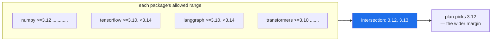

# 3.1 — The Python-version intersection, computed rather than assumed

## One-line answer

Every package declares which Python versions it supports, so the interpreter your project may use is
the **intersection of all of those constraints** — a set you can compute from the index in a few
lines, rather than a number you inherit from a table someone wrote months ago.

---

## The story

A team starts a machine-learning project. Someone checks that their two main libraries support the
Python they have chosen. Both do. They build for a quarter.

Then the project reaches the part that needs a specific serving framework, and it does not support
that Python — it caps two minor versions lower. This is not a bug and not an oversight by anyone; the
framework has always said so, in metadata that was queryable on day one.

The options are all bad. Downgrade the interpreter, and two other libraries lose their floor. Wait
for the framework to catch up, on someone else's schedule. Replace the framework late, with the
architecture already shaped around it. Or run a second service on a second interpreter, and carry the
operational cost of that forever.

They pick one and live with it. The cost is not the fix; it is that the decision was made in month
four with three months of architecture leaning on it, when the same information was available in
month zero for the price of one query per dependency.

`docs/PINS_DS.md` was written to avoid exactly this, and it says so plainly: NumPy is the floor,
TensorFlow is the ceiling, the intersection is 3.12 or 3.13, and the plan takes 3.12. Today you check
whether that is still true — because it was true on the day it was written, and that is a different
claim.

---

## The idea in plain language

Every published package carries a `requires_python` field
([2.1](../02-pypi-index/2.1-the-pypi-json-api.md)) — a specifier
([1.2](../01-versions/1.2-version-specifiers.md)) constraining the **interpreter** rather than another
package. `">=3.12"`, `">=3.10,<3.14"`, or sometimes nothing at all.

Your project must satisfy every one of them at once, for the same reason there is one version of each
package ([1.3](../01-versions/1.3-the-resolution-problem.md)): there is one interpreter. So the set of legal
Pythons is the **intersection** of all those constraints — the versions that appear in every
package's allowed set.

Two words for the edges of that intersection, and they are worth naming because they behave
differently:

- The **floor** is the highest lower bound. One package demanding `>=3.12` raises the floor for the
  entire project, whatever everything else says.
- The **ceiling** is the lowest upper bound. One package capping at `<3.14` caps the whole project.



Three things about this that are not obvious:

**The floor and the ceiling usually come from different packages, and they move independently.** The
floor rises when a fast-moving numerical library drops an old Python. The ceiling rises when a slow,
compiled framework finally ships wheels for a new one. Your window is squeezed from both sides by
projects that do not know about each other.

**A missing `requires_python` is not "supports everything".** It means the package never said, which
is common in older or smaller projects. Treat it as unknown rather than unconstrained — it imposes no
constraint on the resolver, but it is also no evidence that the package works.

**Choosing the newest version in the intersection is usually wrong.** If the intersection is
`{3.12, 3.13}` and the ceiling is `<3.14`, then picking 3.13 means the *next* release of any capped
package could put you outside the window — whereas 3.12 leaves a version of margin. This is exactly
the reasoning `docs/PINS_DS.md` records for choosing 3.12, and it generalises: **pick the version
with room above it, not the highest one that currently works.**

The important shift in this part is procedural rather than technical. The plan's Python choice is not
a fact to memorise; it is the *output of a computation over live data*. Anyone can re-run it. When it
changes, that is a plan amendment (Principle 14), not a surprise
([4.2](../04-drift/4.2-drift-and-the-amendment-protocol.md)).

---

## Why Setu needs it

- **[Day 0's part 1.4](../../../day-00-setup/parts/01-toolchain/1.4-python-3-12-under-uv.md) asserted 3.12 with
  a table.** Today you verify the assertion instead of inheriting it — which is the difference
  between a curriculum and a checklist.
- **Phase 16 needs TensorFlow, a hundred-plus days from now.** The story is a Phase-16 failure that
  starts today, and this is the query that prevents it.
- **`docs/PINS_DS.md` has a "Python version reasoning" section** with a floor/ceiling table.
  [3.3](3.3-regenerating-pins-from-evidence.md) regenerates it from what you compute here.
- **Principle 14 says amend the plan first.** A moved ceiling is precisely the kind of reality change
  that requires an addendum before any code changes.

---

## The mechanism

Read one package's interpreter constraint:

```bash
uv run python -c "
import json, urllib.request
req = urllib.request.Request('https://pypi.org/pypi/numpy/json', headers={'User-Agent':'setu-pins/1.0'})
with urllib.request.urlopen(req, timeout=10) as r:
    info = json.load(r)['info']
print(info['name'], info['version'], '->', repr(info['requires_python']))
"
```

**Line by line:**

- The request is the one from [2.1](../02-pypi-index/2.1-the-pypi-json-api.md), unchanged — same endpoint, same
  headers, same timeout. This part adds no new network technique; it adds what you do with the field.
- `repr(...)` rather than `print(...)` of the value — `repr` shows quotes, so an empty string and
  `None` look different on screen. When a field is optional, printing its repr is how you see which
  of "absent", "empty" and "present" you actually got.

Now intersect several, which is the actual computation:

```bash
uv run python -c "
import json, urllib.request
from packaging.specifiers import SpecifierSet
from packaging.version import Version

PKGS = ['numpy', 'pandas', 'scikit-learn', 'torch', 'transformers', 'langgraph', 'pytest']
CANDIDATES = ['3.10', '3.11', '3.12', '3.13', '3.14']

def requires_python(pkg):
    req = urllib.request.Request(f'https://pypi.org/pypi/{pkg}/json', headers={'User-Agent':'setu-pins/1.0'})
    with urllib.request.urlopen(req, timeout=10) as r:
        info = json.load(r)['info']
    return info['version'], info['requires_python']

combined = SpecifierSet()
print(f'{\"package\":16}{\"version\":12}requires_python')
for pkg in PKGS:
    try:
        ver, rp = requires_python(pkg)
    except Exception as e:
        print(f'{pkg:16}{\"?\":12}ERROR {e}')
        continue
    print(f'{pkg:16}{ver:12}{rp or \"(unstated)\"}')
    if rp:
        combined &= SpecifierSet(rp)

print()
print('combined constraint:', combined)
allowed = [c for c in CANDIDATES if combined.contains(Version(c))]
print('allowed interpreters:', allowed)
"
```

**Line by line:**

- `PKGS` — a representative slice of the plan's stack rather than all sixty, so the demonstration
  stays readable. The real tool runs the same loop over everything in `pyproject.toml`
  ([2.3](../02-pypi-index/2.3-the-check-pins-script.md)).
- `combined = SpecifierSet()` — an **empty** specifier set, which accepts everything. It is the
  correct starting value for an intersection, the same way `0` is the correct start for a sum: the
  identity element, so the first real constraint is not treated specially.
- `combined &= SpecifierSet(rp)` — `&` is intersection on specifier sets, and `&=` accumulates it. The
  whole computation of this part is this one operator, applied in a loop.
- `try/except ... continue` — per-package failure isolation from
  [2.3](../02-pypi-index/2.3-the-check-pins-script.md). A broad `except Exception` is acceptable in a reporting
  loop where the goal is to survive and report; it would not be acceptable where the goal is to act
  on a specific failure.
- `if rp:` — skip packages that state nothing. An unstated constraint must not be turned into
  `SpecifierSet('')`-style noise, and — per the section above — silence is not a claim of support.
- `combined.contains(Version(c))` — test each candidate interpreter. Note `.contains()` here rather
  than the `in` operator used in [1.2](../01-versions/1.2-version-specifiers.md); both work, and `.contains()`
  additionally takes options such as allowing pre-releases, which is why it is the one a tool uses.
- **Read `allowed` against `docs/PINS_DS.md`.** If it no longer contains 3.12, you have found a plan
  amendment on Day 1, which is the day designed to find it.

Confirm the interpreter you are actually on is inside the window:

```bash
uv run python -c "
import sys
from packaging.specifiers import SpecifierSet
from packaging.version import Version
me = Version('.'.join(map(str, sys.version_info[:2])))
print('running:', me)
print('inside >=3.12,<3.14 ?', me in SpecifierSet('>=3.12,<3.14'))
"
```

**Line by line:**

- `sys.version_info[:2]` — the major and minor of the running interpreter as a tuple of ints. The
  patch level is deliberately dropped: compatibility is decided at the minor level
  ([1.1](../01-versions/1.1-semantic-versioning.md)).
- `'.'.join(map(str, ...))` — turn `(3, 12)` into `'3.12'`. `map(str, ...)` applies `str` to each
  element because `join` requires strings; Day 11 covers `map` properly.
- The final line is the assertion the hub's §5 test formalises: **the interpreter you are running is
  inside the window your dependencies allow.** Right now that is easy to satisfy with three packages
  installed; the value is that the same test keeps holding as sixty arrive.

---

## When it breaks

**The empty intersection — the story, caught early:**

```text
combined constraint: <SpecifierSet('<3.14,>=3.12,>=3.14')>
allowed interpreters: []
```

**What it means.** No interpreter satisfies every package. One dependency has raised its floor above
another's ceiling, so the set you must choose from is empty. This is the most valuable output this
computation can produce, and it is far better to see it on Day 1 than to discover it in Phase 16.
The response is a decision, not a workaround: drop a package, wait for one to move, or split the work
across two environments — and record which, because the reasoning is what future-you needs.

**The single package that moves the ceiling:**

```text
package         version     requires_python
tensorflow      2.21.0      >=3.10,<3.14
```

**What it means.** Everything else may be perfectly happy on 3.14; this one caps the project. When the
window narrows, the first diagnostic is to print the constraints and look for the *binding* one —
there is usually exactly one at each edge, and it is often a large compiled framework whose release
cycle is slower than everything around it.

**The constraint that does not exist:**

```text
some-old-package  1.4.0     (unstated)
```

**What it means.** The package declares nothing, so the resolver will happily install it on any
Python. That is not evidence it works — it is evidence nobody said. Unstated constraints are common
in packages published before `requires_python` was widely used, and they are a real source of
"installed fine, failed at import". The mitigation is your own test suite, which is the general answer
whenever metadata is silent.

**And the mismatch between the window and what you actually run:**

```text
running: 3.11
inside >=3.12,<3.14 ? False
```

**What it means.** Your environment predates the constraint — a `.venv` built before a dependency
raised its floor, so it still exists and still imports, and the next `uv sync` will refuse or
upgrade. It is a reminder that `requires-python` in `pyproject.toml`
([3.2](3.2-freezing-into-pyproject-and-the-lock.md)) is a *declaration*, and that the environment on
disk is a separate fact ([Day 0, 2.5](../../../day-00-setup/parts/02-skeleton/2.5-the-venv-you-never-activate.md)).
When the two disagree, rebuild rather than reason about it.

---

## In production

**This computation is why teams keep a support matrix rather than a support number.** A real project
declares the Python versions it supports, tests every one of them in CI, and has a written policy for
adding and dropping. Adding a version means: wheels exist for every compiled dependency, add it to
the matrix, get it green, then make it the default. Dropping means: check nothing in the estate still
needs it, announce, then remove. Neither is a one-line edit, and both are scheduled work rather than
reactions.

**The upper bound is a genuine architectural risk, and it is usually invisible until it bites.** A
single dependency with a slow release cycle can pin an entire organisation to an old interpreter for
a year, blocking language features, performance improvements and eventually security support. This is
worth knowing at the point of *choosing* a dependency: "how quickly does this project ship wheels for
a new Python?" is a legitimate selection criterion, and the answer is in its release history.

**Security support is the constraint nobody computes.** Each Python minor version has a support
window — full fixes, then security-only, then nothing. A project whose ceiling forces it onto an
end-of-life interpreter has a compliance problem regardless of whether the code works, and it usually
surfaces during an audit rather than during development. The professional habit is to check the
intersection against the *supported* versions, not merely the available ones.

**Where this generalises: constraint intersection is the same shape as resolution.** What you did by
hand here — collect constraints from many sources, intersect, pick a point with margin — is what the
resolver does across the whole package graph ([1.3](../01-versions/1.3-the-resolution-problem.md)). Doing it
once manually is the fastest way to stop finding resolvers mysterious, and the intuition transfers to
every other constraint system you will meet.

**The review comment a senior engineer leaves.** On a PR adding a dependency: *"What is this
package's `requires_python`? We are at 3.12 and I want to know whether this moves our ceiling."* And
on a CI configuration testing only one interpreter while `pyproject.toml` claims `>=3.9`: *"We are
claiming support we never test — narrow the claim or widen the matrix."*

**The interview question.** *"How do you decide which Python version a new service targets?"* The
junior answer is "the newest" or "whatever the team uses". The strong answer describes this
computation: intersect the `requires_python` of every dependency to get a window, check that window
against the security-support timeline and what your platform offers, then pick a version **with room
above it** rather than the top of the window — and write the decision down where it cannot drift from
the CI matrix. If you can name that the floor and ceiling come from different packages and move
independently, you have shown you have actually had to do it.

---

## Check yourself

```bash
uv run python -c "
import json, urllib.request
from packaging.specifiers import SpecifierSet
from packaging.version import Version
combined = SpecifierSet()
for pkg in ('numpy', 'pandas', 'pytest'):
    req = urllib.request.Request(f'https://pypi.org/pypi/{pkg}/json', headers={'User-Agent':'setu-pins/1.0'})
    with urllib.request.urlopen(req, timeout=10) as r:
        rp = json.load(r)['info']['requires_python']
    if rp:
        combined &= SpecifierSet(rp)
print('combined:', combined)
print('3.12 allowed:', combined.contains(Version('3.12')))
"
```

`3.12 allowed` must be `True`. If it is not, stop and read
[4.2](../04-drift/4.2-drift-and-the-amendment-protocol.md) — you have found a change that amends the plan.

**Answer out loud, without scrolling up:**

> What is the difference between the floor and the ceiling of your Python window, and why do they
> usually come from different packages? Then: the intersection is `{3.12, 3.13}` — why does this plan
> choose 3.12, and what would choosing 3.13 cost you?

---

**Next:** [3.2 — Freezing it into `pyproject.toml` and the lockfile](3.2-freezing-into-pyproject-and-the-lock.md)
