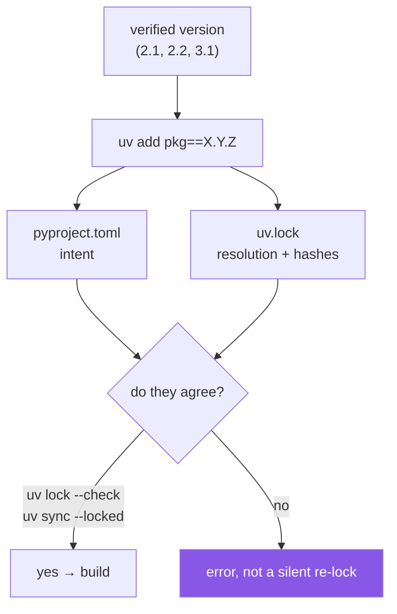

# 3.2 — Freezing it — `uv lock`, `--locked`, `--frozen`, and upgrading exactly one thing

## One-line answer

Once you have verified a version you must **write it down in two places and prove they agree**:
`uv add pkg==X.Y.Z` records the intent and the resolution together, `uv lock --check` and
`uv sync --locked` are the two different ways of asking "do these still agree?", and
`uv lock --upgrade-package pkg` is how you move exactly one pin without disturbing anything else.

---

## The story

A team keeps their dependencies current. Every few weeks someone runs the update command, the
lockfile changes, tests pass, it merges.

One Tuesday, an update lands and an endpoint starts returning subtly wrong numbers under load. Not an
exception — wrong values, occasionally, under concurrency. It takes two days to notice and another
day to correlate it with the deployment.

They open the pull request that caused it. The lockfile diff is **four hundred lines**. Thirty-one
packages moved. One of them is the cause and thirty are noise, and there is no way to tell which
without bisecting an environment, one package at a time, against a bug that only appears under load.

The reviewer had approved it. Of course they had — nobody reads four hundred lines of generated
lockfile, and the pull request description said "update dependencies".

The mistake was not the review. It was that the *unit of change* was "everything", so the unit of
blame was also "everything". Had those been thirty-one small pull requests, the bisect would have
been a glance at a list of titles.

Freezing is not only about writing a version down. It is about making each change to the frozen set
**small enough to attribute**.

---

## The idea in plain language

[Day 0's part 2.4](../../../day-00-setup/parts/02-skeleton/2.4-uv-init-pyproject-and-the-lockfile.md)
established the two files: `pyproject.toml` is intent, `uv.lock` is the resolution. This part is
about the *operations* on them, because there are more than you would guess and they differ in ways
that matter.

**Writing a pin.** `uv add "pkg==X.Y.Z"` does three things at once — resolve and install, record the
pin in `pyproject.toml`, update `uv.lock`. Doing all three in one command is what keeps the two files
in step; hand-editing `pyproject.toml` is the reliable way to desynchronise them.

**Re-resolving without adding anything.** `uv lock` recomputes the lockfile from the current
declarations. You need it after a hand edit, or when you want the resolver to reconsider.

**The two verification flags, which are not synonyms.** This is the part almost everyone gets wrong,
and it is worth being precise:

| Flag | What it does |
|---|---|
| `--locked` | **Refuse to update the lockfile.** If it is not up to date with `pyproject.toml`, raise an error instead of silently re-locking. |
| `--frozen` | **Skip the up-to-date check entirely.** Run against what is already there without verifying anything. |
| `uv lock --check` | Verify the lockfile matches the project metadata, without updating it. |

So they point in opposite directions. `--locked` is *stricter* than the default — it turns a silent
re-lock into a build failure, which is what you want in CI and in the dependency layer of a
Dockerfile. `--frozen` is *looser* — it is what you want inside an already-built image where the
environment is correct by construction and you simply do not want to pay for the check. Reaching for
`--frozen` when you meant `--locked` gives you no verification at all, quietly.

**Upgrading exactly one thing.** `uv lock --upgrade-package <name>` re-resolves that package while
holding everything else at its locked version, and `--upgrade-package <name>==<version>` moves it to
a specific one. Upgrades stay inside the constraints declared in `pyproject.toml`, so an upper bound
is still respected. This is the command that answers the story: it makes the lockfile diff small.



And the habit that ties it together: **commit both files in the same commit, always.** A commit
containing only `pyproject.toml` declares an intent nothing has resolved; a commit containing only
`uv.lock` records a resolution of an intent nobody declared. Either half alone is a state your
project should never be in, which is why
[Day 0, 4.2](../../../day-00-setup/parts/04-first-commit/4.2-the-first-commit.md) insisted on reading
`git status --porcelain` before staging.

---

## Why Setu needs it

- **Principle 4's "committed lockfile" is only true if it is committed *with* the pin.** These are
  the commands that keep that true.
- **Day 2 puts `./m check` in CI**, where `--locked` is the flag that converts a forgotten re-lock
  into a red build instead of a divergent environment.
- **Principle 13's weekly freshness check produces drift** ([2.3](../02-pypi-index/2.3-the-check-pins-script.md)).
  `--upgrade-package` is how you act on one finding at a time, which is what makes a weekly check
  sustainable rather than a quarterly avalanche.
- **Phase 12 onward reports model metrics.** The story is a Phase-12 debugging session: a metric
  moves, and the question is which of thirty-one packages did it.

---

## The mechanism

First, ask whether the two files currently agree:

```bash
uv lock --check; echo "exit status: $?"
```

**Line by line:**

- `uv lock --check` — verify that `uv.lock` matches the project's metadata, **without** updating it.
  A read-only question, safe to run any time.
- `echo "exit status: $?"` — the answer that matters. Zero means they agree. This is the same
  exit-status contract as every gate in this project
  ([Day 0, 3.3](../../../day-00-setup/parts/03-m-script/3.3-the-done-gate.md)), and it is what makes the check
  usable from CI rather than only by a human reading output.

Now create drift deliberately, so you have seen what it looks like:

```bash
cp pyproject.toml /tmp/pyproject.backup && \
  uv run python -c "
import pathlib
p = pathlib.Path('pyproject.toml')
t = p.read_text(encoding='utf-8')
p.write_text(t.replace('\"python-dotenv==1.2.3\"', '\"python-dotenv>=1.2.3\"'), encoding='utf-8')
print('pin loosened by hand — pyproject now disagrees with the lock')
"
```

**Line by line:**

- `cp pyproject.toml /tmp/pyproject.backup` — take a backup first. You are about to break something
  on purpose, and having the undo ready *before* you break it is the habit worth copying, not the
  specific command.
- `&& \` — continue only on success, with a line continuation for readability
  ([Day 0, 3.3](../../../day-00-setup/parts/03-m-script/3.3-the-done-gate.md)).
- The Python does a literal string replacement, turning `==` into `>=`. This is precisely the
  hand-edit that desynchronises the two files — the version of the story's mistake you can undo.
- Note the escaped `\"` — the shell argument is double-quoted, so inner double quotes need escaping
  ([1.2](../01-versions/1.2-version-specifiers.md)). Another reason real code lives in a file.

Watch each verification flag react:

```bash
uv lock --check; echo "lock --check  -> $?"
uv sync --locked 2>&1 | tail -2; echo "sync --locked -> ${PIPESTATUS[0]}"
uv sync --frozen 2>&1 | tail -1; echo "sync --frozen -> ${PIPESTATUS[0]}"
```

**Line by line:**

- `uv lock --check` — now reports a mismatch and exits non-zero. The declaration changed; the
  resolution did not.
- `uv sync --locked` — refuses. **Read its message**: it tells you the lockfile needs updating and
  names the command to do it. This is the failure you want in CI — loud, early, and self-explaining.
- `uv sync --frozen` — **does not complain.** This is the whole point of showing the two together:
  `--frozen` skips the check, so drift passes straight through it. If you have been using `--frozen`
  believing it verifies something, this is the line that corrects it.
- `${PIPESTATUS[0]}` — the exit status of the **first** command in a pipeline, not the last. `$?`
  after a pipe gives you `tail`'s status, which is always zero. This is the same `pipefail` family of
  problem from [Day 0, 3.1](../../../day-00-setup/parts/03-m-script/3.1-set-euo-pipefail.md), and
  `PIPESTATUS` is the tool for inspecting a pipeline stage by stage.

Repair it, and confirm:

```bash
cp /tmp/pyproject.backup pyproject.toml && uv lock --check && echo "agreed again: $?"
```

**Line by line:**

- Restoring the backup returns the declaration to the exact pin, so the existing lockfile matches
  again — no re-resolution needed. If you had instead wanted to *keep* the loosened pin, the fix
  would be `uv lock` to re-resolve and then committing both files.
- `&& echo` — only prints if the check passed, so the message cannot lie.

Finally, the operation the story needed — move one pin, and see how small the diff is:

```bash
uv lock --upgrade-package ruff && git diff --stat uv.lock pyproject.toml
```

**Line by line:**

- `uv lock --upgrade-package ruff` — re-resolve **only** ruff, holding every other package at its
  currently locked version. Upgrades stay inside the constraints in `pyproject.toml`, so a declared
  upper bound is still honoured — the flag cannot be used to escape your own declarations.
- `--upgrade-package ruff==0.17.0` would move it to a specific version instead of the newest
  permitted one, which is what you use after [2.3](../02-pypi-index/2.3-the-check-pins-script.md) has told you
  exactly which version the index now offers.
- `git diff --stat` — the summary of what changed, in lines per file, rather than the full diff. On
  a single-package upgrade this should be a handful of lines. **That number is the point of this
  command**: a diff a reviewer can actually read is a diff a reviewer actually reads.
- Note that with an exact pin in `pyproject.toml`, ruff cannot move at all — the constraint is a
  single version. That is expected here, and it is worth seeing: the upgrade command respects your
  declaration, so bumping an exactly-pinned package is a two-step operation (edit the pin, re-lock),
  which is exactly the deliberateness Principle 4 is asking for.

---

## When it breaks

**The refusal in CI, which is the system working:**

```text
$ uv sync --locked
error: The lockfile at `uv.lock` needs to be updated, but `--locked` was provided.
To update the lockfile, run `uv lock`.
```

**What it means.** Someone changed `pyproject.toml` and did not re-lock, or changed it and did not
commit the lock. The build stops before producing an environment that differs from everyone else's.
The fix is `uv lock` and committing **both** files — not removing the flag, which is the tempting
wrong move because it makes the message go away.

**The silent pass that should have been a refusal:**

```text
$ uv sync --frozen
Audited 4 packages
$ git diff --stat
 pyproject.toml | 1 +
```

**What it means.** `pyproject.toml` changed, the lockfile did not, and `--frozen` did not look. Your
build succeeded against a stale resolution. This is not a bug — `--frozen` is documented as skipping
the check — it is the wrong flag for the job. **In CI you want `--locked`.** Inside a built container
image where the environment was already installed correctly, `--frozen` is right and cheaper.

**The four-hundred-line diff from the story:**

```text
$ git diff --stat uv.lock
 uv.lock | 412 ++++++++++++++++++++++++++++++++-----------------------
```

**What it means.** A blanket upgrade re-resolved everything. It is not *wrong* — periodically letting
the resolver reconsider the whole tree is healthy — but it must be its own pull request, with nothing
else in it, and ideally not the change you make the day before a release. When you need a specific
bump, `--upgrade-package` is the tool; when you need a full refresh, do it deliberately and alone.

**And the one that only shows up on a colleague's machine:**

```text
$ git show --stat HEAD
 pyproject.toml | 1 +

$ uv sync --locked
error: The lockfile at `uv.lock` needs to be updated, but `--locked` was provided.
```

**What it means.** The commit contains the pin but not the lock — `uv.lock` was regenerated locally
and never staged. Your machine works because your lockfile is correct on disk; everyone else's fails.
This is the failure `git status --porcelain` before staging is meant to catch
([Day 0, 4.2](../../../day-00-setup/parts/04-first-commit/4.2-the-first-commit.md)), and it is common enough that
it is worth a habit rather than vigilance.

---

## In production

**The lockfile diff is a review artifact, and treating it as noise is how supply-chain problems get
merged.** Nobody reads four hundred lines, so the discipline is to make the diff small: one logical
change per pull request, blanket refreshes done alone and deliberately. What a reviewer *should* look
at even in a small diff is whether any **new** package appeared that nobody chose — a transitive
dependency added by an upgrade is a new piece of code running in your process, from an author you
have not evaluated. `uv tree` before and after ([1.3](../01-versions/1.3-the-resolution-problem.md)) makes that
visible in a way the raw diff does not.

**Automated bumps are the norm, and this is why they are one-per-PR.** Dependabot and Renovate open
a separate pull request per package precisely to preserve attribution: when something breaks, the
guilty change is a single title in a list. Most teams configure patch and minor bumps to auto-merge
on green CI and majors to require a human — which is
[1.1](../01-versions/1.1-semantic-versioning.md)'s table encoded as automation policy.

**`--locked` in CI is a small line with a large effect.** It converts an entire class of "works on my
machine" into a build failure with a message naming the fix. The general principle is worth carrying
beyond this tool: **when two artifacts must agree, add a check that fails when they do not, rather
than a convention that says they should.** The same reasoning produced the depth check in this
repository and the format check in `./m check`.

**Hashes make the frozen set verifiable, not just recorded.** Because `uv.lock` stores a `sha256` per
artifact, an install verifies the bytes it received against the bytes that were resolved
([Day 0, 2.4](../../../day-00-setup/parts/02-skeleton/2.4-uv-init-pyproject-and-the-lockfile.md)). That is what
turns "we pinned it" into "we can prove we installed the same thing", which is the claim that matters
after a compromised-mirror incident — and it is why a lockfile is a security artifact rather than a
convenience.

**Where lockfiles get genuinely hard: many projects, one repository.** In a monorepo, a shared
lockfile means one upgrade affects every service and the diff is enormous; separate lockfiles mean
services drift apart and a CVE must be fixed in twelve places. Both are real strategies with real
costs, and `uv` workspaces exist for the first
([Day 0, 2.4](../../../day-00-setup/parts/02-skeleton/2.4-uv-init-pyproject-and-the-lockfile.md) mentioned
`--no-workspace` for exactly this reason). Knowing the trade-off exists is the point; you will not
choose today.

**The review comment a senior engineer leaves.** On a PR with an unexplained 400-line lockfile diff:
*"What is this upgrading and why? Please split the targeted bump from the blanket refresh — if this
regresses we cannot bisect it."* And on a CI workflow: *"`--frozen` here skips the check. Use
`--locked` so a forgotten re-lock fails the build."*

**The interview question.** *"How do you upgrade a single dependency without changing anything
else, and why does that matter?"* The mechanical half is the targeted upgrade command. The half they
are actually listening for is the reasoning: a change you cannot attribute is a change you cannot
revert, so the size of a dependency diff determines how fast you can respond to a regression. If you
add that a blanket refresh is still healthy but belongs in its own pull request, you have described
the actual working practice rather than a command.

---

## Check yourself

```bash
uv lock --check; echo "in sync -> $?"; git status --porcelain pyproject.toml uv.lock; echo "(empty above means both are committed and clean)"
```

`in sync -> 0` and no output from `git status` is the state you want to be in at the end of every
day for 240 days.

**Answer out loud, without scrolling up:**

> `--locked` and `--frozen` sound like synonyms and do opposite things — state precisely what each
> one does, and which belongs in CI. Then: why does upgrading one package at a time matter more than
> the time it saves?

---

**Next:** [3.3 — Regenerating `docs/PINS_DS.md` from evidence, not memory](3.3-regenerating-pins-from-evidence.md)
