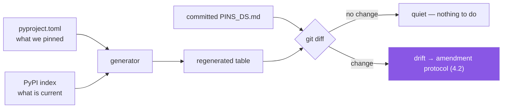

# 3.3 — Regenerating `docs/PINS_DS.md` from evidence, not memory

## One-line answer

A document containing facts that change must be **generated from the source of those facts and
regenerated on a schedule**, carrying the date and method of its own verification — otherwise it is
not documentation, it is a snapshot of someone's memory that everyone treats as current.

---

## The story

An architecture document is written when a system is designed. It is genuinely good: diagrams,
component responsibilities, a table of every service and the datastore it owns.

Two years later a new engineer uses it to plan a change. Three of the services in the table have been
merged. One datastore was migrated. Two components in the diagram were deleted in a cleanup nobody
updated the document for. The engineer plans a week of work against a system that does not exist, and
finds out in review.

Nobody was negligent. Each individual change was small, urgent, and shipped by someone who had never
opened that document — and there was no mechanism connecting the two. The document could not tell
anyone it was stale, because a document has no way to know.

Now compare `docs/TRACKER.md` in this repository. Its header says *"Do not edit this file by hand"*,
and it is regenerated by `scripts/tracker.py` from the curriculum index plus what is actually on
disk. It cannot go stale, because it has no independent existence — it is a *view* of the truth, not
a copy of it.

`docs/PINS_DS.md` is currently the first kind of document. Today it becomes the second.

---

## The idea in plain language

There are two kinds of document in a repository, and confusing them is the story.

**Authored documents** contain judgement: why a decision was made, what was rejected, what the
trade-offs were. A human writes them, they age gracefully, and their value survives a version bump.
`docs/adr/` is this kind ([Day 0, 2.1](../../../day-00-setup/parts/02-skeleton/2.1-the-folder-skeleton.md)).

**Generated documents** contain facts that live somewhere else: what is installed, what versions are
current, what days exist on disk. A program writes them, they age *badly*, and their only defence is
regeneration. `docs/TRACKER.md` is this kind.

`docs/PINS_DS.md` is currently both, which is why it needs attention. It contains a table of exact
versions — pure fact, regenerable — *and* a "Python version reasoning" section explaining the floor,
the ceiling and why 3.12 was chosen — judgement, which no script can produce. The right shape is to
generate the fact and author the judgement, and to make the boundary explicit so neither gets
clobbered.

Three properties make a generated document trustworthy:

**Provenance in the file itself.** The frontmatter already carries `verified: "2026-08-21"` and
`source: "pypi.org/pypi/<pkg>/json — read live, not from memory"`. Those two lines are what let a
reader decide how much to trust it. **A generated document with no timestamp is indistinguishable
from a stale one**, which is the story in one sentence.

**A refusal to be hand-edited.** `docs/TRACKER.md` says so at the top. The reason is not
territorial: a hand edit will be silently destroyed on the next regeneration, so it wastes someone's
work and, worse, teaches them the document is unreliable.

**Regeneration as a diff, not a replacement.** The valuable moment is not the new file — it is the
*difference* between the new file and the old one. That diff is exactly the drift report Principle 13
wants, and it is why regeneration belongs in version control rather than in a temporary file.



One judgement call worth naming: **should a generated file be committed at all?** Committing it costs
diff noise; not committing it means nobody can read it without running the generator, and the diff —
the actual product — does not exist. For small, human-readable artifacts that people consult, commit
them. For large binary ones, do not. `docs/TRACKER.md` and `docs/PINS_DS.md` are both firmly in the
first category.

---

## Why Setu needs it

- **`docs/PINS_DS.md`'s own header says "Your job on Day 1 is not to trust this file."** This part is
  the mechanism that makes that instruction actionable rather than aspirational.
- **Principle 13's weekly freshness check produces a diff**, and a diff needs a committed baseline to
  be a diff against.
- **Principle 14 says amend the plan before adapting code.** The regenerated diff is the *evidence*
  an amendment cites ([4.2](../04-drift/4.2-drift-and-the-amendment-protocol.md)).
- **`scripts/tracker.py` already demonstrates the pattern** in this repository. Following an existing
  convention rather than inventing a second one is itself the lesson.

---

## The mechanism

First, look at how the existing generator declares itself:

```bash
head -12 docs/TRACKER.md
```

**Line by line:**

- The frontmatter carries `generated:` (a date) and `generator: scripts/tracker.py` (the program).
  Together they answer "how current is this, and how do I refresh it?" without anyone having to ask.
- The blockquote underneath states the no-hand-editing rule in the file itself, where someone about
  to edit it will actually see it. **A rule that lives only in a contributing guide is a rule for
  people who read contributing guides.**

Now read what `docs/PINS_DS.md` currently claims about itself:

```bash
sed -n '1,12p' docs/PINS_DS.md
```

**Line by line:**

- `sed -n '1,12p'` — print lines 1 to 12 and nothing else. `-n` suppresses the default "print every
  line" behaviour, and `p` prints the selected range; without `-n` you would get the range twice.
- Note `verified:` and `source:` in its frontmatter. The document already asserts its own provenance —
  what it lacks is a program that can refresh it, which is what turns an assertion into a guarantee.

Produce the fact half from evidence:

```bash
uv run python -c "
import json, re, tomllib, urllib.error, urllib.request, pathlib, datetime

PIN = re.compile(r'^([A-Za-z0-9._-]+)\s*==\s*([^\s;]+)')
doc = tomllib.loads(pathlib.Path('pyproject.toml').read_text(encoding='utf-8'))
specs = list(doc['project'].get('dependencies', []))
for g in doc.get('dependency-groups', {}).values():
    specs += [s for s in g if isinstance(s, str)]

def latest(pkg):
    req = urllib.request.Request(f'https://pypi.org/pypi/{pkg}/json', headers={'User-Agent':'setu-pins/1.0'})
    with urllib.request.urlopen(req, timeout=10) as r:
        return json.load(r)['info']['version']

print(f'| Package | Pinned | Current | Status |')
print(f'|---|---|---|---|')
for s in specs:
    m = PIN.match(s)
    if not m:
        print(f'| {s} | — | — | NOT PINNED |'); continue
    name, pinned = m.group(1), m.group(2)
    try:
        cur = latest(name)
    except urllib.error.URLError as e:
        print(f'| {name} | {pinned} | ? | ERROR {e} |'); continue
    status = 'current' if cur == pinned else 'DRIFT'
    print(f'| {name} | {pinned} | {cur} | {status} |')
print()
print(f'verified: {datetime.date.today().isoformat()}')
"
```

**Line by line:**

- Everything above the `print`s is assembled from parts you have already built —
  [2.3](../02-pypi-index/2.3-the-check-pins-script.md)'s pin parsing and per-package error handling,
  [2.1](../02-pypi-index/2.1-the-pypi-json-api.md)'s request. Nothing new is introduced; this part is about what
  you *do* with the result.
- `print(f'| Package | ...')` — emitting **Markdown table syntax** directly. A generator's output
  format is part of its interface: producing the exact rows the document needs means the regeneration
  step is a copy rather than a reformat.
- `status = 'current' if cur == pinned else 'DRIFT'` — a conditional expression. The comparison is
  string equality here, which is correct because both sides came from the same source formats; if you
  needed ordering rather than equality you would parse both with `Version`
  ([1.1](../01-versions/1.1-semantic-versioning.md)).
- `continue` on both failure paths — the row still gets printed, with the failure *in* it. A
  generated table that silently omits the packages it could not check is worse than one that marks
  them, because the omission is invisible.
- `datetime.date.today().isoformat()` — the provenance line, `YYYY-MM-DD`. ISO format sorts correctly
  as text and is unambiguous internationally, unlike every other date format.

See the drift as a diff, which is the actual product:

```bash
uv run python scripts/check_pins.py --markdown > /tmp/pins-new.md 2>/dev/null || echo "(build check_pins.py first — hub §4)"
diff <(sed -n '/^| Package/,/^$/p' docs/PINS_DS.md) /tmp/pins-new.md | head -20
```

**Line by line:**

- `scripts/check_pins.py --markdown` — the tool from [2.3](../02-pypi-index/2.3-the-check-pins-script.md), in its
  machine-readable mode. It does not exist until you build it; that is the hub's §4, and the `||`
  fallback says so rather than failing confusingly.
- `> /tmp/pins-new.md` — redirect standard output to a file. `2>/dev/null` discards standard error
  separately, so progress messages do not end up inside the generated document — **keeping the data
  on stdout and the chatter on stderr is what makes a tool pipeable**, and it is a rule worth
  following in everything you write.
- `<( ... )` — **process substitution**: run a command and present its output as if it were a
  filename. It lets `diff` compare a *slice* of the committed file against the freshly generated one
  without creating a temporary file for the left side.
- `sed -n '/^| Package/,/^$/p'` — print from the line starting `| Package` up to the next blank line:
  the table, and only the table. Address ranges in `sed` take patterns as well as line numbers, which
  is what makes "the section starting here and ending there" expressible.
- **The output of this command is the weekly freshness report.** Empty means nothing moved.

---

## When it breaks

**The generated file, hand-edited:**

```text
$ git diff docs/PINS_DS.md
-| pandas | 3.0.5 |
+| pandas | 3.0.6 |    # updated by hand after reading the release notes

$ uv run python scripts/check_pins.py --markdown > docs/PINS_DS.md
$ git diff docs/PINS_DS.md
-| pandas | 3.0.6 |
+| pandas | 3.0.5 |
```

**What it means.** The hand edit was destroyed by the next regeneration, as it always will be. The
edit was also *wrong in a subtle way*: it changed the document without changing `pyproject.toml`, so
the document briefly disagreed with the thing it describes. If a version should move, it moves in
`pyproject.toml` via `uv add` ([3.2](3.2-freezing-into-pyproject-and-the-lock.md)) and the document
follows. **Edit the source, regenerate the view.**

**The regeneration that quietly drops packages:**

```text
$ uv run python scripts/check_pins.py --markdown | wc -l
14
$ git show HEAD:docs/PINS_DS.md | sed -n '/^| Package/,/^$/p' | wc -l
57
```

**What it means.** The new table is far shorter than the committed one. Either a great many packages
failed their lookup and were skipped, or the pin parser stopped matching a format that appears in
`pyproject.toml`. Both are silent in the file itself, which is why the *diff* is the thing you read —
a document that has quietly lost forty rows looks perfectly fine on its own.

**The document with no date:**

```text
| Package | Version |
|---|---|
| numpy | 2.5.2 |
```

**What it means.** Read in isolation, this is unusable: you cannot tell whether it was verified
today or eighteen months ago, so you cannot decide whether to act on it. This is the story's
architecture document, and the missing line is the entire difference. **Provenance is not metadata
housekeeping — it is what makes the content actionable.**

**And the failure mode of committing generated files, which is real:**

```text
$ git log --oneline -5 -- docs/PINS_DS.md
a1b2c3d  regenerate pins
b2c3d4e  regenerate pins
c3d4e5f  regenerate pins
```

**What it means.** Noise: a commit every run, with nothing meaningfully changed. The fix is not to
stop committing it — it is to regenerate on a **schedule** and commit only when the diff is non-empty
(`git diff --quiet` exits non-zero when there are changes, which is exactly the test). A generated
file should produce a commit when reality moved, and silence otherwise.

---

## In production

**The professional name for this artifact is a software bill of materials — an SBOM.** It is a
machine-readable inventory of every component in a build, in a standard format (CycloneDX or SPDX),
generated from the lockfile rather than written by hand. It is increasingly a contractual and
regulatory requirement, and it exists to answer one question quickly during an incident: *does any
system we ship contain the vulnerable component?* `docs/PINS_DS.md` is a small, human-readable
ancestor of the same idea, and recognising the family resemblance is worth more than the file itself.

**Documentation drift is fought with the same weapon as code drift: a failing check.** The mature
version of this part is a CI job that regenerates the document and fails if the result differs from
what is committed — the same shape as `ruff format --check`
([Day 0, 1.5](../../../day-00-setup/parts/01-toolchain/1.5-the-editor-and-the-interpreter-trap.md)) and
`uv sync --locked` ([3.2](3.2-freezing-into-pyproject-and-the-lock.md)). Once a document is generated,
"is this current?" becomes a build-time question with a yes-or-no answer, and the story becomes
impossible rather than merely discouraged.

**Separate the generated region from the authored one explicitly.** The common pattern is marker
comments — a `<!-- BEGIN GENERATED -->` / `<!-- END GENERATED -->` pair — with the generator replacing
only what lies between them. This is what lets `docs/PINS_DS.md` keep its authored "Python version
reasoning" prose while its table is machine-owned. Without a marker, the generator either destroys
the judgement or cannot be run.

**Not everything should be generated, and the boundary is judgement.** A generated document can tell
you *what* is pinned; only a human can record *why* 3.12 rather than 3.13, or why a package was
rejected. Teams that try to generate everything end up with accurate documents nobody learns anything
from. The rule that holds up: **generate the facts, author the reasoning, and link them.**

**Timestamps must reflect verification, not writing.** A regeneration that fails to reach the network
and falls back to cached data should say so, rather than stamping today's date on last week's
answers. This is the same honesty problem as the stale cache in
[2.3](../02-pypi-index/2.3-the-check-pins-script.md), and it matters more here because the document outlives the
run: a wrong timestamp is a lie that persists.

**The review comment a senior engineer leaves.** On a PR hand-editing a generated file: *"This is
generated — change the source and re-run, or your edit disappears on the next run and confuses the
next person."* And on a new generated document with no header: *"Add the generator name and the
verification date at the top, and a line saying not to edit it by hand."*

**The interview question.** *"How do you stop documentation from going out of date?"* The weak answer
is process — review reminders, a documentation owner. The strong answer separates the two kinds:
facts should be generated from their source and verified in CI so staleness fails a build; reasoning
should be authored, dated, and kept close to the code it explains. Naming an SBOM as the industrial
version of the first, and an ADR as the industrial version of the second, shows you have worked
somewhere that had both.

---

## Check yourself

```bash
head -12 docs/PINS_DS.md && echo "---" && grep -n "generated\|verified\|source" docs/TRACKER.md docs/PINS_DS.md | head
```

Both documents should declare **when** they were produced and **what produced them**. If
`docs/PINS_DS.md` cannot yet name a generator, that is the gap the hub's §4 asks you to close.

**Answer out loud, without scrolling up:**

> What is the difference between an authored document and a generated one, and which failure mode
> does each have? Then: `docs/PINS_DS.md` contains both kinds of content — name which parts are
> which, and how a generator can update one without destroying the other.

---

**Next:** [4.1 — The three breaking changes already in this stack](../04-drift/4.1-the-three-breaking-changes.md)
