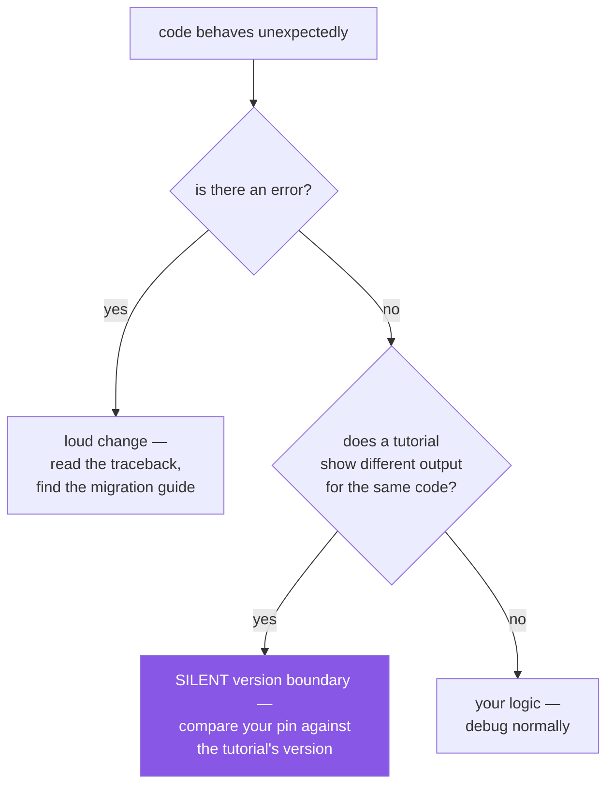

# 4.1 — The three breaking changes already in this stack

## One-line answer

Three of this plan's pins are **major versions that removed behaviour the internet is still full of**
— pandas 3, NumPy 2, and transformers 5 — and the dangerous property they share is that the old code
usually still *runs*, so the failure arrives later, somewhere else, looking like your mistake.

---

## The story

Someone is learning pandas. They find a well-written tutorial, work through it carefully, and hit a
step where they filter rows and set a value on the result. The tutorial's output shows the DataFrame
updated. Theirs does not.

They check their filter — correct. They print the mask — correct. They print the DataFrame before and
after — identical. They re-read the line character by character against the tutorial. It is the same
line.

They assume they have misunderstood something fundamental about pandas, because the alternative —
that the same code produces different results — is not a thing beginners are willing to believe about
a library used by millions of people.

The line was `df["col"][mask] = value`. Under the version the tutorial was written for, it modified
the DataFrame. Under the version they installed, it modifies a temporary copy which is then discarded.
**No error. No warning. The assignment succeeds and goes nowhere.**

That evening was not lost to a hard concept. It was lost to a version boundary that neither the
tutorial nor the code mentioned — and the reason it is worth a whole part on Day 1 is that they had
every piece of information needed to avoid it, in a file called `docs/PINS_DS.md`, before they
started.

---

## The idea in plain language

[1.1](../01-versions/1.1-semantic-versioning.md) established what a major bump *promises*: behaviour was
deliberately removed or changed. This part is about the sub-class of major change that is genuinely
dangerous, and what makes it different.

A **loud** breaking change removes a function. Your code raises `AttributeError` on the line that
uses it, you read the migration guide, you fix it. Annoying, bounded, self-diagnosing.

A **silent** breaking change keeps the same spelling and alters the meaning. The code runs. Something
downstream is wrong. The distance between the cause and the symptom is what costs you the evening —
and by the time you notice, you are debugging the wrong thing.

The plan's Part 2.2 names three of these, and they were chosen because most material written before
about 2024 assumes the old behaviour:

| Change | What moved | Why it is silent |
|---|---|---|
| **pandas 3.0** | Copy-on-Write is the only mode; strings infer to a PyArrow-backed `str` dtype rather than `object`; datetimes default to microsecond resolution | chained assignment succeeds and does nothing; `df.dtypes == "object"` stops finding text columns and simply returns nothing |
| **NumPy 2.x** | removed aliases — `np.float_`, `np.in1d` and relatives; some `copy=` semantics changed | mostly loud (`AttributeError`), but the copy-semantics half is silent |
| **transformers v5** | a major API revision across the library | tutorials from the v4 era produce confusing errors far from their cause |

Two observations that matter more than the specifics.

**Every one of these is a *documented* change, announced in advance.** Nobody was ambushed. The
information existed; what failed was the *route* from the information to the person. That is the gap
this day exists to close: your pins are written down, so you can always answer "which version am I
on?" — and that question is the first one to ask when reality disagrees with a tutorial.

**The defence is not memorising the changes.** You will not be taught pandas 3 today — Day 26 opens
with it, and reproduces both failures on screen deliberately. The defence today is a *habit* with
three steps: know your pinned version, check the tutorial's version before trusting it, and when
behaviour surprises you, suspect the boundary before suspecting yourself.



And a fourth pin worth knowing about even though the plan's Part 2.2 lists three: **`mcp` is at 2.0**,
also a major. Its lesson is deferred to Day 209, and the plan says to verify the specification
revision on the spec page *before* writing a server rather than trusting any tutorial. Same pattern,
different subject.

---

## Why Setu needs it

- **Day 20 teaches NumPy 2.x names first**, so the removed aliases are never learned. That only works
  if you are actually on NumPy 2, which is what today's pinning guarantees.
- **Day 26 opens by reproducing both pandas 3.0 failures on screen.** It needs a verified pandas 3
  pin, and it needs you to already believe that a version boundary can be silent.
- **Every Phase 16 lesson ends with a live-docs verification link** because transformers v5 is a
  major. The habit is established here; it is used there.
- **Principle 2 — from scratch before library** exists partly for this reason: when you have
  implemented cosine similarity yourself, a library whose behaviour changed cannot mislead you about
  what the answer should be.

---

## The mechanism

The habit is one question — *which version am I actually on?* — asked before you trust anything.

```bash
uv run python -c "
import importlib.metadata as m
for pkg in ('pandas', 'numpy', 'transformers'):
    try:
        print(f'{pkg:16} {m.version(pkg)}')
    except m.PackageNotFoundError:
        print(f'{pkg:16} not installed yet (arrives in its own phase)')
"
```

**Line by line:**

- `importlib.metadata.version(pkg)` — the installed version, as evidence rather than as intent
  ([1.1](../01-versions/1.1-semantic-versioning.md)). None of these three are installed today, because packages
  arrive on the day they are first used — and the script says so instead of crashing.
- `m.PackageNotFoundError` — the specific exception for "no such installed package". Catching the
  specific one rather than bare `Exception` means a genuine bug still surfaces
  ([2.3](../02-pypi-index/2.3-the-check-pins-script.md)).
- **Run this before following any tutorial**, in the environment you are actually using. It is the
  cheapest possible check and it answers the question the story's reader never asked.

Confirm what the plan pins, so you know what you are heading toward:

```bash
grep -nE "pandas|numpy|transformers|mcp" docs/PINS_DS.md | head -12
```

**Line by line:**

- `grep -nE "a|b|c"` — extended regular expressions (`-E`), where `|` means alternation, with line
  numbers (`-n`) so you can jump to them. The same pattern as
  [Day 0, 1.2](../../../day-00-setup/parts/01-toolchain/1.2-git-and-git-bash.md).
- Read the ⚠️ markers in the output. **Those marks are the plan telling you where it expects you to
  be careful**, and they are the reason the table has a "Why this, and what to watch" column rather
  than only a version.

Now build the reflex that catches a silent change — comparing behaviour against a version, not
against a tutorial:

```bash
uv run python -c "
import sys
print('python  :', sys.version.split()[0])
print()
print('Before trusting any code example, ask:')
print('  1. what version is my environment on?      -> importlib.metadata.version()')
print('  2. what version was the example written for? -> its date, its imports, its output')
print('  3. is there a major boundary between them?  -> the release notes, not a search result')
"
```

**Line by line:**

- This block prints a checklist rather than computing anything, which is deliberate: the mechanism of
  this part is a *procedure*, and a procedure you can run is more likely to be followed than one you
  intend to remember.
- Step 2's tells are worth internalising. A tutorial's **date** is the weakest signal (undated posts
  are everywhere). Its **imports** are better — `from sklearn.cross_validation import ...` names a
  module that has not existed for years. Its **printed output** is the strongest: if the example
  shows output your identical code does not produce, you have found a version boundary, not a
  misunderstanding.
- Step 3 says release notes rather than a search engine, because a search will return the popular
  answer, which is by definition the one written when the old behaviour was current.

---

## When it breaks

**The silent one, in full:**

```text
>>> import pandas as pd
>>> df = pd.DataFrame({"a": [1, 2, 3]})
>>> mask = df["a"] > 1
>>> df["a"][mask] = 99
>>> df
   a
0  1
1  2
2  3
```

**What it means.** The assignment ran. No exception, no warning, and the DataFrame is unchanged —
`df["a"]` produced a temporary object, the assignment modified that, and it was discarded. Under
Copy-on-Write this is the defined behaviour, and the fix is a single indexing call that names both
axes at once: `df.loc[mask, "a"] = 99`. Day 26 teaches this properly. **Today the lesson is the
shape**: correct-looking code, no error, wrong result.

**The one that stops finding your columns:**

```text
>>> text_cols = df.columns[df.dtypes == "object"]
>>> list(text_cols)
[]
```

**What it means.** The DataFrame has text columns; this idiom no longer finds them, because strings
now infer to a dedicated `str` dtype rather than `object`. Nothing raised. A pipeline built on this
line will quietly process zero text columns and produce a model trained on fewer features than
intended — which surfaces as slightly worse metrics, the hardest possible symptom to trace.

**The loud one, which is the easy case:**

```text
>>> import numpy as np
>>> np.float_
AttributeError: `np.float_` was removed in the NumPy 2.0 release. Use `np.float64` instead.
```

**What it means.** This is what a *good* breaking change looks like: it fails immediately, at the
line responsible, and the error message names the replacement. Compare it with the two above. When
you meet this you have lost seconds; the silent ones cost an evening. Recognising the difference is
why this part separates loud from silent rather than listing changes.

**And the version-boundary symptom in its most confusing form:**

```text
$ uv run python -m pytest
E   AssertionError: assert 0 == 3
E    +  where 0 = len(result)
```

**What it means.** A test asserting three rows got zero, with no error anywhere near the cause — the
downstream consequence of one of the silent changes above, several function calls away. **When a
result is empty or unchanged rather than wrong, suspect a silent version boundary.** That heuristic
will save you more time over 240 days than memorising any specific API change.

---

## In production

**Silent behaviour changes are the reason a test suite is a dependency-management tool, not just a
correctness tool.** Loud changes are caught by the interpreter; silent ones are caught only by an
assertion about a *value*. This is why upgrading a major version without tests is not really an
upgrade — it is a hope. It is also why the professional sequence for a major bump is: read the
migration guide first, upgrade in an isolated branch, and pay close attention to tests that check
*results* rather than tests that check things do not raise.

**Deprecation warnings are the early-warning system, and they are off by default.** Well-run projects
warn for a full release cycle before removing something, but Python hides `DeprecationWarning`
outside of test runs. Turning them into errors *in tests only* —
`filterwarnings = ["error::DeprecationWarning"]` in pytest configuration — converts a future silent
break into a failing test while the old behaviour still works. This is the single highest-leverage
setting for avoiding the story, and it is the same idea as
[1.1](../01-versions/1.1-semantic-versioning.md)'s note, applied to a specific class of change.

**Pinned versions make "which version" answerable, which is the actual production value.** During an
incident the question "did this behaviour change under us?" must be answerable in seconds, from the
lockfile and the deployment record, not from memory. A team without pins cannot answer it at all —
which means a whole category of cause cannot be ruled out, so every incident investigation is longer.

**The wider skill: calibrating trust in documentation by age.** Search results and model-generated
code are both weighted toward what was common when the material was written, which for a
recently-changed library is the *old* behaviour. Professionals develop a reflex for it: check the
version a source assumes before adopting its patterns, prefer the project's own current
documentation to third-party tutorials, and treat an undated post about a fast-moving library as
approximately worthless. This is exactly why every lesson in this project ends with a **Verify before
you code** section pointing at live docs.

**Upgrade planning is a normal part of the calendar.** Major versions are announced long before they
land. Teams that track announcements schedule the work; teams that do not get it as an emergency when
a security fix arrives only in the new major. The plan's Principle 13 Friday check is the small
version of that practice, and it is what stops "we are three majors behind" from being discovered
rather than decided.

**The review comment a senior engineer leaves.** On a PR bumping a major with only a version change
in the diff: *"Has anyone read the migration guide? Please link the release notes and say what in our
code is affected — a green build is not evidence for a silent change."* And on a code review
containing an idiom from an older era: *"This pattern is from before the 2.0 change; it still runs
but it no longer does what it looks like."*

**The interview question.** *"How do you upgrade a dependency across a major version?"* The
distinguishing part of a good answer is naming the risk correctly: the dangerous changes are not the
ones that raise, they are the ones where the same code now means something different, so the process
must be read-the-migration-guide first, upgrade in isolation, and lean on tests that assert values.
Mentioning that you would turn deprecation warnings into test errors *ahead* of the upgrade shows you
have been on the wrong side of this once and changed how you work.

---

## Check yourself

```bash
grep -nE "⚠️" docs/PINS_DS.md docs/00_MASTER_PLAN_DS_GENAI.md | head -8 && uv run python -c "
import importlib.metadata as m
for p in ('pandas','numpy','transformers','mcp'):
    try: print(f'{p:14}', m.version(p))
    except m.PackageNotFoundError: print(f'{p:14} not installed yet')
"
```

Every ⚠️ in the plan marks a place where a version boundary is expected to bite. None of those four
packages is installed today — which is correct, and which is why today is the right time to know they
are coming.

**Answer out loud, without scrolling up:**

> What makes a breaking change *silent* rather than loud, and why is the silent kind more expensive
> even though it produces no error? Then: a tutorial's code produces different output than yours.
> Name the three things you check, in order, before concluding you have misunderstood something.

---

**Next:** [4.2 — Drift, the freshness check, and the amendment protocol](4.2-drift-and-the-amendment-protocol.md)
