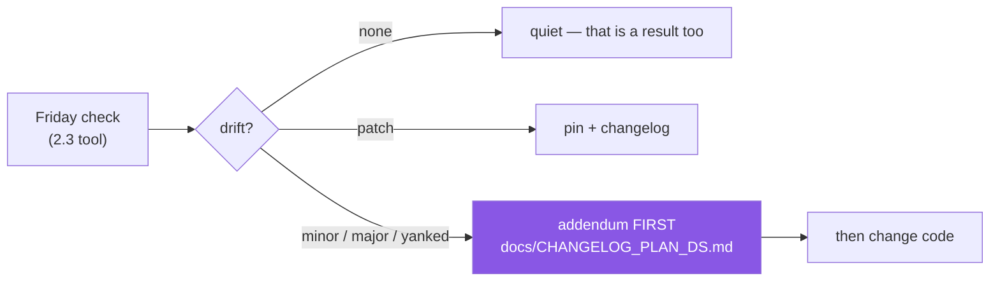

# 4.2 — Drift, the freshness check, and the amendment protocol

## One-line answer

A pin is a decision, and decisions decay — so the pairing that keeps this project honest is a
**scheduled check that detects drift** (Principle 13) and a **rule that the plan is amended before
any code adapts to it** (Principle 14), because a codebase quietly reshaped around a change nobody
wrote down is a codebase nobody can explain.

---

## The story

A retry helper is added to a codebase with a comment: `# API is flaky, retry 3 times`. Reasonable.

Six months later the retries are still there, plus a sleep, plus a special case for one endpoint that
"sometimes returns an empty list on the first call". Each addition was a small, sensible response to
an observed problem, made by someone who did not have time to investigate the cause.

The cause, it turns out, was a version bump eight months earlier that changed a client library's
default from synchronous to eventually-consistent reads. It was in the release notes. Nobody read
them, because nobody was looking — the upgrade was routine, the tests passed, and the strange
behaviour started a week later and was attributed to "the API being flaky".

The code now contains four workarounds for a documented behaviour change, and no comment anywhere
names it. The next person to touch this will find defensive code with no rationale and will not dare
remove any of it.

**The code adapted to reality and nobody amended the plan.** That is Principle 14's failure mode, and
it is far more common than a dramatic outage: it looks like maintenance, it accumulates slowly, and
its cost is that the system becomes inexplicable.

---

## The idea in plain language

**Drift** is the gap between what you decided and what is now true. Nothing did anything wrong; the
world moved. Today you froze a set of versions ([3.2](../03-freezing/3.2-freezing-into-pyproject-and-the-lock.md))
and generated a document recording them ([3.3](../03-freezing/3.3-regenerating-pins-from-evidence.md)). Both
begin decaying immediately.

Two principles work as a pair, and neither is much use alone.

**Principle 13 — the weekly freshness check — is *detection*.** Every Friday: release notes for every
pin, plus the MCP specification page. The tool from [2.3](../02-pypi-index/2.3-the-check-pins-script.md) produces
the diff. Without this, drift is discovered by an unrelated failure, at the worst time, by whoever is
least prepared.

**Principle 14 — amend the plan first — is *response*.** When reality has changed, you write the
amendment **before** touching code: what changed, what it affects, what you are going to do. Only
then does the code move. The plan's own words are *"ecosystem change → versioned addendum → then
code. Never patch code around a plan that has gone stale."*

Why that order, when it feels slower? Because of the story. Code written in response to an
unrecorded change carries no explanation, and an unexplained workaround is permanent — nobody can
safely delete what they cannot account for. Writing first costs a paragraph; not writing costs the
ability to ever clean up.

Not all drift deserves the same response, and matching the response to the size is the judgement this
part is really teaching:

| What moved | What it means | Response |
|---|---|---|
| **Patch** (`3.0.5 → 3.0.6`) | bug fixes only | pin it, note it in the changelog, move on |
| **Minor** (`3.0.5 → 3.1.0`) | additions | pin it, skim the notes, changelog entry |
| **Major** (`3.0.5 → 4.0.0`) | removals ([1.1](../01-versions/1.1-semantic-versioning.md)) | **stop.** Write an addendum before any code changes |
| **Yanked** ([2.2](../02-pypi-index/2.2-yanked-and-prerelease.md)) | the release was withdrawn | move immediately; your `==` pin is still installing it |
| **Python floor/ceiling moved** ([3.1](../03-freezing/3.1-the-python-version-intersection.md)) | your interpreter window changed | addendum — this affects every future day |

`docs/PINS_DS.md` states the rule in its own words: *any patch drift → pin it and log it; any minor
or major drift → write an addendum **before** you pin.*



This repository already contains a worked example. `docs/CHANGELOG_PLAN_DS.md` records amendment
**v2.0.0** — the doc-architecture change that produced the `parts/` structure you are reading right
now. It names the trigger, the amendment, what was explicitly *unchanged*, and the migration. That is
the shape every future entry takes.

---

## Why Setu needs it

- **Principle 13 is a standing commitment for 240 days.** It only survives if it is cheap
  ([2.3](../02-pypi-index/2.3-the-check-pins-script.md)) and if its output has an obvious next action — which is
  the table above.
- **Principle 14 is what every phase gate depends on.** Thirteen ADRs by Day 240 are only defensible
  if the reasoning was written when it was fresh.
- **`docs/CHANGELOG_PLAN_DS.md` exists and has one entry.** Today's job includes knowing what a
  second entry would look like and when to write it.
- **The plan is a live document, not scripture.** A curriculum that cannot be amended goes stale in a
  field where pandas made a breaking major release in January — the plan says so itself, in Part 9.

---

## The mechanism

Run the detection half, and read the result as a decision rather than a report:

```bash
uv run python scripts/check_pins.py 2>/dev/null || echo "(build it first — hub §4; until then, the one-liner below)"
```

**Line by line:**

- The tool from [2.3](../02-pypi-index/2.3-the-check-pins-script.md), whose exit status is the answer: zero means
  nothing moved. **A quiet Friday is a successful Friday**, and a check that is silent when there is
  nothing to say is one you will still be running in Phase 27.
- `|| echo` — the fallback for before you have built it, so the command is honest about its
  precondition rather than failing obscurely
  ([Day 0, 2.5](../../../day-00-setup/parts/02-skeleton/2.5-the-venv-you-never-activate.md)).

Classify what you find, which is the step people skip:

```bash
uv run python -c "
from packaging.version import Version

def classify(pinned, current):
    p, c = Version(pinned), Version(current)
    if p == c:              return 'none'
    if c < p:               return 'YANKED-OR-ROLLBACK — investigate'
    if c.major != p.major:  return 'MAJOR — addendum before any code'
    if c.minor != p.minor:  return 'minor — skim notes, pin, changelog'
    return 'patch — pin and log'

for pinned, current in [('3.0.5','3.0.6'), ('3.0.5','3.1.0'), ('3.0.5','4.0.0'), ('3.0.5','3.0.5'), ('3.0.5','3.0.4')]:
    print(f'{pinned:8} -> {current:8} {classify(pinned, current)}')
"
```

**Line by line:**

- `classify` is a **pure function** — inputs in, verdict out, no network and no files. That is
  deliberate: it is the piece the hub's §5 test can exercise without touching PyPI, and it is the
  separation of *fetching* from *deciding* that [2.3](../02-pypi-index/2.3-the-check-pins-script.md) argued for.
- `Version(pinned)`, `Version(current)` — parsed, never compared as strings
  ([1.1](../01-versions/1.1-semantic-versioning.md)).
- `if c < p` — the current version is *older* than your pin. That is not ordinary drift: either your
  pinned release was yanked and the index's latest has gone backwards, or you pinned something that
  was withdrawn. It gets its own branch because its response is urgent
  ([2.2](../02-pypi-index/2.2-yanked-and-prerelease.md)).
- The order of the checks matters: equality first, then the anomaly, then major, then minor, then
  patch by elimination. **Write the most specific condition first**, the same rule as ordering
  `except` clauses ([2.3](../02-pypi-index/2.3-the-check-pins-script.md)).
- Note the function returns a *verdict string* rather than printing. A function that decides and a
  caller that reports are separable and testable; a function that prints is neither.

Read the amendment this repository has already made, as the template for your next one:

```bash
sed -n '/^## v2.0.0/,/^## v1.0.0/p' docs/CHANGELOG_PLAN_DS.md | head -30
```

**Line by line:**

- `sed -n '/start/,/end/p'` — the pattern-range address from
  [3.3](../03-freezing/3.3-regenerating-pins-from-evidence.md): print from the first match to the next.
- What to notice in the output is the **structure**, not the content: a *Trigger* (what changed in
  reality), the *Amendment* (what the plan now says), an *Explicitly unchanged* section, and a
  *Migration* note. The third of those is the one beginners omit and the one reviewers value most —
  saying what you did **not** change is how a reader knows the blast radius.

Write a drift entry now, as a dry run:

```bash
cat > /tmp/amendment-draft.md <<'EOF'
## vX.Y.Z — YYYY-MM-DD — <one-line summary>

**Trigger.** What changed in reality, with evidence: the package, the old and new versions,
and a link to the release notes. Read, not assumed.

**Amendment.** What the plan now says. Which days, IDs or pins are affected.

**Explicitly unchanged.** Everything a reader might fear this touches, but it does not.

**Migration.** What has to happen to existing work, and in what order.
EOF
cat /tmp/amendment-draft.md
```

**Line by line:**

- The heredoc from [Day 0, 2.2](../../../day-00-setup/parts/02-skeleton/2.2-gitignore-before-secrets-exist.md),
  quoted so nothing expands.
- **"Read, not assumed"** in the Trigger section is the load-bearing phrase. An amendment citing a
  version you did not verify is the same failure as the tutorial in
  [4.1](4.1-the-three-breaking-changes.md), one level up.
- Writing to `/tmp` — this is a draft, not a commit. The real entry goes in
  `docs/CHANGELOG_PLAN_DS.md` when you actually have drift to record.

---

## When it breaks

**The quiet result, which people misread as a failed run:**

```text
$ uv run python scripts/check_pins.py; echo "exit: $?"
exit: 0
```

**What it means.** No drift. Nothing printed because there was nothing to say. This is the *correct*
and most common outcome, and a check that stays silent when all is well is what keeps it survivable
for 240 days ([2.3](../02-pypi-index/2.3-the-check-pins-script.md)'s note on alert fatigue). If you find silence
unsettling, add a one-line summary — but do not add per-package noise.

**Drift found, and the tempting wrong move:**

```text
$ uv run python scripts/check_pins.py
DRIFT pandas: pinned 3.0.5, index has 4.0.0
exit: 1

$ uv add "pandas==4.0.0"   # <- WRONG ORDER
```

**What it means.** You have just adopted a major version — behaviour removed, per
[1.1](../01-versions/1.1-semantic-versioning.md) — without reading what it removed or recording the decision.
The tests may even pass, because the dangerous changes are the silent ones
([4.1](4.1-the-three-breaking-changes.md)). Principle 14's order exists precisely for this moment:
**addendum first, then the pin.** The pin takes seconds either way; the difference is whether anyone
can explain it later.

**The version that went backwards:**

```text
DRIFT some-lib: pinned 2.4.0, index has 2.3.9
```

**What it means.** The index's latest is *older* than your pin — almost always because `2.4.0` was
yanked ([2.2](../02-pypi-index/2.2-yanked-and-prerelease.md)). Your `==` pin is still installing the withdrawn
release, and will keep doing so silently. This is the one row in the table with no "consider it next
sprint" option: check the yank reason and move.

**And the failure the whole part is about, which produces no output at all:**

```text
$ git log --oneline -3 -- src/
a1b2c3d  add retry for flaky API
b2c3d4e  increase retry count to 5
c3d4e5f  special-case empty first response
```

**What it means.** Three commits adapting to a change nobody named. There is no error, no alert, and
no single moment where it went wrong — which is why it needs a *scheduled* check rather than
vigilance. When you find defensive code with no rationale, the question to ask is "what changed
underneath us, and when?", and the answer is usually in a release note somebody had available and
nobody was looking for.

---

## In production

**This pattern has a name outside Python: drift detection and reconciliation.** Infrastructure tools
compare declared state against deployed state on a schedule and report the difference — `terraform
plan`, a GitOps controller reconciling a cluster against a repository. The shape is identical to
[2.3](../02-pypi-index/2.3-the-check-pins-script.md)'s tool, and so are the failure modes: a check that is too
noisy gets ignored, and a difference that is fixed without being recorded becomes permanent
mystery. Recognising the shape means you already understand half of a subject you have not studied.

**"Write the decision before the change" is a general engineering practice with several names.**
ADRs, RFCs, design docs, change requests. They all exist for the story's reason: a system whose
decisions were never written becomes a system nobody dares modify. The minimum viable version is
three sentences — what changed, what we decided, what we rejected — and it is worth more than a long
document written afterwards, because it is written while the alternatives are still live in someone's
head. Principle 10's thirteen ADRs are this practice on a schedule.

**Scheduled checks need an owner and a schedule, or they need to be automated.** "Every Friday"
survives for one person on a personal project; on a team it needs to be a CI job on a cron, opening
an issue when it finds something. The general rule: **if a check depends on someone remembering, it
will stop happening at exactly the moment things get busy** — which is the moment it was most needed.
The same argument as the gate in [Day 0, 3.3](../../../day-00-setup/parts/03-m-script/3.3-the-done-gate.md).

**Security drift is the version of this with a deadline.** A pinned dependency with a published CVE
is not a stale pin, it is an open vulnerability, and the response time is measured against disclosure
rather than convenience. Real teams run vulnerability scanning against their lockfiles continuously
and treat findings as incidents with severity levels. The freshness check you are building is the
same mechanism; only the urgency differs.

**Amendments protect you from your own past reasoning, not only from other people.** The most common
reader of a changelog entry is its author, a year later, trying to remember why something is the way
it is. Writing down the *rejected* option is the part that pays off — it stops you relitigating a
decision you already made carefully, with less context than you had the first time.

**The review comment a senior engineer leaves.** On a PR bumping a major version: *"Where is the
write-up? I want to know what this removes and what in our code depends on it before we merge the
pin."* And on a defensive workaround with no comment: *"What is this protecting against? If we cannot
name it, we will never be able to remove it."*

**The interview question.** *"How do you keep a project's dependencies current without breaking
things?"* The complete answer has both halves and most candidates give only one. Detection: a
scheduled, automated check against the index and against advisories, cheap enough to run constantly
and quiet when there is nothing to report. Response: a triage rule that matches the size of the
change — patches pinned and logged, majors requiring a written decision before any code moves. If you
add *why* the writing comes first — that unexplained workarounds are permanent because nobody can
safely delete what they cannot account for — you have answered from experience rather than from
process.

---

## Check yourself

```bash
sed -n '/^## v2.0.0/,/^\*\*Migration/p' docs/CHANGELOG_PLAN_DS.md | head -20 && echo "--- pins verified on: ---" && grep -n "verified" docs/PINS_DS.md
```

Read this repository's own amendment and find its four parts — Trigger, Amendment, Explicitly
unchanged, Migration. Then check how old `docs/PINS_DS.md`'s verification date is. If it is not
today's, you have not finished the day.

**Answer out loud, without scrolling up:**

> Principle 13 and Principle 14 do different jobs — name which is detection and which is response,
> and explain why neither works without the other. Then: your Friday check reports a major bump. What
> is the very next thing you do, and why is it not `uv add`?

---

**Next:** back to the hub — [`../../LESSON.md`](../../LESSON.md) — and then tick
[`../../CHECKLIST.md`](../../CHECKLIST.md).
