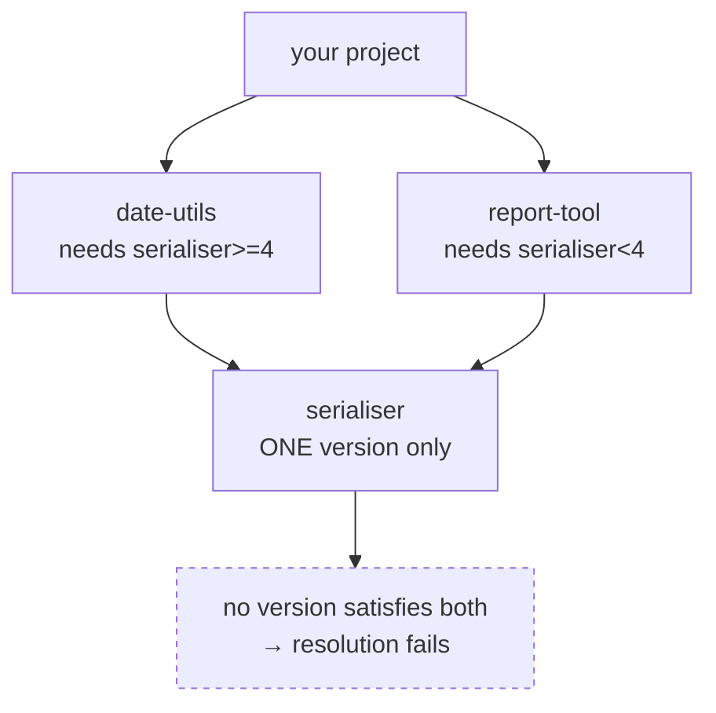

# 1.3 — The resolution problem — why one package's version depends on all the others

## One-line answer

Installing a package is not a download, it is a **search**: the resolver must find one version of
every package in the whole transitive tree such that every constraint in that tree is satisfied
simultaneously — which is why a single new dependency can change five unrelated versions, or fail
outright with an explanation instead of an installation.

---

## The story

Someone adds one small library to a project. It is a utility for parsing dates — a few hundred lines.
They expect one line in the diff.

The install output scrolls for a while, and afterwards their lockfile shows eleven changed versions.
Three packages they have never heard of were added. One package they *do* rely on was **downgraded**
from 2.4 to 2.1. Nothing in their own code was touched.

They assume something has gone wrong and try again with the same result. They start looking for a
flag to make it "just install the one thing".

Nothing went wrong. The date library requires a serialisation package at `>=4`; that package's
version 4 requires a compatibility shim; and the shim is incompatible with the 2.4 they had, but fine
with 2.1. To satisfy *everything at once*, the resolver had to move all of it. There is no way to
"just install the one thing", because a Python environment can hold exactly one version of each
package, so every install is a decision about the entire environment.

The eleven-line diff is not a side effect. It is the answer to a question they did not know they had
asked.

---

## The idea in plain language

A **resolver** is the component that turns "I want these packages" into "here is exactly which
version of every package to install". Its input is your declarations
([1.2](1.2-version-specifiers.md)); its output is a complete, consistent set.

Three facts make this harder than it sounds, and together they explain everything in the story.

**1. Dependencies are transitive.** You ask for pandas; pandas requires NumPy; NumPy requires
nothing further. You declared one package and installed two. Real projects declare fifteen and
install two hundred — the ones you did not name are **transitive dependencies**, and they are the
majority of what runs in your process.

**2. An environment holds exactly one version of each package.** There is one `site-packages`
([Day 0, 1.1](../../../day-00-setup/parts/01/1.1-why-one-tool-owns-the-environment.md)) and one
folder per package inside it. So if two of your dependencies both need `serialiser`, they do not get
one each — they must **agree**. This is the *diamond dependency problem*: two paths through the graph
arrive at the same package with different demands.



**3. Therefore it is a search, not a lookup.** The resolver picks a candidate version, reads *its*
requirements, adds them to the set of constraints, and continues — and when it reaches a
contradiction it must **backtrack**: undo a choice, try an older version, and explore again. That is
why adding one package can move five others, and why resolution takes real work rather than being
instant.

Two consequences worth holding onto.

**Failure is a proof, not a crash.** When a resolver says "no solution found", it has *demonstrated*
that no combination satisfies your constraints. Modern resolvers report the conflicting chain —
that message is the most useful part of the output, and it deserves reading rather than skipping.
Older tools would instead install *something* and let you discover the incompatibility at runtime,
which is strictly worse.

**Resolution and installation are separate steps.** Resolving answers "which versions?"; installing
downloads and unpacks them. This separation is exactly what a lockfile records — the answer, without
the download — so it can be replayed later on a different machine
([Day 0, 2.4](../../../day-00-setup/parts/02/2.4-uv-init-pyproject-and-the-lockfile.md)). You can
resolve without installing, which is how you check that a plan is *possible* before committing to it
— and that is what you will do to the whole 240-day stack in
[3.1](../03/3.1-the-python-version-intersection.md).

---

## Why Setu needs it

- **The plan pins a stack of about sixty packages** spanning NumPy, PyTorch, TensorFlow, LangChain
  and MCP. Whether they can *coexist* is a resolution question, and it is the single biggest technical
  risk in the whole 240 days. `docs/PINS_DS.md` even flags gensim as "the most fragile pin here
  against NumPy 2.x — verify import on Day 1."
- **Principle 4's lockfile is a stored resolution.** You cannot understand what `uv.lock` is for
  without understanding what was hard about producing it.
- **Every "No solution found" message you meet for 240 days** is this part. Learning to read the
  conflict chain now saves every one of those evenings.
- **[3.1](../03/3.1-the-python-version-intersection.md) computes the Python floor and ceiling** by
  intersecting constraints — the same operation the resolver performs, done by hand once so it stops
  being magic.

---

## The mechanism

Watch a resolution happen without installing anything:

```bash
echo "pandas" | uv pip compile - -o /dev/null 2>&1 | head -20
```

**Line by line:**

- `echo "pandas" |` — feed a one-line requirements list into the next command's input, the pipe from
  [Day 0, 1.2](../../../day-00-setup/parts/01/1.2-git-and-git-bash.md).
- `uv pip compile -` — resolve a set of requirements into a fully pinned list. The lone `-` means
  **read the requirements from standard input** rather than from a file.
- `-o /dev/null` — write the resolved output to the null device, because here we only want to see
  whether it resolves and what it reports, not keep the file. (`-o` is `--output-file`.)
- `2>&1` — merge standard error into standard output so the summary lines, which `uv` writes to
  stderr, survive the pipe. Without this you would see the resolved packages but not the commentary.
- **Nothing is installed by this command.** That is the point: resolution is a separate step, and
  you can ask "is this even possible?" without changing your environment.

Now see the transitive tree you are actually running:

```bash
uv tree
```

**Line by line:**

- `uv tree` — print the dependency graph of the current project: your direct declarations, and
  everything underneath them, indented. Run it and count the packages you never asked for. That
  count is the answer to "what does a lockfile record that `pyproject.toml` does not"
  ([Day 0, 2.4](../../../day-00-setup/parts/02/2.4-uv-init-pyproject-and-the-lockfile.md)).
- The tree is also where a diamond becomes visible: a package appearing under two different parents
  is one that had to satisfy both.

Read the constraints a package imposes, straight from its metadata:

```bash
uv run python -c "
import importlib.metadata as m
for pkg in ('pytest', 'ruff'):
    md = m.metadata(pkg)
    print(pkg, '-> requires-python:', md.get('Requires-Python'))
    for r in (m.requires(pkg) or [])[:6]:
        print('    ', r)
"
```

**Line by line:**

- `m.metadata(pkg)` — the package's metadata as a mapping. `Requires-Python` is the constraint the
  package places on the *interpreter*, which is the input to
  [3.1](../03/3.1-the-python-version-intersection.md).
- `m.requires(pkg)` — the list of requirement strings this package imposes on other packages. **These
  are the constraints the resolver reads.** Seeing them as ordinary strings, in the same PEP 440
  grammar you learned in [1.2](1.2-version-specifiers.md), is what turns the resolver from a black
  box into a program doing something you could do by hand.
- `or []` — `requires()` returns `None` for a package with no dependencies, and iterating `None`
  raises `TypeError`. Defending against that is the difference between a script that works on your
  machine and one that works on the next package you point it at.
- `[:6]` — a slice, keeping the output short.

Force a conflict on purpose, so the failure is something you have seen rather than something you
have read about:

```bash
printf 'pytest==9.1.1\npytest==8.0.0\n' | uv pip compile - -o /dev/null 2>&1 | tail -8
```

**Line by line:**

- `printf '...\n...\n'` — two contradictory requirements, one per line. `printf` interprets `\n`
  reliably where `echo` does not ([Day 0, 3.3](../../../day-00-setup/parts/03/3.3-the-done-gate.md)).
- The resolver must report failure, because no single version of pytest is both 9.1.1 and 8.0.0.
  **Read the message it prints.** That shape — "because X depends on … and you depend on …, we can
  conclude" — is the conflict chain, and it is the thing to look for in every future failure.
- `tail -8` — the last eight lines, where the conclusion is.

---

## When it breaks

**The genuine conflict, in the form you will actually meet:**

```text
$ uv add "gensim==4.4.0"
  × No solution found when resolving dependencies:
  ╰─▶ Because gensim==4.4.0 depends on numpy<2 and your project depends on numpy==2.5.2,
      we can conclude that your project's requirements are unsatisfiable.
```

**What it means.** Read it as a proof with two premises and a conclusion. Premise one is *gensim's*
constraint, which you did not write and cannot change. Premise two is yours. They are incompatible,
so nothing can be installed — the resolver has not given up, it has finished.

Your options, in the order a professional considers them: use a gensim version whose constraint
admits NumPy 2 (check the index — [2.1](../02/2.1-the-pypi-json-api.md)); drop the package and use
something else for that job; or, last, change your own pin and accept the consequences elsewhere.
Note that `docs/PINS_DS.md` predicted this exact pairing as the plan's most fragile, which is why
Day 1 verifies it rather than discovering it in Phase 14.

**The resolution that succeeds but downgrades something:**

```text
$ uv add some-tool
Resolved 34 packages
 + some-tool==1.2.0
 - httpx==0.28.1
 + httpx==0.27.2
```

**What it means.** The story, in four lines. `some-tool` constrains `httpx` below your current
version, so satisfying everything required moving it. This is legal and often fine — but it is a
change to a package you depend on, made by a package you just met, and it deserves a look rather
than a shrug. **Read the `-`/`+` pairs in every resolution output**; they are the part that affects
code you already wrote.

**The failure that is really about your Python version:**

```text
$ uv add "tensorflow==2.21.0"
  × No solution found when resolving dependencies:
  ╰─▶ Because tensorflow==2.21.0 requires Python <3.14 and your project requires
      Python ==3.14.*, we can conclude that your project's requirements are unsatisfiable.
```

**What it means.** The constraint is on the *interpreter*, not on another package — the ceiling from
[Day 0, 1.4](../../../day-00-setup/parts/01/1.4-python-3-12-under-uv.md), enforced by the resolver
rather than discovered at import time. This is the failure mode
[3.1](../03/3.1-the-python-version-intersection.md) exists to prevent before it happens.

**And the one with no message, because it is a performance cliff:**

```text
$ pip install -r requirements.txt
Collecting package-a
  Downloading package_a-3.2.1.tar.gz
  ...
INFO: pip is looking at multiple versions of package-b to determine which version
is compatible with other requirements. This could take a while.
```

**What it means.** Backtracking. The resolver picked a candidate, found a contradiction deeper in the
tree, and is now working its way through older versions looking for a set that holds. It is not
stuck; it is searching a large space. This message is the classic symptom of an over-constrained tree
([1.2](1.2-version-specifiers.md)'s note about pins removing the resolver's freedom), and the fix is
usually to relax a pin rather than to wait.

---

## In production

**Resolution is per-environment, and that is a real operational problem.** The correct answer can
differ by operating system, CPU architecture and Python version, because packages declare
platform-conditional dependencies with the environment markers from
[1.2](1.2-version-specifiers.md). A lockfile produced on a developer's laptop can therefore be wrong
for a Linux container. Teams solve this either by resolving inside the target platform (in Docker,
in CI) or by using a tool that produces a **universal** lock covering several platforms at once —
which is what `uv.lock` does, and it is a substantial part of why it is preferred to a plain
`requirements.txt` here.

**Testing the *lower* bound is the discipline almost nobody has.** If you declare `httpx>=0.27`, your
CI almost certainly tests the newest version, so the claim about 0.27 is untested and probably false.
Mature library projects run an extra CI job that resolves to the **oldest** permitted versions, which
either validates the declared range or proves it is fiction. If you maintain a library and take one
practice from this part, take that one.

**Resolution time is a build-cost line item.** In a large monorepo, a slow resolve on every CI run is
minutes of compute per commit, multiplied by every commit. The standard mitigations are caching the
resolver's index and wheels, and — the important one — **not re-resolving at all in CI**:
`uv sync --frozen` replays a stored resolution rather than computing a new one
([Day 0, 2.4](../../../day-00-setup/parts/02/2.4-uv-init-pyproject-and-the-lockfile.md)). Resolve on a
developer's machine, deliberately; replay everywhere else.

**The security dimension: dependency confusion.** Because the resolver fetches whatever the index
offers for a name, an attacker who publishes a package on the public index with the same name as your
private internal one — at a higher version — can have it selected instead. This has been used in real
attacks. The defences are exact pins with **hashes** (so an unexpected artifact fails verification),
explicit index configuration rather than blending public and private sources, and namespacing
internal packages. The hashes in `uv.lock` are not decoration; this is the attack they answer.

**The review comment a senior engineer leaves.** On a PR whose lockfile diff downgrades an unrelated
package: *"This resolution moves `httpx` back a minor version — was that intended? Check whether the
new dependency's constraint is really that tight or whether we can ask them to widen it."* And on a
CI job running `uv sync` without `--frozen`: *"This re-resolves on every run, so the build is a
function of the day. Replay the lock instead."*

**The interview question.** *"Why can installing one package change the versions of several others,
and why does an install sometimes fail with 'no solution' rather than installing anyway?"* They are
checking whether you understand that resolution is a constraint-satisfaction search over a transitive
graph where each package may appear only once. The strong answer names the diamond dependency
problem, explains backtracking, and adds that failing loudly is *better* than the older behaviour of
installing an inconsistent set and failing at runtime — because a resolution error is a proof
delivered before deployment rather than an exception delivered after it.

---

## Check yourself

```bash
uv tree && echo "--- forced conflict, expect a proof: ---" && printf 'pytest==9.1.1\npytest==8.0.0\n' | uv pip compile - -o /dev/null 2>&1 | tail -5
```

Count the packages in the tree that you never declared. Then read the conflict message and identify
its two premises and its conclusion.

**Answer out loud, without scrolling up:**

> Why can an environment not simply install two versions of the same package and give each dependent
> the one it wants? Then: what exactly has a resolver *proved* when it says "no solution found", and
> why is that better news than an install that succeeds?

---

**Next:** [2.1 — PyPI's JSON API, and why you never take a version from a tutorial](../02/2.1-the-pypi-json-api.md)
