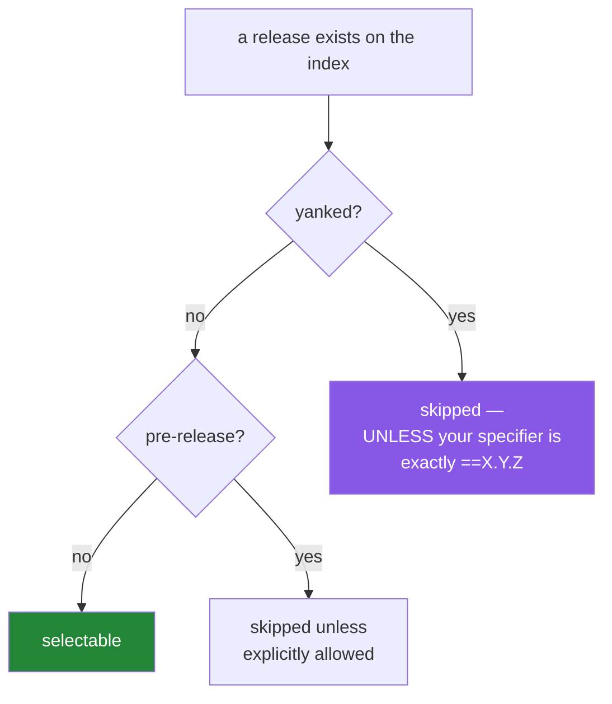

# 2.2 — Yanked releases and pre-releases, and when "latest" is the wrong answer

## One-line answer

A published release can be **yanked** — marked as "do not use" without being deleted — and the rule
installers follow says a yanked file is ignored *unless you pinned to it exactly, which is what this
project does everywhere*, so an exact pin is the one specifier that can keep installing a release its
own authors have withdrawn.

---

## The story

A maintainer ships version `2.4.0` on a Tuesday. Within a few hours, reports arrive: under one
common configuration it corrupts output. Quietly, silently, wrongly.

They cannot delete it. Once a release is published, the files are permanent — deleting them would
break every build that already depends on that version, and would let someone later upload *different
files* under the same version number, which is a far worse problem than a bug. Immutability is the
foundation everything else stands on.

So they do the thing the ecosystem provides for exactly this: they **yank** it. The release stays
downloadable, but it is flagged, with a reason attached. New installs will skip it. `2.4.1` goes out
the same evening with the fix.

Two teams are affected.

The first declared `the-library>=2.0`. Their next build silently skips `2.4.0` and picks `2.4.1`. They
never learn any of this happened. The mechanism worked exactly as designed.

The second team pinned `the-library==2.4.0`, because they are careful people who pin things. Their
builds keep installing the corrupted release. For five weeks. The yank was a signal aimed directly at
them, and the exact pin is precisely what stopped it landing.

Being careful protected them from surprise and exposed them to a known-bad release. Both halves are
true, which is why this part exists rather than being a footnote in [1.2](../01/1.2-version-specifiers.md).

---

## The idea in plain language

Two mechanisms, both about "this release exists but you probably do not want it".

### Yanking

**Yanking** is defined by **PEP 592**. It marks a file as problematic without deleting it. The
metadata carries a boolean `yanked` and an arbitrary string `yanked_reason` explaining why — both
visible in the index responses you met in [2.1](2.1-the-pypi-json-api.md).

The rule installers follow is worth quoting rather than paraphrasing, because the exception is the
whole point:

> Yanked files are always ignored, unless they are the only file that matches a version specifier
> that "pins" to an exact version using either `==` (without any modifiers that make it a range, such
> as `.*`) or `===`.

Read that twice. `>=2.0` skips a yanked release. `==2.4.*` skips it, because `.*` makes it a range.
`==2.4.0` **installs it**. That is deliberate — it exists so that a build which already depends on a
specific version does not break the moment someone yanks it — but the consequence is the story: the
tightest specifier is the one that ignores the warning.

Yanking is also **reversible**: the flag can be rescinded and re-applied. It is a label, not a
deletion.

Why yank rather than delete? Because deletion would allow a version number to be re-used with
*different content*, which destroys the guarantee that `2.4.0` means one specific set of bytes
forever. Every lockfile, every hash, every reproducible build rests on that guarantee
([Day 0, 2.4](../../../day-00-setup/parts/02/2.4-uv-init-pyproject-and-the-lockfile.md)).

### Pre-releases

A **pre-release** is a version published for testing before the real one. PEP 440 spells them with a
suffix: `2.0.0a1` (alpha), `2.0.0b2` (beta), `2.0.0rc1` (release candidate), and `2.0.0.dev3` for
development builds.

Installers **exclude pre-releases by default**. They are considered only when nothing else satisfies
your constraints, or when you explicitly ask. This is why `info.version` from
[2.1](2.1-the-pypi-json-api.md) will normally show you `1.9.0` even when `2.0.0rc1` is newer — and
why sorting a version list yourself, without filtering, can hand you a release candidate as "latest".
[1.1](../01/1.1-semantic-versioning.md)'s `Version(s).is_prerelease` is how you filter it.



So "what is the latest version?" is three questions wearing one coat: latest *published*, latest
*not yanked*, and latest *stable*. `docs/PINS_DS.md` wants the third. A script that answers the first
will eventually pin you to a release candidate or a withdrawn release, and it will do it silently.

---

## Why Setu needs it

- **Principle 4 pins everything with `==`.** That is the exact specifier form PEP 592's exception
  names, so this project is structurally in the second team's position. The defence is not to abandon
  pinning — it is to **check the yanked flag when you pin and when you re-verify**, which is what
  [2.3](2.3-the-check-pins-script.md) builds.
- **Principle 13's weekly freshness check** is the mechanism that catches a yank applied *after* you
  pinned. Without it, a pin is a decision made once and never revisited.
- **`docs/PINS_DS.md` records "the latest non-yanked release"** in its own description of
  `info.version`. Day 1's job is to verify that claim rather than inherit it.
- **Day 3 pins three provider SDKs** on free tiers that move quickly. Pre-releases and rapid yanks
  are more common in fast-moving client libraries than in NumPy.

---

## The mechanism

Ask whether a specific release is yanked — the question `info.version` alone does not answer:

```bash
uv run python -c "
import json, urllib.request
def release(pkg, ver):
    url = f'https://pypi.org/pypi/{pkg}/{ver}/json'
    req = urllib.request.Request(url, headers={'User-Agent': 'setu-pins/1.0'})
    with urllib.request.urlopen(req, timeout=10) as r:
        return json.load(r)
doc = release('pytest', '9.1.1')
files = doc['urls']
print('files:', len(files))
print('any yanked:', any(f['yanked'] for f in files))
print('reasons:', {f.get('yanked_reason') for f in files})
"
```

**Line by line:**

- `f'https://pypi.org/pypi/{pkg}/{ver}/json'` — the **release-specific** endpoint from
  [2.1](2.1-the-pypi-json-api.md). Asking about one version directly is the right shape here: the
  project-level endpoint describes the latest release, which is not the release you pinned.
- `doc['urls']` — the file objects for this release. A single release has several files (wheels for
  different platforms, plus a source distribution), and **yanking is per file** — so the honest
  question is about the set, not a single flag.
- `any(f['yanked'] for f in files)` — `any()` over a generator: `True` if at least one file is
  flagged. `all()` would ask whether every file is, which is a different and usually less useful
  question.
- `{f.get('yanked_reason') for f in files}` — a **set** comprehension, collapsing duplicate reasons.
  `.get()` rather than `[...]` because the field may be absent rather than `None`, and a reporting
  script should not crash on a missing optional field ([2.1](2.1-the-pypi-json-api.md)).
- Expect `False` and `{None}` for a healthy release. That is the baseline you are learning to
  recognise, so an unhealthy one stands out.

Now find the latest **stable, non-yanked** version — the answer `docs/PINS_DS.md` actually wants:

```bash
uv run python -c "
import json, urllib.request
from packaging.version import Version
req = urllib.request.Request(
    'https://pypi.org/simple/pytest/',
    headers={'Accept': 'application/vnd.pypi.simple.v1+json',
             'User-Agent': 'setu-pins/1.0'},
)
with urllib.request.urlopen(req, timeout=10) as r:
    doc = json.load(r)
versions = [Version(v) for v in doc['versions']]
stable = [v for v in versions if not v.is_prerelease]
print('published :', len(versions))
print('stable    :', len(stable))
print('newest published:', max(versions))
print('newest stable   :', max(stable))
"
```

**Line by line:**

- `'Accept': 'application/vnd.pypi.simple.v1+json'` — the header that switches the Simple API from
  its HTML form to its JSON form, PEP 691. Without it you get HTML and `json.load` fails.
- `doc['versions']` — the array of every published version. This is the non-deprecated way to
  enumerate releases, replacing the `releases` key flagged in [2.1](2.1-the-pypi-json-api.md).
- `[Version(v) for v in doc['versions']]` — parse each one, so comparisons are numeric rather than
  alphabetical ([1.1](../01/1.1-semantic-versioning.md)'s `'3.10' > '3.9'` trap).
- `not v.is_prerelease` — the filter that separates "newest published" from "newest stable". Run this
  against a package mid-release-cycle and the two lines differ; that difference is the bug this part
  prevents.
- `max(versions)` — correct **because** the list holds `Version` objects. On raw strings this returns
  a plausible, wrong answer, which is the worst kind.
- Note this endpoint's file objects use `requires-python` with a hyphen, unlike the JSON API's
  underscore — the naming difference from [2.1](2.1-the-pypi-json-api.md), which you will trip over
  once.

Prove the PEP 592 exception on your own machine, with no network mystery:

```bash
uv run python -c "
from packaging.specifiers import SpecifierSet as S
for spec in ('>=2.0', '==2.4.*', '~=2.4.0', '==2.4.0'):
    s = S(spec)
    pins_exactly = len(s) == 1 and next(iter(s)).operator in ('==', '===') and '*' not in next(iter(s)).version
    print(f'{spec:10} would install a yanked 2.4.0: {pins_exactly}')
"
```

**Line by line:**

- `len(s) == 1` — a `SpecifierSet` is a collection; the PEP's exception is about a specifier that
  pins, so a set with several clauses is not it.
- `next(iter(s))` — pull the single `Specifier` out of the set. Sets are not indexable, so `s[0]`
  would raise; `next(iter(...))` is the idiom for "the one element".
- `.operator in ('==', '===')` and `'*' not in ....version` — the PEP's condition, written out: `==`
  or `===`, **without** a modifier that makes it a range. `==2.4.*` fails the second test, which is
  exactly the distinction the specification draws.
- Only the last line prints `True`. **That line is this project's pinning style**, which is why the
  yank check belongs in the script rather than in your memory.

---

## When it breaks

**Installing a yanked release, which looks like success:**

```text
$ uv add "the-library==2.4.0"
Resolved 8 packages
 + the-library==2.4.0
```

**What it means.** No warning appears in this shape of output, and the release is withdrawn. The only
way to know is to ask ([the first command above](#the-mechanism)). Some tools do surface a notice; not
all do, and you should not build a habit on whether a particular version of a particular tool
happens to print one. **Check the flag; do not rely on being told.**

**The pre-release that arrived because nothing else could satisfy you:**

```text
$ uv add "some-lib>=3.0"
Resolved 12 packages
 + some-lib==3.0.0rc2
```

**What it means.** No stable 3.x exists yet, so the only thing matching `>=3.0` was a release
candidate, and the "exclude pre-releases by default" rule yields when the alternative is failure. You
have shipped a release candidate into your lockfile. If that is not what you wanted, the fix is a
constraint that admits a version which actually exists — and the general lesson is that a specifier
reaching into the future will eventually be satisfied by something you have not seen.

**The "latest" that is a release candidate, from your own script:**

```text
newest published: 3.0.0rc1
newest stable   : 2.9.4
```

**What it means.** Your script sorted versions and took the maximum without filtering. Pin the first
value and you have pinned a release candidate as if it were a release. The one-line fix is the
`not v.is_prerelease` filter above; the general lesson is that **"latest" is ambiguous and a script
must say which of the three meanings it implements.**

**And the failure that only happens weeks later:**

```text
$ ./m check
E   AssertionError: output mismatch: expected 3 rows, got 0
```

...on a build that has not changed. **What it means.** Possibly nothing to do with yanking — but if a
pinned dependency was yanked since you pinned it, your build is still installing a release its
authors marked as broken, and this is what that looks like: a failure with no diff to blame. The
first diagnostic question when a stable build starts failing without a commit is *did anything about
my dependencies change?*, and a yank is one of the few ways the answer is yes while the versions are
identical.

---

## In production

**The tension in this part is real and should be stated rather than resolved by slogan.** Exact
pinning gives reproducibility and takes away the ecosystem's ability to warn you. The professional
answer is not to loosen pins; it is to **add the missing feedback loop**: automated checks that
compare your lockfile against the index and against vulnerability advisories, and open a pull request
or fail a scheduled build when a pinned release is yanked or has a published CVE. Pin hard, monitor
continuously. Principle 13's Friday check is the small version of that discipline, and
[2.3](2.3-the-check-pins-script.md) is the tool it runs.

**Yanking is an incident-response tool, and knowing it exists changes how you respond to your own
bad release.** If you ship something broken, the correct sequence is: yank the release with a clear
reason, publish a fixed version immediately, and communicate. What you do **not** do is delete, and
you cannot re-upload the same version number with different files — immutability is enforced. Teams
who have not internalised this waste the first hour of an incident looking for a delete button.

**Pre-releases are how you get ahead of a major version rather than being surprised by one.** The
mature pattern for a major bump — [1.1](../01/1.1-semantic-versioning.md)'s subject — is to test
against the release candidate in a *separate, non-blocking* CI job while it is still a candidate. You
find out whether the new major breaks you before it lands, at a time of your choosing, and can file
issues while the maintainers can still act on them. This is why "exclude pre-releases by default,
opt in deliberately" is the right default rather than a nuisance.

**Immutability is what makes lockfiles and hashes meaningful.** Because `2.4.0` can never mean
different bytes, a `sha256` recorded in `uv.lock` is a permanent statement about what you built with.
Ecosystems that allowed republishing under the same version have had exactly the incident you would
expect. When you write a hash into a lockfile you are relying on this property; it is worth knowing
that you are.

**The review comment a senior engineer leaves.** On a lockfile update: *"Did you check whether any of
these pinned releases are yanked? Our `==` pins will install them regardless."* And on a script that
picks the newest version by sorting: *"Filter pre-releases explicitly, or we will pin an rc the next
time a major is in flight."*

**The interview question.** *"What happens if a library you depend on yanks the version you have
pinned?"* Most candidates have never heard of yanking, which makes this a strong discriminator. The
full answer: yanking marks a release as withdrawn without deleting it, because deletion would break
reproducibility and allow version reuse; installers skip yanked files **except** when the specifier
pins exactly with `==` — so an exactly pinned build keeps installing it silently, and the mitigation
is automated monitoring of your lockfile against the index rather than looser pins. Being able to
name that trade-off precisely is a senior answer to a question that sounds like trivia.

---

## Check yourself

```bash
uv run python -c "
import json, urllib.request
from packaging.version import Version
req = urllib.request.Request('https://pypi.org/simple/pytest/',
    headers={'Accept':'application/vnd.pypi.simple.v1+json','User-Agent':'setu-pins/1.0'})
with urllib.request.urlopen(req, timeout=10) as r:
    vs = [Version(v) for v in json.load(r)['versions']]
print('newest published:', max(vs))
print('newest stable   :', max(v for v in vs if not v.is_prerelease))
"
```

If those two lines are equal, no pre-release is currently in flight for pytest — run it again against
a faster-moving package and watch them diverge.

**Answer out loud, without scrolling up:**

> Why can a maintainer not simply delete a broken release, and what do they do instead? Then: state
> the rule about which specifiers install a yanked file, and explain why this project's pinning style
> is the one the rule singles out.

---

**Next:** [2.3 — `scripts/check_pins.py`, the tool that reads the index for you](2.3-the-check-pins-script.md)
