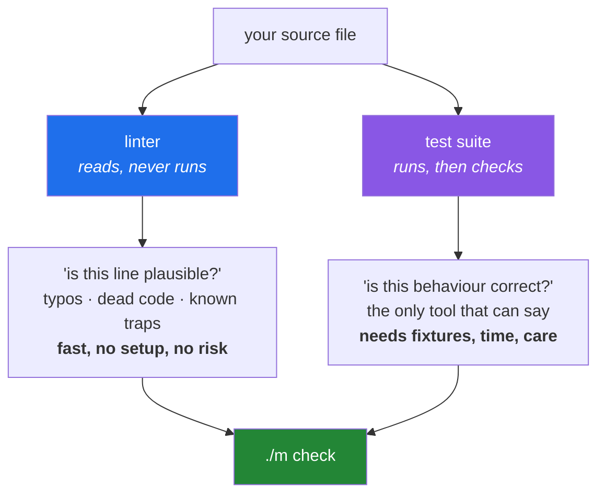

# 1.1 — What a linter is, and the two questions it cannot answer

## One-line answer

A **linter** reads your source code without running it and reports patterns that are legal Python
but almost certainly not what you meant — which means it can catch a whole class of bugs before a
test exists, and can never tell you whether the program does the right thing.

---

## The story

Someone is on call at two in the morning. A nightly job has failed, and the message on the screen is
this:

```text
NameError: name 'reslut' is not defined
```

They find the line. Three weeks earlier, a variable was typed `reslut` in one place and `result` in
another. The code had been reviewed by two people. It had passed its tests — because the branch
containing that line only runs when an upstream service returns an empty payload, which had never
happened in staging and happened for the first time that night.

Nothing was subtle here. The typo is visible from across the room once you know where to look. What
made it expensive was *when* it was found: the machine that could have spotted it in a tenth of a
second, the moment the line was typed, was never asked.

That machine is the subject of this part. It would have printed:

```text
F821 Undefined name `reslut`
```

...before the file was ever saved, before the review, before the branch was merged, before anyone's
sleep was involved.

---

## The idea in plain language

There are two completely different ways a tool can learn something about a program.

**Run it and watch.** Give it inputs, observe what comes out, compare against what should have come
out. That is a **test**, and it is the subject of [3.1](../03-pytest/3.1-the-test-that-can-go-red.md).
Tests are the only thing that can tell you a program is *correct*, because correctness is about
behaviour and behaviour only exists when the code runs.

**Read it without running it.** Parse the source into a tree of syntax, walk that tree, and look for
shapes known to be trouble. That is **static analysis** — *static* meaning "at rest", as opposed to
*dynamic*, meaning "while running". A **linter** is a static-analysis tool aimed at code quality.
The word comes from a 1970s C tool named for the lint a clothes dryer catches: small fluff, harmless
individually, worth removing.

The crucial property is that a linter never executes your code. It does not import your modules, does
not call your functions, does not need a database or a network or a key. It only reads. That is why
it is fast enough to run on every keystroke, and why it is safe to point at code you have not read.

### What it can see

Because it reads the whole file as a structure rather than as text, a linter can answer questions
about *reachability* and *usage* that a human eye skims past:

| Question | The finding |
|---|---|
| Is this name ever defined? | `F821 Undefined name` — the story above |
| Is this import ever used? | `F401 imported but unused` |
| Is this variable assigned and then never read? | `F841 Local variable is assigned to but never used` |
| Are two keys in this dict literal the same? | `F602`-family duplicate-key findings |
| Does this `except:` swallow every error including `KeyboardInterrupt`? | `E722 Do not use bare except` |
| Is this default argument a mutable object? | `B006 Do not use mutable data structures for argument defaults` |

That last one is the bug [Day 4, 3.1](../../../day-04-objects/parts/03-identity-trap/3.1-the-mutable-default-argument.md)
takes an entire document to explain. A linter finds it by pattern, without understanding a word of
what your function is for.

### The two questions it cannot answer

This is the part people get wrong, and it is worth being precise about rather than gesturing at.

**It cannot tell you whether the code is right.** `return a - b` in a function named `add` is
perfectly clean code. Every name is defined, nothing is unused, the formatting is immaculate. A
linter will pass it forever. Only a test that asserts `add(2, 3) == 5` has any opinion.

**It cannot tell you whether the code is worth writing.** A beautifully linted three-hundred-line
function that duplicates something already in `src/setu/` is still three hundred lines of waste. That
is a review question, and a human one.

So a linter is not a quality tool in the large sense. It is a **floor**. It removes an entire
category of embarrassment — the misspelling, the leftover import, the accidentally-swallowed
exception — so that reviews and tests can spend their attention on the questions only they can
answer.



---

## Why Setu needs it

- **Principle 7 says evals before features**, and a test is the expensive instrument. The linter is
  what stops you spending a test on `NameError`. Every day from here writes tests; none of them
  should have to assert that your variables are spelled consistently.
- **`./m check` already calls `ruff check .` as its first gate** — you wrote that dispatcher on
  [Day 0, 3.2](../../../day-00-setup/parts/03-m-script/3.2-the-case-dispatcher.md) without yet knowing
  what the command does. Today it stops being a magic word.
- **From Day 10 onward, code graduates from a notebook into `src/setu/`** (Principle 6). Notebook
  code is written in a hurry and carries exactly the debris — unused imports, variables from an
  abandoned experiment — that a linter exists to strip.
- **By Phase 20 you will be reading code a language model wrote.** Generated code is syntactically
  confident and semantically careless; it produces unused imports and shadowed builtins at a rate
  hand-written code does not. The linter is the first reader of anything you did not type yourself.

---

## The mechanism

Give the linter something wrong on purpose and watch it read.

```bash
mkdir -p /tmp/lint-demo
printf '%s\n' \
  'import json' \
  'import os' \
  '' \
  '' \
  'def load(path):' \
  '    data = open(path).read()' \
  '    reslut = json.loads(data)' \
  '    return result' \
  > /tmp/lint-demo/broken.py

uv run ruff check --isolated --select F,E /tmp/lint-demo/broken.py
```

**Line by line:**

- `printf '%s\n' 'line' 'line' ... > file` — writes the file one argument per line. This is used
  rather than a heredoc because a heredoc inside a lesson that is itself inside a shell is one
  nesting level too many; `printf` has no delimiter to collide with.
- `import os` — deliberately unused. This is the single most common finding in real code, because an
  import outlives the line that needed it.
- `reslut = json.loads(data)` then `return result` — the story's bug, reproduced. Note that this file
  is **valid Python**. It parses. `python -c "import ast; ast.parse(open('/tmp/lint-demo/broken.py').read())"`
  is perfectly happy with it. The error only exists at the moment that line runs.
- `--isolated` — ignore every `pyproject.toml` and `ruff.toml` on disk, including this project's. The
  finding you see is then a property of the code, not of your configuration, which is what makes this
  a teaching command rather than a project command.
- `--select F,E` — run only two rule families for now: `F` (logical errors) and `E` (style errors
  from pycodestyle). [1.2](1.2-choosing-rule-families.md) is about what the other letters mean.

The output:

```text
F401 [*] `os` imported but unused
 --> /tmp/lint-demo/broken.py:2:8
  |
1 | import json
2 | import os
  |        ^^
  |
help: Remove unused import: `os`

F821 Undefined name `result`
 --> /tmp/lint-demo/broken.py:8:12
  |
7 |     reslut = json.loads(data)
8 |     return result
  |            ^^^^^^
  |

F841 [*] Local variable `reslut` is assigned to but never used
 --> /tmp/lint-demo/broken.py:7:5
  |
7 |     reslut = json.loads(data)
  |     ^^^^^^
  |
help: Remove assignment to unused variable `reslut`

Found 3 errors.
[*] 2 fixable with the `--fix` option.
```

Read what actually happened there. The linter did not know the variable was *misspelled* — it has no
dictionary. It found two independent facts: a name is used that was never bound (`F821`), and a name
is bound that is never used (`F841`). A human reading those two findings together sees the typo
instantly. That is the shape of nearly every good static finding: **the tool reports structure, and
the structure makes the mistake obvious.**

Note also `[*] 2 fixable`. `F401` and `F841` have mechanical fixes — delete the line. `F821` does
not, because the tool has no idea whether you meant `reslut`, `results`, or something else entirely.
[1.3](1.3-fix-and-noqa-as-debt.md) is about that distinction and why it matters more than it looks.

Now ask the linter what it knows about itself:

```bash
uv run ruff rule F821
uv run ruff linter | head -20
```

**Line by line:**

- `ruff rule F821` — prints the rule's own documentation: what it detects, why, and an example. Every
  finding you do not understand has this command as its answer, and reaching for it rather than for a
  search engine is a habit worth forming on day one.
- `ruff linter` — lists every rule *family* (the letter prefixes) and which upstream tool each one
  reimplements. `F` is pyflakes, `E`/`W` are pycodestyle, `B` is flake8-bugbear, and so on. Ruff is a
  single binary that absorbed a dozen separate tools, which is why the codes look borrowed — they
  are.
- `| head -20` — the full list is long. You are looking at the shape, not memorising it.

---

## When it breaks

**The linter is silent on a file you were sure was wrong:**

```text
$ uv run ruff check .
All checks passed!
```

**What it means.** Almost always one of three things. Either the file is excluded — check
`extend-exclude` in `pyproject.toml`, which in this project already excludes `notebooks` and
`days/*/lab`. Or the rule that would have caught it is not selected: with `select = ["E", "F"]` a
bugbear finding like `B006` is simply not looked for. Or — the honest possibility — the bug is a
behaviour bug, and no linter was ever going to see it. The fix for the first two is configuration;
the fix for the third is a test.

**The path you gave it contains no Python:**

```text
$ uv run ruff check days/
warning: No Python files found under the given path(s)
All checks passed!
```

**What it means.** `All checks passed!` here is technically true and practically a lie — nothing was
checked. This exact output is worth burning into memory, because a CI job that lints the wrong
directory prints a cheerful green message forever. Whenever a lint step passes suspiciously fast,
the first question is *how many files did it actually read?* Add `--statistics` and find out.

**Ruff refuses the file entirely:**

```text
$ uv run ruff check /tmp/lint-demo/really-broken.py
error: Failed to parse /tmp/lint-demo/really-broken.py:3:1: Expected an expression
```

**What it means.** The file is not valid Python, so there is no syntax tree to walk and no analysis
to do. A linter's findings all presuppose a parse. This is the one case where "the linter said
nothing useful" is entirely reasonable — fix the syntax first, then ask again.

---

## In production

**The linter runs in three places, and they are not interchangeable.** In the editor, on every
keystroke, where its job is to be fast and forgiving. In a pre-commit hook, where its job is to stop
obvious debris entering history — the trade-off there is [4.2](../04-the-gate/4.2-local-gate-versus-remote-gate.md).
And in CI, where its job is to be the final word on a machine that has none of your local
configuration ([5.1](../05-ci/5.1-what-ci-actually-is.md)). A team that has only the first has a
suggestion; a team that has only the third has a slow feedback loop. Real projects have all three,
running the **same pinned version** — which is why `ruff==0.16.4` sits in `pyproject.toml` rather
than being installed globally. An unpinned linter is a tool that can fail your build on a day you
changed nothing, which is the fastest way to teach a team to distrust the build.

**Speed is not a vanity metric; it changes what the tool is for.** Older Python linters took tens of
seconds on a large repository, which meant they ran in CI and nowhere else, which meant findings
arrived after you had moved on. A linter that finishes a large codebase in well under a second can
run on save, and a finding that appears while your hand is still on the keyboard costs almost
nothing to fix. The engineering point generalises: **a tool's latency determines where in the
workflow it can live, and where it lives determines whether it helps.**

**On a legacy codebase you do not turn everything on.** Pointing a modern linter at a decade-old
repository produces thousands of findings, and a wall of red teaches a team to ignore red. The
professional move is to enable a narrow, high-signal set (`F` alone is a defensible start), fix that
to zero, commit, and widen one family at a time — each widening its own small pull request. Some
teams additionally *baseline*: record today's findings as accepted and fail only on new ones. Both
strategies protect the property that matters most, which is that **a red build always means
something new is wrong**.

**The review comment a senior engineer leaves.** On a pull request that adds `# noqa` to make a
finding disappear: *"What was the finding, and why is it wrong here? If the rule is wrong for this
codebase, disable it in config with a comment saying why; if it is right, fix the code. A bare
`noqa` says neither."* That is [1.3](1.3-fix-and-noqa-as-debt.md)'s subject in one sentence.

**The interview question.** *"What's the difference between a linter, a formatter, and a type
checker?"* The answer that lands: all three are static — none of them runs your code — but they
answer different questions. A **formatter** decides how the code looks and has no opinion on meaning
([2.1](../02-formatting/2.1-why-a-formatter-ends-the-argument.md)). A **linter** looks for patterns
that are legal but suspicious. A **type checker** proves that the types flowing through the program
are consistent, which is a stronger and more expensive claim than a linter makes. And none of the
three can tell you the program is correct — that is what tests are for. Candidates who blur linter
and formatter together are usually the ones who have only ever had them configured for them.

---

## Check yourself

```bash
uv run ruff check --isolated --select F --statistics src/ tests/ scripts/
uv run ruff rule F841
```

The first prints a per-rule count for the project's real Python — expect zero findings, and note
that `--statistics` is what tells you it actually looked. The second explains, in the tool's own
words, one of the three findings from the demo above.

**Answer out loud, without scrolling up:**

> A colleague says "we don't need tests, we have a linter." Name one bug a linter always catches and
> a test might miss, and one bug a test always catches and a linter never can. Then say what
> `All checks passed!` does *not* prove.

---

**Next:** [1.2 — Rule families, and choosing the six this project runs](1.2-choosing-rule-families.md)
