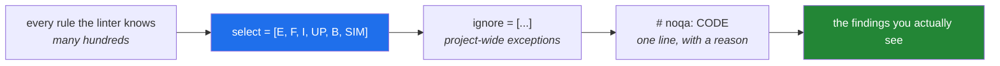

# 1.2 — Rule families, and choosing the six this project runs

## One-line answer

A linter ships with far more rules than any single project should run, so `select` is a **deliberate
list of the mistakes you have decided to be protected from** — and this project selects six families
because each one prevents a bug that a later day of the plan would otherwise spend an evening on.

---

## The story

A team turns on a new linter with the configuration they found in a blog post: every rule, all of
them, on.

The first run finds four thousand, one hundred and twelve problems.

Some are real. There is a bare `except:` in the payment retry path that has been swallowing
`KeyboardInterrupt` for two years. Nobody finds it, because it is on page thirty-one of the output,
between a complaint that a docstring's first line does not end in a period and a complaint that a
comparison to `True` should be written differently.

Two weeks later somebody adds `--exit-zero` to the CI step so the build goes green again. The linter
keeps running. It keeps finding four thousand problems. Nobody has read its output since.

Contrast a second team. They turn on one family — the one that finds undefined names and unused
imports — get eleven findings, fix all eleven in an afternoon, and merge. The build is now genuinely
green, and stays green, and when it goes red everybody looks. Six months later they have added four
more families, one at a time, each with a short note in the config saying what it is for.

The second team has less linting and vastly more benefit, and the difference is entirely in the
`select` list.

---

## The idea in plain language

### A rule code is a family letter plus a number

Every finding is identified by a short code like `F401`, `E501`, `B006`, `UP007`. The **letters** are
the family; the **digits** are the specific rule inside it. Selecting a family selects every rule in
it, so `select = ["F"]` means "all the pyflakes rules" and `select = ["F401"]` means "only the
unused-import one".

The letters are historical. Ruff is one binary that reimplemented a long list of separate
community tools, and it kept each tool's original codes so that findings would be recognisable to
people migrating. `F` came from a tool called pyflakes, `E` and `W` from one called pycodestyle, `B`
from a plugin called bugbear. You do not need the history; you need to know that **the letter tells
you which tradition a rule comes from, and traditions differ wildly in how opinionated they are.**

### `select`, `ignore`, and `extend-select`

Three settings do almost the same thing and are worth separating now.

- **`select`** — replaces the default list entirely. This is the setting that says "these are the
  rules this project runs."
- **`extend-select`** — adds to whatever is already selected, rather than replacing. Useful in a
  nested configuration; a source of confusion in a single one.
- **`ignore`** — removes specific rules from whatever `select` let in. `select = ["E"]` with
  `ignore = ["E501"]` means "all pycodestyle errors except the line-length one".

The mental model is a funnel: `select` opens the gate, `ignore` narrows it, and a `# noqa` comment
([1.3](1.3-fix-and-noqa-as-debt.md)) narrows it once more at a single line.



### The six this project selected, and why each is here

Open `pyproject.toml` and you will find the list already written, from
[Day 0, 2.4](../../../day-00-setup/parts/02-skeleton/2.4-uv-init-pyproject-and-the-lockfile.md):

| Family | Tradition | What it prevents | The day it would have saved you |
|---|---|---|---|
| **`E`** | pycodestyle errors | Lines over the limit, bare `except:`, comparisons written in a way that reads wrong | Every day — this is the baseline |
| **`F`** | pyflakes | Undefined names, unused imports, unused locals, f-strings with no placeholders | [1.1](1.1-what-a-linter-is.md)'s story |
| **`I`** | isort | Imports in an inconsistent order, so that two people editing the same file produce a conflict in the import block | Day 17, when `src/setu/` grows real modules |
| **`UP`** | pyupgrade | Syntax that only exists because the code once supported an older Python — `Dict[str, int]` where `dict[str, int]` works | Day 19, typing and dataclasses |
| **`B`** | bugbear | Real traps: mutable default arguments, loop variables captured in closures, `assert` on a tuple | [Day 4, 3.1](../../../day-04-objects/parts/03-identity-trap/3.1-the-mutable-default-argument.md) |
| **`SIM`** | flake8-simplify | Code that says in six lines what one line says — `if x: return True else: return False` | Day 9, comprehensions |

Two of those are worth dwelling on because they are the ones a beginner would not have chosen.

**`B` is the family that catches Python's designed-in traps.** `B006` — mutable default argument — is
not a style opinion. It is a bug that has bitten essentially every Python programmer once, produces
behaviour that looks like the interpreter is haunted, and is invisible in review because the line
looks completely ordinary. Selecting `B` means you are protected from it forever, on the day you
first write a function with a default.

**`I` is the family that prevents merge conflicts rather than bugs.** If everyone's imports are
sorted the same way by a machine, two people adding an import to the same file put it in the same
place, and git merges it cleanly. Without it, import blocks are a conflict generator. This is a rule
whose value is social, and that is a perfectly good reason for a rule to exist.

### What is deliberately *not* selected

There is no `D` (docstring conventions), no `ANN` (type-annotation requirements), no `PL`
(the pylint port). Each of those is defensible in a large team with a written style guide; each of
them, on a learning repository, would produce hundreds of findings that teach nothing about the
subject of the day. **A rule you are going to `noqa` everywhere is a rule you should not have
selected.**

---

## Why Setu needs it

- **Principle 4 says nothing floats**, and the linter's *rule set* is as much a pin as its version.
  A project that runs "whatever the default is" gets a different set of findings whenever the tool
  updates its defaults, which makes a green build a moving target.
- **`B006` is a Day 4 subject.** Selecting `B` today means that on Day 4 the linter will catch the
  bug *while you are writing the lesson's exercises*, which is a far better teacher than reading
  about it.
- **`UP` matters because this plan pins a modern stack.** NumPy 2.x, pandas 3.0 and transformers v5
  all changed their idioms; most material online was written against the older ones. `UP` is the
  rule family that flags the old shape when you copy it in out of habit.
- **`I` matters from Day 17**, when `src/setu/` becomes a real package with many modules and imports
  start to accumulate.

---

## The mechanism

First, see the difference a `select` list makes on identical code:

```bash
mkdir -p /tmp/lint-demo
printf '%s\n' \
  'from typing import List' \
  '' \
  '' \
  'def tally(items, seen=[]):' \
  '    for i in items:' \
  '        if i not in seen:' \
  '            seen.append(i)' \
  '    if len(seen) > 0:' \
  '        return True' \
  '    else:' \
  '        return False' \
  '' \
  '' \
  'def sizes(xs: List[int]) -> List[int]:' \
  '    return [len(str(x)) for x in xs]' \
  > /tmp/lint-demo/families.py

echo "--- only F ---"
uv run ruff check --isolated --select F /tmp/lint-demo/families.py
echo "--- the six this project runs ---"
uv run ruff check --isolated --select E,F,I,UP,B,SIM /tmp/lint-demo/families.py
```

**Line by line:**

- `def tally(items, seen=[])` — a mutable default argument. Legal Python, runs fine the first time,
  and accumulates state across calls forever after. `F` says nothing about it; `B` does.
- `if len(seen) > 0: return True else: return False` — six lines that mean `return len(seen) > 0`.
  Only `SIM` has an opinion.
- `from typing import List` and `List[int]` — the pre-3.9 way of writing `list[int]`. Only `UP` has
  an opinion, and note that `F` cannot flag it: the import *is* used, so `F401` does not fire.
- `--isolated` — again, so the demo shows the rules you asked for and not the project's config
  ([1.1](1.1-what-a-linter-is.md)).
- Two runs over one file is the whole lesson: **the code did not change; the number of findings did.**
  Findings are a function of configuration, not only of code.

The second run adds roughly this:

```text
B006 Do not use mutable data structures for argument defaults
 --> /tmp/lint-demo/families.py:4:23
  |
4 | def tally(items, seen=[]):
  |                       ^^
  |
help: Replace with `None`; initialize within function

SIM103 Return the condition directly
 --> /tmp/lint-demo/families.py:8:5
  |
8 |     if len(seen) > 0:
  |     ^^^^^^^^^^^^^^^^^
  |

UP035 [*] `typing.List` is deprecated, use `list` instead
UP006 [*] Use `list` instead of `List` for type annotation
```

Now inspect the project's own configuration rather than trusting this document:

```bash
uv run python -c "
import tomllib, pathlib
cfg = tomllib.loads(pathlib.Path('pyproject.toml').read_text(encoding='utf-8'))
ruff = cfg['tool']['ruff']
print('line-length     :', ruff['line-length'])
print('target-version  :', ruff['target-version'])
print('excluded        :', ruff['extend-exclude'])
print('selected        :', ruff['lint']['select'])
"
```

**Line by line:**

- `tomllib` — the standard library's TOML reader, available since 3.11 and met on
  [Day 1, 1.2](../../../day-01-pins/parts/01-versions/1.2-version-specifiers.md). Reading the config
  with a parser rather than with your eyes is the same instinct as
  [Day 1, 3.3](../../../day-01-pins/parts/03-freezing/3.3-regenerating-pins-from-evidence.md): ask the
  file, do not remember it.
- `cfg['tool']['ruff']` — the linter's settings live under a `[tool.ruff]` table, which is the
  standard place for any tool to keep configuration inside `pyproject.toml`. That convention is why
  this project has one config file instead of six.
- `ruff['lint']['select']` — note the nesting. Lint rules are under `[tool.ruff.lint]`, while
  `line-length` is one level up under `[tool.ruff]`, because line length is shared between the linter
  and the formatter ([2.1](../02-formatting/2.1-why-a-formatter-ends-the-argument.md)).
- `target-version = "py312"` — tells `UP` which upgrades are safe. Set it to an older version and
  `UP` stops suggesting `list[int]`, because on that version it would not work. **The rule family is
  the same; the target version changes its answers.**
- `extend-exclude` — `notebooks` and `days/*/lab`. Notebooks are scratchpads (Principle 6) and lab
  folders are yours to make a mess in; linting either would punish exactly the places where mess is
  the point.

---

## When it breaks

**A rule you selected is not firing:**

```text
$ uv run ruff check --select UP src/
All checks passed!
```

...on a file you know contains `List[int]`. **What it means.** Most often `target-version` is set
below the version that makes the modern syntax available, so the upgrade would be wrong and the rule
correctly stays quiet. Check `[tool.ruff] target-version` first. The second possibility is that the
file is excluded — `--show-settings` prints the fully resolved configuration for a path, including
which excludes applied, and is the fastest way to stop guessing.

**A rule code that does not exist:**

```text
$ uv run ruff check --select FOO123 .
ruff failed
  Cause: Unknown rule selector: `FOO123`
```

**What it means.** Exactly what it says, and it is a good failure — a silently ignored unknown
selector would let a typo in your configuration quietly disable a family. Compare this with the
`--strict-markers` behaviour in [3.3](../03-pytest/3.3-markers-and-exit-code-five.md): the same
design instinct, in a different tool. **A configuration key that is wrong should be loud.**

**The one that surprises people — turning on a family breaks the build:**

```text
$ ./m check
Found 87 errors.
```

**What it means.** You widened `select` and the codebase has debris the new family objects to. This
is not a reason to revert; it is the story at the top of this part playing out on a small scale. Fix
them, or narrow the addition to one specific rule (`B006` rather than `B`), get to zero, and widen
again next week. **The invariant to protect is "green means nothing new is wrong", and a permanently
red build destroys it.**

---

## In production

**`select` is a document, not a setting.** In a real repository the list carries comments saying why
each family is there and what happened the day it was added. Six months later, somebody proposing to
remove `B` because it is annoying can read that `B006` cost the team a day in March, and the
conversation is over in a minute. Configuration without rationale gets deleted by the next person
who is in a hurry.

**Per-directory rules are how real projects avoid a global compromise.** Tests legitimately do things
application code should not — long lines full of fixture data, `assert` everywhere, unused arguments
that exist to satisfy a signature. Rather than weakening the whole project's rules to accommodate
them, professionals use per-file overrides: a `[tool.ruff.lint.per-file-ignores]` table that relaxes
specific codes under `tests/` only. **The general principle is that the strictness of a rule should
match the risk of the code it governs**, and a single global setting cannot express that.

**Widening a rule set on a live codebase is a scheduling problem, not a technical one.** The
technical part takes a command. The part that decides whether it succeeds is doing it as a separate,
mechanical pull request with no behaviour change in it, so that the review is trivial and the diff
never gets tangled with a feature. A senior engineer who has done this twice will insist on that
separation without being able to say why in one sentence; the reason is that **a diff which mixes
mechanical churn with real change cannot be reviewed at all.**

**The failure mode that only shows at scale:** a monorepo with several teams, one `select` list, and
a family that is right for one team's service and wrong for another's. The symptom is a slow drift of
`noqa` comments into one directory. The fix is nested configuration — a `ruff.toml` per package
inheriting from the root — and the diagnostic is counting `noqa` comments per directory, which is a
one-line `grep` and a surprisingly good measure of where your configuration does not fit your code.

**The review comment a senior engineer leaves.** On a pull request that turns on a large new family:
*"Split this. One commit adds the family to `select` with a one-line rationale; one commit fixes the
findings. Right now I can't tell which of these 200 changed lines is mechanical."*

**The interview question.** *"How would you introduce linting to a codebase that has never had it?"*
The answer that lands is the second team's: start with the narrowest high-signal family, drive it to
zero, make the build fail on it, then widen one family at a time. Say explicitly that you would
**not** enable everything, and say why — because a build that is always red is a build nobody reads,
and the value of a gate is entirely in the fact that people trust it.

---

## Check yourself

```bash
uv run ruff check --statistics src/ tests/ scripts/
uv run ruff rule B006
uv run ruff check --show-settings src/setu/__init__.py | grep -A4 "lint"
```

The first shows which of the six families is doing any work on this repository today. The second
explains the trap you will meet properly on Day 4. The third prints the fully resolved configuration
that actually applies to one real file — including every default you never wrote down.

**Answer out loud, without scrolling up:**

> Name the six families this project selects and, for each, one concrete mistake it prevents. Then
> say what would go wrong if you replaced the list with "every rule the tool has".

---

**Next:** [1.3 — `--fix`, unsafe fixes, and `noqa` as a debt record](1.3-fix-and-noqa-as-debt.md)
