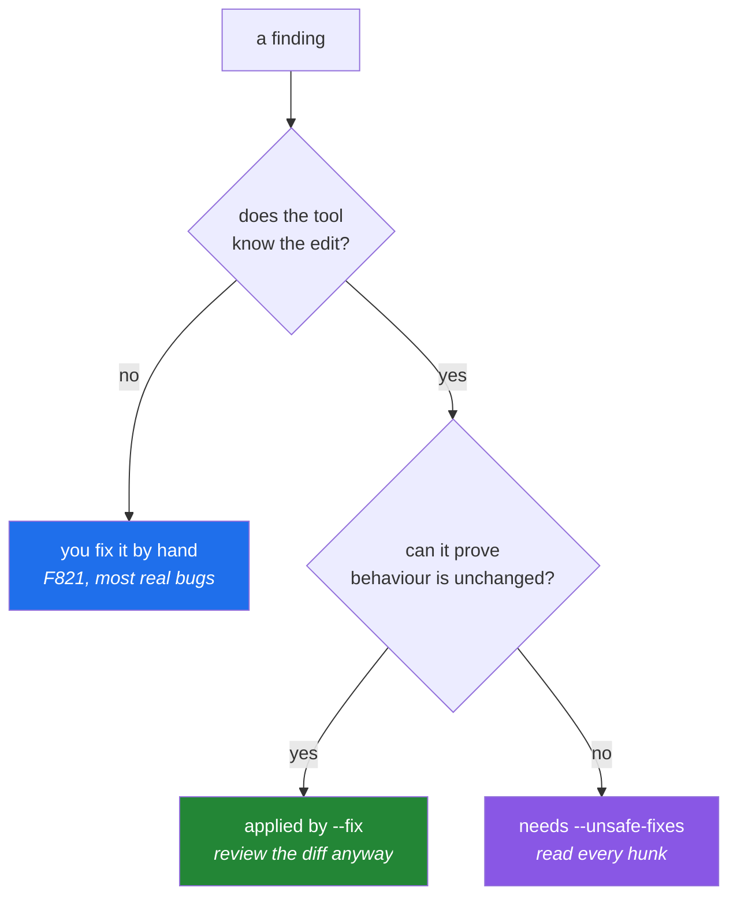

# 1.3 — `--fix`, unsafe fixes, and `noqa` as a debt record

## One-line answer

A linter can repair some of its own findings automatically, and it divides those repairs into
**safe** (the meaning of the program cannot change) and **unsafe** (it might) — while a `# noqa`
comment silences a finding without repairing anything, which makes an un-explained `noqa` a debt
nobody recorded.

---

## The story

A junior engineer is told the build is red and there are ninety-one lint findings on their branch.
They find the flag that fixes things automatically, add the one that also does the risky ones because
ninety-one is a lot, and run it.

The build goes green. The diff is four hundred lines. The pull request is approved by someone who
scrolled to the bottom.

Three weeks later a bug report arrives: a report that used to list every record now lists only some
of them. The bisect lands on the lint commit. Buried in those four hundred lines is this change:

```text
-        for row in list(rows):
-            if row.stale:
-                rows.remove(row)
+        for row in rows:
+            if row.stale:
+                rows.remove(row)
```

The `list(...)` call looked redundant. It was not: it was making a copy so that the loop could safely
delete from the original. The automated fix was labelled unsafe precisely because a tool cannot know
whether a copy is redundant or load-bearing. Nobody read the label.

What is worth noticing is that the tool did nothing wrong. It said *unsafe*. It required an extra
flag. The engineer supplied the flag to make a number go down, and the review that was supposed to
be the second line of defence was defeated by the size of the diff — which the flag had created.

---

## The idea in plain language

### Not every finding has a fix

A finding is a report: *this pattern is here*. A **fix** is a machine-applicable edit that makes the
report go away. Some findings have one and some do not, and the reason is always the same: whether
the tool can know what you meant.

- `F401 'os' imported but unused` — the fix is *delete the import line*. There is exactly one
  sensible edit.
- `F821 Undefined name 'result'` — there is no fix. The tool has no idea what you meant to type.

You saw both in [1.1](1.1-what-a-linter-is.md); the `[*]` marker in the output is the tool telling
you which is which.

### Safe versus unsafe

Among the findings that do have a fix, the tool draws a second line, and it is the important one.

A **safe fix** is one where the tool can prove the program's behaviour is unchanged. Removing an
import that is genuinely never referenced. Rewriting `Dict[str, int]` as `dict[str, int]` when
`target-version` says the modern form exists.

An **unsafe fix** is one that is *probably* what you want but *might* change behaviour, or might
delete something you cared about. Two shapes recur:

1. **It might delete meaning.** Removing an unused variable is safe unless the right-hand side had a
   side effect — `unused = send_the_email()` looks exactly like `unused = 2 + 2` to a syntax tree.
2. **It might change semantics in a corner.** The story's `list(rows)` is one; another is rewriting
   a comparison in a way that behaves differently for an unusual type that overrides an operator.

Safe fixes are applied by `--fix`. Unsafe ones require `--unsafe-fixes` as well, and that extra
keystroke is the entire safety mechanism. It exists to make you *decide*.



### `noqa` — the third option, which repairs nothing

A `# noqa: F401` comment at the end of a line tells the linter to ignore that finding on that line.
The name is old shell shorthand for "no quality assurance", and it does not fix anything: the
pattern stays, the report stops.

There are honest uses. An import in a package's `__init__.py` that exists purely to re-export a name
is genuinely unused *in that file* and genuinely needed — `F401` is wrong there, and a `noqa` with a
reason is the correct answer. A deliberately broken example inside a test fixture is another.

But a `noqa` is a decision that outlives the person who made it. In six months, nobody can tell the
difference between "we thought about this and the rule is wrong here" and "I was in a hurry". That is
why the only acceptable form carries two things: **the specific code**, so it silences one rule
rather than all of them, and **a reason in words**.

```text
import numpy as np  # noqa: F401  # re-exported for `from setu.stats import np`
```

Bare `# noqa` — no code — is the version to avoid entirely. It silences every present and future
finding on that line, including the `F821` somebody introduces there next year.

---

## Why Setu needs it

- **Principle 6 says notebook code graduates to `src/setu/` with a test the same day.** Notebook code
  arrives full of exactly the debris `--fix` handles well — unused imports from an abandoned cell,
  variables from an experiment. Knowing which repairs are safe makes that graduation a minute's work
  rather than an afternoon's.
- **`./m check` runs `ruff check .` with no `--fix`** — the gate reports and refuses; it never edits
  your code behind your back. Understanding why is [4.1](../04-the-gate/4.1-what-m-check-actually-runs.md)'s
  subject, and the reason starts here: a gate that silently rewrites files cannot be trusted to tell
  you the truth about them.
- **From Phase 20 you will apply automated edits to generated code.** The `--fix` habits you build
  now — read the diff, never combine mechanical and semantic changes in one commit — are the same
  habits that keep an agent's edits reviewable.
- **`docs/` and the lesson files are formatted, not linted** ([2.3](../02-formatting/2.3-python-inside-markdown.md)),
  so the only thing standing between a wrong `noqa` and the permanent record is you.

---

## The mechanism

Watch the tool separate the three categories on one file:

```bash
mkdir -p /tmp/lint-demo
printf '%s\n' \
  'import json' \
  'import os' \
  '' \
  '' \
  'def report(rows):' \
  '    count = len(rows)' \
  '    payload = json.dumps({"n": count})' \
  '    return payloud' \
  > /tmp/lint-demo/fixes.py

uv run ruff check --isolated --select F /tmp/lint-demo/fixes.py
```

**Line by line:**

- `import os` — unused, and its removal is provably behaviour-preserving. A **safe** fix.
- `payload = json.dumps(...)` — assigned, never read. The right-hand side is a pure function call, but
  the tool cannot know that in general, so removing the assignment is an **unsafe** fix.
- `return payloud` — a typo. **No** fix exists.
- One file, three categories, which is exactly why the flag has three levels rather than being a
  boolean.

The output ends with a line that is the whole point:

```text
Found 3 errors.
[*] 1 fixable with the `--fix` option (1 hidden fix can be enabled with the `--unsafe-fixes` option).
```

Now apply them in stages and look at what actually changed each time:

```bash
cp /tmp/lint-demo/fixes.py /tmp/lint-demo/fixes.bak

uv run ruff check --isolated --select F --fix /tmp/lint-demo/fixes.py
diff /tmp/lint-demo/fixes.bak /tmp/lint-demo/fixes.py

uv run ruff check --isolated --select F --fix --unsafe-fixes /tmp/lint-demo/fixes.py
diff /tmp/lint-demo/fixes.bak /tmp/lint-demo/fixes.py
```

**Line by line:**

- `cp ... .bak` — keep the original. `--fix` **edits your file in place**; there is no undo inside the
  tool, and git is your only safety net. Never run `--fix` on a dirty working tree you have not
  committed or stashed — that advice sounds pedantic until the first time you conflate your own
  uncommitted work with a mechanical rewrite.
- `--fix` alone — removes `import os` and nothing else. The diff is one line, and one line is a diff
  a human can actually read.
- `diff old new` — the habit that matters. **Look at what the machine did.** An automated edit you did
  not read is an automated edit you cannot defend in review.
- `--fix --unsafe-fixes` — now the `payload` assignment goes too. On this file that is correct. On
  the story's file it was not, and the tool has no way to tell the two apart, which is precisely why
  it made you type the second flag.
- Run the second `diff` and read both hunks together: you are looking at the difference between "the
  tool proved this" and "the tool guessed this and told you it was guessing".

There is also a way to see the change without applying it:

```bash
uv run ruff check --isolated --select F --diff --unsafe-fixes /tmp/lint-demo/fixes.bak
```

**Line by line:**

- `--diff` — print the patch to standard output and **change nothing on disk**. This is the flag to
  reach for first on unfamiliar code, and the one to use in a CI job that wants to comment on a pull
  request rather than rewrite it.
- Reading the patch before applying it inverts the story at the top of this part: the decision happens
  before the diff exists, not after four hundred lines are already staged.

And the escape hatch, written the only way that is acceptable:

```python
"""A module whose imports exist to be re-exported."""

from setu.textutils import clean_title  # noqa: F401  # public API of `setu`, unused here by design
```

**Line by line:**

- `# noqa: F401` — names the **specific** code. A bare `# noqa` would also silence a future `F821` on
  this line, which is how a silenced line becomes a blind spot.
- The second comment — "public API of setu, unused here by design" — is the reason, in words, on the
  same line as the code it excuses. This is
  the half that makes the comment a record rather than a shrug, and it is the half people omit.
- The two comments are separate on purpose: the first is machine-read, the second is human-read.
  Ruff parses up to the code list and treats the rest as prose.

---

## When it breaks

**`--fix` reports work it did not do:**

```text
$ uv run ruff check --fix .
Found 12 errors (3 fixed, 9 remaining).
```

**What it means.** Nine findings either have no fix at all or have only an unsafe one. The number that
matters is `9 remaining`, and the reflex to avoid is reaching for `--unsafe-fixes` to make it
smaller. Read the nine first: in real code, several of them are usually genuine bugs, which is the
opposite of debris.

**A fix that makes the file worse:**

```text
$ uv run ruff check --fix --unsafe-fixes .
Found 41 errors (41 fixed, 0 remaining).
$ uv run python -m pytest -q
FAILED tests/test_report.py::test_lists_every_row - AssertionError: 3 != 7
```

**What it means.** This is the story, caught by a test rather than by a customer, which is the entire
argument for Principle 7. An unsafe fix changed behaviour. The recovery is `git diff` — or
`git checkout -- .` if nothing else in the tree was yours — and then applying the fixes in small
batches with the tests run between them. **The lesson is not "never use unsafe fixes"; it is "never
apply a large batch of them without a green test suite on the other side".**

**A `noqa` that stops working:**

```text
RUF100 [*] Unused `noqa` directive (unused: `F401`)
```

**What it means.** The finding it was suppressing is gone — you deleted the import, or the rule stopped
firing — so the comment is now noise pointing at nothing. `RUF100` is a rule specifically for
detecting dead suppressions, and it is one of the best arguments for always naming the code: a bare
`# noqa` can never be detected as stale, because the tool cannot know what it was for. This project
does not select `RUF` today, which is a reasonable thing to revisit once `src/setu/` is large.

**And the one that looks like the linter is broken:**

```text
$ uv run ruff check .
All checks passed!
$ git diff --stat
 src/setu/textutils.py | 14 ++++++++------
```

**What it means.** You ran `--fix` at some point in this session and forgot. The check passes because
the code was already repaired — by you, unreviewed. Always run `git status` before believing a green
result you did not expect.

---

## In production

**The professional default is `--fix` in the editor, never in CI.** On save, safe fixes applied
automatically are pure benefit: the change is one line, you are looking at the file, and the feedback
is instant. In CI the same flag is a mistake, because a CI job that rewrites code has to either push
a commit (surprising) or discard the work (pointless). CI's job is to **report and refuse**, which is
exactly what `./m check` does ([4.1](../04-the-gate/4.1-what-m-check-actually-runs.md)).

**Mechanical changes get their own commit, always.** When a large `--fix` run is genuinely needed —
adopting a new rule family, upgrading a stack — the professional shape is: one commit that is
*entirely* mechanical, with a message saying which command produced it, and no other change in it.
Reviewers can then verify by re-running the command instead of reading four hundred lines. Some teams
record the hash of such commits in a `.git-blame-ignore-revs` file so that `git blame` skips them and
still shows who wrote each line's actual logic. That file is a small thing that saves an enormous
amount of archaeology later.

**`noqa` density is a metric worth watching.** A single suppression is a decision. Forty in one
directory is a signal that a rule does not fit that code, and the correct response is to change the
configuration rather than to keep annotating — per-file ignores exist precisely for this
([1.2](1.2-choosing-rule-families.md)). Counting them is a `grep -rc "noqa" src/` away, and running
that once a quarter tells you something no dashboard will.

**What breaks at scale:** on a large repository, `--fix` over the whole tree touches hundreds of files
and produces a merge conflict with every branch in flight. Teams that do this without warning burn a
day of everyone else's time. The mitigation is coordination, not technology — announce it, do it when
few branches are open, and land it fast.

**The review comment a senior engineer leaves.** On a `# noqa` with no code: *"Name the rule. A bare
noqa also hides the next bug someone writes on this line, and `RUF100` can never tell us when it goes
stale."* And on a large auto-fix diff: *"Which command produced this? Put it in the commit message so
I can re-run it instead of reading it."*

**The interview question.** *"Your linter offers to fix a finding automatically. When do you let it?"*
The answer that separates people who have done this from people who have read about it: when the fix
is marked safe, when the working tree is clean so git can undo it, when the diff is small enough to
read, and when a test suite runs on the other side. And name the asymmetry explicitly — an unsafe fix
saves you a minute and can cost a week, so the expected value only works out if you are reading the
diff.

---

## Check yourself

```bash
uv run ruff check --statistics --fix --diff src/ tests/ scripts/ 2>&1 | tail -5
grep -rn "noqa" src/ tests/ scripts/ || echo "no suppressions in this repo yet"
```

The first shows what the tool *would* change across the project without touching a byte. The second
should print the fallback message today — and the day it stops doing so, every line it prints should
carry a code and a reason.

**Answer out loud, without scrolling up:**

> Explain to someone who has never used a linter why `--fix` and `--unsafe-fixes` are two different
> flags, using the `list(rows)` example. Then say what a `# noqa` with no rule code costs you a year
> from now.

---

**Next:** [2.1 — Why a formatter ends the argument](../02-formatting/2.1-why-a-formatter-ends-the-argument.md)
