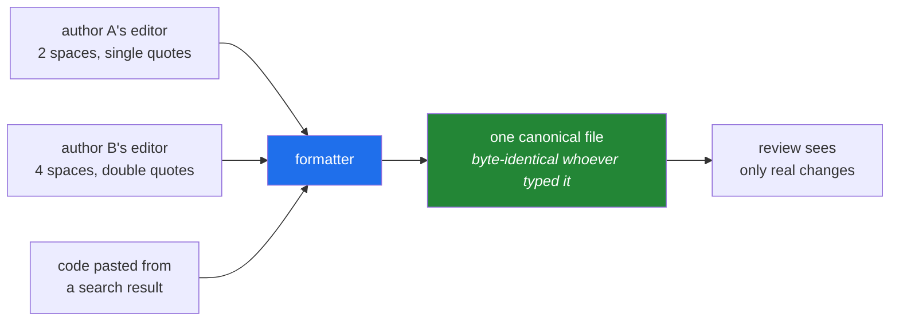

# 2.1 — Why a formatter ends the argument

## One-line answer

A **formatter** rewrites your code's whitespace, line breaks and quoting to one canonical shape
without ever changing what it does — and its real value is not beauty but the fact that it removes an
entire class of conversation from code review permanently.

---

## The story

A pull request adds one line to a function. The diff shows nineteen changed lines.

The other eighteen are formatting. The author's editor uses four spaces; the file was written by
somebody whose editor used two. The author's editor strips trailing whitespace on save; the previous
author's did not. Somewhere in there, a string that was single-quoted is now double-quoted.

The reviewer opens it, cannot find the actual change, and asks the author to revert the unrelated
edits. The author does, mostly. A second reviewer notices that one function is now over the line
length everyone vaguely remembers agreeing on, and leaves a comment. A third person replies that the
limit is a relic and should be raised. Fourteen comments accumulate. The single-line change is merged
four days later.

Now imagine the same repository with a formatter that runs on save. The author types the line, saves,
and the file is rewritten to the one shape the project uses. The diff is one line. There is nothing
to comment on, because there is nothing left to have an opinion about — the machine already had it,
identically, for everybody.

The formatter did not make the code prettier. It **deleted a recurring meeting.**

---

## The idea in plain language

### Formatting is the part of the source that the language ignores

Python cares about indentation, which makes this slightly less obvious than in other languages, but
the principle holds. There are many ways to write the same program that produce byte-identical
behaviour:

- `x = {'a': 1}` and `x = {"a": 1}` — the quote character is a choice.
- A call that fits on one line, or the same call with each argument on its own line.
- A blank line between two functions, or two blank lines.
- A trailing comma after the last argument, or none.

Every one of those is invisible to the interpreter and visible to a human, which is exactly the
territory people argue about. A **formatter** is a program that takes any of those variants and emits
one canonical choice. Feed it a thousand different spellings of the same function; get one file back
every time.

The technical term is **idempotent**: running the formatter on already-formatted code changes
nothing. That property is what makes it safe to run automatically on every save.

### Formatter versus linter — the distinction that matters

You met the linter in [1.1](../01-linting/1.1-what-a-linter-is.md). Both tools are static — neither
runs your code — and both can edit files, which is why people conflate them. They answer completely
different questions.

| | Linter | Formatter |
|---|---|---|
| Question | "Is this pattern suspicious?" | "Is this laid out canonically?" |
| Can it change behaviour? | An unsafe fix can ([1.3](../01-linting/1.3-fix-and-noqa-as-debt.md)) | **No.** Never. That is the contract. |
| Is disagreement possible? | Yes — a rule can be wrong for your code | No. There is one output. |
| Output on clean code | "All checks passed" | The identical file |
| Configuration surface | Large — which rules, per directory | Deliberately tiny |

That last row is the one people find surprising. Modern formatters offer almost nothing to configure
— in this project, exactly one setting, `line-length = 100` — and the small surface is a feature, not
an oversight. **Every knob is a decision a team can argue about.** A formatter with fifty options
recreates the meeting it was supposed to delete.

### Why "ends the argument" is the accurate phrase

The value is not that the canonical style is *better*. For most choices it demonstrably is not
better; it is merely *chosen*. Double quotes are not superior to single quotes. What matters is that
the choice is made once, by a machine, identically for everyone, forever — so the cost of the
decision is paid once instead of on every pull request.

This is a general engineering pattern worth naming, because it recurs: **when a decision has low
stakes and high recurrence, the correct move is to remove the decision, not to optimise it.** You
will meet the same instinct in `random_state=` on every estimator (Principle 4), and again in the
pinned `model=` on every call to a language model. The point in all three cases is not that the
chosen value is best; it is that it stops varying.



---

## Why Setu needs it

- **`./m check` runs `ruff format --check .` as its second gate**, right after the linter — you wrote
  that on [Day 0, 3.2](../../../day-00-setup/parts/03-m-script/3.2-the-case-dispatcher.md). Today it
  stops being a magic word, and [2.2](2.2-format-check-and-the-ci-split.md) explains why the gate uses
  `--check` and not the plain command.
- **This repository's lesson files contain Python**, and the formatter reaches inside them
  ([2.3](2.3-python-inside-markdown.md)). Teaching code that the project's own formatter would rewrite
  is a bug in the lesson, so this is not a tidiness rule here — it is a correctness rule for the
  material you are reading.
- **Principle 6 sends notebook code into `src/setu/`.** Notebook cells are written in a hurry with
  whatever spacing your fingers produced; formatting them on the way in costs one command and makes
  the graduation diff readable.
- **From Phase 20 you will be reviewing code you did not type.** A formatter applied to generated
  code makes it diffable against what you already have, which is the only way to see what actually
  changed.

---

## The mechanism

Write a file in the worst plausible style and watch it become canonical:

```bash
mkdir -p /tmp/fmt-demo
printf '%s\n' \
  "import json" \
  "def summarise( rows,limit = 10 ):" \
  "    out = {'count':len(rows),'limit':limit}" \
  "    if limit<len(rows) :" \
  "        out['truncated']=True" \
  "    return json.dumps( out )" \
  > /tmp/fmt-demo/messy.py

uv run ruff format --isolated --diff /tmp/fmt-demo/messy.py
```

**Line by line:**

- `def summarise( rows,limit = 10 ):` — spaces inside the parentheses, no space after the comma,
  spaces around a keyword-argument default. Three separate conventions, all legal, all different from
  each other.
- `{'count':len(rows),'limit':limit}` — single quotes and no space after the colons.
- `if limit<len(rows) :` — no spaces around the operator, a space before the colon.
- `--isolated` — ignore this project's `pyproject.toml` so you see the formatter's own defaults rather
  than this repository's `line-length = 100`. Same reasoning as in
  [1.1](../01-linting/1.1-what-a-linter-is.md).
- `--diff` — print the patch, change nothing. Reach for this first, always; the version that edits
  files is the one you run when you already know what it will do.

The patch:

```text
--- /tmp/fmt-demo/messy.py
+++ /tmp/fmt-demo/messy.py
@@ -1,6 +1,8 @@
 import json
-def summarise( rows,limit = 10 ):
-    out = {'count':len(rows),'limit':limit}
-    if limit<len(rows) :
-        out['truncated']=True
-    return json.dumps( out )
+
+
+def summarise(rows, limit=10):
+    out = {"count": len(rows), "limit": limit}
+    if limit < len(rows):
+        out["truncated"] = True
+    return json.dumps(out)
```

Read the changes as a list of decisions the machine made so you never have to: two blank lines before
a top-level definition, no padding inside brackets, one space after a comma, no spaces around `=` in
a default, spaces around a comparison operator, double quotes, a space after a dict colon. Not one of
those alters what the function does.

Now prove idempotence — the property that makes it safe to automate:

```bash
uv run ruff format --isolated /tmp/fmt-demo/messy.py
cp /tmp/fmt-demo/messy.py /tmp/fmt-demo/once.py
uv run ruff format --isolated /tmp/fmt-demo/messy.py
diff /tmp/fmt-demo/once.py /tmp/fmt-demo/messy.py && echo "IDEMPOTENT: second run changed nothing"
```

**Line by line:**

- The first `ruff format` without `--diff` **edits the file in place**. As with `--fix`
  ([1.3](../01-linting/1.3-fix-and-noqa-as-debt.md)), git is the only undo.
- `cp` after the first run — snapshot the formatted state.
- The second `ruff format` runs on already-formatted code.
- `diff` printing nothing, and the `&&` therefore reaching the `echo`, is the proof. If a formatter
  were not idempotent, running it on save would fight with running it in CI, and every commit would
  oscillate.

And prove the stronger claim — that behaviour is untouched — rather than believing it:

```bash
uv run python -c "
import ast, pathlib
before = pathlib.Path('/tmp/fmt-demo/once.py').read_text(encoding='utf-8')
after = pathlib.Path('/tmp/fmt-demo/messy.py').read_text(encoding='utf-8')
print('bytes identical :', before == after)
print('AST identical   :', ast.dump(ast.parse(before)) == ast.dump(ast.parse(after)))
"
```

**Line by line:**

- `ast.parse(...)` — turns source text into the **abstract syntax tree**: the structure the
  interpreter actually executes, with all whitespace and formatting discarded. This is the same
  representation a linter walks ([1.1](../01-linting/1.1-what-a-linter-is.md)).
- `ast.dump(...)` — renders the tree as a comparable string. Two files with the same dump are the same
  program, however differently they are spelled.
- Comparing the AST rather than the text is **the formal statement of the formatter's contract**. A
  formatter may change the bytes; it may never change the dump. That is the difference between it and
  an unsafe lint fix, and it is why a formatter needs no review while an unsafe fix does.
- Run this against the messy original and the formatted one and both lines will disagree in the first
  and agree in the second — which is exactly the result you want.

---

## When it breaks

**The formatter refuses the file:**

```text
$ uv run ruff format /tmp/fmt-demo/broken.py
error: Failed to parse /tmp/fmt-demo/broken.py:4:1: Expected an indented block after function definition
1 file left unchanged
```

**What it means.** Formatting requires a parse, exactly as linting does. The file is not valid Python,
so there is no tree to lay out. Note `1 file left unchanged`: the tool does not half-format a file it
could not read, which is the right behaviour and worth noticing.

**Your line is too long and the formatter will not fix it:**

```text
$ uv run ruff check .
E501 Line too long (118 > 100)
 --> src/setu/textutils.py:41:101
```

...on a file `ruff format` just declared clean. **What it means.** This is the most common confusion
about formatters and it is worth being exact. The formatter breaks lines **where it can** — at commas
inside brackets, at operators inside parentheses. It cannot break a line that has no break point: a
single long string literal, a long URL in a comment, a deeply chained attribute access with no
parentheses. Those remain long, the formatter leaves them alone, and the linter's `E501` is the thing
that complains. The fix is yours: shorten the string, wrap it in parentheses so a break point exists,
or decide the line is fine and move on. **The formatter and the line-length rule are two different
tools reading the same setting, which is why `line-length` lives under `[tool.ruff]` and not under
`[tool.ruff.lint]`** ([1.2](../01-linting/1.2-choosing-rule-families.md)).

**A formatting change you did not ask for, in a file you did not touch:**

```text
$ git status --short
 M src/setu/textutils.py
 M src/setu/loaders.py
 M scripts/check_pins.py
```

**What it means.** You ran `ruff format .` — the whole project — rather than on your file, and the
version of the formatter changed since the last time somebody did that, or the project has files that
were never formatted. Either way, this is the mechanical-diff problem from
[1.3](../01-linting/1.3-fix-and-noqa-as-debt.md). Commit it separately with a message that names the
command, or revert everything you did not intend to touch.

**And the one that means the pin failed:**

```text
$ uv run ruff format --check .
Would reformat: src/setu/textutils.py
1 file would be reformatted, 42 files already formatted
```

...on a commit that was green yesterday and that nobody has edited. **What it means.** The formatter's
version changed. A formatter's output is stable across patch releases by design but *may* change in a
minor release when a layout bug is fixed. This is precisely the scenario Principle 4 exists for: with
`ruff==0.16.4` pinned in `pyproject.toml` and `uv.lock` committed, this cannot happen by accident —
only when you deliberately move the pin, at which point the reformat is expected and gets its own
commit.

---

## In production

**The formatter runs on save, and CI only ever checks.** That split is
[2.2](2.2-format-check-and-the-ci-split.md)'s entire subject, and the reasoning is the same as for
`--fix`: the tool that edits belongs where a human is watching, and the tool that judges belongs
where nobody is.

**Adopting a formatter on an old codebase is a one-day event with a permanent tail.** The initial run
touches every file, produces an enormous diff, and conflicts with every open branch. The professional
sequence is: announce a date, ask everyone to merge or rebase, run it in a single commit that
contains *nothing else*, and add that commit's hash to `.git-blame-ignore-revs` so `git blame` steps
over it. Teams that skip the last step lose the ability to see who wrote a line, which is a
surprisingly large loss — blame is how you find the person to ask.

**The small configuration surface is the product.** It is tempting, on adoption, to configure the
formatter to match the house style so the initial diff is smaller. This is a trap: every option you
set is a decision that will be re-litigated, and matching an old style means you keep arguing about
it. Take the defaults, change `line-length` if you must, and spend the argument once.

**What changes at scale:** on a very large repository, formatting the whole tree in CI is wasted work
— you only care about what the change touched. Mature setups run the formatter over the diff's files
only, using the merge base to decide the set. The subtlety is that this can miss a file that became
unformatted through a config change rather than an edit, so a scheduled full run — weekly, like
Principle 13's freshness check — is the usual companion.

**The review comment a senior engineer leaves.** On a pull request with a large formatting diff mixed
into a feature: *"Please split the formatting into its own commit. I can review one line of logic; I
cannot review it hidden in three hundred lines of whitespace."* And on a proposal to add formatter
options: *"What problem does this option solve that is worth having this conversation again next
year?"*

**The interview question.** *"Why would you use a formatter with almost no configuration options?"*
The weak answer is "consistency". The strong answer names the mechanism: the formatter's value comes
from removing a class of decisions from human attention entirely, and every configuration option puts
one of those decisions back. Then add the technical half — the formatter guarantees the syntax tree
is unchanged, which is why its output needs no review, and that guarantee is what separates it from a
linter's unsafe fix.

---

## Check yourself

```bash
uv run ruff format --check src/ tests/ scripts/
uv run ruff format --diff --isolated src/setu/__init__.py
```

The first is the gate `./m check` runs, aimed at this project's real Python. The second shows what a
formatter with *no* project configuration would do to a file this project considers clean — the
difference between those two runs is exactly what `line-length = 100` buys.

**Answer out loud, without scrolling up:**

> A colleague argues that the team should configure the formatter to allow single quotes, because
> they prefer them. Give the one-sentence reason this is the wrong trade even if single quotes are
> nicer. Then say what property of a formatter makes it safe to run automatically on every save, and
> how you would prove that property for a specific file.

---

**Next:** [2.2 — `format --check`, and where each half of the tool belongs](2.2-format-check-and-the-ci-split.md)
