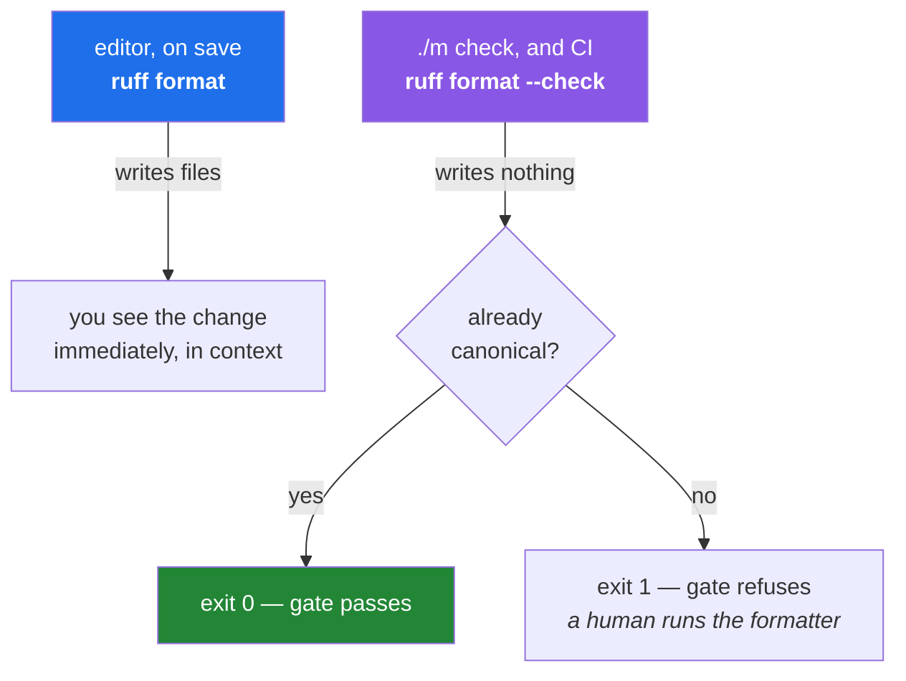

# 2.2 — `format --check`, and where each half of the tool belongs

## One-line answer

The same formatter has two modes — **rewrite the file** and **report whether it would have to** — and
the whole discipline is that the rewriting mode belongs where a human is watching, while a gate must
only ever ask the question and refuse.

---

## The story

A team wires their formatter into their build. Not `--check`; the real thing. The build server
formats the code, and because a build that leaves the repository dirty is untidy, it commits the
result and pushes it back.

For a while this seems clever. Nobody ever sees a formatting failure again.

Then someone opens a pull request, and the build pushes a formatting commit onto their branch while
they are still typing. Their next `git push` is rejected — the remote has moved. They pull, get a
merge commit they did not want, and push again. The build formats again.

Worse arrives later. A developer runs the tests locally, they pass, they push. The build formats one
file, pushes, and *that* commit is what gets deployed — a commit nobody has ever run a test against,
authored by a machine, at three in the morning. It is almost certainly fine, because formatting
cannot change behaviour ([2.1](2.1-why-a-formatter-ends-the-argument.md)). "Almost certainly fine" is
not the property you want from the thing that decides what ships.

The fix is one flag. The build stops editing and starts asking. When the answer is "this file would
be reformatted", the build fails, and a human — the one who wrote the line — runs the formatter
themselves and pushes a commit they authored.

---

## The idea in plain language

### A tool that edits and a tool that judges are different tools

Most quality tools have both modes, and it is worth seeing the pattern as a pattern rather than as a
per-tool quirk:

| Tool | Edits | Judges |
|---|---|---|
| formatter | `ruff format .` | `ruff format --check .` |
| linter | `ruff check --fix .` | `ruff check .` |
| lockfile | `uv lock` | `uv lock --check` |
| dependency sync | `uv sync` | `uv sync --locked` |

You met the last two on [Day 1, 3.2](../../../day-01-pins/parts/03-freezing/3.2-freezing-into-pyproject-and-the-lock.md),
where `--locked` refuses and `--frozen` skips the question entirely. The shape is identical here, and
recognising it saves you learning each tool separately: **every tool that can bring a file into a
desired state also has a mode that only asks whether it is already there.**

### What `--check` actually does

`ruff format --check .` runs the entire formatting computation — parse, lay out, produce the
canonical text — and then, instead of writing the result, compares it to what is on disk. If they
match for every file, it prints a count and exits **0**. If any file differs, it names the files and
exits **1**.

It never writes. That is the whole guarantee, and it is what makes the command safe to run on a
machine you do not control, on a checkout you did not make, in a job that has push credentials.

The **exit code** is the part that matters to a gate. You met exit codes on
[Day 0, 3.1](../../../day-00-setup/parts/03-m-script/3.1-set-euo-pipefail.md): a program returns 0 for
success and non-zero for failure, and `set -e` in `./m` turns any non-zero into an immediate stop. So
`ruff format --check .` inside `./m check` needs no `if` statement, no parsing of output, no cleverness
at all — it either passes or it kills the script. **The text on screen is for you; the exit code is
for the script.**

### `--diff` is the third mode, and it is for humans

There are really three:

- **rewrite** — `ruff format .` — changes files, exits 0 almost always.
- **check** — `ruff format --check .` — changes nothing, exit code carries the answer, output names
  the files.
- **diff** — `ruff format --diff .` — changes nothing, prints the actual patch, and also exits
  non-zero when there is one.

`--diff` is what you want when a gate has just failed and you are asking *why*. `--check` tells you
`src/setu/textutils.py` would be reformatted; `--diff` shows you that it is one line where you left a
trailing comma out. In CI, `--diff` output in the log is the difference between a developer
reproducing the failure in thirty seconds and reproducing it in ten minutes.



---

## Why Setu needs it

- **`./m check` contains `uv run ruff format --check .`** — the second of its four gates
  ([4.1](../04-the-gate/4.1-what-m-check-actually-runs.md)). Under `set -euo pipefail` from
  [Day 0, 3.1](../../../day-00-setup/parts/03-m-script/3.1-set-euo-pipefail.md), that one line is the
  whole enforcement mechanism.
- **Today you write the CI workflow** ([5.2](../05-ci/5.2-the-workflow-file-block-by-block.md)), and CI
  is the environment where the story's mistake is easiest to make and most expensive to undo. The
  workflow will call `./m check`, which means it inherits the correct behaviour for free — which is
  itself the argument for having one gate command rather than a list of steps duplicated in two
  places.
- **`./m done N` runs `./m check` before it commits** ([Day 0, 3.3](../../../day-00-setup/parts/03-m-script/3.3-the-done-gate.md)).
  A gate that reformatted your files on the way to committing them would be committing work you never
  read.
- **Principle 4 pins the formatter**, so `--check` failing on unchanged code means the pin moved, not
  that the tool is flaky ([2.1](2.1-why-a-formatter-ends-the-argument.md)'s last failure).

---

## The mechanism

Make one file non-canonical and watch the three modes disagree about what to do with it:

```bash
mkdir -p /tmp/fmt-demo
printf '%s\n' \
  "def add(a,b):" \
  "    return a+b" \
  > /tmp/fmt-demo/two.py

echo "--- check: asks, exits non-zero ---"
uv run ruff format --isolated --check /tmp/fmt-demo/two.py; echo "exit: $?"

echo "--- diff: shows the patch, still writes nothing ---"
uv run ruff format --isolated --diff /tmp/fmt-demo/two.py; echo "exit: $?"

echo "--- the file on disk is still the one you wrote ---"
cat /tmp/fmt-demo/two.py
```

**Line by line:**

- `def add(a,b):` and `return a+b` — missing a space after the comma and around the operator. Small on
  purpose: the point is the exit code, not the size of the change.
- `echo "exit: $?"` — `$?` holds the exit status of the command that just finished. This is the value
  `set -e` reacts to, and printing it explicitly is how you stop guessing what a gate saw.
- `--check` prints something like `Would reformat: /tmp/fmt-demo/two.py` and `1 file would be
  reformatted` — then `exit: 1`.
- `--diff` prints the patch and also `exit: 1`. **Both modes report failure by exit code**, which is
  why either works inside a gate; `--check` is preferred there only because its output is shorter.
- `cat` at the end — the proof that neither mode touched the file. Run the same sequence with plain
  `ruff format` and this last command shows the rewritten version instead.

Now watch what `set -e` does with that exit code — the mechanism `./m check` relies on:

```bash
printf '%s\n' \
  '#!/usr/bin/env bash' \
  'set -euo pipefail' \
  'echo "gate 1: lint"' \
  'uv run ruff check --isolated /tmp/fmt-demo/two.py' \
  'echo "gate 2: format"' \
  'uv run ruff format --isolated --check /tmp/fmt-demo/two.py' \
  'echo "gate 3: you never get here"' \
  > /tmp/fmt-demo/gate.sh
chmod +x /tmp/fmt-demo/gate.sh
/tmp/fmt-demo/gate.sh; echo "script exit: $?"
```

**Line by line:**

- `set -euo pipefail` — the strict mode from
  [Day 0, 3.1](../../../day-00-setup/parts/03-m-script/3.1-set-euo-pipefail.md). The `-e` is the one
  doing the work here: the first command to exit non-zero ends the script.
- `ruff check` passes — the file has no lint findings, only formatting ones. **Two different tools,
  two different answers about the same file**, which is [2.1](2.1-why-a-formatter-ends-the-argument.md)'s
  distinction made concrete.
- `ruff format --check` exits 1, `-e` fires, and the third `echo` never runs.
- `script exit: 1` — the script propagates the failure to *its* caller, which is how `./m check`
  failing makes `./m done` refuse to commit
  ([Day 0, 3.3](../../../day-00-setup/parts/03-m-script/3.3-the-done-gate.md)).
- Fix the file with `uv run ruff format --isolated /tmp/fmt-demo/two.py` and run the script again: all
  three lines print and the exit is 0. That transition — red to green, by doing the work rather than
  by loosening the gate — is the loop every day of this plan runs on.

---

## When it breaks

**The gate fails and the message names files you have never opened:**

```text
$ uv run ruff format --check .
Would reformat: notebooks/scratch.py
Would reformat: days/day-01-pins/lab/experiment.py
2 files would be reformatted, 44 files already formatted
```

**What it means.** The formatter is reaching into directories that are meant to be scratch space. This
project's `pyproject.toml` sets `extend-exclude = ["notebooks", "days/*/lab"]` precisely to prevent
it (Principle 6 — the notebook is a scratchpad). Seeing this output means either the exclude was
removed, or you are running with `--isolated`, which throws the project configuration away by design.
This is the routine confusion caused by the flag every demo in these lessons uses, and it is worth
meeting once deliberately.

**The formatter and the linter disagree and you are stuck in a loop:**

```text
$ uv run ruff format .
1 file reformatted
$ uv run ruff check .
E501 Line too long (104 > 100)
```

**What it means.** As in [2.1](2.1-why-a-formatter-ends-the-argument.md): the formatter produced its
canonical layout, and one line has no break point it is allowed to use. Formatting again will not
change it — the formatter is idempotent and has already done everything it can. The resolution is
yours: restructure the line, or decide `E501` should not apply and record that decision in
configuration with a reason ([1.3](../01-linting/1.3-fix-and-noqa-as-debt.md)). What you must not do
is loop.

**CI passes and your machine fails, on identical files:**

```text
local : 1 file would be reformatted
CI    : 45 files already formatted
```

**What it means.** Two different formatter versions. Your editor has an extension bundling its own
copy, CI installs the pinned one from `uv.lock`, and they are not the same build. The rule that
resolves it: **the pinned version in the project is the only authority**, and your editor must be
configured to use the project's environment rather than its own bundled binary — the interpreter trap
from [Day 0, 1.5](../../../day-00-setup/parts/01-toolchain/1.5-the-editor-and-the-interpreter-trap.md),
in a new costume.

**And the one worth recognising instantly:**

```text
$ uv run ruff format --check .
error: Failed to parse src/setu/loaders.py:12:5: Expected an expression
1 file left unchanged
```

...and the gate exits non-zero. **What it means.** Not a formatting failure at all — a syntax error.
The gate is correct to refuse, but the message you act on is the parse error, not the format one.
When several gates could explain a red build, **read the first error, not the last**; the later ones
are usually consequences.

---

## In production

**The rule is: tools that write run where a human is looking; tools that judge run where nobody is.**
Editor-on-save writes. Pre-commit hooks are the genuinely contested middle ground and get their own
argument in [4.2](../04-the-gate/4.2-local-gate-versus-remote-gate.md). CI never writes. Stated that
baldly it sounds like a style preference; it is not. The property being protected is that **the
artifact CI approved is byte-identical to the artifact a human tested**, and a CI job that edits code
breaks it.

**The bot-that-formats pattern exists and is not the same mistake.** Some large projects do have
automation that pushes formatting commits — but as a *bot opening a pull request*, not as a build step
mutating the branch under review. The difference is that the change becomes a reviewable, blockable
artifact with an author, instead of an invisible side effect of a build. If you ever propose
automation that changes code, propose it in that shape.

**`--diff` in CI logs is a small investment with a large return.** A failing check that says only
"would reformat 3 files" sends the developer to run the tool locally and hope their version matches.
A failing check that prints the patch lets them see the answer in the log. Mature workflows run
`--check` for the exit code and `--diff` for the log, or simply use `--diff` alone, since it carries
both.

**What changes at scale:** on a large repository the formatter reads every file on every run, and
"every file" eventually becomes minutes. Teams then restrict the gate to files the change touched,
computed from the merge base. The trap is that a configuration change can unformat files nobody
edited, so the diff-scoped gate is paired with a scheduled full run — the same detect-and-respond
split as Principle 13 and Principle 14 on
[Day 1, 4.2](../../../day-01-pins/parts/04-drift/4.2-drift-and-the-amendment-protocol.md).

**The review comment a senior engineer leaves.** On a CI workflow with `ruff format .` in it:
*"Add `--check`. A build step that rewrites the tree means the commit we deploy is not the commit we
tested."*

**The interview question.** *"Your CI formats code automatically and pushes the result. What's wrong
with that?"* A good answer names two concrete failures rather than an aesthetic objection: developers
race the build for the branch tip, and the deployed commit is one no test ever ran against. Then give
the fix in one sentence — CI checks and refuses, humans format — and note that the same split applies
to the linter's `--fix`, the lockfile's `--check`, and every other tool with a write mode. Being able
to state it as a *general rule* rather than a formatter fact is what makes it a senior answer.

---

## Check yourself

```bash
uv run ruff format --check .; echo "exit: $?"
grep -n "ruff" m
```

The first is the exact gate, on the whole project, with its exit code made visible. The second shows
you the two lines inside `./m` that call these tools — read them now that you know what each flag
does, and note which one carries `--check` and which does not.

**Answer out loud, without scrolling up:**

> Your build server formats code and pushes the result. Describe two specific failures that causes —
> one that annoys a developer, one that affects what gets deployed. Then name the flag that fixes it
> and say what the gate does instead of fixing the file.

---

**Next:** [2.3 — Python inside Markdown: why this repository's lessons are code](2.3-python-inside-markdown.md)
