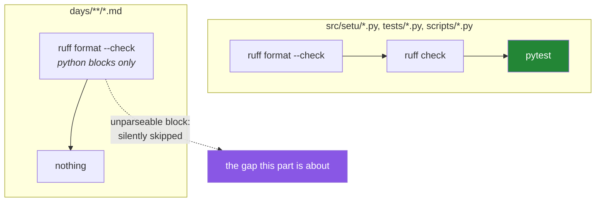

# 2.3 — Python inside Markdown — why this repository's lessons are code

## One-line answer

The formatter reaches inside fenced Python blocks in Markdown files and rewrites them, while the
linter does not look at Markdown at all — so in this repository every lesson's Python is *formatted*
like source and *not checked* like source, and knowing exactly where that line falls is what stops a
broken example being committed.

---

## The story

A team keeps their onboarding guide in the repository, as Markdown, with code examples in it. It is
good documentation. New people follow it on their first morning.

One example is a five-line function. Some time in the guide's second year, somebody edits it to add a
parameter and mistypes the signature — a missing colon at the end of the `def` line. The example is
now not Python at all.

Nothing catches it. The linter does not read Markdown files. The test suite does not import
documentation. The formatter runs in the build, reports every file already formatted, and exits 0 —
because a code block it cannot parse is one it silently skips.

Six months later a new hire spends forty minutes on their first morning trying to work out what they
are doing wrong, before someone senior looks over their shoulder and says "oh, that's a typo in the
doc, ignore it".

They ignore it. It is still there.

The interesting part is not the typo. It is that a whole *category* of file — the one containing the
code most people read first — sat outside every gate the team had, and nobody had noticed, because
the build was green and green means checked.

---

## The idea in plain language

### This repository's lessons are not documentation about code — they contain code

Look at what you are reading. Every part document in `days/` carries fenced blocks, many of them
Python, and the plan's own rules say each one must be walked through token by token (Principle 16's
contract, plan Part 11.4). A reader will copy those blocks and run them. If the Python inside a
lesson is wrong, the lesson is wrong, in the strongest sense — it does not matter how good the prose
around it is.

That makes the lesson files **source code with prose in it**, not prose with decoration. And source
code gets tooled.

### What the formatter does with a `.md` file

`ruff format` accepts Markdown files and rewrites the Python inside fenced blocks, leaving everything
else — the prose, the tables, the `bash` blocks, the diagrams — untouched. It recognises the fence
language tag: `python`, the short `py`, and `pycon` for interactive-session transcripts with `>>>`
prompts.

So the exact same canonical layout rules from [2.1](2.1-why-a-formatter-ends-the-argument.md) — double
quotes, a space after a comma, spaces around operators, `line-length = 100` from this project's
`pyproject.toml` — apply to the code you read in a lesson. That is why every Python block in these
documents looks like the code in `src/setu/`: it went through the same machine.

### What the linter does *not* do with a `.md` file

This is the asymmetry, and it is the thing worth carrying away. `ruff check days/` prints:

```text
warning: No Python files found under the given path(s)
All checks passed!
```

The linter looks for files it recognises as Python — `.py` and friends — and a `.md` file is not one.
So `F401`, `F821`, `B006`, none of them ever run over a lesson's code. You met that exact warning as
a trap in [1.1](../01-linting/1.1-what-a-linter-is.md); here it is not a misconfiguration but the
tool's designed behaviour, and it defines the boundary of what the gate protects.

### The consequence, stated plainly

| | Lesson Python | `src/setu/` Python |
|---|---|---|
| Formatted by `ruff format` | **Yes** | Yes |
| Linted by `ruff check` | **No** | Yes |
| Executed by `pytest` | No | Yes |
| Parsed at all by the gate | Only if the formatter can parse it | Always |

Two of those rows are the reason this part exists. Lesson code gets **one** of the three gates, and
even that one fails open: a block the formatter cannot parse is skipped without complaint. The
undefined name, the wrong argument order, the import that does not exist — none of it is caught by
any machine in this repository. **The author is the only check on the semantics of a lesson's code**,
which is exactly why the plan requires every block to carry a line-by-line walkthrough. Writing the
explanation is what makes you read the code.



---

## Why Setu needs it

- **`CLAUDE.md` states the rule for this repository**: lesson code is linted and formatted like any
  other code, and a day is not finished until `uv run ruff format days/day-NN-<slug>/` has run. Today
  is where that instruction stops being folklore.
- **`./m check` runs `ruff format --check .` over the whole tree**
  ([4.1](../04-the-gate/4.1-what-m-check-actually-runs.md)), and `days/` is inside `.`. So an
  unformatted lesson block fails the gate for the whole project — including on the day you were trying
  to commit something else entirely.
- **`./m depth` enforces the other half.** The depth checker requires a `Line by line:` walkthrough
  after every code block whose language carries logic, which is the *human* gate that compensates for
  the missing lint pass. Read that script's `unexplained_code_blocks` function once; it is the
  clearest statement of this trade-off in the repository.
- **This day writes the CI workflow** ([5.2](../05-ci/5.2-the-workflow-file-block-by-block.md)), which
  runs the same gate on a fresh machine. A lesson whose formatting only passes on your laptop is a
  build failure for whoever clones this next.

---

## The mechanism

Prove both halves of the asymmetry on one file. The fenced blocks below are written with **four**
backticks, because their contents include three-backtick fences — a fence must be longer than
anything it contains, or the inner one closes it early.

````bash
mkdir -p /tmp/md-demo
printf '%s\n' \
  '# A lesson with code in it' \
  '' \
  '```python' \
  'import os' \
  'def add(a,b):' \
  '    return a+b' \
  '```' \
  '' \
  '```bash' \
  'x=1   # shell, not Python' \
  '```' \
  > /tmp/md-demo/lesson.md

echo "=== the formatter reads it ==="
uv run ruff format --isolated --diff /tmp/md-demo/lesson.md; echo "exit: $?"

echo "=== the linter does not ==="
uv run ruff check --isolated --select F /tmp/md-demo/lesson.md; echo "exit: $?"
````

**Line by line:**

- The fence tagged `python` holds two problems: bad spacing (a *formatting* problem) and an unused
  `import os` (a *lint* problem, `F401`, from [1.1](../01-linting/1.1-what-a-linter-is.md)). One file,
  one block, one of each — so the two commands below can disagree about it.
- The fence tagged `bash` holds `x=1`, which would be a spacing error if it were Python and is
  perfectly correct shell. The formatter must leave it alone, and watching it do so is how you learn
  that the **fence tag is the whole mechanism**.
- `--isolated` again, so what you see is the tool's behaviour and not this project's configuration
  ([1.1](../01-linting/1.1-what-a-linter-is.md)).
- The formatter's output rewrites `def add(a,b)` to `def add(a, b)` and `a+b` to `a + b`, does not
  touch the `bash` block, and exits **1** because a change was needed.
- The linter's output is `warning: No Python files found under the given path(s)` followed by
  `All checks passed!` and exit **0**. The unused import is still there. **Nothing in this repository
  will ever tell you about it.**

Now the failure mode that matters more than either — a block that is not Python at all:

````bash
printf '%s\n' \
  '# A lesson with a broken block' \
  '' \
  '```python' \
  'def add(a, b)' \
  '    return a + b' \
  '```' \
  > /tmp/md-demo/broken.md

uv run ruff format --isolated --check /tmp/md-demo/broken.md; echo "exit: $?"
````

**Line by line:**

- `def add(a, b)` — no colon. This is not valid Python; running it raises `SyntaxError`.
- `--check` is the gate's mode from [2.2](2.2-format-check-and-the-ci-split.md), so this is exactly
  what CI would do to the file.
- The output is `1 file already formatted` and `exit: 0`. **The gate passes.** The formatter needs a
  parse tree to lay out code, has none, and — unlike when you point it at a `.py` file, where it
  reports `Failed to parse` — treats an unparseable fence inside Markdown as something it is simply
  not responsible for.
- That behaviour is defensible: a Markdown file may legitimately contain a `python` fence showing
  *deliberately* broken code, which is a thing lessons do constantly. But the consequence is the one
  in the story — **"the format gate is green" is not a claim that your example is valid Python.**

So check it yourself, which takes one small script. Save it as `scripts/check_blocks.py`:

```python
"""Parse every Python block in days/ and report the ones that are not Python.

    uv run python scripts/check_blocks.py

Exit status: 0 when every block parses, 1 when any block does not. This proves the blocks are
syntactically Python; it does not run them, and therefore proves nothing about whether they work.
"""

from __future__ import annotations

import ast
import re
import sys
from pathlib import Path

ROOT = Path(__file__).resolve().parents[1]
FENCE = chr(96) * 3
BLOCK = re.compile(rf"^{FENCE}(?:python|py)\s*$(.*?)^{FENCE}\s*$", re.M | re.S)


def main() -> int:
    bad = 0
    for path in sorted((ROOT / "days").rglob("*.md")):
        text = path.read_text(encoding="utf-8")
        for number, block in enumerate(BLOCK.findall(text), start=1):
            try:
                ast.parse(block)
            except SyntaxError as exc:
                bad += 1
                rel = path.relative_to(ROOT)
                print(f"{rel}: block {number}: {exc.msg} (line {exc.lineno} of the block)")
    print(f"unparseable python blocks: {bad}")
    return 1 if bad else 0


if __name__ == "__main__":
    sys.exit(main())
```

**Line by line:**

- `FENCE = chr(96) * 3` — three backtick characters, built rather than typed. A literal fence inside a
  Python string inside a Markdown fence is exactly the nesting problem the four-backtick blocks above
  work around; `chr(96)` sidesteps it entirely and is the idiom to reach for whenever a program has to
  talk about Markdown.
- `rf"^{FENCE}(?:python|py)\s*$(.*?)^{FENCE}\s*$"` — an f-string *and* a raw string. The `f` half
  interpolates `FENCE`; the `r` half stops Python interpreting `\s` as an escape before the regex
  engine sees it.
- `(?:python|py)` — a **non-capturing** group. Without `?:` the language tag would become a capture and
  `findall` would return pairs instead of block bodies, which is a small surprise that costs ten
  minutes the first time.
- `(.*?)` — non-greedy. The greedy `.*` would run from the first fence in the file to the last,
  swallowing every block and all the prose between them into one match.
- `re.M | re.S` — `M` makes `^` and `$` match at line boundaries rather than only at the ends of the
  string; `S` makes `.` match newlines so a block body can span lines. Both are required, for
  different reasons, and dropping either silently returns zero matches.
- `ast.parse(block)` — the standard-library parser met in
  [2.1](2.1-why-a-formatter-ends-the-argument.md). It raises `SyntaxError` and **executes nothing**,
  which is what makes it safe to point at a lesson whose examples start a server or delete a file.
- `except SyntaxError as exc` — catch the specific failure rather than a bare `except:`, which would
  also swallow `KeyboardInterrupt` (`E722`, from [1.2](../01-linting/1.2-choosing-rule-families.md)).
- `exc.lineno` — the line **within the block**, not within the file, because that is the number the
  regex's capture can honestly report. Converting it to a file line means tracking the fence's own
  offset; worth doing the day this becomes a gate, not before.
- `return 1 if bad else 0` and `sys.exit(main())` — the exit code, so this can join a gate
  ([2.2](2.2-format-check-and-the-ci-split.md)). A checking tool that only prints is one people stop
  reading.
- Note what this does **not** do: it proves the block *parses*, not that it *works*.
  `import nonexistent_module` parses perfectly. Closing that gap means executing the block, which is a
  real technique — several documentation toolchains do exactly that — and a much larger commitment
  than a day of Phase 0 should make.

---

## When it breaks

**The gate fails on a lesson you did not think of as code:**

```text
$ ./m check
Would reformat: days/day-02-quality-gate/parts/03-pytest/3.1-the-test-that-can-go-red.md
1 file would be reformatted, 61 files already formatted
```

**What it means.** A Python block inside that lesson is not canonical — usually a hand-typed example
where you wrote `dict(a=1,b=2)` without the space. The fix is `uv run ruff format days/day-02-quality-gate/`
and then reading the diff, because the formatter has just edited the code your reader will copy.

**The formatter reformats an example you *wanted* misformatted:**

```text
-x = {'a':1}
+x = {"a": 1}
```

...in a lesson whose entire point was showing badly formatted input. **What it means.** The tool
cannot tell a demonstration from a mistake. The way out is to tag the fence with a language the
formatter does not claim — `text` — which is why every "here is the ugly version" block in these
lessons is tagged `text` and every "here is the code you run" block is tagged `python`. **The fence
tag is a statement about what the block is for**, not just about syntax highlighting.

**An example that is silently wrong:**

```text
$ ./m check
OK all green
```

...over a lesson containing `def add(a, b)` with no colon. **What it means.** The gap this part exists
for, reproduced above. Nothing in `./m check` parses lesson blocks; the only defences are the
line-by-line walkthrough the depth contract forces you to write, and the parse check in *The
mechanism*. If you find yourself relying on the gate here, you have misread what the gate covers.

**And the confusing one:**

```text
$ uv run ruff check days/
warning: No Python files found under the given path(s)
All checks passed!
$ uv run ruff format --check days/
Would reformat: days/day-01-pins/parts/01-versions/1.1-semantic-versioning.md
```

**What it means.** Both are correct and they are answering different questions. The linter found no
`.py` files, which is true. The formatter found Python *inside* Markdown, which is also true. Seeing
these two outputs side by side is the fastest way to internalise the asymmetry, and it is worth
running them once, deliberately, so the shape sticks.

---

## In production

**Documentation that contains code should be tested, and the pattern has a name.** The technique of
extracting code from documentation and running it is *doctest*-style verification, and the standard
library ships a module for one flavour of it — a `pycon` block with `>>>` prompts and expected output
can be executed and compared. Larger projects go further: their docs build fails if any example
raises. The trade-off is real — executable examples must be self-contained, which constrains how you
write them — but the property bought is enormous, and it is the only way to guarantee the second
sentence of a tutorial still works two years after the first.

**The general principle is the one to carry:** every file type in a repository either has a gate or is
a place where mistakes accumulate silently. Markdown, YAML, SQL, Dockerfiles, shell scripts — each
starts life ungated, and each will eventually contain something that breaks. Mature repositories keep
an explicit list of which file types are checked by what, precisely so that the answer to "is this
covered?" is never a shrug. Try writing that list for this repository from memory and then checking
it against `pyproject.toml` and `./m check`; the gaps you find are real.

**What changes at scale:** a documentation set of a thousand pages cannot have every example executed
on every commit — the run takes too long and the examples need too much environment. The usual answer
is tiering: parse-check everything on every commit (cheap, catches the story's typo), execute the
*getting started* examples on every commit because they are what a new user meets first, and execute
the long tail nightly. That tiering by *cost of being wrong* rather than by convenience is the
distinguishing habit.

**The review comment a senior engineer leaves.** On a pull request that changes a code example in a
guide: *"Did you run this? Our format gate parses it but nothing executes it, so a green build here
means nothing about whether the example works."*

**The interview question.** *"How do you stop the code in your documentation from rotting?"* The weak
answer is "review it carefully". The strong answer names the mechanism and its limits: extract and
parse every example on every commit for a cheap syntax gate, execute the critical ones so an API
change fails the build, and be explicit that a formatter passing over your docs proves layout and
nothing else. If you can also say *why* a formatter skips an unparseable block rather than failing —
because a documentation file may legitimately show broken code — you are describing a tool you have
actually used rather than one you have read about.

---

## Check yourself

```bash
uv run ruff format --check days/; echo "format gate exit: $?"
uv run ruff check days/; echo "lint gate exit: $?"
```

Run both and read the two outputs together. One of them examined every Python block in every lesson
in this repository. The other examined nothing at all and said `All checks passed!`.

**Answer out loud, without scrolling up:**

> Name the three gates in `./m check` and say, for each, whether it applies to a Python block inside a
> lesson file. Then explain what a green `ruff format --check days/` does *not* prove about the code
> in a lesson, and what this repository uses instead to cover that gap.

---

**Next:** [3.1 — The test that can go red](../03-pytest/3.1-the-test-that-can-go-red.md)
