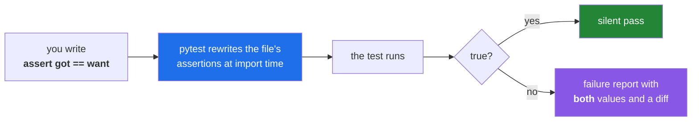

# 3.1 — The test that can go red — assertion rewriting and discovery

## One-line answer

A test is a function that makes a claim about your code and **fails loudly when the claim stops being
true** — which means a test you have never seen fail is a test you have no evidence works, and the
first thing you do with any new test is break it on purpose.

---

## The story

A data pipeline has a test suite. Four hundred tests, green for eight months, run on every commit. The
team is proud of it.

A customer reports that a report is missing rows. Investigation finds that a filtering step has been
returning an empty list for eleven weeks, because a column was renamed upstream and the filter now
matches nothing.

There is a test for that filter. It is green. It has always been green.

Someone opens it:

```text
def test_filter_removes_stale_rows():
    rows = load_fixture("rows.json")
    result = filter_stale(rows)
    assert result is not None
```

`assert result is not None`. An empty list is not `None`. The test has been passing for eleven weeks
by asserting something that would be true no matter how badly the function broke — and it would have
kept passing if `filter_stale` had been deleted and replaced with `return []`.

Nobody wrote this in bad faith. It was written in a hurry, at the end of a Friday, to make a coverage
number go up. It passed the first time it was run. **That was the problem: it passed the first time it
was run, and nobody asked whether it could ever do anything else.**

---

## The idea in plain language

### A test is an executable claim

You met static analysis in [1.1](../01-linting/1.1-what-a-linter-is.md): tools that read your code
without running it. A **test** is the other kind. It runs the code, gives it a known input, and
compares what came out against what should have come out. That comparison is the only way anything can
know your program is *correct*, because correctness is a property of behaviour and behaviour only
exists at runtime.

Three parts, always, in this order — a shape traditionally called **arrange, act, assert**:

1. **Arrange** — build the known input. A list, a temporary file, a fake response.
2. **Act** — call the thing under test, exactly once, and keep the result.
3. **Assert** — state what must be true about that result.

The third is where tests live or die. `assert result is not None` is an assertion in the syntactic
sense and a wish in every other sense.

### The property that matters: it must be able to fail

Principle 7 in this plan says *evals before features*, and the sharp edge of it is the phrase "a
behaviour is not done until a test can go red when it regresses". Read that as an instruction about
what you do with a new test: **change the code so the test should fail, and watch it fail.**

A test you have only ever seen pass is untested software. That is not a rhetorical flourish; the test
is itself a program, it can have bugs, and the specific bug it most often has is asserting something
that is unconditionally true. The only reliable detector is to make the claim false and confirm the
test notices.

This is where the phrase "red, green" comes from. Red first, deliberately. Then make it green by
writing the code. Then break it again once, at the end, to be sure it is still watching.

### What pytest actually gives you

There are many ways to write tests in Python. This project uses **pytest**, and the reason is a single
feature that sounds cosmetic and is not.

In plain Python, `assert a == b` raises `AssertionError` with no information. You get "something was
false" and nothing about what. Testing frameworks historically solved this by making you write
`self.assertEqual(a, b)` — a special method per comparison, so the framework knows both sides.

Pytest takes a different route: it **rewrites the assertion statements in your test files** before
running them, replacing each bare `assert` with code that records both sides of the comparison. You
write the plain Python `assert a == b`, and on failure pytest shows you `a`, `b`, and where they
differ.

The consequence is that there is nothing to learn. No assertion vocabulary, no base class to inherit
from. A test is a function whose name starts with `test_`, in a file whose name starts with `test_`,
containing `assert`.



### Discovery — how pytest finds anything at all

Pytest is given a directory and goes looking. Its default rules, all of which this project relies on:

- Files named `test_*.py` or `*_test.py`.
- Functions inside them named `test_*`.
- Classes named `Test*` (with no `__init__`), and `test_*` methods inside those.

Everything else is ignored. A helper function called `check_rows` in a test file is never run as a
test, which is exactly what you want — helpers are ordinary functions.

This project narrows discovery further, in `pyproject.toml`:

```text
[tool.pytest.ini_options]
addopts = "-q --strict-markers"
testpaths = ["tests"]
```

`testpaths = ["tests"]` means a bare `pytest` looks only in `tests/`, which is why running it does not
try to import every notebook and lab file in the repository. `addopts` are flags applied to every run
— `-q` for quiet output, and `--strict-markers`, which is [3.3](3.3-markers-and-exit-code-five.md)'s
subject.

---

## Why Setu needs it

- **Principle 7 is the reason this day exists.** Every lab from here to Day 240 ends with at least one
  test that can go red, and every checklist in this plan contains a *break it, watch it go red, fix
  it* box. This part is where that instruction acquires a mechanism.
- **`./m check` runs the offline suite as its third gate** ([4.1](../04-the-gate/4.1-what-m-check-actually-runs.md)),
  and `./m done N` refuses to commit when it fails
  ([Day 0, 3.3](../../../day-00-setup/parts/03-m-script/3.3-the-done-gate.md)). Today the suite stops
  being empty.
- **[Day 1](../../../day-01-pins/LESSON.md) already wrote `tests/test_pins.py`** with four tests whose
  bodies are `TODO(me)`. Those tests currently fail by raising `NotImplementedError`, which is the
  correct starting state — red before green, by construction.
- **From Phase 12 the thing under test stops being a function and becomes a model**, and from Phase 20
  it becomes an agent. The assertion changes shape — a held-out metric, a rubric — but the property
  never does: it must be able to go red.

---

## The mechanism

Write the story's bad test and a good one side by side, and let pytest show you the difference:

```python
"""Two tests of the same function. Only one of them can ever fail."""


def filter_stale(rows):
    """Return only the rows that are not marked stale."""
    return [r for r in rows if not r["stale"]]


FIXTURE = [
    {"id": 1, "stale": False},
    {"id": 2, "stale": True},
    {"id": 3, "stale": False},
]


def test_wishful() -> None:
    result = filter_stale(FIXTURE)
    assert result is not None


def test_actually_checks() -> None:
    result = filter_stale(FIXTURE)
    assert [r["id"] for r in result] == [1, 3]
```

**Line by line:**

- `def filter_stale(rows)` — the function under test lives in the same file only for this
  demonstration. In the real project it lives in `src/setu/` and the test imports it (Principle 6).
- `FIXTURE` — the *arrange* step, hoisted to module level because it is constant. Three rows, one of
  them stale, is the smallest input that can distinguish "filters correctly" from "returns everything"
  **and** from "returns nothing". A two-row fixture would miss one of those.
- `test_wishful` — the story's test. `result is not None` is true for `[1, 3]`, true for `[]`, true for
  the whole input unchanged. It asserts that the function returned *something*, which no working
  function has ever failed to do.
- `test_actually_checks` — `[r["id"] for r in result] == [1, 3]` names the exact expected output.
  Comparing the extracted ids rather than the dicts keeps the failure message readable; comparing
  whole dicts would work too and would print more on failure.
- `-> None` on both — the return annotation. Pytest ignores it; it is there because this project
  selects `UP` and will grow into typed code by Day 19, and because a test that returns a value is
  almost always a mistake worth making visible.

Now the step people skip. Break the function and see which test notices:

```bash
mkdir -p /tmp/pt-demo
# save the code above as /tmp/pt-demo/test_filter.py first, then:
uv run python -m pytest /tmp/pt-demo/test_filter.py -v

# now break it: make the filter return nothing at all
sed -i 's/return \[r for r in rows if not r\["stale"\]\]/return []/' /tmp/pt-demo/test_filter.py
uv run python -m pytest /tmp/pt-demo/test_filter.py -v
```

**Line by line:**

- `python -m pytest` rather than a bare `pytest` — running it as a module guarantees the interpreter is
  the one `uv run` selected, and puts the current directory on the import path. Bare `pytest` can
  resolve to a different installation, which is the interpreter trap from
  [Day 0, 1.5](../../../day-00-setup/parts/01-toolchain/1.5-the-editor-and-the-interpreter-trap.md)
  wearing a new hat.
- `-v` — verbose: one line per test with its name and result, instead of a row of dots. Worth it while
  learning; `-q` is the project default for a reason once suites get large.
- `sed -i 's/.../.../'` — edit the file in place, replacing the filter body with `return []`. This is
  the deliberate break, and it is the *only* step in this document that proves anything.
- After the break, `test_actually_checks` fails and `test_wishful` still passes. That single line of
  output is the entire subject of this part.

The failure report is the other half of what pytest buys you:

```text
=================================== FAILURES ===================================
_____________________________ test_actually_checks _____________________________

    def test_actually_checks() -> None:
        result = filter_stale(FIXTURE)
>       assert [r["id"] for r in result] == [1, 3]
E       assert [] == [1, 3]
E
E         Right contains 2 more items, first extra item: 1
E
E         Full diff:
E         - [1, 3]
E         + []

/tmp/pt-demo/test_filter.py:26: AssertionError
=========================== short test summary info ============================
FAILED /tmp/pt-demo/test_filter.py::test_actually_checks - assert [] == [1, 3]
1 failed, 1 passed in 0.02s
```

Read what the rewriting bought: `assert [] == [1, 3]` — both sides, printed, from a plain `assert`
statement you wrote with no framework vocabulary. Then a diff. Then the file and line. A developer
seeing that in CI knows what happened without opening the code.

And `1 failed, 1 passed` is the sentence that should make you uncomfortable about `test_wishful`. It
is still green. It will be green forever.

---

## When it breaks

**Pytest finds nothing:**

```text
$ uv run python -m pytest
no tests ran in 0.01s
```

...and the exit code is **5**, not 0. **What it means.** Discovery matched nothing: the file is not
named `test_*.py`, the function is not named `test_*`, or you are outside `testpaths`. This exit code
has its own subject in [3.3](3.3-markers-and-exit-code-five.md), because a naive gate treats
"collected nothing" as success and that is how a test suite silently disappears.

**A test file that will not import:**

```text
=================================== ERRORS ====================================
_______________ ERROR collecting tests/test_pins.py ________________
ImportError while importing test module '/…/tests/test_pins.py'.
Hint: make sure your test modules/packages have valid Python names.
Traceback:
tests/test_pins.py:12: in <module>
    from check_pins import classify
E   ModuleNotFoundError: No module named 'check_pins'
```

**What it means.** This is a **collection error**, not a test failure — pytest could not even load the
file, so none of its tests ran. The distinction matters: a collection error in one file does not tell
you anything about the tests inside it. Here the cause is the import path;
[Day 1's](../../../day-01-pins/LESSON.md) `tests/test_pins.py` deals with it by inserting
`ROOT / "scripts"` into `sys.path` at the top, because `scripts/` is not an installed package.

**The assertion that helps nobody:**

```text
E       assert False
```

**What it means.** You wrote `assert some_function(x)` where the function returns a bool. Rewriting can
only show you the values it can see, and here there is one value: `False`. Compare against something —
`assert some_function(x) is True` is barely better; `assert result == expected` with both named is what
you want. **The quality of a failure message is decided when you write the assertion, not when it
fails.**

**And the worst one, because it looks like success:**

```text
$ uv run python -m pytest -q
....................                                                     [100%]
20 passed in 0.31s
```

...on a branch where you deliberately broke the code. **What it means.** Every one of those twenty
tests is a `test_wishful`. This is the story, and the only way to find out is the deliberate break. Do
it once per test, the day you write it, and record it in the day's checklist — which is exactly why
every `CHECKLIST.md` in this plan carries a *break it, watch it go red, fix it* box.

---

## In production

**"Can this test fail?" is a formal question, and the technique that answers it is mutation testing.**
A mutation-testing tool systematically introduces small changes into your source — flip a `<` to `<=`,
replace a return value with a constant, delete a line — and re-runs the suite for each. Every mutant
that survives is a change to your code that no test noticed, which is a precise, mechanical answer to
"where is my suite lying to me". It is expensive, so teams run it on the critical module rather than
the whole repository, and the output is far more actionable than a coverage percentage.

**Which is worth saying plainly: coverage is not the metric people think it is.** Line coverage tells
you a line executed during the test run. It does not tell you anything was asserted about it.
`test_wishful` gives `filter_stale` one hundred per cent line coverage. A team that manages to a
coverage number will produce exactly that test, in volume, because it is the cheapest way to move the
number. Coverage is useful for finding code with *zero* tests; beyond that it measures the wrong thing.

**Test speed decides whether tests are run.** A suite that finishes in seconds gets run before every
commit. A suite that takes twenty of them gets run in CI and skipped locally, which doubles the
feedback loop. The professional structure is a fast core — pure functions, no I/O, no network — that
runs constantly, and a slower tier that runs less often. This project builds that split on day one:
`-m "not live"` in `./m check` keeps every network test out of the fast path
([3.3](3.3-markers-and-exit-code-five.md)).

**What changes when the thing under test is a model or an agent.** From Phase 12 the output is not
deterministic and `assert got == want` stops being available. The property survives the change of
shape: instead of equality you assert a **threshold on a held-out metric** — accuracy on a test split
never used for training (Principle 15) — and instead of a value you assert a **rubric score**. Both can
still go red. What you must not do is respond to non-determinism by weakening the assertion until it
always passes, which is `assert result is not None` in a lab coat.

**The review comment a senior engineer leaves.** On a new test: *"Show me this failing. Change the
return value in the function and paste the output in the PR description."* It sounds pedantic once and
is never pedantic twice.

**The interview question.** *"How do you know your tests are any good?"* Almost everyone says coverage.
The answer that stands out names the failure mode first — a test that asserts something unconditionally
true passes forever and gives full coverage — and then gives two mechanisms: deliberately break the
code and confirm the expected tests go red, and use mutation testing on the parts of the system where
being wrong is expensive. Finishing with *"and I'd rather have four tests I've watched fail than forty
I haven't"* is the sentence that gets remembered.

---

## Check yourself

```bash
uv run python -m pytest -q
uv run python -m pytest --collect-only -q | tail -5
```

The first runs the project's current suite. The second lists what discovery actually found, without
running anything — the command to reach for the moment you suspect a test file is being ignored.

**Answer out loud, without scrolling up:**

> A colleague shows you a test that has passed for a year and says the code it covers must be solid.
> Give the two-sentence reason that does not follow, and describe the exact experiment you would run
> to find out whether the test can fail at all.

---

**Next:** [3.2 — Fixtures, `tmp_path`, and the test that leaves nothing behind](3.2-fixtures-and-tmp-path.md)
