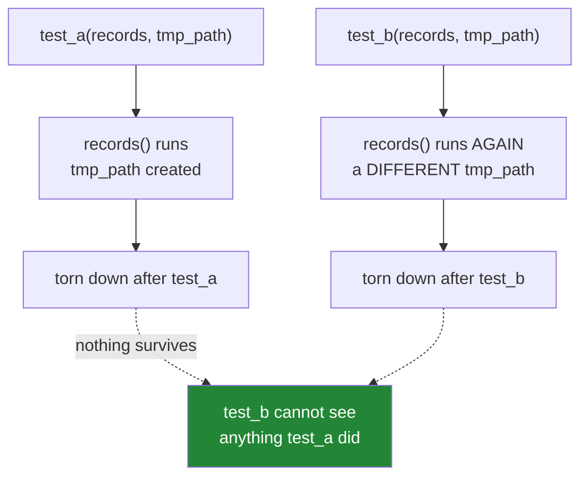

# 3.2 — Fixtures, `tmp_path`, and the test that leaves nothing behind

## One-line answer

A **fixture** is a named piece of setup that pytest builds fresh and hands to any test that asks for
it by putting its name in the test's parameter list — and the reason to use one rather than a module
global is that a fixture is rebuilt per test, which is what stops one test's leftovers deciding
another test's result.

---

## The story

A test suite has an intermittent failure. Not always — perhaps one run in six. Always the same test,
`test_report_totals`, and always with a number that is slightly too large.

Re-running it alone passes. Re-running the whole suite usually passes. The team adds a retry to the CI
step and moves on, because it is one test and there is a release this week.

Two months later somebody runs the suite with a flag that randomises test order, chasing something
else entirely, and now it fails four times in five. That is enough of a clue to look properly.

The cause is eleven lines above the failing test:

```text
RECORDS = []

def test_ingest_appends():
    ingest(RECORDS, {"id": 1})
    assert len(RECORDS) == 1

def test_report_totals():
    ingest(RECORDS, {"id": 2})
    assert total(RECORDS) == 2
```

`RECORDS` is a module-level list. It is created once, when the file is imported, and both tests mutate
it. When they run in file order the second sees one leftover record and its expected total of 2 works
out by accident. When something reorders them — a parallel runner, a filter, a randomiser — the
accident stops happening.

The suite was never testing what it claimed. It was testing a specific execution order, and the order
was never written down anywhere.

---

## The idea in plain language

### The problem fixtures solve is shared state

Every test needs input: a list, a file, a database connection, a fake response. The naive way to
provide it is a module-level variable, which is created **once** when the module is imported and then
shared by every test in the file.

If the tests only read it, that is fine. The moment one of them mutates it, the tests are coupled: the
result of the second depends on whether the first ran, which depends on ordering, which is not
something you control or should want to.

This is the same aliasing hazard you will meet head-on in
[Day 4, 2.3](../../../day-04-objects/parts/02-containers/2.3-aliasing-two-names-one-object.md) — two
names, one object — and the same one behind the mutable-default-argument bug in
[Day 4, 3.1](../../../day-04-objects/parts/03-identity-trap/3.1-the-mutable-default-argument.md). It is
worth noticing that the single most common Python trap and the single most common flaky-test cause are
the same fact about the language.

### A fixture is setup with a name and a lifetime

A **fixture** is a function decorated with `@pytest.fixture`. What it returns becomes available to any
test that names it as a parameter. Pytest sees the parameter name, finds the fixture with that name,
runs it, and passes the result in.

```text
@pytest.fixture
def records():
    return []

def test_ingest_appends(records):     # <- pytest calls records() and passes the result
    ingest(records, {"id": 1})
    assert len(records) == 1
```

The mechanism is deliberately implicit — the parameter name *is* the request — and that is the one
genuinely surprising thing about pytest. Once you have seen it, the rest follows.

By default a fixture has **function scope**: it runs again for every single test that asks for it. So
`records` above is a *different* empty list in every test, and the story's coupling cannot happen. That
default is the point.

### The scopes, and the trade they make

| Scope | Rebuilt | Use it for |
|---|---|---|
| `function` (default) | once per test | anything mutable — the safe default |
| `class` | once per test class | rare |
| `module` | once per test file | expensive read-only setup, e.g. a parsed fixture file |
| `session` | once per whole run | a container, a database, a loaded model |

Widening the scope buys speed and costs isolation, and the trade is real: a `session`-scoped database
connection is the difference between a suite that takes seconds and one that takes an hour. The rule
that keeps you safe is **share only what you do not mutate**, and if a test must mutate shared state,
it is responsible for undoing it.

### `tmp_path` — the fixture you did not write

Pytest ships built-in fixtures. The one you will use constantly is `tmp_path`: ask for it, and you get
a `pathlib.Path` to a **fresh, empty directory unique to that test**, which pytest creates before the
test and cleans up later.

That solves a second version of the same problem. A test that writes to `output.json` in the current
directory pollutes the repository, collides with a parallel run of itself, and leaves a file behind
that the *next* run may read and pass on. `tmp_path` makes every one of those impossible.

Two more built-ins worth knowing today:

- **`capsys`** — captures anything the code under test printed, so you can assert on output.
- **`monkeypatch`** — temporarily replaces an attribute, a dictionary entry, or an environment
  variable, and **restores it automatically** when the test ends. That last property is why you use it
  rather than assigning to `os.environ` directly, which leaks into every later test.



---

## Why Setu needs it

- **Principle 8 is leakage, and this is its test-suite cousin.** The habit of asking "could state from
  one step reach another step that must not see it?" is the same instinct that puts the train/test
  split before the scaler on Day 76. Building it here, on lists and directories, is cheap; building it
  for the first time on a model is expensive.
- **[Day 1's](../../../day-01-pins/LESSON.md) `check_pins.py` writes a cache file.** Testing anything
  that touches the filesystem without `tmp_path` means either polluting the repo or mocking so much
  that you are no longer testing the real code path.
- **Day 3 puts API keys in the environment** ([3.1 of that day](../../../day-03-keys-and-budget/parts/01-secrets/1.2-dotenv-and-os-environ.md)),
  and `monkeypatch.setenv` is how you test key-handling code without a real key and without leaking a
  fake one into the rest of the run.
- **From Phase 6 there is a real database**, and a `session`-scoped connection fixture with
  per-function transactions is the standard shape. The scope table above is what that decision rests
  on.

---

## The mechanism

Reproduce the story's coupling, then remove it, in one file:

```python
"""Shared module state couples tests; a fixture does not."""

import pytest


def ingest(records: list[dict], row: dict) -> None:
    """Append a row. Mutates its argument in place, on purpose."""
    records.append(row)


SHARED: list[dict] = []


def test_shared_one() -> None:
    ingest(SHARED, {"id": 1})
    assert len(SHARED) == 1


def test_shared_two() -> None:
    ingest(SHARED, {"id": 2})
    assert len(SHARED) == 1  # passes only if test_shared_one never ran


@pytest.fixture
def records() -> list[dict]:
    """A brand-new empty list, rebuilt for every test that asks for it."""
    return []


def test_isolated_one(records: list[dict]) -> None:
    ingest(records, {"id": 1})
    assert len(records) == 1


def test_isolated_two(records: list[dict]) -> None:
    ingest(records, {"id": 2})
    assert len(records) == 1  # passes always
```

**Line by line:**

- `SHARED: list[dict] = []` — created **once**, at import. Both `test_shared_*` functions mutate the
  same object, which is the story.
- `test_shared_two` asserts `len(SHARED) == 1` and its comment tells you the truth: it passes only in
  the absence of its neighbour. Run the file and it fails, because `test_shared_one` ran first and left
  a row behind — the accident, made deterministic.
- `@pytest.fixture` — the decorator that registers `records` as available by name. Decorators are a
  Day 14 subject (`PY-16`); for today, treat it as "pytest now knows about this function".
- `def records() -> list[dict]: return []` — the body runs afresh for each requesting test, so the
  returned list is a **different object** every time. That is the whole fix, and it is one line.
- `def test_isolated_one(records: list[dict])` — the parameter name matches the fixture name, which is
  how the request is made. Rename the parameter and pytest raises `fixture 'recs' not found`; the
  binding is by name and nothing else.
- Both `test_isolated_*` assert `len(records) == 1` and both pass, in any order, run alone or together
  or in parallel. **Order-independence is the property, and it is worth testing for explicitly** — see
  the `-p no:randomly` note in *When it breaks*.

Now the filesystem version, which is where `tmp_path` earns its place:

```python
"""Anything that writes a file gets tmp_path, always."""

import json
import os
from pathlib import Path

import pytest


def write_cache(path: Path, payload: dict) -> None:
    """Write payload as JSON, creating parent directories if needed."""
    path.parent.mkdir(parents=True, exist_ok=True)
    path.write_text(json.dumps(payload), encoding="utf-8")


def test_write_cache_roundtrips(tmp_path: Path) -> None:
    target = tmp_path / "nested" / "cache.json"

    write_cache(target, {"pandas": "3.0.5"})

    assert target.is_file()
    assert json.loads(target.read_text(encoding="utf-8")) == {"pandas": "3.0.5"}


def test_write_cache_starts_empty(tmp_path: Path) -> None:
    assert list(tmp_path.iterdir()) == []


def test_env_is_set_inside_this_test(monkeypatch: pytest.MonkeyPatch) -> None:
    monkeypatch.setenv("SETU_FAKE_KEY", "not-a-real-key")
    assert os.environ["SETU_FAKE_KEY"] == "not-a-real-key"


def test_env_did_not_leak_into_the_next_test() -> None:
    assert "SETU_FAKE_KEY" not in os.environ
```

**Line by line:**

- `tmp_path: Path` — the built-in fixture. You did not define it and do not import it; naming the
  parameter is the entire request. Pytest hands you a `pathlib.Path` to a directory that exists and is
  empty.
- `tmp_path / "nested" / "cache.json"` — `pathlib`'s `/` operator builds paths without string
  concatenation, so the same line works on Windows and Linux. This is a Day 16 subject (`PY-19`) that
  you get to use early because it is unavoidable here.
- `path.parent.mkdir(parents=True, exist_ok=True)` — the code under test creates its own directories.
  `parents=True` makes intermediate levels; `exist_ok=True` stops it raising when they already exist.
  Testing this through `tmp_path` is only safe because the directory is disposable.
- `encoding="utf-8"` on both read and write — never rely on the platform default. On Windows it is not
  UTF-8, and a test that passes on one machine and fails on another because of a character in a title
  is a genuinely miserable afternoon.
- `test_write_cache_starts_empty` — asserts the directory is empty. This test exists to demonstrate the
  isolation claim rather than to test your code: it passes even though the previous test wrote two
  files, because **this test got a different directory**.
- `monkeypatch.setenv(...)` — sets an environment variable for the duration of this test only. Pytest
  restores the previous state during teardown, so nothing leaks into the next test.
- `test_env_did_not_leak_into_the_next_test` — the proof, written as a separate test because that is
  the only place from which the restoration is observable. Assigning `os.environ["SETU_FAKE_KEY"]`
  directly in the first test would make this second one fail, and the leak would otherwise surface as
  a test that passes alone and fails in the suite — the story again, in a different costume.

Run them and ask pytest to show its work:

```bash
uv run python -m pytest /tmp/pt-demo/test_fixtures.py -v
uv run python -m pytest /tmp/pt-demo/test_fixtures.py --fixtures | head -30
uv run python -m pytest /tmp/pt-demo/test_fixtures.py --setup-show -q 2>&1 | head -20
```

**Line by line:**

- `-v` — the per-test lines. Expect `test_shared_two` to fail and everything else to pass; that failure
  is the point of the file.
- `--fixtures` — lists every fixture visible from this file, built-in ones included, with their
  docstrings. This is how you discover `tmp_path`, `capsys` and `monkeypatch` without reading
  documentation, and how you find out what a colleague's `conftest.py` has quietly made available.
- `--setup-show` — prints `SETUP F records` and `TEARDOWN F records` lines around each test, where `F`
  is the scope. Run it once: seeing the fixture set up and torn down twice, once per test, is what
  turns "function scope" from a phrase into a fact.

---

## When it breaks

**The fixture name is not found:**

```text
E       fixture 'recs' not found
>       available fixtures: cache, capfd, capsys, doctest_namespace, monkeypatch, pytestconfig,
        record_property, recwarn, tmp_path, tmp_path_factory, ...
>       use 'pytest --fixtures [testpath]' for help on them.
```

**What it means.** The parameter name does not match any fixture. Usually a typo; sometimes the fixture
is defined in a different file and was never moved into `conftest.py`, which is the file pytest looks
in for fixtures shared across a directory. Note that the error helpfully lists what *is* available —
read that list rather than guessing.

**A test that passes alone and fails in the suite:**

```text
$ uv run python -m pytest tests/test_report.py::test_totals -q
1 passed
$ uv run python -m pytest -q
FAILED tests/test_report.py::test_totals - assert 3 == 2
```

**What it means.** Shared state, essentially always. Something earlier in the run mutated an object,
an environment variable, a file on disk, or a module-level cache that this test reads. The diagnostic
that finds it fastest is bisection by test selection: run half the suite plus the failing test, and
narrow. The fix is nearly always to convert the shared thing into a function-scoped fixture.

**The reverse — passes in the suite, fails alone:**

```text
$ uv run python -m pytest tests/test_report.py::test_totals -q
FAILED tests/test_report.py::test_totals - KeyError: 'schema'
```

**What it means.** This test depends on setup that another test performed. It is the same illness with
the polarity reversed, and it is worse, because the suite is green and nothing tells you. A test must
carry its own arrangement; if that is expensive, the arrangement belongs in a fixture, not in a
neighbouring test.

**A `session`-scoped fixture that poisons everything after it:**

```text
E       sqlalchemy.exc.PendingRollbackError: Can't reconnect until invalid
        transaction is rolled back
```

**What it means.** A shared, long-lived resource was left in a broken state by a test that failed
partway through, and every subsequent test inherits it. This is the cost side of widening scope. The
standard remedy is to keep the *connection* session-scoped and wrap each test in a transaction that is
rolled back in teardown, so the expensive thing is shared and the mutable thing is not.

---

## In production

**Fixture scope is a performance decision with a correctness price, and it should be made explicitly.**
The mature shape is a small number of `session`-scoped fixtures for genuinely expensive resources — a
container, a loaded model, a compiled parser — and everything mutable at function scope on top of
them. When somebody widens a scope to make the suite faster, the review question is always the same:
*what mutates it, and what undoes that?* If there is no answer, the speed-up is a future flaky test.

**`conftest.py` is where shared fixtures live, and it is directory-scoped.** A fixture defined in
`tests/conftest.py` is available to every test under `tests/`; one in `tests/integration/conftest.py`
is available only there. This is how large suites avoid one enormous file of shared setup, and the
convention is worth adopting before it is needed — this project will want a `conftest.py` around Day
19, when the first async fixtures appear.

**Randomised order is how you find the story's bug on purpose.** Plugins exist that shuffle test order
every run and print the seed, so an order-dependence surfaces as an occasional failure with a
reproducible seed rather than as a mystery two months later. Turning that on early is uncomfortable —
it finds real problems — which is precisely the argument for it. A suite that only passes in file order
is a suite that cannot be parallelised, and parallelism is the main lever you have when a suite gets
slow.

**What changes at scale:** with thousands of tests, per-test setup dominates the runtime and shared
resources become unavoidable. The techniques that keep isolation while sharing are transactional
rollback for databases, a fresh schema or namespace per worker for parallel runs, and — for anything
truly global — a lock plus explicit cleanup in teardown. The failure that only shows with real data is
the *ordering-sensitive* one: a fixture builds a dictionary from a directory listing, the filesystem
returns entries in a different order on another machine, and a test that asserted on the first element
fails only in CI.

**The review comment a senior engineer leaves.** On a test that writes to a relative path:
*"Use `tmp_path`. As written this creates a file in whatever directory the suite happens to run from,
and two parallel workers will fight over it."* And on a module-level mutable: *"This is shared across
every test in the file. Make it a fixture — it is one decorator and it removes a whole class of flake."*

**The interview question.** *"You have a test that fails about one run in ten and passes when you run
it alone. Walk me through it."* The answer that lands names the category first — shared mutable state
across tests, almost always — then gives the diagnostic (run with randomised order to make it
reproducible, bisect by test selection to find the culprit) and the fix (function-scoped fixture, or
explicit teardown for anything genuinely shared). Adding *"and I would not add a retry, because a
retry hides the same bug that will eventually appear in production"* is the sentence that separates
someone who has fixed one from someone who has read about it.

---

## Check yourself

```bash
uv run python -m pytest --fixtures tests/ | grep -A2 "tmp_path"
uv run python -m pytest --setup-show -q tests/ 2>&1 | head -20
```

The first is pytest telling you, in its own words, what `tmp_path` gives you. The second shows every
fixture in this project's suite being set up and torn down around each test — read the `SETUP`/`TEARDOWN`
pairs and note the scope letter on each.

**Answer out loud, without scrolling up:**

> Explain why a module-level list shared by two tests is a bug even when both tests currently pass.
> Then name the two things `tmp_path` guarantees that writing to `./output.json` does not, and say
> what `monkeypatch.setenv` does at the end of a test that plain assignment to `os.environ` does not.

---

**Next:** [3.3 — Markers, `--strict-markers`, and the exit code that means "nothing ran"](3.3-markers-and-exit-code-five.md)
