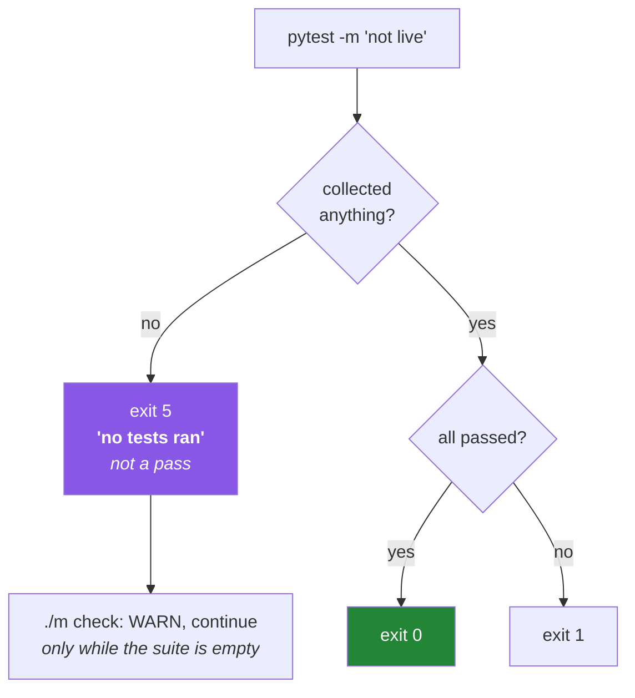

# 3.3 — Markers, `--strict-markers`, and the exit code that means "nothing ran"

## One-line answer

A **marker** is a label you attach to a test so a run can select or exclude it — which is how this
project keeps every network-touching test out of `./m check` — and two details decide whether the
mechanism protects you or quietly betrays you: `--strict-markers`, which rejects a marker you never
declared, and **exit code 5**, which pytest returns when it collected nothing at all.

---

## The story

A team splits its suite. Fast unit tests run on every commit; slow integration tests run nightly. The
split is done with a marker, `@pytest.mark.integration`, and the fast job runs with
`-m "not integration"`.

It works. For about a year.

Then somebody adds a new integration test and types `@pytest.mark.integraton`. One letter. The test
is now carrying a marker that nobody has heard of, so `-m "not integration"` does not exclude it —
because it genuinely is not marked `integration` — and it runs in the fast job on every commit. It
takes forty seconds and hits a staging database.

That is mildly bad, and it is not the story. The story is what happens six weeks later, when somebody
notices the fast job has become slow, adds `-m "not integraton and not integration"` to make it fast
again, and merges. Now the misspelled marker is load-bearing. Two spellings mean two categories.
Nobody can tell which tests are in which.

The whole mess is prevented by one flag. With `--strict-markers`, the misspelled marker is not a
silent new category; it is an error at collection time, on the first run, before the commit:

```text
'integraton' not found in `markers` configuration option
```

The second half of the story is worse and quieter. The nightly integration job runs
`pytest -m integration`. One day somebody refactors the directory layout and the integration tests
end up outside `testpaths`. The nightly job now collects **zero** tests, prints `no tests ran`, and —
depending on how the job is written — reports success. Nothing has been integration-tested for three
months, and every dashboard is green.

---

## The idea in plain language

### A marker is a label with a query language

`@pytest.mark.live` above a test function attaches the label `live` to it. The label does nothing on
its own. Its value comes from `-m`, which takes an expression over labels:

| Expression | Selects |
|---|---|
| `-m live` | only tests labelled `live` |
| `-m "not live"` | everything except them |
| `-m "live and slow"` | tests carrying both |
| `-m "not live and not slow"` | the fast core |

This project declares two markers in `pyproject.toml`, and both were written on
[Day 0](../../../day-00-setup/LESSON.md) before anything used them:

```text
markers = [
    "live: hits a real API or database - skipped by default, never run in CI",
    "slow: takes more than a few seconds",
]
```

Notice that the declaration carries a **description**, and the description states a policy. That is
not decoration: `pytest --markers` prints these, so the rule about what `live` means lives next to
the mechanism that enforces it.

### Why `live` exists in this project specifically

Principle 5 says zero budget — no paid keys, ever — and the free tiers this plan runs on are limited
by rate rather than by money ([Day 3](../../../day-03-keys-and-budget/LESSON.md)). A test that calls a
provider consumes a request from a daily allowance. A test that calls a provider **in CI** consumes
one every time anybody pushes anything.

So the rule is absolute: **CI never spends a quota.** The mechanism is that every test touching the
network is marked `live`, and every automated runner passes `-m "not live"`. You can see it already
in `./m check`, and in the workflow you write today
([5.3](../05-ci/5.3-caching-and-never-spending-a-quota.md)).

[Day 1](../../../day-01-pins/LESSON.md) wrote the first one: `test_pins_match_the_index` is marked
`live` because it fetches from the package index.

### `--strict-markers` — making a typo loud

Without it, `@pytest.mark.anything` is legal. Pytest happily attaches a label it has never heard of,
because markers are open by design — plugins invent their own.

With `--strict-markers` in `addopts`, any marker not declared in the `markers` list is a **collection
error**. The test does not run; the run fails; the message names the offending marker.

The design instinct is the same one behind `Unknown rule selector` in
[1.2](../01-linting/1.2-choosing-rule-families.md): a configuration name that is wrong should be
loud, because the failure mode of silence is a category nobody knows exists. It is worth collecting
these — every good tool has a strict mode, and turning it on early costs nothing while the codebase
is small.

### Exit code 5 — the one that looks like success

Pytest's exit codes are a small, fixed set. Three matter today:

| Code | Meaning |
|---|---|
| `0` | every collected test passed |
| `1` | tests were collected and some failed |
| `5` | **no tests were collected at all** |

Code 5 is the interesting one. "Nothing ran" is not a pass, and pytest is careful to say so with a
distinct code — but a shell script written as `pytest || exit 1` treats 5 as failure (fine), while
one written to only check for `1` treats it as success (not fine), and a `set -e` script treats it as
a hard stop even when an empty suite is the honest state of a young repository.

This project's `./m` handles it explicitly, and the comment in the script says why:

```text
set +e
uv run python -m pytest -q -m "not live"
PYTEST=$?
set -e
if [ "$PYTEST" -eq 5 ]; then
  echo "WARN pytest collected no tests yet (Principle 7: ...)"
elif [ "$PYTEST" -ne 0 ]; then
  exit "$PYTEST"
fi
```

Read that as a deliberate decision rather than a workaround. An empty suite is *reported out loud* and
allowed, because on Day 0 it was the truth; every other non-zero code is fatal. What is not permitted
is silence — and the day the suite is no longer empty, the honest move is to delete the exception, so
that "collected nothing" becomes a hard failure again.



---

## Why Setu needs it

- **Principle 5 is enforced by exactly one mechanism**, and it is `-m "not live"`. Everything else
  about the zero-budget rule is intention; this is the part a machine checks.
- **`./m check` runs `-m "not live"`** ([4.1](../04-the-gate/4.1-what-m-check-actually-runs.md)) and so
  does the workflow you write today ([5.2](../05-ci/5.2-the-workflow-file-block-by-block.md)). Two
  places, one rule, and the reason there is a single `./m check` command is so that the rule cannot
  drift between them.
- **[Day 1's](../../../day-01-pins/LESSON.md) suite already has a `live` test** whose body is
  `TODO(me)`. Its checklist has a box for confirming it is skipped by default — that box is this part.
- **From Phase 20 every provider call is rate-limited**, and by the capstone there are eval suites
  that would burn a daily allowance in one run. The discipline of marking, established now on one
  test, is what makes those suites safe to have.

---

## The mechanism

Write both markers and watch selection do its job:

```python
"""Markers split a suite into what CI may run and what it may not."""

import pytest


def add(a: int, b: int) -> int:
    return a + b


def test_fast_arithmetic() -> None:
    assert add(2, 3) == 5


@pytest.mark.slow
def test_slow_but_offline() -> None:
    total = sum(range(2_000_000))
    assert total == 1_999_999_000_000


@pytest.mark.live
def test_hits_the_network() -> None:
    import urllib.request

    request = urllib.request.Request(
        "https://pypi.org/pypi/pytest/json",
        headers={"User-Agent": "setu-day2/1.0"},
    )
    with urllib.request.urlopen(request, timeout=10) as response:
        assert response.status == 200
```

**Line by line:**

- `@pytest.mark.slow` — the label. It changes nothing about how the test runs; it only makes the test
  selectable. Both markers must appear in `pyproject.toml`'s `markers` list or `--strict-markers`
  rejects the file.
- `sum(range(2_000_000))` — genuinely slow-ish and entirely offline, which is the point: `slow` and
  `live` are **independent** axes. A test can be slow without touching a network, and a network test
  can be fast. Conflating them into one marker is the common mistake, and it means you can no longer
  ask for "fast tests that hit the network" when debugging.
- `2_000_000` — underscores as digit separators, legal since Python 3.6 and purely for the reader.
- `@pytest.mark.live` — the marker that carries the Principle 5 policy. Note the import of
  `urllib.request` is *inside* the function: a `live` test's dependencies should not be paid for at
  collection time by runs that will skip it. With the standard library that costs nothing, but the
  habit matters when the import is a heavy provider SDK.
- `timeout=10` and a named `User-Agent` — the politeness rules from
  [Day 1, 2.1](../../../day-01-pins/parts/02-pypi-index/2.1-the-pypi-json-api.md). A network test with
  no timeout is a hung CI job waiting to happen.
- `response.status == 200` — asserting the contract, not the content. The version number on PyPI
  changes; the fact that the endpoint answers does not.

Now select, three ways, and read the counts:

```bash
mkdir -p /tmp/pt-demo
# save the file above as /tmp/pt-demo/test_markers.py, then:

echo "=== everything ==="
uv run python -m pytest /tmp/pt-demo/test_markers.py -q; echo "exit: $?"

echo "=== what ./m check runs ==="
uv run python -m pytest /tmp/pt-demo/test_markers.py -q -m "not live"; echo "exit: $?"

echo "=== the fast core only ==="
uv run python -m pytest /tmp/pt-demo/test_markers.py -q -m "not live and not slow"; echo "exit: $?"

echo "=== a selection that matches nothing ==="
uv run python -m pytest /tmp/pt-demo/test_markers.py -q -m "live and slow"; echo "exit: $?"
```

**Line by line:**

- The first run executes all three, network included, and exits 0.
- `-m "not live"` reports `2 passed, 1 deselected`. **Deselected, not skipped** — a distinction worth
  holding: a skipped test was collected and then declined at runtime; a deselected one was filtered
  before it ran. Only the second guarantees no code inside the test executed.
- `-m "not live and not slow"` leaves one test. Boolean operators over labels are the whole query
  language, and they compose exactly as you would expect.
- `-m "live and slow"` matches nothing: `no tests ran` and `exit: 5`. This is the story's second half
  in miniature — a selection expression that has stopped matching anything looks almost identical to a
  suite that passed, and only the exit code tells you apart.
- Run the second command with `-v` once and note that deselected tests do not appear in the output at
  all. That invisibility is why the count line matters.

Then make the typo on purpose, so you recognise the error when it is not on purpose:

```bash
printf '%s\n' \
  'import pytest' \
  '' \
  '' \
  '@pytest.mark.integraton' \
  'def test_typo() -> None:' \
  '    assert True' \
  > /tmp/pt-demo/test_typo.py

echo "=== without strict markers: silently accepted ==="
uv run python -m pytest /tmp/pt-demo/test_typo.py -q -p no:cacheprovider -c /dev/null; echo "exit: $?"

echo "=== with strict markers: a collection error ==="
uv run python -m pytest /tmp/pt-demo/test_typo.py -q -p no:cacheprovider -c /dev/null --strict-markers; echo "exit: $?"
```

**Line by line:**

- `-c /dev/null` — use an empty configuration file instead of the project's `pyproject.toml`. Without
  it, this project's `addopts` would apply `--strict-markers` to both runs and the contrast would
  vanish. This is the pytest equivalent of `--isolated` in
  [1.1](../01-linting/1.1-what-a-linter-is.md).
- `-p no:cacheprovider` — disable the plugin that writes a `.pytest_cache` directory, so a throwaway
  demo leaves nothing behind. The same instinct as `tmp_path` in
  [3.2](3.2-fixtures-and-tmp-path.md).
- The first run: `1 passed`, exit 0. The unknown marker was accepted without comment, and the test is
  now in a category of one that nobody will ever select.
- The second run: a collection error saying that `integraton` was not found in the `markers`
  configuration option, and a non-zero exit. **Same file, same code, opposite outcome** — the
  difference is entirely in whether the tool was told to be strict.
- This project's `pyproject.toml` puts `--strict-markers` in `addopts`, which means it applies to every
  run without anyone remembering it. That is the correct place for a rule you never want to be
  optional.

---

## When it breaks

**The strict-marker error, which is what you want:**

```text
=================================== ERRORS ====================================
_____________________ ERROR collecting tests/test_router.py ___________________
'integraton' not found in `markers` configuration option
============================ short test summary info ==========================
ERROR tests/test_router.py - Failed: 'integraton' not found in `markers` configuration option
!!!!!!!!!!!!!!!!!!!! Interrupted: 1 error during collection !!!!!!!!!!!!!!!!!!!!
```

**What it means.** Either a typo — fix the spelling — or a genuinely new category, in which case add it
to the `markers` list in `pyproject.toml` **with a description saying when it applies**. Adding it
without a description is how the list becomes a set of words nobody can define a year later.

**The one the story is about:**

```text
$ uv run python -m pytest -q -m integration
no tests ran in 0.01s
$ echo $?
5
```

**What it means.** The selection matched nothing. Perhaps the marker was renamed, perhaps the files
moved outside `testpaths`, perhaps the whole directory was deleted in a refactor. The failure is
invisible in the summary line and visible only in the exit code, which is exactly why any job whose
purpose is "run category X" should treat 5 as a failure rather than allowing it. **A gate that cannot
distinguish "everything passed" from "nothing ran" is not a gate.**

**A `live` test that ran when it should not have:**

```text
$ uv run python -m pytest -q -m "not live"
...F                                                                     [100%]
FAILED tests/test_router.py::test_fallback - urllib.error.URLError: <urlopen error
        [Errno -3] Temporary failure in name resolution>
```

**What it means.** A test that touches the network is missing its `@pytest.mark.live`. The DNS error is
the tell — CI has no network access to that host, or has none at all. The fix is the marker, and the
lesson is that **the marker is the only thing standing between your suite and a free-tier quota**;
there is no automatic detection of "this test used a socket".

**And the misleading green:**

```text
$ uv run python -m pytest -q
1 passed, 14 deselected in 0.04s
```

**What it means.** Fourteen tests were filtered out and one ran. If you expected a full run, something
in `addopts` or your command line is selecting. `1 passed` is a true statement about a nearly empty
run — always read the deselected count, and be suspicious of a suite that got faster without getting
smaller.

---

## In production

**Markers are how a suite is tiered by cost, and the tiers should map to when they run.** The mature
arrangement is three: a fast offline core on every commit, a slower integration set on every merge to
the main branch, and an expensive end-to-end set nightly. The marker names should say *why* a test is
in a tier — `live`, `slow`, `gpu`, `flaky` — rather than naming the tier itself, so that the schedule
can change without re-labelling every test. This project starts with two markers because two is what
it needs; the shape is the same at thirty.

**Exit code 5 deserves an explicit decision in every automated runner you write.** The general rule:
if the job's purpose is "run this category and tell me it is healthy", then collecting nothing is a
failure and the script must say so. The only defensible exception is a young repository where an empty
suite is honestly the state of the world, which is precisely how this project's `./m` is written and
commented — and the comment includes its own expiry, because the exception should be deleted the day
it stops being true.

**A related failure that only appears at scale:** a test suite split across many jobs by marker, where
the union of the selections is assumed to cover everything and does not. A test with no marker at all
falls through every `-m X` selection and is never run by any job. The defence is a job that runs the
*complement* — everything not selected by any other job — or, more simply, one job with no `-m` at all
running periodically and comparing its collected count against the sum of the others. Counting is an
underrated diagnostic.

**On skipping versus deselecting.** `@pytest.mark.skip` and `@pytest.mark.skipif` are different tools
from selection markers: a skipped test is collected, reported as skipped, and visible in the summary.
That visibility is the reason to prefer `skipif` for a *conditional* exclusion — "no key present in
this environment" — and `-m` for a *policy* exclusion. A test skipped for a reason that has quietly
gone away for a year is a known problem; the `skipif` at least leaves a line in the output saying so,
whereas a deselected test leaves nothing.

**The review comment a senior engineer leaves.** On a new test that calls a provider: *"Mark it
`live`. Our CI has no keys and the free tier has a daily cap — an unmarked test here means every push
spends from it."* And on a CI job: *"This treats exit 5 as success. If the selection ever stops
matching, this job will be green forever and we will not find out."*

**The interview question.** *"Your CI is green but a whole category of tests hasn't run in months. How
could that happen, and how would you prevent it?"* The answer that lands names the mechanism: a
selection expression that matches nothing exits with a distinct code that scripts frequently ignore, so
"no tests ran" becomes "passed". The prevention is twofold — treat that code as a failure in any job
whose purpose is a category, and assert on the collected count so the job fails if the number drops.
Adding the strict-marker point — that an undeclared marker should be a hard error, because a typo
otherwise silently creates a category with one member — shows you have been on the wrong end of it.

---

## Check yourself

```bash
uv run python -m pytest --markers | head -12
uv run python -m pytest -q -m "not live"; echo "exit: $?"
uv run python -m pytest -q -m "live"; echo "exit: $?"
```

The first prints this project's declared markers with the policy each one carries. The second is
exactly what `./m check` runs. The third asks for the `live` tests alone — read its exit code and say,
before you look, what it means.

**Answer out loud, without scrolling up:**

> Explain why `@pytest.mark.integraton` is more dangerous than a test that simply fails, and name the
> setting that turns it into an error. Then say what pytest returns when a selection matches nothing,
> and why a script that only checks for exit code 1 will report that as success.

---

**Next:** [4.1 — What `./m check` actually runs, and in what order](../04-the-gate/4.1-what-m-check-actually-runs.md)
