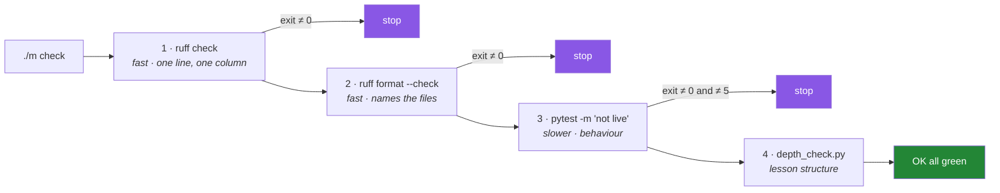

# 4.1 — What `./m check` actually runs, and why the order is not arbitrary

## One-line answer

`./m check` is four gates in a fixed sequence — lint, format, offline tests, depth contract — chained
by `set -e` so the first failure stops everything, and the order is chosen so that the **cheapest,
most specific** failure is the one you are shown.

---

## The story

Two engineers make the same mistake: a syntax error in a file they are about to commit.

The first works on a project where the build runs the whole test suite first. Their suite takes eleven
minutes. At minute nine, forty tests fail with import errors, and the log is thirty thousand lines
long. They scroll, find a traceback, find another, find a third, and eventually work out that all
forty have one cause. Then they fix one character and wait eleven minutes again.

The second works on a project where the linter runs first. Six seconds in:

```text
error: Failed to parse src/setu/loaders.py:12:5: Expected an expression
```

One line, one file, one column. They fix it and re-run.

Same bug. Same tools installed. The only difference is which question was asked first — and the
difference in the time it cost is two orders of magnitude.

There is a second, subtler version. Imagine the order were reversed but the test suite were fast.
Would it matter? Yes, and this is the part that is easy to miss: the tests would still have reported
*forty* failures, and forty failures with one cause is a worse report than one failure with one
cause, however quickly it arrives. **Ordering gates is about the quality of the diagnosis, not only
about the speed.**

---

## The idea in plain language

### A gate is a command that refuses

You built `./m` on [Day 0](../../../day-00-setup/parts/03-m-script/3.2-the-case-dispatcher.md) as a
dispatcher — a `case` statement that maps a word to a command. `check` is one of those words, and its
body is four commands in a row.

What makes it a *gate* rather than a list is two things you already have:

- **`set -euo pipefail`** at the top of the script
  ([Day 0, 3.1](../../../day-00-setup/parts/03-m-script/3.1-set-euo-pipefail.md)). The `-e` means the
  script exits the moment any command returns non-zero.
- **Every tool reports by exit code** ([2.2](../02-formatting/2.2-format-check-and-the-ci-split.md)).
  `ruff check` exits 1 on findings, `ruff format --check` exits 1 when a file would change, `pytest`
  exits 1 on a failure and 5 on an empty collection
  ([3.3](../03-pytest/3.3-markers-and-exit-code-five.md)).

Put those together and the gate needs no logic at all. Four lines, in order, and the shell does the
rest.

### The four gates, in the order they run

```text
uv run ruff check .                          # 1. lint
uv run ruff format --check .                 # 2. format
uv run python -m pytest -q -m "not live"     # 3. offline tests   (exit 5 handled explicitly)
uv run python scripts/depth_check.py         # 4. depth contract
echo "OK all green"
```

Each one is a subject you have already met today, and the interesting question is why they are in
*this* sequence.

### The ordering rule: cheapest and most specific first

Two properties decide the order, and they happen to agree.

**Cost.** Linting a repository of this size takes well under a second. Formatting is comparable. The
test suite takes longer and will take much longer by Phase 12, when a model is being fitted. The depth
check reads every Markdown file in `days/`, which grows with the curriculum. Sorting by cost means the
common case — you broke something small — is diagnosed almost instantly.

**Specificity of the failure.** This is the property that survives when the costs even out. A parse
error reported by the linter names one file, one line, one column. The *same* parse error reported by
pytest arrives as an `ImportError` inside a collection error, possibly repeated across every test file
that imports it. A formatting violation reported by `ruff format --check` names the file; the same
violation reported by nothing at all is a diff argument in a code review three days later.

**The general rule worth carrying out of this part: run the gate that gives the narrowest diagnosis
first.** It generalises past this repository — it is why a compiler reports syntax errors before type
errors, and why a schema check runs before a data-quality check.

### Why the depth check is last

It is the only gate here that is not about Python correctness at all; it enforces the plan's Part 11
contract on lesson structure. It runs last because a day whose *code* is broken is not a day whose
*structure* you want to be arguing about, and because a structural failure is never a blocker for the
other three.



### One command, called from two places

`./m check` is called by you, and by `./m done N`
([Day 0, 3.3](../../../day-00-setup/parts/03-m-script/3.3-the-done-gate.md)), and today it will be
called by CI ([5.2](../05-ci/5.2-the-workflow-file-block-by-block.md)). That is the whole reason it
exists as a named command rather than as four lines in a workflow file: **there is exactly one
definition of "green", and it cannot drift between your laptop and the build server.** A CI workflow
that lists the four commands itself is a second definition, and second definitions diverge.

---

## Why Setu needs it

- **Principle 1 says no commit, no day.** `./m done N` runs this gate before it commits, so "the day
  is finished" is a mechanical claim rather than a feeling.
- **Principle 5 lives in gate three.** `-m "not live"` is the single line that keeps a free-tier
  quota safe ([3.3](../03-pytest/3.3-markers-and-exit-code-five.md)), and it is in `./m check`
  precisely so that no runner ever has to remember it.
- **Principle 16 lives in gate four.** The depth contract is machine-checked, which is what stops a
  thin day being committed on a tired evening.
- **Today's CI workflow calls this command and nothing else**
  ([5.2](../05-ci/5.2-the-workflow-file-block-by-block.md)), which is the argument for keeping the gate
  in the repository rather than in a build configuration.

---

## The mechanism

Read the gate before you trust it:

```bash
sed -n '/^  check)/,/^    ;;/p' m
```

**Line by line:**

- `sed -n '/start/,/end/p' file` — print only the lines between two patterns. `-n` suppresses the
  default "print everything" behaviour, and the `p` at the end prints the matched range.
- `/^  check)/` — the start of the `check` branch of the `case` statement from
  [Day 0, 3.2](../../../day-00-setup/parts/03-m-script/3.2-the-case-dispatcher.md). Two leading spaces
  because that is how the script is indented; a pattern that ignores indentation would also match the
  word inside a comment.
- `/^    ;;/` — the `;;` that ends a `case` branch, which is the shell's equivalent of a `break`.
- Reading a gate's source before relying on it is not paranoia. The whole value of `./m check` is that
  it is one definition of green; a definition you have never read is a definition somebody else owns.

Now watch the ordering property directly. Break one thing in two different ways and see which gate
catches it:

```bash
mkdir -p /tmp/gate-demo
cp -r src /tmp/gate-demo/src-backup

# A: a formatting problem only
printf '%s\n' 'X = {"a":1}' > src/setu/_scratch.py
./m check; echo "exit: $?"

# B: a parse error, which is a stronger failure
printf '%s\n' 'def broken(' > src/setu/_scratch.py
./m check; echo "exit: $?"

rm -f src/setu/_scratch.py
./m check; echo "restored exit: $?"
```

**Line by line:**

- `cp -r src /tmp/gate-demo/src-backup` — a safety net before deliberately breaking files inside the
  real project. The same instinct as the `.bak` copy before `--fix` in
  [1.3](../01-linting/1.3-fix-and-noqa-as-debt.md); git would also do, but only if the tree is clean.
- `X = {"a":1}` — missing a space after the colon. Valid Python, so `ruff check` passes it and gate
  **two** is what refuses. The output is `Would reformat: src/setu/_scratch.py`, and gates three and
  four never run.
- `def broken(` — not valid Python at all. Now gate **one** refuses, with `Failed to parse`, and gate
  two never runs. Two different breakages, caught by two different gates, and in both cases you were
  shown exactly one problem.
- `rm -f` then re-run — always restore, and always confirm the restoration with the gate rather than
  by eye. A deliberate break you forgot to undo is a genuinely embarrassing commit.
- Note that `_scratch.py` sits inside `src/setu/`, which is **not** excluded — unlike `notebooks` and
  `days/*/lab` ([1.2](../01-linting/1.2-choosing-rule-families.md)). Putting the demo file where the
  gate can see it is the point.

And confirm the exit code propagates, which is what makes `./m done` work:

```bash
printf '%s\n' 'def broken(' > src/setu/_scratch.py
if ./m check > /dev/null 2>&1; then
  echo "gate said green"
else
  echo "gate refused with exit $?"
fi
rm -f src/setu/_scratch.py
```

**Line by line:**

- `if ./m check ...; then` — the shell's `if` tests the **exit code** of a command, not its output.
  This is the same mechanism `./m done` uses, and seeing it written out explicitly makes the
  dependency obvious.
- `> /dev/null 2>&1` — discard both standard output and standard error, so what you see is the branch
  taken rather than the tool's chatter. `2>&1` means "send stream 2 (errors) wherever stream 1 is
  already going" and must come *after* the redirect of stream 1, which is the classic ordering trap.
- `echo "gate refused with exit $?"` — inside the `else` branch, `$?` is the exit code of the
  condition. Expect `1`, propagated from `ruff check` through `set -e` and out of the script.
- If this printed `gate said green`, `set -euo pipefail` would be missing from `./m` — which is
  exactly what [Day 0, 3.1](../../../day-00-setup/parts/03-m-script/3.1-set-euo-pipefail.md) was
  protecting.

---

## When it breaks

**The gate stops at the first failure and you assume it is the only one:**

```text
$ ./m check
F401 [*] `os` imported but unused
 --> scripts/check_pins.py:4:8
Found 1 error.
```

**What it means.** Exactly one lint finding, and **nothing else was checked**. `set -e` stopped the
script, so you have no information about formatting, tests or structure. This is the intended
behaviour and it is worth internalising: a red `./m check` tells you about one gate, not about the
project. Fix and re-run rather than assuming the rest was fine.

**The empty-suite warning:**

```text
$ ./m check
All checks passed!
44 files already formatted
WARN pytest collected no tests yet (Principle 7: every lab ends with one that can go RED)
depth contract: all 2 checked days pass
OK all green
```

**What it means.** Gate three collected nothing and returned 5, which `./m` reports out loud and
allows ([3.3](../03-pytest/3.3-markers-and-exit-code-five.md)). On the day the suite is no longer
empty, this line should disappear — and if it ever comes back, something has hidden the tests.
**Treat its reappearance as a failure even though the script does not.**

**A gate that passes on your machine and fails in CI:**

```text
local : OK all green
CI    : error: Failed to parse days/day-02-quality-gate/lab/scratch.py
```

**What it means.** Something is present on one machine and not the other, or excluded on one and not
the other. The usual causes: an untracked file that only exists locally, a `.gitignore` rule hiding
something from the commit, or a different tool version. The diagnostic that settles it fastest is
`git status --porcelain` locally and the checkout step's file listing in CI —
[5.1](../05-ci/5.1-what-ci-actually-is.md) is about exactly this class of difference.

**The depth check refusing a day you thought was finished:**

```text
FAIL day   2  3 problems
       - parts/03-pytest/3.2-fixtures-and-tmp-path.md: dead link: ../04-the-gate/4.1-what-m-check.md
       - LESSON.md: §2 map does not link parts/05-ci/5.3-caching-and-never-spending-a-quota.md
       - LESSON.md: frontmatter says parts: 13, parts/ holds 14
```

**What it means.** All three are the depth contract doing its job: a link written against a filename
that does not exist, a part on disk that the hub never mentions, and a declared count that disagrees
with reality. None of them is a Python problem, which is why this gate is separate from the other
three — and why it is last.

---

## In production

**One command, defined in the repository, is the pattern — and the name varies but the property does
not.** Some projects call it `make check`, some `just ci`, some `npm run verify`. What matters is that
the definition of "acceptable" lives in version control next to the code, so it changes in the same
commit as the code that needs it, and so a new contributor can reproduce the build without reading a
build server's web interface. A CI configuration that lists steps inline is the anti-pattern: the
definition is then in two places, and the day they disagree is the day somebody merges a red commit
believing it is green.

**Ordering gates by diagnosis quality scales into much bigger pipelines.** A mature pipeline is a
funnel: seconds-long static checks, then minutes-long unit tests, then integration tests, then
deployment to a staging environment, then smoke tests. Every stage is more expensive and less
specific than the one before, and every stage only runs if the previous one passed. The reason is the
story — you want the cheapest possible answer to "is this obviously wrong?" before spending anything.

**Fail-fast is the default and it has a real counter-argument.** Stopping at the first failure gives
the clearest diagnosis; running everything gives the fullest report. Large projects often run
independent gates *in parallel* and report all their results, precisely because a developer waiting
twenty minutes would rather learn about the lint error and the test failure together. The trade-off is
resolved by the cost of a round trip: when feedback is seconds, fail fast; when it is tens of minutes,
gather everything. This project's feedback is seconds.

**What changes at scale:** the whole-repository gate becomes too slow, and teams move to gates scoped
to what the change touched — computed from the merge base — with a periodic full run to catch what
scoping misses ([2.2](../02-formatting/2.2-format-check-and-the-ci-split.md) makes the same point
about the formatter). The failure mode that only shows with a large repository is a *flaky* gate: a
test that fails one run in fifty. At one hundred commits a day that is two red builds a day, which is
enough to destroy trust in the gate entirely, which is why mature teams treat flakiness as a
priority-one bug rather than an annoyance.

**The review comment a senior engineer leaves.** On a pull request that adds a check directly to a CI
workflow: *"Put it in `./m check` and have CI call that. Otherwise I can't run the same gate you
did."*

**The interview question.** *"Walk me through your CI pipeline. Why is it in that order?"* Most people
list stages. The answer that stands out gives the *rule* — cheapest and most specific first, so the
narrowest diagnosis wins — and then illustrates it with the syntax-error example: the same bug
reported by a linter is one line, reported by a test suite is forty tracebacks. Then name the
counter-argument (parallel gates give a fuller report when round trips are long) so it is clear you
have chosen rather than copied.

---

## Check yourself

```bash
./m check; echo "exit: $?"
sed -n '/^  check)/,/^    ;;/p' m
```

Run the gate and read its source in the same breath. Every line in that `case` branch is a subject you
have now met — say out loud which part of today explains each one.

**Answer out loud, without scrolling up:**

> Name the four gates in order and give the reason lint comes before tests that is *not* about speed.
> Then explain why CI calls `./m check` rather than listing the four commands itself.

---

**Next:** [4.2 — The local gate and the remote gate, and why you need both](4.2-local-gate-versus-remote-gate.md)
