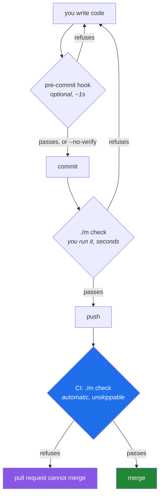

# 4.2 — The local gate and the remote gate, and why you need both

## One-line answer

A gate on your machine is **fast and skippable**; a gate on a server is **slow and unskippable** —
and the two are not redundant, because the first exists to protect your time and the second exists to
protect the branch, which are different jobs that fail in different ways.

---

## The story

A team installs a pre-commit hook. Every `git commit` now runs the linter, the formatter and the full
test suite before it will write the commit.

The first week is wonderful. Nothing broken reaches the branch.

The second week, the test suite crosses ninety seconds. Committing now means ninety seconds of
waiting, and people commit twenty times a day. Someone discovers that `git commit --no-verify` skips
hooks entirely. They mention it to a colleague. Within a fortnight it is in everyone's shell history,
and half the team has aliased `gc` to include it.

The hook still exists. It runs for the two people who have not learned the flag yet. Nobody has
deleted it, so everybody believes it is protecting them.

Now the second half. The same team has no server-side check, because "the hook catches it". A branch
lands with a failing test. Nobody notices for two days, because the failure only shows on a machine
with a different timezone, and the person who wrote it had `--no-verify` in their alias anyway.

The lesson is not *"pre-commit hooks are bad"*. It is that a local gate is **advice you can decline**,
and a gate whose enforcement depends on everybody's goodwill on their worst day is not enforcement. A
remote gate cannot be aliased away. What it *can* be is slow — and a team with only a remote gate
waits ten minutes to be told about a missing space after a comma.

---

## The idea in plain language

### The two gates answer different questions

| | Local gate | Remote gate |
|---|---|---|
| Where | your machine — `./m check` | a build server — the workflow you write today |
| When | before you commit, or whenever you like | on every push, automatically |
| Speed | seconds; must be, or it is skipped | can be minutes |
| Skippable | **yes**, trivially | no |
| Environment | yours, with all your local state | fresh, reproducible, nobody's |
| Its job | protect **your time** | protect **the branch** |

Read the last row twice. The local gate is not a weaker copy of the remote one. It exists so that you
find out about a typo in six seconds instead of in ten minutes. If it fails to catch something, you
lose a round trip. The remote gate exists so that a broken commit cannot become everybody else's
problem. If *it* fails to catch something, the main branch is broken for the whole team.

Different jobs, different failure costs, different design constraints — which is why the correct
answer is both, and why they are allowed to differ in what they run.

### Where a pre-commit hook fits

A **hook** is a script git runs at a defined moment. `pre-commit` runs before a commit is created and
can refuse it by exiting non-zero. It lives in `.git/hooks/`, which is **not** part of the repository
— so a hook is per-clone and per-person, and installing one is something each contributor must do.

That single fact settles most arguments about hooks. A hook cannot be a team policy, because a team
policy has to apply to people who have not installed it. It can be a personal convenience, and it is a
good one.

The design rule that keeps a hook useful: **it must be fast enough that nobody wants to skip it.** In
practice that means the static gates — lint and format, which finish in about a second — and not the
test suite. A hook that runs in a second is a hook that survives; a hook that runs in ninety is the
story.

### What "unskippable" actually requires

A remote gate is only unskippable if the platform enforces it. Running a workflow on every push is
necessary and not sufficient: without a branch protection rule requiring the check to pass, anybody
can merge a red pull request, and the workflow becomes an expensive way to generate red icons nobody
looks at.

That configuration lives in the hosting platform rather than in the repository, which is worth
noticing — it is one of the few pieces of a project's quality machinery that is not in version
control, and therefore one of the few that can be changed without a review. Knowing that it exists
and where it lives is the difference between a gate and a decoration.



### Why this project has no hook installed

`./m done N` already runs `./m check` before it commits
([Day 0, 3.3](../../../day-00-setup/parts/03-m-script/3.3-the-done-gate.md)). For a one-person
curriculum repository where every day ends with that command, a pre-commit hook would be a second
mechanism enforcing the same thing at a slightly different moment — and the plan's own instinct
(Principle 3, one concept per day) is against machinery that duplicates machinery.

That is a *decision*, not an absence, and it is worth being able to defend. On a repository with more
than one contributor the answer would go the other way for the fast gates.

---

## Why Setu needs it

- **Today you add the remote gate** ([5.2](../05-ci/5.2-the-workflow-file-block-by-block.md)), which
  makes this the moment to be explicit about what the local one is and is not for.
- **`./m done N` is the local gate with teeth** — it refuses to commit when the checklist has unticked
  boxes *and* when `./m check` fails. That is two different refusals for two different kinds of
  incompleteness, and both are yours to bypass if you decide to, which is the honest property of a
  local gate.
- **Principle 1 says no commit, no day.** A local gate that people route around would quietly turn
  that into "no commit message, no day", which is not the same claim.
- **From Phase 26 there are agents that can write** (Principles 11 and 12). The local/remote
  distinction here is the same shape as the human-approval checkpoint there: a control that the actor
  can bypass is a suggestion, and knowing which of your controls are suggestions is the whole skill.

---

## The mechanism

Write the fast hook, install it, and then demonstrate its own escape hatch:

```bash
cat > .git/hooks/pre-commit << 'HOOK'
#!/usr/bin/env bash
# Local convenience only. Fast gates only - anything slower gets skipped, and a skipped
# hook is worse than no hook because it looks like protection. Tests run in ./m check
# and in CI, which is where the unskippable gate lives.
set -euo pipefail
echo "pre-commit: ruff check"
uv run ruff check .
echo "pre-commit: ruff format --check"
uv run ruff format --check .
HOOK
chmod +x .git/hooks/pre-commit
```

**Line by line:**

- `.git/hooks/pre-commit` — the exact filename git looks for; there is no configuration to point at a
  different one. Note the location: **inside `.git/`, which is not tracked**, so this file is yours
  alone and vanishes if you re-clone.
- The comment at the top says *why the hook is small*. A hook without that comment grows a test run
  within a year, because the reasoning was never written down.
- `set -euo pipefail` — the same strict mode as `./m`
  ([Day 0, 3.1](../../../day-00-setup/parts/03-m-script/3.1-set-euo-pipefail.md)). Without `-e`, a
  failing linter would print its findings and the hook would still exit 0, permitting the commit.
- Only the two static gates from [4.1](4.1-what-m-check-actually-runs.md), not `./m check` in full.
  This is the design rule made concrete: the hook is a subset chosen by speed.
- `chmod +x` — git will not run a hook that is not executable, and it will not tell you why. A hook
  that silently never runs is the second-worst outcome here.

Now prove both of its properties — that it refuses, and that refusing is optional:

```bash
printf '%s\n' 'import os' > src/setu/_scratch.py
git add src/setu/_scratch.py

echo "=== the hook refuses ==="
git commit -m "temp: should be refused"; echo "exit: $?"

echo "=== and the refusal is one flag away ==="
git commit --no-verify -m "temp: hook skipped on purpose"; echo "exit: $?"

echo "=== undo the demonstration commit ==="
git reset --soft HEAD~1
git restore --staged src/setu/_scratch.py
rm -f src/setu/_scratch.py
```

**Line by line:**

- `import os` in a fresh file — an unused import, so `F401` fires and gate one of the hook refuses
  ([1.1](../01-linting/1.1-what-a-linter-is.md)).
- The first `git commit` prints the hook's output and then fails; no commit is created. That is the
  hook working.
- `--no-verify` — skips every hook. The commit is created, with the unused import in it. **This is not
  a bug in git**; hooks are explicitly a local convenience and the flag exists because sometimes you
  genuinely need to commit broken work in progress. It is also the story's entire mechanism.
- `git reset --soft HEAD~1` — undo the commit but keep the changes staged. `--soft` touches only the
  branch pointer; `--hard` would also discard the file, which is more destruction than this demo
  needs.
- `git restore --staged` then `rm` — unstage and delete, returning the tree to where it started.
  Always clean up after a demonstration that writes to the real repository.

And the observation that motivates keeping the hook small:

```bash
echo "=== how long the hook's gates take ==="
time (uv run ruff check . > /dev/null && uv run ruff format --check . > /dev/null)

echo "=== how long the full gate takes ==="
time ./m check > /dev/null
```

**Line by line:**

- `time (...)` — the shell's built-in timer around a subshell containing both commands. Parentheses
  group them so one `time` covers both.
- `> /dev/null` — discard output; you are measuring, not reading.
- The two numbers are the whole argument. Today, on a repository this small, both are quick and the
  case for a hook is weak. Run these two commands again on Day 130, when the suite fits a small neural
  network, and the gap will be the reason the hook contains only the first pair.
- **The number that matters is not "is this fast" but "is this fast enough that I will not skip it".**
  That threshold is personal and it is low — somewhere near two seconds.

---

## When it breaks

**The hook does not run at all:**

```text
$ git commit -m "test"
[main 3f9a2c1] test
 1 file changed, 1 insertion(+)
```

...with no hook output. **What it means.** Almost always the executable bit: git skips a hook it
cannot execute and says nothing. `ls -l .git/hooks/pre-commit` and look for `x` in the permissions;
`chmod +x` fixes it. On Windows this is the same trap you met with `./m` on
[Day 0, 4.2](../../../day-00-setup/parts/04-first-commit/4.2-the-first-commit.md) — the filesystem has
no execute bit, so it is the mode git records that decides. The other possibility is a missing or
wrong shebang line.

**The hook runs and the commit still contains the problem:**

```text
$ git commit -m "fix"
pre-commit: ruff check
All checks passed!
[main a41b8e2] fix
```

...and the pushed branch fails CI on a formatting error. **What it means.** The hook checks the
**working tree**, not the staged content. If you have unstaged changes, the hook is inspecting files
that differ from what is being committed. Serious hook frameworks solve this by stashing unstaged
work first; a hand-written hook usually does not, and this is the single most common surprise with
them. Knowing the limitation is enough — it is another reason the unskippable gate belongs on the
server, where it checks what was actually pushed.

**A hook that blocks a merge:**

```text
$ git merge feature/loaders
error: Your local changes to the following files would be overwritten by merge
```

...or a `pre-commit` hook firing in the middle of a rebase and failing on a commit that was fine when
it was written. **What it means.** Hooks fire during operations that create commits, including rebases
and merges, and a hook that assumes a clean tree will misbehave there. `--no-verify` is the correct
tool in that moment, which is a good illustration of why the flag exists rather than being an
oversight.

**And the organisational failure, which has no error text:**

```text
$ git config --get alias.c
commit --no-verify
```

**What it means.** Somebody has made skipping the default. Nothing is technically broken, and the hook
is now purely decorative. There is no fix in the repository — the fix is the remote gate, which is
what the next section builds.

---

## In production

**Real teams use a hook *manager* rather than hand-written hooks, and the reason is version control.**
A framework keeps the hook definitions in a tracked configuration file, pins the tool versions it
runs, and installs the actual `.git/hooks/` script from that definition on request. That fixes the two
structural problems with a hand-written hook: the definition is now reviewable and shared, and the
tool versions match everybody else's. It also usually stashes unstaged changes so the hook sees what
is being committed. If you propose hooks to a team, propose them in that shape.

**The unskippable half of the gate is a platform setting, and it needs an owner.** Requiring a status
check before merge, requiring a review, forbidding force-pushes to the default branch — these live in
the hosting platform's settings, outside the repository, and they can be changed by anyone with
administrative rights without leaving a diff. Mature teams treat that configuration as an artifact:
they write down what it should be, and some encode it as infrastructure-as-code so a change is a
reviewable commit like anything else. The failure mode otherwise is a protection that was quietly
relaxed during an incident and never restored.

**The gates may legitimately differ between local and remote, and the difference should be
deliberate.** CI can afford to run the `live` tests on a schedule that your laptop should not
([3.3](../03-pytest/3.3-markers-and-exit-code-five.md)); a laptop can afford an interactive debugger
that CI cannot. What must not differ is the *core* definition of green, which is why both call
`./m check` ([4.1](4.1-what-m-check-actually-runs.md)) and CI adds to it rather than replacing it.

**What changes at scale:** with a large team, the remote gate becomes the bottleneck — everybody's
pushes queue for the same runners, and a ten-minute pipeline plus twenty merges a day is a genuine
constraint. The techniques are the ones already named: scope the gate to changed files, run
independent gates in parallel, and cache aggressively
([5.3](../05-ci/5.3-caching-and-never-spending-a-quota.md)). The organisational technique is a merge
queue, which tests the *result* of merging rather than the branch in isolation — closing the gap where
two individually-green branches are red together.

**The review comment a senior engineer leaves.** On a pull request adding a test run to a pre-commit
hook: *"This will be at `--no-verify` within a month. Keep the hook to the second-long checks and let
CI own the suite."*

**The interview question.** *"You have a pre-commit hook running your linter. Do you still need it in
CI?"* The answer that lands does not argue about redundancy; it names the property. A hook is
per-clone, uninstalled by default, and one flag away from being skipped, so it can protect an
individual's time but cannot be a team guarantee. CI is unskippable — provided branch protection
actually requires it, which is worth saying out loud, because a workflow with no required status check
is a suggestion with a nicer interface. Then close with the division of labour: the local gate makes
the loop fast, the remote gate makes the branch safe.

---

## Check yourself

```bash
ls -l .git/hooks/ | grep -v ".sample" || echo "no hooks installed - a deliberate choice, see above"
git config --get-regexp '^alias\.' || echo "no git aliases configured"
```

The first shows whether this clone has any hook installed and whether it is executable. The second
shows whether any of your own shortcuts quietly skip verification — the failure with no error text.

**Answer out loud, without scrolling up:**

> Give the one-sentence reason a pre-commit hook cannot be a team policy. Then name what a remote gate
> needs *besides* running on every push before it is genuinely unskippable, and say which of the four
> gates in `./m check` you would put in a hook and which you would not.

---

**Next:** [5.1 — What CI actually is: a fresh machine that does not trust you](../05-ci/5.1-what-ci-actually-is.md)
