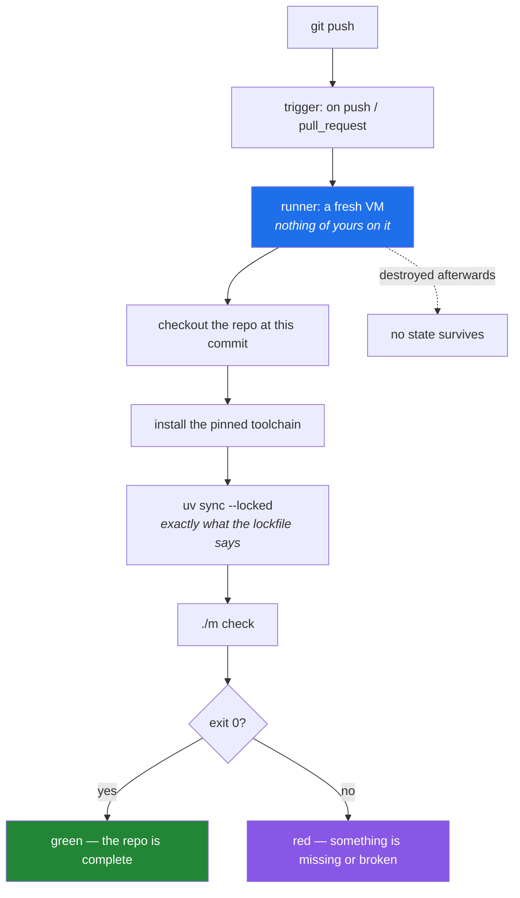

# 5.1 — What CI actually is — a fresh machine that does not trust you

## One-line answer

**Continuous integration** is the practice of running your gate on a clean machine, automatically, on
every push — and its value comes almost entirely from *clean*: a computer with none of your
half-finished state, none of your untracked files, and none of the tools you installed once and forgot
about.

---

## The story

Somebody finishes a feature. It works. The tests pass. They push, open a pull request, and the build
fails within a minute:

```text
ModuleNotFoundError: No module named 'httpx'
```

They are baffled, because `httpx` is obviously installed — they have been using it all afternoon.
They run the tests again locally. Green. They read the log twice.

Then they check `git status` and find the answer. Three weeks ago, chasing something unrelated, they
ran `pip install httpx` in their environment. It has been there ever since, and every test they have
written since has been able to import it. The package was never added to `pyproject.toml`, because it
arrived by hand rather than through the project.

Their machine had a secret. Not deliberately, not carelessly — just accumulated. And every single
green test run on that machine for three weeks had been quietly relying on it.

The build server had no such secret. It was created a minute ago, cloned the repository, installed
exactly what the lockfile said, and asked the honest question: *does this project work using only what
the project declares?* The answer was no, and had been no for three weeks.

That question is the whole product. Everything else about CI — the interface, the badges, the
notifications — is packaging.

---

## The idea in plain language

### The word means what it says

**Continuous integration** was originally a claim about *frequency*: that everybody merges their work
into the shared branch often — daily rather than monthly — so that integration problems arrive small
and constantly instead of enormous and rarely. The automated build is the practice that makes the
frequency safe, and over time the name migrated onto the tool.

Both halves are worth holding. The tool is a build server; the practice is small, frequent merges. A
team with a beautiful build server and six-week branches does not have continuous integration.

### What "a fresh machine" buys you

Every CI run starts from an image with nothing of yours in it, clones your repository at one commit,
and installs dependencies from your lockfile. That erases four categories of local accident at once:

| Local accident | What CI does about it |
|---|---|
| A package installed by hand, never declared | It is not installed, so imports of it fail |
| A file you created but never committed | It does not exist, so anything reading it fails |
| An environment variable set in your shell profile | It is unset, so code depending on it fails |
| A tool version that drifted since you installed it | It installs the pinned version from the lockfile |

That table is the definition of the guarantee. **CI does not prove your code is correct. It proves
your repository is complete** — that everything needed to build and test the project is actually
inside it.

This is why the story's failure is a *good* failure. The build did not break anything; it revealed
something that was already broken and invisible.

### The vocabulary, once, so the next section reads

A handful of terms recur across every CI platform, with slightly different names:

- **Workflow** — a file describing what to run and when. Lives in the repository, usually under a
  conventional directory the platform looks in.
- **Trigger** (or *event*) — what starts it: a push, a pull request, a schedule, a manual click.
- **Job** — a unit that runs on one machine. Jobs run in parallel by default and can be made to depend
  on each other.
- **Runner** — the machine a job runs on: a fresh virtual machine or container from a standard image.
- **Step** — one command or one pre-packaged **action** inside a job. Steps run in order, and by
  default a failing step fails the job.
- **Artifact** — a file a job produces and keeps after the machine is destroyed: a coverage report, a
  built package, a log.

Nothing conceptually new is happening. It is your gate, on somebody else's computer, started
automatically.



### The property that makes it worth the trouble

A CI run is **reproducible by construction**. Two runs of the same commit start from the same image,
install from the same lockfile, and execute the same commands. When they disagree, something genuinely
non-deterministic is involved — a network call, a clock, an unseeded random number, a test that
depends on order ([3.2](../03-pytest/3.2-fixtures-and-tmp-path.md)) — and that disagreement is
information you cannot get any other way.

It is worth seeing how much of this plan's machinery exists to protect that property. Exact pins and a
committed lockfile ([Day 1](../../../day-01-pins/LESSON.md)). `random_state=` on every estimator and
`model=` typed out on every call, from Principle 4. Function-scoped fixtures
([3.2](../03-pytest/3.2-fixtures-and-tmp-path.md)). **Reproducibility is not a CI feature; CI is what
makes the absence of reproducibility visible.**

---

## Why Setu needs it

- **Principle 4 has no witness until today.** Pinning everything on Day 1 was a claim; a fresh machine
  building from `uv.lock` is the first thing that has ever tested it.
- **Principle 5 is at risk here more than anywhere.** A build that runs on every push, several times a
  day, is exactly the place where an unmarked `live` test would drain a free-tier allowance
  ([3.3](../03-pytest/3.3-markers-and-exit-code-five.md)). CI has no keys and runs `-m "not live"`, by
  design ([5.3](5.3-caching-and-never-spending-a-quota.md)).
- **Principle 9 says data has provenance**, and a fresh machine is where a mystery CSV sitting
  untracked in your `data/` folder finally announces itself.
- **The capstone's eval gate runs in CI on Day 235.** Everything about that day — mocked model calls,
  a metric threshold that can go red — assumes the machinery you build today.
- **A stranger must be able to run this repository from the README** (the Phase 29 gate). A green CI
  badge is the only evidence for that claim that does not depend on your memory of what you installed.

---

## The mechanism

Before writing a workflow, ask what your machine is hiding. Every one of these questions has a
one-line answer and each has caught a real bug:

```bash
echo "=== files git does not know about ==="
git status --porcelain --untracked-files=all | head -20

echo "=== files git is deliberately ignoring ==="
git status --porcelain --ignored | grep '^!!' | head -10

echo "=== does the declared environment actually match the lock? ==="
uv lock --check && echo "pyproject and uv.lock agree"

echo "=== SETU-ish variables leaking in from your shell ==="
env | grep -iE 'setu|api|key|token' | sed 's/=.*/=<redacted>/' || echo "none set"
```

**Line by line:**

- `git status --porcelain` — machine-readable output, one line per file, stable across git versions.
  The human-readable form is designed to change; the porcelain form is not.
- `--untracked-files=all` — list every untracked file individually rather than collapsing a whole
  directory into one line. A collapsed directory is exactly where an undeclared fixture hides.
- `--ignored` and `grep '^!!'` — the `!!` prefix marks ignored files. This is the more interesting
  list: these are files you have deliberately arranged for CI never to see, and a test that reads one
  of them will fail there and only there.
- `uv lock --check` — the verification mode from
  [Day 1, 3.2](../../../day-01-pins/parts/03-freezing/3.2-freezing-into-pyproject-and-the-lock.md).
  Asking whether intent and resolution still agree, without changing either.
- `sed 's/=.*/=<redacted>/'` — print the variable **names** and hide the values. Never print a key,
  even to your own terminal, because terminals get screenshotted and scrollback gets shared. Day 3
  spends a whole section on this instinct.
- Run all four before pushing anything today. If the second and fourth are empty and the third agrees,
  your machine has no secrets, and CI will tell you the same thing more slowly.

Now simulate the fresh machine locally, which is the fastest way to believe any of this:

```bash
git clone --local . /tmp/fresh-setu
cd /tmp/fresh-setu
uv sync --locked
./m check; echo "exit: $?"
cd -
```

**Line by line:**

- `git clone --local .` — clone this repository into a new directory. Crucially, a clone contains
  **only what is committed**: untracked files, ignored files and your virtual environment do not come
  along. That is the same erasure CI performs, for free, in a second.
- `--local` — for a clone on the same filesystem, hard-link the object store instead of copying it.
  Faster and smaller; irrelevant to the lesson but the right flag.
- `uv sync --locked` — install exactly what `uv.lock` specifies and **refuse** if the lockfile
  disagrees with `pyproject.toml`. The `--locked` half is the important one: plain `uv sync` would
  quietly re-resolve and hide the very drift you are testing for
  ([Day 1, 3.2](../../../day-01-pins/parts/03-freezing/3.2-freezing-into-pyproject-and-the-lock.md)).
- `./m check` — the same gate, in an environment built only from committed files
  ([4.1](../04-the-gate/4.1-what-m-check-actually-runs.md)). If this passes and your working copy
  passes, the repository is complete.
- `cd -` — return to the previous directory. Delete `/tmp/fresh-setu` when you are done; it is a full
  second checkout.
- **Do this once before writing the workflow.** Finding a missing file here takes thirty seconds;
  finding it in a CI log takes a push, a wait, and a scroll.

---

## When it breaks

**The story's failure, which is the most common first CI failure there is:**

```text
Run ./m check
ImportError while importing test module '/home/runner/work/setu/setu/tests/test_router.py'.
E   ModuleNotFoundError: No module named 'httpx'
Error: Process completed with exit code 1.
```

**What it means.** Something is installed on your machine and not declared in `pyproject.toml`. The
fix is `uv add httpx==<exact>` — with the exact pin, from
[Day 1, 2.1](../../../day-01-pins/parts/02-pypi-index/2.1-the-pypi-json-api.md) — and committing both
`pyproject.toml` and `uv.lock`. The fix is *not* installing it on the runner as a separate step,
which would move the secret rather than remove it.

**A file that exists only for you:**

```text
FileNotFoundError: [Errno 2] No such file or directory: 'data/papers.csv'
```

**What it means.** The file is untracked or ignored. Decide which it should be: a small fixture
belongs in `tests/fixtures/` and gets committed; a large dataset stays out of git and the test that
needs it gets marked so CI skips it ([3.3](../03-pytest/3.3-markers-and-exit-code-five.md)). What you
must not do is commit a 200 MB CSV to make a build green. Principle 9 also applies — anything
committed under `data/` needs a `SOURCE.md`.

**The lockfile refusing:**

```text
error: The lockfile at `uv.lock` needs to be updated, but `--locked` was provided.
        To update the lockfile, run `uv lock`.
```

**What it means.** `pyproject.toml` was edited and `uv.lock` was not regenerated, or one was committed
without the other. This is `--locked` doing precisely its job. Run `uv lock` locally, commit both
files together, and note that this failure could not have happened if they had been staged together
in the first place — which is why Day 1's checklist has a box for exactly that.

**And the one that means something is genuinely non-deterministic:**

```text
Run 1: 61 passed
Run 2 (same commit, no changes): 60 passed, 1 failed
FAILED tests/test_report.py::test_ordering - assert ['b', 'a'] == ['a', 'b']
```

**What it means.** Two runs of an identical commit disagreed, so the difference is inside your code,
not inside the repository. The usual suspects: an unseeded random number, iteration over something
without a defined order, a clock or timezone, a test depending on execution order
([3.2](../03-pytest/3.2-fixtures-and-tmp-path.md)), or a network call that should have been marked
`live`. This is the single most valuable failure CI produces, because it is nearly impossible to
observe on one machine that always looks the same.

---

## In production

**A CI run should be the *only* way anything reaches production, and the reason is provenance.** Once
a build server is the thing that builds, tests, and publishes an artifact, you can say exactly which
commit produced what is running — and nobody can push a binary they built on a laptop, from a working
tree nobody has seen, at midnight. Teams that allow the second path eventually have an incident where
the deployed code does not match any commit, and that investigation is genuinely awful.

**Speed is a first-class design constraint, not a nice-to-have.** A pipeline that takes forty minutes
changes behaviour: people batch changes to avoid waiting, which makes each change larger, which makes
each failure harder to diagnose — the opposite of what continuous integration is for. The levers are
caching ([5.3](5.3-caching-and-never-spending-a-quota.md)), parallel jobs, and scoping expensive
stages to what changed. The rule of thumb worth carrying is that the loop people actually use is the
one that finishes before their attention moves.

**"It works on my machine" is a statement about environments and it has a real answer.** The
progression, in increasing strength: a lockfile makes dependencies identical; a container image makes
the operating system and system libraries identical too; a fully declarative build makes the whole
environment reproducible from a file. Each step removes a category of difference, and each costs
something. Knowing which category bit you is what tells you how far up that ladder you need to go —
most teams need the first, some need the second, and very few need the third.

**A test matrix is how you find the differences you were not thinking about.** Running the same suite
against several Python versions, or several operating systems, turns "we support 3.12 and 3.13" from
a claim into a checked fact. It multiplies your minutes, so the professional move is a small matrix on
every push and a wider one on a schedule. This project pins exactly one interpreter version
([Day 1, 3.1](../../../day-01-pins/parts/03-freezing/3.1-the-python-version-intersection.md)), so its
matrix is one cell — which is itself a decision worth being able to defend.

**The review comment a senior engineer leaves.** On a pull request adding an install step for a
package to the CI workflow: *"Why isn't this in `pyproject.toml`? If CI needs it, the project needs
it, and now local and CI have different environments again."*

**The interview question.** *"What does a green CI build actually tell you?"* Most people answer "the
tests pass", which is the small half. The answer that stands out separates the two claims: it tells
you the tests passed **and** that everything required to run them is committed — that the repository
is self-contained. Then name what it does *not* tell you: nothing about code that has no test, nothing
about behaviour under real load, and nothing at all if the suite collected no tests
([3.3](../03-pytest/3.3-markers-and-exit-code-five.md)). Being precise about the boundary of a
guarantee is the tell of someone who has debugged one.

---

## Check yourself

```bash
git status --porcelain --untracked-files=all
git clone --local . /tmp/fresh-setu && cd /tmp/fresh-setu && uv sync --locked && ./m check; cd -
rm -rf /tmp/fresh-setu
```

The first should print nothing you did not expect. The second is CI, on your own machine, without a
network round trip — if it is green, tomorrow's workflow will be too.

**Answer out loud, without scrolling up:**

> Name the four categories of local accident a fresh machine erases, and give a concrete example of
> each. Then state, in one sentence, what a green build proves about your repository that a green
> local test run does not.

---

**Next:** [5.2 — The workflow file, block by block](5.2-the-workflow-file-block-by-block.md)
