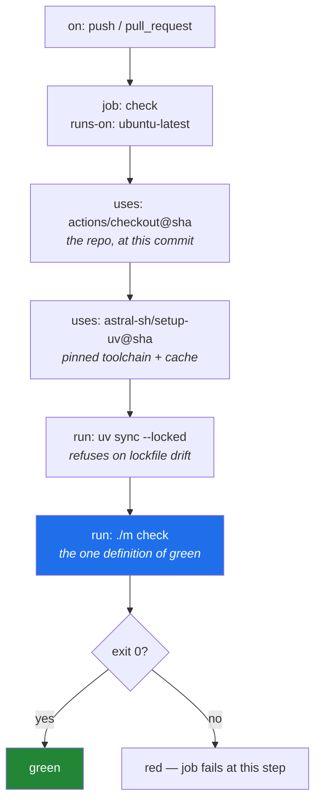

# 5.2 — The workflow file, block by block

## One-line answer

A workflow is a YAML file in `.github/workflows/` that names **when** to run, **where** to run, and
**what steps to take** — and a good one is short, because everything it needs to know about your
project is already inside `./m check`.

---

## The story

An engineer inherits a project and opens its build configuration. It is four hundred lines.

There are eleven steps. Three of them install tools with `curl | sh`, at whatever version was current
this morning. One sets four environment variables whose names appear nowhere else in the repository.
One runs the linter with a different rule set than the one in `pyproject.toml`, because two years ago
somebody needed the build to be greener. Another runs the tests with three flags nobody can explain.

None of it can be run locally. To find out whether a change works, you push and wait.

The engineer's first task is to add a check. They add a twelfth step, because that is what the file
teaches you to do, and the file becomes four hundred and eight lines.

Compare a workflow whose entire job is:

```text
- uses: actions/checkout@...
- uses: astral-sh/setup-uv@...
- run: uv sync --locked
- run: ./m check
```

Every decision about what "green" means lives in the repository, in a command you can run on your
laptop ([4.1](../04-the-gate/4.1-what-m-check-actually-runs.md)). The workflow's only job is to
provide a clean machine and call it. When the gate changes, the workflow does not, because the
workflow never knew what the gate did.

**The length of a CI configuration is a good proxy for how much of your build you cannot run
locally.**

---

## The idea in plain language

### Where the file lives, and why the path matters

A workflow is a `.yml` file inside `.github/workflows/`. The directory is a convention the platform
scans; a file anywhere else is just a file. This project already has `.github/workflows/README.md`
explaining that the real workflow is written today — a placeholder deliberately left for you.

### The four questions every workflow answers

Strip away the syntax and a workflow is four answers:

1. **When does this run?** — the `on:` block. A push, a pull request, a schedule, a manual click.
2. **Where does it run?** — `runs-on:`, naming a runner image.
3. **What does it do?** — a list of `steps:`, each either a `run:` (a shell command) or a `uses:` (a
   pre-packaged action).
4. **Under what conditions does it stop?** — by default, the first failing step fails the job.

Everything else — caching, matrices, artifacts, permissions — is refinement on those four.

### `run:` versus `uses:`

A **`run:`** step is a shell command on the runner. Ordinary, transparent, and exactly what you would
type yourself.

A **`uses:`** step invokes an **action** — a reusable unit somebody else published. `actions/checkout`
clones your repository; `astral-sh/setup-uv` installs the toolchain from
[Day 0](../../../day-00-setup/parts/01-toolchain/1.3-uv-the-one-binary.md). Actions exist because the
alternative is thirty lines of shell to detect a platform and download a binary, in every project.

The important consequence: **an action is third-party code running with access to your repository.**
Which brings up the pinning question.

### Pinning an action, and why a tag is not a pin

You met specifiers on [Day 1, 1.2](../../../day-01-pins/parts/01-versions/1.2-version-specifiers.md).
The same reasoning applies here with one extra twist.

`uses: actions/checkout@v7` refers to a **git tag**. Tags are pointers, and a tag can be moved to a
different commit by whoever controls the repository. So `@v7` is not "this exact code" — it is
"whatever `v7` currently points at", which is a range with extra steps.

`uses: actions/checkout@3d3c42e5aac5ba805825da76410c181273ba90b1` refers to a **commit hash**, which
cannot be moved. That is a real pin, in exactly the sense Principle 4 means, and it is what the
official uv documentation recommends. The convention is to write the hash and put the human-readable
version in a trailing comment, because a bare hash tells a reader nothing:

```text
uses: actions/checkout@3d3c42e5aac5ba805825da76410c181273ba90b1 # v7.0.1
```

This matters more than it looks. A moved tag is the supply-chain equivalent of the yanked release from
[Day 1, 2.2](../../../day-01-pins/parts/02-pypi-index/2.2-yanked-and-prerelease.md) — the version you
asked for is not the code you got — except that here the code runs with access to your repository.

### What this project's workflow must do, and must not do

Must: check out the code, install the pinned toolchain, sync from the lockfile with `--locked`, run
`./m check`.

Must not: install anything not in `pyproject.toml` ([5.1](5.1-what-ci-actually-is.md)'s story), define
its own idea of green, or make a single request to a model provider
([5.3](5.3-caching-and-never-spending-a-quota.md)).



---

## Why Setu needs it

- **Principle 4 extends to the build.** Pinning Python packages and then invoking an unpinned action
  leaves the largest unpinned thing in the project sitting in the file that runs on every push.
- **Principle 5 depends on the workflow's contents.** CI holds no keys and never runs `live` tests, and
  the enforcement is that the workflow calls `./m check`, which carries `-m "not live"`
  ([3.3](../03-pytest/3.3-markers-and-exit-code-five.md)).
- **`.github/workflows/README.md` has been waiting for this since Day 0** — the repository was built
  with a hole shaped like today.
- **Day 235 adds an eval gate to this same workflow.** A workflow that is four lines is one you can
  extend confidently; the story's four hundred is not.

---

## The mechanism

Take the file one block at a time. First, **when**:

```yaml
name: check

on:
  push:
    branches: [main]
  pull_request:
  workflow_dispatch:

concurrency:
  group: check-${{ github.ref }}
  cancel-in-progress: true
```

**Line by line:**

- `name: check` — what appears in the platform's interface. Matching the command it runs (`./m check`)
  means the thing that went red and the thing you type to reproduce it have the same name, which is a
  small kindness to your future self.
- `on:` — the trigger block, answering question one.
- `push: branches: [main]` — run on pushes to the default branch only. Without the `branches` filter,
  every push to every branch runs, which duplicates the pull-request run and doubles your minutes for
  no information.
- `pull_request:` — with no filter, meaning every pull request. This is the run that matters, because
  it is the one a branch protection rule can require
  ([4.2](../04-the-gate/4.2-local-gate-versus-remote-gate.md)).
- `workflow_dispatch:` — adds a manual "run" button. Cheap to include, invaluable when you want to
  re-run a build without producing an empty commit.
- `concurrency.group: check-${{ github.ref }}` — group runs by branch. `${{ ... }}` is the platform's
  expression syntax and `github.ref` is the branch reference.
- `cancel-in-progress: true` — when you push twice in a minute, cancel the first run. The result was
  going to be discarded anyway, and on a free tier the minutes are the scarce resource. **Note the
  grouping is per branch**, so cancelling your own superseded run never cancels somebody else's.

Then **where**, and the permissions the job gets:

```yaml
permissions:
  contents: read

jobs:
  check:
    runs-on: ubuntu-latest
    timeout-minutes: 10
```

**Line by line:**

- `permissions: contents: read` — the token handed to this job may read the repository and nothing
  else. This is Principle 11, blast radius, applied to a build: the job's only job is to run a gate,
  so it needs no ability to write code, open issues, or publish packages. Setting this explicitly
  matters because the default can be broader, and a build with write access is a build that a
  compromised action can use.
- `jobs:` then `check:` — one job, whose key is its identifier. More jobs would run in parallel on
  separate machines.
- `runs-on: ubuntu-latest` — the runner image. Linux is the cheapest tier and the closest match to
  where most Python actually runs. Note that `-latest` is a *moving* target, which sits slightly
  uneasily beside Principle 4 — pinning to a dated image is stricter and costs you security updates.
  Naming the tension is the point; this project takes the moving image and relies on the lockfile for
  the parts that matter.
- `timeout-minutes: 10` — kill the job if it exceeds this. Without it, a hung network call runs until
  the platform's much larger default expires, burning the allowance on a job that will never finish.
  Every job you ever write should have one.

Then **what**, which is the short part:

```yaml
    steps:
      - uses: actions/checkout@3d3c42e5aac5ba805825da76410c181273ba90b1 # v7.0.1

      - name: Install uv
        uses: astral-sh/setup-uv@c771a70e6277c0a99b617c7a806ffedaca235ff9 # v9.0.0
        with:
          enable-cache: true

      - name: Install the project
        run: uv sync --locked

      - name: Run the gate
        run: ./m check
```

**Line by line:**

- `uses: actions/checkout@<sha> # v7.0.1` — clone the repository at the commit under test. Pinned by
  commit hash, with the version in a comment, for the reason given above. Without this step the
  runner has no code at all; it is not implied.
- `name:` on a step — the label in the log. Optional, and worth writing: `Run the gate` is a better
  thing to see in a failure notification than the raw command.
- `astral-sh/setup-uv@<sha> # v9.0.0` — installs `uv`, the single tool from
  [Day 0, 1.3](../../../day-00-setup/parts/01-toolchain/1.3-uv-the-one-binary.md). It also installs the
  Python interpreter your `pyproject.toml` asks for, which is why there is no separate Python step —
  `requires-python = "==3.12.*"` from
  [Day 1, 3.1](../../../day-01-pins/parts/03-freezing/3.1-the-python-version-intersection.md) is what
  decides the version.
- `with: enable-cache: true` — the action's own caching, which is [5.3](5.3-caching-and-never-spending-a-quota.md)'s
  subject. One line here replaces a hand-written cache step with a key you have to get right.
- `uv sync --locked` — install exactly what the lockfile says, and **fail** if `pyproject.toml` and
  `uv.lock` disagree. The `--locked` half is the point: plain `uv sync` would re-resolve and hide the
  drift ([Day 1, 3.2](../../../day-01-pins/parts/03-freezing/3.2-freezing-into-pyproject-and-the-lock.md)).
- `./m check` — the entire gate, in one line, identical to what you run locally
  ([4.1](../04-the-gate/4.1-what-m-check-actually-runs.md)). Everything the build knows about this
  project is in the repository.

Verify the file before pushing it, because YAML fails in quiet ways:

```bash
uv run python -c "
import sys, pathlib
try:
    import yaml
except ModuleNotFoundError:
    sys.exit('PyYAML is not a dependency of this project - use the JSON-free check below instead')
doc = yaml.safe_load(pathlib.Path('.github/workflows/check.yml').read_text(encoding='utf-8'))
print('triggers :', sorted(doc[True] if True in doc else doc['on']))
print('jobs     :', sorted(doc['jobs']))
print('steps    :', len(doc['jobs']['check']['steps']))
"
```

**Line by line:**

- The `try`/`except ModuleNotFoundError` — PyYAML is deliberately *not* a dependency of this project
  (packages arrive on the day they are first needed), so the snippet must fail with an explanation
  rather than a traceback. Writing the fallback message is the habit; a tool that dies unhelpfully on
  a missing optional import is a tool people stop using.
- `yaml.safe_load` rather than `yaml.load` — `safe_load` refuses to construct arbitrary Python objects
  from the document. Using the unsafe variant on a file you did not write is a genuine remote-code
  execution path, and the habit of reaching for the safe one belongs from the first time you touch
  YAML.
- `doc[True] if True in doc else doc['on']` — a genuine YAML trap worth meeting once. In the YAML 1.1
  rules most parsers implement, the bare word `on` is a **boolean**, so `on:` becomes the key `True`
  rather than the string `"on"`. The platform's own parser handles it; a naive script does not. This is
  the same category of surprise as `'3.10' > '3.9'` from
  [Day 1, 1.1](../../../day-01-pins/parts/01-versions/1.1-semantic-versioning.md): a value that is not
  the type it looks like.
- `len(doc['jobs']['check']['steps'])` — assert on the shape you expect. Four steps; if this prints a
  different number, an edit did not land where you thought.
- The simplest check of all, needing no dependency: `git diff --check` for whitespace damage, and
  reading the file. **YAML is indentation-sensitive, and the most common workflow bug in existence is
  a step nested one level wrong**, which parses perfectly and does something else.

---

## When it breaks

**The workflow does not run at all, and there is nothing to click on:**

```text
(no workflow runs listed)
```

**What it means.** Three usual causes, in order of frequency. The file is not in
`.github/workflows/` — a workflow in `.github/` alone is ignored. The file is not committed and
pushed; a workflow that exists only locally does not exist. Or the `on:` block does not match what
you did — pushing to a branch when `push:` is filtered to `main` and no pull request is open means
nothing should trigger, which is correct behaviour that looks like breakage.

**YAML that parses into the wrong shape:**

```text
Invalid workflow file: .github/workflows/check.yml#L14
Unexpected value 'runs-on'
```

**What it means.** Indentation. `runs-on` belongs under the job key, not under `jobs:` directly, and
YAML has no way to tell you what you *meant*. The reliable fix is to compare against a known-good
file structurally rather than squinting: parse it and print the nesting, as above. The reliable
prevention is an editor configured to show indentation guides for YAML.

**The gate cannot be executed:**

```text
Run ./m check
/home/runner/work/_temp/xxxx.sh: line 1: ./m: Permission denied
Error: Process completed with exit code 126
```

**What it means.** The execute bit is not set on `m` **in git**. Your local filesystem may well have
it — on Windows it does not exist at all — but what the runner checks out is the mode git recorded.
`git ls-files -s -- m` must print `100755`; if it prints `100644`, run
`git update-index --chmod=+x m` and commit. This is the exact check
[Day 0's](../../../day-00-setup/parts/04-first-commit/4.2-the-first-commit.md) `test_daily_driver_is_executable`
already makes, which is why that test exists — and exit code **126** specifically means "found but not
executable", as distinct from 127, "not found at all".

**The lockfile check refusing, in the place it is most useful:**

```text
Run uv sync --locked
error: The lockfile at `uv.lock` needs to be updated, but `--locked` was provided.
Error: Process completed with exit code 2
```

**What it means.** `pyproject.toml` and `uv.lock` were not committed together. This is the failure
that `--locked` exists to produce, and it is worth being pleased about: the alternative is a build
that quietly re-resolves and installs something nobody chose.

**And the one that costs money elsewhere:**

```text
Run ./m check
tests/test_router.py::test_gemini_answers FAILED
E   google.genai.errors.ClientError: 400 API key not valid
```

**What it means.** A test that calls a provider is not marked `live`, so `-m "not live"` did not
exclude it ([3.3](../03-pytest/3.3-markers-and-exit-code-five.md)). Today it fails because there is no
key. The dangerous version of this bug is the one where a key *has* been added to the build's secrets
— then it passes, and every push spends from a daily allowance. Mark the test.

---

## In production

**Pinning actions by commit hash is a supply-chain control, and it has a maintenance cost that needs
an answer.** Hashes do not tell you when a security fix lands, so teams pair hash pinning with an
automated dependency updater that opens a pull request when a new release appears. That combination —
immutable by default, updated deliberately, reviewed like any other change — is the same
detect-and-respond pair as Principles 13 and 14 on
[Day 1, 4.2](../../../day-01-pins/parts/04-drift/4.2-drift-and-the-amendment-protocol.md). Pinning
without the updater produces a build frozen in 2026; updating without the pin produces a build that
can change under you.

**Least privilege on the build token is not theatre.** A workflow that runs third-party actions with
write access to the repository is one compromised action away from a malicious commit. Set
`permissions:` explicitly at the top, grant `contents: read` by default, and widen it per job only
where a job genuinely publishes something. When you meet Principle 11 properly on Day 182, this is the
example to reach for — the blast radius of a build job is a concrete, already-familiar case.

**Untrusted input is the sharp edge, and it deserves naming now.** A workflow triggered by a pull
request from a fork runs code proposed by a stranger. Platforms handle this by restricting the token
and withholding secrets from fork pull requests, but the trap is a workflow that interpolates a
pull-request title or branch name directly into a shell command — the expression is substituted into
the script before the shell sees it, so a crafted title becomes a command. The defence is to pass
untrusted values through an environment variable rather than interpolating them into a `run:` string.
This is injection, in a costume you will meet again when you build tools for an agent in Phase 21.

**What changes at scale:** minutes become the constraint, and the levers in order of return are
caching, cancelling superseded runs (`concurrency`, already in the file above), splitting the gate
into parallel jobs so a lint failure does not wait behind a test suite, and scoping expensive jobs to
paths that changed. The failure mode that only appears with a busy repository is the *queue*: with one
runner and thirty pushes an hour, the wait is not the pipeline, it is the line for the pipeline.

**The review comment a senior engineer leaves.** On a new workflow: *"Pin the actions to SHAs, set
`permissions: contents: read`, and add a `timeout-minutes`. Also — why are there eight steps here?
Everything after `uv sync` should be one call to our gate script so I can run it locally."*

**The interview question.** *"Why would you pin a GitHub Action to a commit hash instead of a version
tag?"* The answer that lands is precise about the mechanism: a tag is a mutable pointer that the
action's owner can move, so `@v7` does not identify code, while a commit hash does — and the code in
question executes inside your build with access to your repository. Then give the completion: hashes
alone would freeze you out of security fixes, so you pair them with an automated updater, which turns
every version change into a reviewable pull request. Name the trade-off and you sound like someone who
has run the pipeline, not read about it.

---

## Check yourself

```bash
ls -la .github/workflows/
git ls-files -s -- m
grep -n "uses:" .github/workflows/check.yml 2>/dev/null || echo "check.yml not written yet - that is today's build brief"
```

The first confirms the file is where the platform will look for it. The second must print `100755`,
or the gate will fail with `Permission denied` before it runs a single check. The third shows every
third-party action your build will execute — read the list and confirm each one is pinned to a hash.

**Answer out loud, without scrolling up:**

> Name the four questions every workflow answers, and point at the block of the file that answers each.
> Then explain why `@v7` is not a pin, and say what the build's token should be allowed to do in a
> workflow whose only job is to run a gate.

---

**Next:** [5.3 — Caching, and why CI must never spend a quota](5.3-caching-and-never-spending-a-quota.md)
