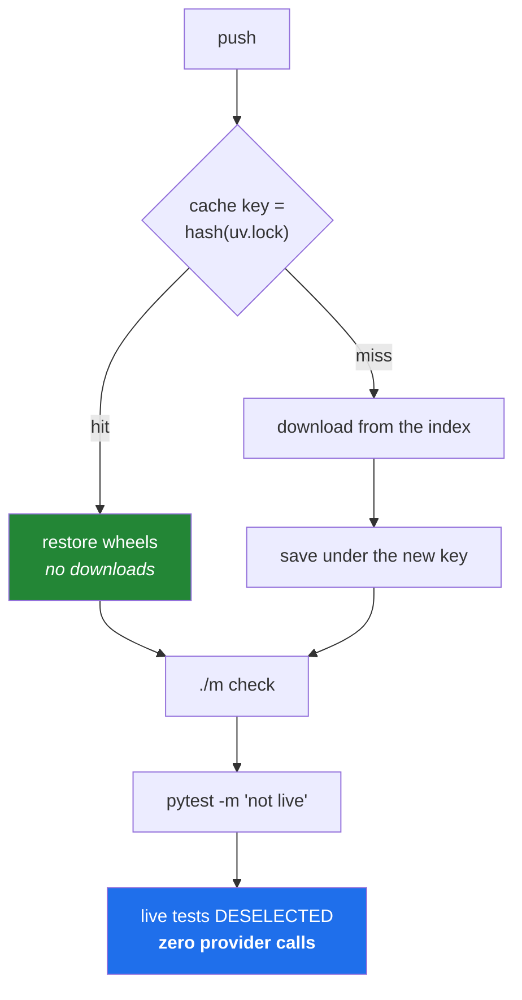

# 5.3 — Caching, and why CI must never spend a quota

## One-line answer

A cache makes a build fast by reusing work from a previous run, and the only two questions that
matter are **what key identifies the reusable work** and **what happens when the key is wrong** — and
the same "what does this run consume?" instinct is what keeps a free-tier allowance safe from a build
that fires on every push.

---

## The story

A small team ships a chatbot demo. It has an integration test that asks the model a question and
checks the answer mentions the right product. One call. A couple of seconds. It runs in CI.

The build runs on every push and on every pull-request update. There are four engineers. On a busy
day that is sixty builds.

Sixty model calls a day, from a daily allowance of a few hundred. It works, until a Thursday when
someone pushes fifteen times in an afternoon polishing a change, and the allowance runs out at four
o'clock. Every build after that is red — not because anything is broken, but because the quota is
gone. Nobody can merge anything until the counter resets. Two people spend an hour trying to find the
bug that does not exist.

There is a second version of the same afternoon, at a company where the key is not free. There, the
build does not go red. It keeps working perfectly, and the bill arrives at the end of the month.

Both failures come from the same missing question, which nobody asked when the test was written:
**what does this consume, multiplied by how often it runs?** A test that costs one call is free. A
test that costs one call sixty times a day is a budget line. Nothing about the test changed; the
*frequency* did, and frequency is what CI supplies.

---

## The idea in plain language

### Two topics, one instinct

This part carries two subjects that look unrelated and are not. **Caching** is about not repeating
work you have already done. **The zero-budget rule** is about not doing work that costs something in
the first place. Both are answers to the question *what does this run actually consume?*, and asking
it before writing a workflow step is the habit worth building.

### What a cache is, and the only hard part

A cache stores the result of an expensive step, keyed by something identifying the inputs, so that a
later run with the same inputs can skip the work.

For a Python project the expensive step is downloading and installing dependencies. On a fresh machine
that means fetching every wheel from the index and unpacking it. Cache the downloaded wheels, and a
later run reuses them.

Everything about caching is easy except the key, and the key is where all the bugs live.

- **Too specific** and the cache never hits. If the key includes the commit hash, every run has a new
  key and you have built a very elaborate way to store files nobody reads.
- **Too general** and the cache hits when it should not. If the key is just the operating system, a
  run whose dependencies changed reuses the old ones, and the build passes using packages the
  lockfile does not describe — which quietly undoes everything
  [Day 1](../../../day-01-pins/LESSON.md) established.

The right key is **a hash of the file that determines the dependencies** — for this project, `uv.lock`.
Change the lockfile, get a new key, install fresh. Do not change it, reuse. That is exactly the
property you want, and it is one of the neatest arguments for having a lockfile at all.

This is why the workflow's `enable-cache: true` from
[5.2](5.2-the-workflow-file-block-by-block.md) is one line: the action knows what determines a uv
project's dependencies and builds the key itself.

### Cache the downloads, not the environment

A subtle but important distinction. It is safe to cache the **downloaded artifacts** — the wheels,
which are immutable by construction because a version can never be republished with different bytes
([Day 1, 2.2](../../../day-01-pins/parts/02-pypi-index/2.2-yanked-and-prerelease.md)). It is riskier
to cache the **installed environment**, because an environment is a resolved state that may not match
the current lockfile, and restoring one can make a build green using packages nobody chose.

Cache inputs; recompute outputs. The rule generalises well beyond CI.

### And the second subject: CI never spends a quota

Principle 5 says zero budget, no paid keys, ever. On free tiers the currency is **rate limits**, not
dollars ([Day 3](../../../day-03-keys-and-budget/LESSON.md) is entirely about this). A build that runs
on every push is the highest-frequency consumer in the whole project, which makes it the worst
possible place for a call that costs anything.

This project's enforcement is three properties working together, and it is worth seeing that no single
one of them would be enough:

1. **CI holds no keys.** Nothing is put in the build's secrets, so there is no credential to spend.
2. **Every network-touching test is marked `live`** ([3.3](../03-pytest/3.3-markers-and-exit-code-five.md)).
3. **The gate runs `-m "not live"`** ([4.1](../04-the-gate/4.1-what-m-check-actually-runs.md)), so those
   tests are deselected before they execute.

Property 1 alone would give you red builds instead of spent quota — better, but still red. Property 2
alone does nothing without 3. Property 3 alone fails the moment somebody forgets a marker. Together
they mean a forgotten marker is a *loud, free* failure rather than a silent, expensive one, which is
the design goal: **make the failure mode of a mistake cheap.**



---

## Why Setu needs it

- **Principle 5 is the reason this project can exist at all.** Every free tier this plan depends on has
  a daily cap; the build is the one component that could exhaust one without anybody deciding to.
- **Day 3 issues three keys and two databases** ([Day 3](../../../day-03-keys-and-budget/LESSON.md)),
  and the day after tomorrow is when the temptation to "just check the key works in CI" arrives. The
  answer is decided today, before there is a key to be tempted by.
- **Every lab in this plan states its request budget** — the hub's §6, in every day. That section is the
  same question this part asks, applied to a single day's work rather than to the build.
- **Day 235 puts an eval suite in CI**, where every model call is mocked. That day is only affordable
  because of the discipline established here.
- **Free CI minutes are also a quota.** Caching is not an optimisation for its own sake; it is what
  keeps the build inside a free allowance as the project grows to 240 days of lessons and tests.

---

## The mechanism

First, see what the cache is actually saving you. Time a cold install against a warm one:

```bash
echo "=== cold: no cached wheels at all ==="
rm -rf /tmp/uv-cache-demo
time UV_CACHE_DIR=/tmp/uv-cache-demo uv sync --locked --reinstall > /dev/null

echo "=== warm: same lockfile, cache populated ==="
time UV_CACHE_DIR=/tmp/uv-cache-demo uv sync --locked --reinstall > /dev/null

du -sh /tmp/uv-cache-demo
```

**Line by line:**

- `UV_CACHE_DIR=/tmp/uv-cache-demo` — an environment variable set for one command only, redirecting the
  tool's cache somewhere disposable so this demonstration cannot disturb your real one. The
  `VAR=value command` form is a shell feature worth knowing: the variable exists for that process and
  vanishes afterwards.
- `--reinstall` — force reinstallation even though the environment is already correct. Without it the
  second run would do nothing at all and the comparison would measure nothing.
- `--locked` — as always, refuse if the lockfile disagrees with `pyproject.toml`
  ([Day 1, 3.2](../../../day-01-pins/parts/03-freezing/3.2-freezing-into-pyproject-and-the-lock.md)).
- `time` on both — the two numbers *are* the lesson. The first pays for downloads; the second does not.
  On a project with three dependencies the gap is modest; on one with `torch` in it, the gap is the
  difference between a usable build and an unusable one.
- `du -sh` — how big the cache is. Cache storage is itself a quota on most platforms, and a cache that
  grows without bound is a cache that starts evicting the entries you wanted.

Now prove the key property — that a changed lockfile must miss:

```bash
echo "=== the key that identifies this dependency set ==="
uv run python -c "
import hashlib, pathlib
digest = hashlib.sha256(pathlib.Path('uv.lock').read_bytes()).hexdigest()
print('runner-os + uv.lock ->', digest[:16])
"
```

**Line by line:**

- `hashlib.sha256(...).hexdigest()` — a content hash: the same bytes always produce the same digest,
  and any change produces a completely different one. This is exactly how a cache action builds its
  key from a file.
- `read_bytes()` rather than `read_text()` — hash the file as bytes, so a line-ending difference between
  Windows and Linux is visible rather than silently normalised. On a cache key that difference matters:
  it is the reason the real key also includes the runner's operating system.
- `digest[:16]` — the first sixteen characters, for readability. A real key uses the whole thing.
- Run this, change one pin in `pyproject.toml`, run `uv lock`, and run it again: a different digest, a
  different key, a guaranteed cache miss and a fresh install. **That is the entire correctness argument
  for keying on the lockfile**, and it is worth doing once with your own eyes.

Then the budget half. Prove, mechanically, that the gate cannot spend anything:

```bash
echo "=== which tests would CI deselect? ==="
uv run python -m pytest --collect-only -q -m "live" 2>&1 | tail -3

echo "=== what the gate actually runs ==="
uv run python -m pytest --collect-only -q -m "not live" 2>&1 | tail -3

echo "=== is any provider key visible right now? ==="
env | grep -cE '^(GEMINI|GROQ|OPENROUTER|OPENAI)_API_KEY=' || echo "0 provider keys in this shell"
```

**Line by line:**

- `--collect-only` — list the tests that *would* run, without running any of them. This is the safe way
  to ask "what is in this selection?" when the answer might cost something; running the suite to find
  out would defeat the purpose.
- `-m "live"` then `-m "not live"` — the two halves of the split. Read the counts together: every test
  in this repository must appear in exactly one of them, and the sum must equal the total. **A test
  missing from both is impossible; a test in the wrong one is the expensive bug.**
- `env | grep -cE '^(GEMINI|...)_API_KEY='` — count matching variables, printing only the number.
  Deliberately never printing a value: a key that reaches your terminal reaches your scrollback, and
  scrollback gets shared. Day 3 makes this a rule; today it is a habit.
- Expect `0` today — no keys exist yet. Run this again after Day 3 and the answer changes locally while
  staying `0` in CI forever, which is the invariant this part is about.

Finally, the assertion that makes the invariant a test rather than a promise:

```python
"""Principle 5, as a test: nothing the default suite runs may touch a provider."""

from __future__ import annotations

import os

import pytest

PROVIDER_KEYS = ("GEMINI_API_KEY", "GROQ_API_KEY", "OPENROUTER_API_KEY", "OPENAI_API_KEY")


def test_ci_has_no_provider_keys() -> None:
    """In CI, no provider credential may be present at all (Principle 5)."""
    if os.environ.get("CI") != "true":
        pytest.skip("only meaningful on a build runner")

    present = [name for name in PROVIDER_KEYS if os.environ.get(name)]
    assert not present, f"CI must hold no provider keys, found: {present}"
```

**Line by line:**

- `os.environ.get("CI") != "true"` — most CI platforms set `CI=true` on every runner, which is the
  standard way for code to know where it is. Checking it rather than a platform-specific variable keeps
  the test portable.
- `pytest.skip(...)` — skip with a reason rather than passing vacuously. A skipped test appears in the
  summary with its message, so a reader sees the test exists and why it did not apply — the visibility
  argument from [3.3](../03-pytest/3.3-markers-and-exit-code-five.md).
- `os.environ.get(name)` rather than `name in os.environ` — an empty-string value is as good as absent
  for this purpose, and `.get()` treats it that way.
- `assert not present, f"...found: {present}"` — the failure message **names which key**, which is the
  difference between a five-second fix and a search. This is [3.1](../03-pytest/3.1-the-test-that-can-go-red.md)'s
  point about assertion quality applied to a test whose failure will be read by somebody in a hurry.
- Note what this does not do: it never prints the *value*. A test that echoed a credential into a
  public build log would be a far worse bug than the one it was checking for.

---

## When it breaks

**The cache never hits, and every build is slow:**

```text
Cache not found for input keys: setup-uv-Linux-x64-a3f9c1...
```

...on every single run, including two runs of the same commit. **What it means.** Something in the key
varies per run. The classic cause is including a timestamp or a run number; a subtler one is hashing a
file that the build itself modifies before the cache is saved. The diagnostic is to print the key on
two consecutive runs and compare, which sounds obvious and is the step people skip.

**The cache hits when it should not:**

```text
Cache restored from key: setup-uv-Linux-x64-...
Run ./m check
ModuleNotFoundError: No module named 'httpx'
```

...on a commit that *does* declare `httpx`. **What it means.** A stale environment was restored under
a key that did not account for the change. This is the dangerous direction: a cache that misses costs
time, a cache that hits wrongly costs correctness. The fix is a key derived from the lockfile, and the
general rule is the one above — cache inputs, recompute outputs.

**The story, in a log:**

```text
Run ./m check
tests/test_router.py::test_answers_about_pandas FAILED
E   google.genai.errors.ClientError: 429 RESOURCE_EXHAUSTED: Quota exceeded for
    quota metric 'Generate requests per day'
```

**What it means.** A `live` test ran in CI and the daily allowance is gone — not just for the build,
for you, until the counter resets. The immediate fix is the missing `@pytest.mark.live`. The lasting
fix is that CI holds no key, so this cannot get past a red build into a spent quota.

**And the version that is worse because it is green:**

```text
Run ./m check
61 passed in 48.2s
```

...where the suite used to take four seconds. **What it means.** Something in the default selection
started making network calls, and it is passing, which means a credential is present. Nobody
investigates a green build, which is precisely why the duration is the signal here. **A gate that
suddenly got ten times slower has changed what it does**, and that deserves the same attention as a
gate that went red.

---

## In production

**Cache keys deserve a fallback chain, and getting it right is the whole craft.** The mature pattern is
an exact key plus a list of prefixes to fall back on: try `os-lock-<hash>`, and if that misses, restore
`os-lock-` (the most recent build of any lockfile) and let the tool install only the difference. That
turns a total miss into a partial hit, which on a large dependency set is most of the benefit. The
danger is the same as before — the fallback must be safe to build on, which it is for a *download*
cache and is not for an installed environment.

**Caches are storage quotas and they evict.** Platforms cap total cache size per repository and evict
least-recently-used entries. A workflow that saves a large cache per branch will evict its own main
branch entry and then wonder why builds are slow. The practical rules: cache one thing well rather than
five things carelessly, keep branch caches able to fall back to the main branch's, and look at your
cache usage occasionally rather than never.

**"What does this consume, times how often it runs?" is a question for every automated thing you
write.** CI is where the multiplier is largest, but a scheduled job, a webhook handler and an agent
loop all have one. The professional habit is to write the multiplier down: this project does it in
every hub's §6 request budget, and stating `0` is an answer. The failure that only appears in
production is the one where the multiplier changes without the code changing — a build that moves from
push-triggered to matrix-across-five-versions has just multiplied every per-run cost by five, and
nobody edited a test.

**When you genuinely must test against a real provider, the shape is a scheduled job, not a push
trigger.** Once a day, on the main branch only, with its own credential, its own timeout, and a
notification when it fails. That gives you the signal — the provider's API still works the way you
think — at a cost of one run rather than sixty, and it keeps the fast gate free. Everything else uses
recorded fixtures or mocks, which is what Day 235's eval gate does.

**The review comment a senior engineer leaves.** On a pull request adding a test that calls a model:
*"Mark it `live` and add a recorded fixture for the CI path. As written this runs on every push from
every branch, and our daily cap is a few hundred requests."*

**The interview question.** *"How do you keep external API calls out of your CI pipeline, and why does
it matter?"* The answer that lands names the multiplier first — CI runs on every push, so a per-run
cost becomes a per-push cost — and then gives layered defences rather than one: no credentials in the
build environment, a marker on every test that touches the network, and a selection expression in the
gate that excludes them. Then the completion: the real coverage comes from mocks and recorded fixtures
in the fast path, plus a scheduled job against the real provider so you still learn when their API
changes. If you also mention that a *slower* green build is a signal worth investigating, you are
describing a pipeline you have actually watched.

---

## Check yourself

```bash
uv run python -m pytest --collect-only -q -m "live" 2>&1 | tail -2
uv run python -m pytest --collect-only -q -m "not live" 2>&1 | tail -2
grep -rn "enable-cache\|uv sync" .github/workflows/ 2>/dev/null || echo "workflow not written yet"
```

The two counts must add up to the whole suite — if they do not, some test carries a marker nobody has
declared. The third shows the two lines in your workflow that decide how fast and how expensive every
future build is.

**Answer out loud, without scrolling up:**

> What file should a Python project's dependency cache be keyed on, and what goes wrong with a key
> that is too general? Then name the three independent properties that stop this project's CI spending
> a provider quota, and say what each one alone would fail to prevent.

---

**Next:** back to the hub — [`LESSON.md`](../../LESSON.md) §4, to assemble `.github/workflows/check.yml`.
