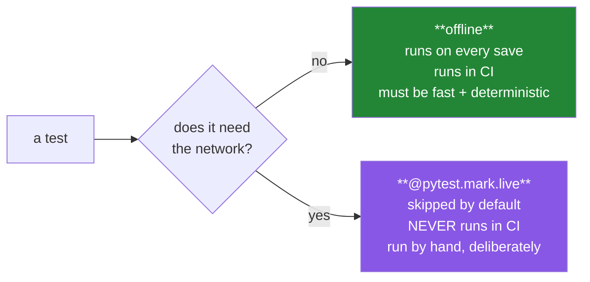

# Day 2 — Foundry II: the quality machine

**Phase 0 · Foundry** · Principles served: **1**, **5 (zero budget)**, **7 (evals before features)**

> **Yesterday:** the pins, with evidence you generated yourself.
> **Today:** ruff configured, a test strategy that will still work on Day 230, and CI that runs on
> every push without ever spending a free-tier quota.
> **Tomorrow:** three free API keys, two free databases, and the rate budget.

```bash
./m start 2 && ./m scaffold 2
```

**Time:** 75 minutes. **Request budget:** 0 model calls.

---

## §1 The story

There is a specific way this project fails, and it happens around Day 150.

By then you have roughly forty modules in `src/setu/`. A model call, a database call, and a vector
store are all involved in the same test file. You change one function. Eleven tests go red. Four of
them are red because you broke something. Seven are red because Gemini rate-limited you, Supabase
paused an idle project, and one test depends on the order the others ran in.

You cannot tell which four matter. So you stop running the tests. And a test suite you do not run is
a test suite you do not have.

The fix is not "write better tests later". It is a decision you make **today, before there is
anything to test**: every test in this repo is one of exactly two kinds.



Two consequences fall straight out of that split, and both are load-bearing for 238 more days:

1. **CI never spends money or quota** (Principle 5). On a $0 budget the currency is requests per day.
   A CI run that burns your Gemini quota at 9am means you cannot do Day 165's lab at 9pm.
2. **A red test always means you broke something.** That is the only condition under which people
   keep running tests.

The second half of today is **ruff** — one binary that replaces black, isort, flake8, and a dozen
plugins. Not because style matters aesthetically, but because a formatter ends every argument you
would otherwise have with yourself at 11pm, and a linter catches the mutable-default bug you will
meet properly on Day 4.

---

## §2 Setup — run this

```bash
mkdir -p days/day-02/lab
touch tests/conftest.py
touch tests/fixtures/__init__.py 2>/dev/null || mkdir -p tests/fixtures && touch tests/fixtures/__init__.py
touch src/setu/config.py
touch tests/test_config.py
mkdir -p .github/workflows
touch .github/workflows/check.yml
```

- `mkdir -p tests/fixtures` — the folder for small, committed, hand-made data. Fixtures are **not**
  downloaded datasets; those live in gitignored `data/raw/` (Principle 9).
- `conftest.py` — pytest discovers this automatically. Fixtures and hooks defined here are available
  to every test file without an import. It is the one file pytest treats as magic.

No new packages. `ruff` and `pytest` came in on Day 0.

---

## §3 Configure ruff

Ruff is already in `pyproject.toml` from Day 0. Add the lint rules:

```toml
[tool.ruff]
line-length = 100
target-version = "py312"
extend-exclude = ["notebooks", "days/*/lab"]

[tool.ruff.lint]
select = ["E", "F", "I", "UP", "B", "SIM"]
```

**Line by line:**

- `line-length = 100` — not 79 (a 1980s terminal), not 120 (unreadable in a side-by-side diff). 100
  fits a modern editor with a file tree open.
- `target-version = "py312"` — tells ruff which syntax is available, so the `UP` rules can rewrite
  `Optional[str]` to `str | None` rather than warning about a version you do not use.
- `extend-exclude` — `notebooks/` is a scratchpad (Principle 6) and lab folders contain
  deliberately-broken teaching examples. Linting those would fight the curriculum.
- `select = [...]` — the rule families, and each is chosen:
  - `E` pycodestyle errors — real spacing and syntax problems.
  - `F` pyflakes — undefined names, unused imports. **The highest-value family by far.**
  - `I` isort — import ordering, applied automatically. Ends a whole category of merge conflict.
  - `UP` pyupgrade — rewrites old idioms to modern ones. This is what keeps the codebase from
    accumulating 2019-era Python over 240 days.
  - `B` bugbear — **includes `B006`, the mutable-default-argument check.** You meet that bug properly
    on Day 4; today the linter starts guarding against it.
  - `SIM` simplify — flags `if x == True` and similar noise.

Try it:

```bash
uv run ruff check .
uv run ruff format .
uv run ruff check . --statistics
```

- `ruff check .` — lint. Reports problems, changes nothing.
- `ruff format .` — format, in place. Ruff's formatter is black-compatible.
- `--statistics` — a count per rule instead of a line per finding. Useful when a first run reports
  hundreds of issues and you want to know whether it is one problem repeated or fifty problems.

Prove `B006` works — put this in `days/day-02/lab/badcode.py`, run `ruff check days/`, and read the
error, then delete the file:

```python
def broken(item, bucket=[]):
    bucket.append(item)
    return bucket
```

(Lab folders are excluded from the default lint, which is why you pass `days/` explicitly.)

---

## §4 The test strategy

`tests/conftest.py`:

```python
"""Shared pytest configuration for Setu. Discovered automatically - never imported."""

from __future__ import annotations

import os
from pathlib import Path

import pytest

FIXTURES = Path(__file__).parent / "fixtures"


def pytest_collection_modifyitems(config, items):
    """Skip every `live` test unless SETU_LIVE=1 is set in the environment."""
    if os.environ.get("SETU_LIVE") == "1":
        return
    skip = pytest.mark.skip(reason="live test; set SETU_LIVE=1 to run")
    for item in items:
        if "live" in item.keywords:
            item.add_marker(skip)


@pytest.fixture
def fixtures_dir() -> Path:
    """Path to the committed, hand-made test data."""
    return FIXTURES


@pytest.fixture(autouse=True)
def _no_accidental_network(monkeypatch, request):
    """Fail loudly if an offline test tries to open a socket."""
    if "live" in request.keywords:
        return
    import socket

    def guard(*args, **kwargs):
        raise RuntimeError(
            "offline test attempted a network connection - mark it @pytest.mark.live"
        )

    monkeypatch.setattr(socket.socket, "connect", guard)
```

**Line by line:**

- `pytest_collection_modifyitems` — a pytest **hook**. Pytest calls it after collecting tests and
  before running them, with the full list. The name is fixed; pytest finds it by name.
- `os.environ.get("SETU_LIVE") == "1"` — an opt-in switch. Default off means the safe path is the
  lazy path, which is the only kind of safety that survives contact with a tired person.
- `pytest.mark.skip(reason=...)` — the reason is printed in the summary, so a skipped test explains
  itself instead of looking like a silent gap.
- `"live" in item.keywords` — `keywords` holds the marks applied to a test. This is how you act on
  `@pytest.mark.live`.
- `@pytest.fixture` — a function pytest calls for any test that names it as a parameter. You saw this
  pattern on Day 26; here you are writing them.
- `@pytest.fixture(autouse=True)` — applied to **every** test whether or not it asks. Use sparingly;
  this is one of the two justified cases in the whole project.
- `monkeypatch.setattr(socket.socket, "connect", guard)` — replaces the socket connect method for the
  duration of one test, then restores it. Any offline test that reaches for the network now fails
  with a message telling you exactly what to do. **This is the rule enforced rather than documented.**
- `import socket` **inside** the function — deliberate: it keeps the import cost off collection and
  makes the dependency local to the guard.

Register the marker — you already did, on Day 0, in `pyproject.toml`:

```toml
markers = [
    "live: hits a real API or database - skipped by default, never run in CI",
    "slow: takes more than a few seconds",
]
```

- `--strict-markers` (also from Day 0) makes a **typo'd marker an error**. Without it,
  `@pytest.mark.liev` silently marks nothing and your test runs against a live API in CI.

---

## §5 `config.py` — reading environment safely

You need this before Day 3 puts real keys in it.

```python
"""Environment configuration for Setu. Fails loudly, never silently."""

from __future__ import annotations

import os
from dataclasses import dataclass

from dotenv import load_dotenv


class MissingKey(RuntimeError):
    """Raised when a required environment variable is absent or blank."""


def _require(name: str) -> str:
    value = (os.environ.get(name) or "").strip()
    if not value:
        raise MissingKey(f"{name} is not set - copy .env.example to .env and fill it in")
    return value


@dataclass(frozen=True)
class Keys:
    gemini: str
    groq: str
    openrouter: str


def load_keys() -> Keys:
    """Read the three free-tier keys from .env, without overriding the real environment."""
    load_dotenv(override=False)
    return Keys(
        gemini=_require("GEMINI_API_KEY"),
        groq=_require("GROQ_API_KEY"),
        openrouter=_require("OPENROUTER_API_KEY"),
    )
```

**Line by line:**

- `class MissingKey(RuntimeError)` — a **named** exception. `except MissingKey` is precise;
  `except Exception` is not. You build custom exceptions properly on Day 18 (PY-22); this is the
  first one.
- `(os.environ.get(name) or "").strip()` — `.get` returns `None` for an absent variable, and `None`
  has no `.strip()`. The `or ""` handles that in one token. **The `.strip()` is not cosmetic:** a
  pasted key with a trailing newline produces a 401 that looks exactly like a wrong key, and you will
  lose an hour to it on Day 3 without this line.
- `if not value:` — catches both absent and blank-after-strip. A variable set to an empty string is
  not "set".
- `@dataclass(frozen=True)` — generates `__init__`, `__repr__` and `__eq__`, and **frozen** makes
  instances immutable. Keys should not be reassignable after loading. Day 4's mutability lesson,
  applied before you have formally met it.
- `load_dotenv(override=False)` — read `.env` into the environment, but **do not overwrite anything
  already set**. That ordering is right: a real environment variable (in CI, in Docker) must beat a
  local file, or your container will run with your laptop's settings.

---

## §6 The eval that must be able to fail

`tests/test_config.py`:

```python
import pytest

from setu.config import MissingKey, _require


def test_missing_key_fails_loudly(monkeypatch):
    monkeypatch.delenv("SETU_TEST_KEY", raising=False)
    with pytest.raises(MissingKey):
        _require("SETU_TEST_KEY")


def test_blank_key_is_treated_as_missing(monkeypatch):
    monkeypatch.setenv("SETU_TEST_KEY", "   ")
    with pytest.raises(MissingKey):
        _require("SETU_TEST_KEY")


def test_whitespace_is_stripped(monkeypatch):
    monkeypatch.setenv("SETU_TEST_KEY", "  abc123\n")
    assert _require("SETU_TEST_KEY") == "abc123"


def test_error_message_names_the_variable(monkeypatch):
    monkeypatch.delenv("SETU_TEST_KEY", raising=False)
    with pytest.raises(MissingKey, match="SETU_TEST_KEY"):
        _require("SETU_TEST_KEY")


@pytest.mark.live
def test_this_one_is_skipped_by_default():
    raise AssertionError("if you see this fail, the live-skip hook is broken")
```

**Line by line:**

- `monkeypatch.delenv(..., raising=False)` — remove the variable if present; do not error if it is
  already absent. Tests must not depend on the machine's starting state.
- `pytest.raises(MissingKey)` — asserts the exception is raised. If the code returns normally, the
  test fails. **This is a test of the failure path**, which is the path nobody writes tests for and
  everybody relies on.
- `match="SETU_TEST_KEY"` — a regex against the exception message. It asserts the error is *useful*,
  not merely that it happened. An error message that does not name the variable costs a debugging round.
- `test_whitespace_is_stripped` — delete `.strip()` from `_require` and watch this go red. **Do that
  now**; it is the day's proof that the tests bite.
- The final `@pytest.mark.live` test **asserts unconditionally**. It must never fail, because it must
  never run. If it ever appears as a failure, the §4 skip hook is broken — which is exactly the
  tripwire you want.

```bash
uv run python -m pytest -q
uv run python -m pytest -q -m live --collect-only
```

- The first: four pass, one skipped.
- `-m live --collect-only` — list which tests carry the marker without running them. Use this
  whenever you are unsure what CI is about to skip.

---

## §7 CI that never spends a quota

`.github/workflows/check.yml`:

```yaml
name: check

on:
  push:
  pull_request:

jobs:
  check:
    runs-on: ubuntu-latest
    timeout-minutes: 10
    steps:
      - uses: actions/checkout@v4

      - name: Install uv
        uses: astral-sh/setup-uv@v5
        with:
          enable-cache: true

      - name: Install Python and dependencies
        run: uv sync --locked --all-groups

      - name: Lint
        run: uv run ruff check .

      - name: Format check
        run: uv run ruff format --check .

      - name: Offline tests
        run: uv run python -m pytest -q -m "not live"
```

**Line by line:**

- `on: push` / `pull_request` — run on both, so a broken push is caught even without a PR.
- `timeout-minutes: 10` — a hung job otherwise burns free Actions minutes until GitHub's six-hour
  default. Principle 5 applies to CI minutes too.
- `uv sync --locked` — install **exactly** what `uv.lock` says. `--locked` makes the job **fail** if
  the lockfile is out of date rather than quietly resolving something new. That failure is the point:
  it means CI is testing what you tested.
- `--all-groups` — include the dev group, since ruff and pytest live there.
- `ruff format --check` — check only; never writes. CI must not push commits.
- `-m "not live"` — **the line that keeps CI free.** No key is present in CI, and no test asks for one.
- No `env:` block, no secrets. This workflow has nothing to leak.

---

## §8 Request budget

| Resource | Spent today |
|---|---|
| LLM calls | **0** |
| CI minutes | ~2 per push |
| Cost | $0 |

---

## §9 Traps

- **Skipping `--strict-markers`.** A typo'd marker silently marks nothing, and a "live" test runs in CI.
- **Letting one live test into the default run** "just this once". It will be red on the morning your
  provider has a bad day, and you will start ignoring red.
- **`load_dotenv(override=True)`.** Your laptop's `.env` would then beat the real environment inside
  a container. Always `override=False`.
- **Omitting `.strip()` on a key.** A trailing newline gives a 401 that looks like a wrong key.
- **Formatting in CI.** `ruff format` without `--check` would rewrite files on a runner and change
  nothing you can see.
- **Committing datasets to `tests/fixtures/`.** Fixtures are small and hand-made. Downloads go to
  gitignored `data/raw/` with a `SOURCE.md`.
- **`autouse=True` everywhere** because it is convenient. Two justified uses exist in this repo;
  a third would make test behaviour invisible.

---

## §10 Verify before you code

Written **2026-08-21**:

- <https://docs.astral.sh/ruff/rules/> — confirm the `E F I UP B SIM` families and that `B006` is
  still the mutable-default rule.
- <https://docs.pytest.org/en/stable/reference/reference.html#pytest.hookspec.pytest_collection_modifyitems> —
  the hook signature.
- <https://github.com/astral-sh/setup-uv> — the current action version and inputs.

---

## §11 Say it in an interview

> "Every test in that repo is either offline or explicitly marked live, and the live ones are skipped
> unless you opt in with an environment variable. There's an autouse fixture that patches
> `socket.connect` so an offline test that reaches for the network fails with a message telling you to
> mark it. CI runs only the offline set — which means CI never touches an API quota, and a red build
> always means I broke something rather than that a provider had a bad morning. That distinction is
> what keeps people actually running the suite."

---

## §12 Done when

Tick [`CHECKLIST.md`](CHECKLIST.md), then `./m check && ./m done 2`.
