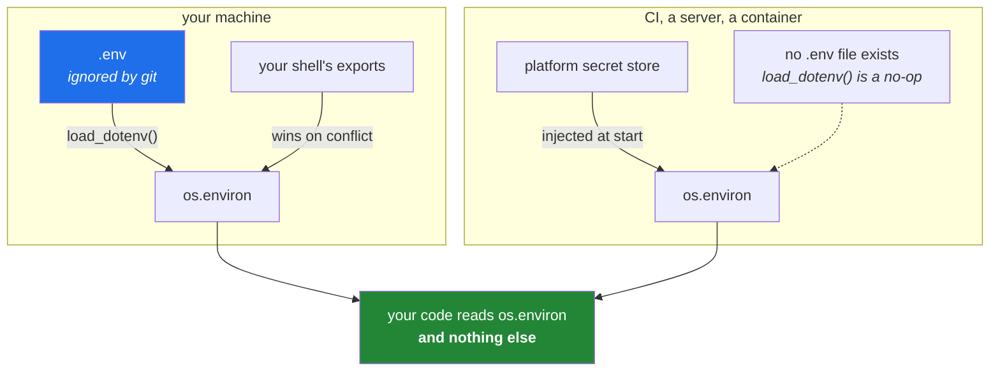

# 1.2 — `.env`, `python-dotenv`, and `os.environ`

## One-line answer

The **environment** is a dictionary of strings every process inherits from whatever started it,
`python-dotenv` is a small library that reads a `.env` file into that dictionary at start-up, and the
only rule that matters is that your code reads `os.environ` and never knows a file was involved.

---

## The story

A team has a service that reads its database password from a `.env` file. The code opens the file,
parses it, and takes the value. It works locally, so it ships.

In production there is no `.env` file — the platform injects secrets as real environment variables,
which is the normal way. The service starts, cannot find the file, and raises `FileNotFoundError`.

Somebody fixes it by shipping a `.env` file into the container image. Now the secret is baked into an
image that gets pushed to a registry, and rotating the password means rebuilding and redeploying the
image. Two weeks later a second environment appears, needing a different password, and the fix is a
second image.

The mistake was one line, made months earlier: the code read *the file* instead of reading *the
environment*. Those look like the same thing when there is only one machine. They are not the same
thing at all, and the difference is the whole reason the environment exists.

The correct shape is two layers. `.env` is a **local convenience** for putting values into the
environment on a developer's machine. The application reads the environment. Nothing in the
application knows `.env` exists — so in production, where a platform sets real variables, the same
code works without a single change.

---

## The idea in plain language

### What the environment actually is

Every process on your machine runs with a set of key–value pairs called its **environment**. It is
created by whatever launched the process, and children inherit a copy from their parent. Your shell
has one; a Python program you start from it gets a copy; a subprocess that program starts gets a copy
of that.

Three properties follow, and each explains a behaviour that otherwise surprises people:

- **Everything is a string.** There are no integers, no booleans, no `None`. `"1"`, `"true"` and
  `"false"` are all just text, and `bool(os.environ["DEBUG"])` is `True` for the string `"false"`,
  which has cost more debugging hours than it should have.
- **A child gets a copy, not a reference.** A program cannot change its parent's environment. This is
  why a script cannot set a variable in the shell that started it — a fact people rediscover
  regularly.
- **It is not secret from the machine.** Anyone who can read your processes can read their
  environment. The environment protects a value from *version control*, not from someone on the box.

In Python the environment is `os.environ`, which behaves like a dictionary of strings.

### `python-dotenv`, and what it is for

A `.env` file is plain text, one `NAME=value` per line. On its own it is inert — nothing reads it
automatically.

`python-dotenv` is a small library with one job: read that file and put its contents into
`os.environ`. That is the whole library. `load_dotenv()` at the start of a program, and from then on
every variable in the file is in the environment, indistinguishable from one the shell set.

The crucial default: **`load_dotenv()` does not overwrite a variable that is already set.** If your
shell exported `GEMINI_API_KEY` and `.env` also has one, the shell wins. That is the right precedence
— the more specific, more deliberate source wins over the file — and it is what makes it safe to have
a `.env` on a machine that also gets real variables injected.

`python-dotenv==1.2.3` is already this project's only runtime dependency, pinned on
[Day 0](../../../day-00-setup/parts/02-skeleton/2.4-uv-init-pyproject-and-the-lockfile.md). It has
been sitting in `pyproject.toml` waiting for today.

### The two-layer rule



Read the diagram as one sentence: **the file is one of several ways a value can reach the
environment, and your code must not care which one it was.** `load_dotenv()` finding no file is not
an error; it does nothing and the program continues, which is exactly the behaviour that makes the
same code run in both columns.

### Reading a variable, three ways, with three different meanings

```text
os.environ["GEMINI_API_KEY"]              # raises KeyError if missing
os.environ.get("GEMINI_API_KEY")          # returns None if missing
os.environ.get("SETU_TIMEOUT", "10")      # returns "10" if missing
```

These are not interchangeable, and choosing between them is a design decision:

- Use the **bracket form** when the program genuinely cannot run without the value. Failing at
  start-up with `KeyError: 'GEMINI_API_KEY'` is far better than failing later, deep in a call, with
  an authentication error that looks like a provider problem.
- Use **`.get()` with no default** when absence is a legitimate state you are going to branch on —
  "if there is no key for this provider, skip it", which is exactly what today's gate script does.
- Use **`.get()` with a default** for genuine configuration, never for a secret. A secret with a
  default is how a placeholder becomes a committed credential.

The rule of thumb: **fail loudly at start-up for anything required, and never give a secret a
default.**

---

## Why Setu needs it

- **Every provider call in this plan reads its key from the environment**, starting with
  [2.1](../02-llm-doors/2.1-gemini-the-workhorse.md) later today and continuing to the shared router
  on Day 172. One mechanism, established once.
- **[Day 2's](../../../day-02-quality-gate/LESSON.md) CI holds no keys**
  ([5.3](../../../day-02-quality-gate/parts/05-ci/5.3-caching-and-never-spending-a-quota.md)), which
  only works because the code reads the environment: on a runner the variables are simply absent, and
  a `live` test is deselected before it can notice.
- **`monkeypatch.setenv` is how key-handling code gets tested**
  ([Day 2, 3.2](../../../day-02-quality-gate/parts/03-pytest/3.2-fixtures-and-tmp-path.md)) — without a
  real key, and without leaking a fake one into the rest of the suite.
- **Principle 4 says nothing floats.** A `model=` typed out on every call is pinned in code; the key
  that authorises the call is pinned to an *environment variable name*, and `.env.example` is where
  that name is recorded.
- **Day 42's Supabase connection string** and Day 51's Mongo URI arrive by the same route
  ([3.1](../03-databases/3.1-supabase-a-postgres-that-pauses.md)), so the pattern is worth getting
  exactly right on a day when nothing is at stake yet.

---

## The mechanism

Start with the environment itself, before any library is involved:

```bash
echo "=== a variable set for one command only ==="
SETU_DEMO=hello uv run python -c "import os; print('inside:', os.environ.get('SETU_DEMO'))"
echo "outside:" "${SETU_DEMO:-<not set>}"

echo "=== a child cannot change its parent ==="
uv run python -c "import os; os.environ['SETU_DEMO'] = 'changed'"
echo "still outside:" "${SETU_DEMO:-<not set>}"

echo "=== everything is a string ==="
SETU_DEBUG=false uv run python -c "
import os
raw = os.environ['SETU_DEBUG']
print('value :', repr(raw))
print('type  :', type(raw).__name__)
print('bool()of it:', bool(raw))
"
```

**Line by line:**

- `SETU_DEMO=hello uv run python -c ...` — the `VAR=value command` form sets a variable **for that one
  command's process only**. It is the cleanest way to demonstrate the environment without changing
  your shell, and it is genuinely useful whenever you want to run something once with a different
  setting.
- `"${SETU_DEMO:-<not set>}"` — parameter expansion with a default. Prints the value if set, otherwise
  the literal text. This prints `<not set>`, proving the variable never existed outside that one
  command.
- The second block assigns inside Python and then checks the shell again: still unset. **A process
  cannot write to its parent's environment.** This is not a Python limitation; it is how processes
  work, and it is why every "set an environment variable from a script" question has the same
  disappointing answer.
- `bool(raw)` on the string `"false"` prints **`True`**, because a non-empty string is truthy. This is
  the single most common environment-variable bug in existence, and meeting it deliberately here is
  cheaper than meeting it in production. The fix is always an explicit comparison —
  `raw.lower() in {"1", "true", "yes"}` — never `bool()`.

Now the file layer:

```bash
printf '%s\n' \
  '# local only - never committed (part 1.1)' \
  'SETU_DEMO_KEY=local-file-value' \
  'SETU_DEMO_OTHER=from-the-file' \
  > .env.demo

uv run python -c "
import os
from dotenv import load_dotenv

print('before load:', os.environ.get('SETU_DEMO_KEY'))
loaded = load_dotenv('.env.demo')
print('load_dotenv returned:', loaded)
print('after load :', os.environ.get('SETU_DEMO_KEY'))

missing = load_dotenv('.env.does-not-exist')
print('missing file returned:', missing, '- and did NOT raise')
"

echo "=== and the precedence rule ==="
SETU_DEMO_KEY=shell-wins uv run python -c "
import os
from dotenv import load_dotenv
load_dotenv('.env.demo')
print('winner:', os.environ['SETU_DEMO_KEY'])
"
rm -f .env.demo
```

**Line by line:**

- `.env.demo` rather than `.env` — a throwaway name so this demonstration cannot collide with the real
  file you are about to create. It is still covered by the `.env.*` ignore rule from
  [1.1](1.1-what-a-secret-is.md), which is worth confirming with `git check-ignore -v .env.demo`.
- `from dotenv import load_dotenv` — note the **import name is `dotenv`** while the package is
  `python-dotenv`. Package name and import name differing is common and is a recurring source of
  "but I installed it" confusion.
- `load_dotenv('.env.demo')` returns a boolean: `True` if it found and read a file, `False` otherwise.
  Called with no argument it searches upward from the current directory for a file named `.env`, which
  is convenient and slightly magical — passing the path explicitly is the version you can reason
  about.
- `load_dotenv('.env.does-not-exist')` returns `False` and **does not raise**. That no-op behaviour is
  the property that lets the same code run in production, where no such file exists.
- The last block sets `SETU_DEMO_KEY` in the shell *and* has it in the file. The printed winner is
  `shell-wins`: **`load_dotenv` does not overwrite what is already set.** Pass `override=True` to
  reverse that, and think carefully before you do — it means a stale file beats a deliberately
  exported variable.

Finally, the shape every module in this project will use:

```python
"""How Setu reads configuration. Nothing below knows a file exists."""

from __future__ import annotations

import os

from dotenv import load_dotenv

# Called once, at import, as close to the entry point as possible. In production there is no
# .env file and this is a no-op - which is exactly why the rest of the module reads os.environ.
load_dotenv()

REQUIRED = ("GEMINI_API_KEY", "GROQ_API_KEY", "OPENROUTER_API_KEY")


def require(name: str) -> str:
    """Return an environment variable, failing loudly and immediately when it is absent."""
    try:
        return os.environ[name]
    except KeyError:
        raise RuntimeError(
            f"{name} is not set. Copy .env.example to .env and fill it in - see "
            f"days/day-03-keys-and-budget/parts/01-secrets/1.2-dotenv-and-os-environ.md"
        ) from None


def optional(name: str) -> str | None:
    """Return an environment variable, or None when absence is a state to branch on."""
    value = os.environ.get(name)
    return value or None


def which_keys_are_present() -> dict[str, bool]:
    """Report presence by NAME only. Never returns or logs a value (part 1.1)."""
    return {name: bool(os.environ.get(name)) for name in REQUIRED}
```

**Line by line:**

- `load_dotenv()` at module level, with no path — the convenient form, called **once**, as near the
  entry point as possible. Calling it inside every function would re-read the file on every call and
  make the timing of configuration unpredictable.
- `try: return os.environ[name] / except KeyError:` — catch the specific error and re-raise something
  that tells the reader what to *do*. A bare `KeyError: 'GEMINI_API_KEY'` says what is missing; this
  message says how to fix it, which is the difference between a five-minute stall and a five-second
  one.
- `from None` — suppress the chained "During handling of the above exception, another exception
  occurred" traceback. The original `KeyError` adds nothing here; hiding it keeps the useful message at
  the bottom of the output where people look. Exceptions are Day 18's subject (`PY-22`); this is a
  preview of one idiom.
- `return value or None` in `optional` — collapses both the missing case and the empty-string case to
  `None`. An empty variable is a real and common state — a `.env` line with nothing after the `=` — and
  treating `""` as "present" produces an authentication failure instead of a clear absence.
- `which_keys_are_present` returns **booleans keyed by name**, never values. Every diagnostic in this
  project reports presence this way, so that a screenshot of a terminal is never a leak.
- `REQUIRED` as a module-level tuple, not a list — it is a constant and immutability makes that
  visible. The distinction between the two is [Day 4, 2.1](../../../day-04-objects/parts/02-containers/2.1-the-four-containers.md)'s
  subject.

---

## When it breaks

**The variable is not there:**

```text
KeyError: 'GEMINI_API_KEY'
```

**What it means.** Either `.env` does not exist, `load_dotenv()` was never called, or it was called
after the value was read. That last one is subtle: module-level code runs at import time, so a module
that reads `os.environ` at import will run *before* a `load_dotenv()` in your `main()`. The reliable
ordering is to load in one small configuration module and have everything else import from it.

**The file exists and the value is still missing:**

```text
>>> load_dotenv()
False
```

**What it means.** It searched upward from the current working directory and found nothing named
`.env`. Running from a subdirectory is the usual cause. Passing an explicit path built from
`Path(__file__).resolve().parents[N]` removes the ambiguity entirely, which is what
`tests/test_setup.py` already does for `ROOT`.

**The value is not what the file says:**

```text
$ grep GEMINI .env
GEMINI_API_KEY=AIza-the-new-one
$ uv run python -c "import os; from dotenv import load_dotenv; load_dotenv(); print(os.environ['GEMINI_API_KEY'][:8])"
AIza-the
```

...printing the *old* key's prefix. **What it means.** The variable was already exported in your shell
— probably by a profile file you edited weeks ago — and `load_dotenv` does not override. `env | grep
GEMINI` will confirm it. This is correct behaviour and a genuinely confusing hour if you do not know
the precedence rule.

**A quoting surprise:**

```text
SETU_TOKEN="abc123"
```

...read back as `abc123` in some tools and `"abc123"` in others. **What it means.** `.env` is not a
standardised format; it is a convention, and implementations differ on quoting, on whether `export`
prefixes are allowed, and on multi-line values. The habit that avoids all of it: **no quotes unless
the value contains a space, and no spaces around the `=`.** When a value must contain a newline or a
quote, base64-encode it rather than fighting the parser.

**And the one that only happens in production:**

```text
FileNotFoundError: [Errno 2] No such file or directory: '.env'
```

**What it means.** Somebody wrote code that opens `.env` directly instead of calling `load_dotenv`.
That is the story at the top of this part, and the fix is not to ship a `.env` — it is to read
`os.environ` and let the platform put things there.

---

## In production

**`.env` is a development convenience and it does not go to production.** Real deployments inject
environment variables from a secret manager at start-up. The application does not change, which is
precisely the payoff of the two-layer rule; only the source of the values does. A `.env` file inside a
container image is a genuine anti-pattern — it bakes a credential into an artifact that gets pushed to
a registry and copied around, and it makes rotation a rebuild.

**Validate configuration at start-up, all at once, and refuse to start if it is wrong.** The mature
pattern is a single settings object built and checked as the process boots: every required variable
present, every numeric one parsed, every URL well-formed. The payoff is that a misconfiguration fails
in the first second with a message naming every problem, rather than in the first *request* with a
message naming one. From Day 19 this project uses a validating model for exactly that
(`PY-23`), and the shape you write today is the hand-rolled version of it.

**The environment is visible to anyone on the machine, and that has consequences.** A process listing
can expose variables passed on a command line; a crash reporter can capture the whole environment; a
debug endpoint that dumps configuration is a credential disclosure with a friendly interface. The
defences are to redact by name at the logging layer, never to pass a secret as a command-line
argument, and to keep the blast radius of any single credential small (Principle 11).

**What changes at scale:** with many services and many environments, the number of variables becomes
its own problem, and drift between environments becomes the most common cause of "works in staging".
Teams respond with a single declared schema for configuration — one place listing every variable, its
type, whether it is required, and whether it is secret — checked at start-up in every environment.
`.env.example` is the seed of that idea, which is why keeping it complete is worth a test rather than
a habit.

**The review comment a senior engineer leaves.** On code with `os.environ.get("API_KEY", "sk-test-...")`:
*"Never default a secret. That default will be committed, it will look like a real key to a scanner,
and one day it will be a real key. If it's required, fail at start-up."*

**The interview question.** *"How do you manage configuration and secrets across local, CI and
production?"* The answer that lands names the layering: code reads the environment and nothing else,
so the *source* of values can differ per environment without a code change — a git-ignored `.env`
locally, injected secrets in CI and production, with the more specific source winning. Then add the
two details that show experience: validate everything at start-up so misconfiguration fails fast and
completely, and never give a secret a default, because a default is how a placeholder becomes a
committed credential. If you also mention that everything in the environment is a string, so `"false"`
is truthy, you are describing a bug you have personally shipped.

---

## Check yourself

```bash
uv run python -c "
import os
from dotenv import load_dotenv
print('loaded a .env file:', load_dotenv())
for name in ('GEMINI_API_KEY', 'GROQ_API_KEY', 'OPENROUTER_API_KEY'):
    print(f'{name:22} present: {bool(os.environ.get(name))}')
"
```

Run it now — every line should say `False`, because no key exists yet. Run it again at the end of
today and every line should say `True`. Note that it prints presence and never a value: that is the
habit, not the exercise.

**Answer out loud, without scrolling up:**

> Explain why your code should read `os.environ` rather than opening `.env`, using what happens in
> production as the reason. Then state what `load_dotenv()` does when the file is missing and why that
> behaviour is required, and say which of the three ways to read a variable you would use for an API
> key and why.

---

**Next:** [1.3 — When a key leaks: rotation, history, and blast radius](1.3-when-a-key-leaks.md)
