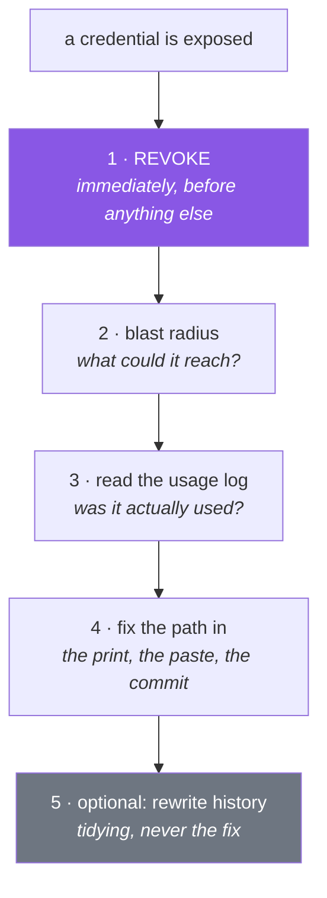

# 1.3 — When a key leaks — rotation, history, and blast radius

## One-line answer

A leak is a question of **time and reach**, not of embarrassment: the fix is always *revoke first,
investigate second*, and the amount of damage a leak can do was decided long before it happened — by
how much that one credential was permitted to do.

---

## The story

An engineer working alone on a side project has one API key. It is in a `.env` file. It works.

To debug something at eleven at night, they add a print statement — just the first eight characters,
to check the right key is loading. The output goes to a terminal. They paste that terminal output into
a public forum, asking why the request is failing.

The eight characters are a prefix, so nothing is exposed. Except the paste also included the line
below it, which was the full request being sent, with the `Authorization` header in it.

Somebody points it out four hours later. By then the key has been used, from three countries, and the
daily allowance is gone.

The engineer does the right thing: revokes the key, issues a new one, and moves on. Total damage: one
evening, and a free-tier counter that resets at midnight. **The reason it was one evening and not one
disaster is entirely because of what that key could do.** It could call a language model on a free
tier. It could not read a database, could not send email, could not spend money, and was not the same
key used for anything else.

Now imagine the identical mistake with a credential that has broader permissions — one that can read
production data, or one that is reused across three services because it was easier. The mistake is the
same size. The consequence is not.

**You do not get to control whether you will ever leak a credential. You get to control what a leaked
credential can do.** That decision is made on the day you create the key, not on the day you lose it.

---

## The idea in plain language

### The three questions, in order

When a credential is exposed, three questions matter and the order is not negotiable:

1. **Is it still valid?** If yes, revoke it. Now, before anything else — before you finish reading the
   logs, before you tell anybody, before you work out how it happened. Every second it stays valid is
   a second somebody else might be using it.
2. **What could it reach?** The **blast radius**: everything that credential is permitted to do. This
   determines what else you have to check.
3. **Was it used?** The provider's usage or audit log answers this. Note that it is question *three* —
   you do not wait for this answer before revoking, because revoking is cheap and waiting is not.

The instinct to invert 1 and 3 — "let me check whether anything bad happened before I break my own
setup" — is natural and wrong. Revocation costs you a few minutes of reissuing. Waiting costs you
whatever the other person does in that window.

### Blast radius is designed, not discovered

Principle 11 in this plan says *before any tool gets write access, name what it can destroy and shrink
that*. It is written about agent tools; it applies identically to credentials, and today is the day
you first act on it.

Concretely, for the five credentials you are about to create:

| Credential | What it can do | What shrinks the radius |
|---|---|---|
| Provider API keys | Spend a free-tier allowance, attributed to you | Free tier only, no billing attached (Principle 5) |
| Supabase connection string | Full read/write on your project's database | A separate project used only for this curriculum |
| MongoDB Atlas URI | Full read/write on the M0 cluster | A dedicated database user, not the admin account |

Notice that every mitigation is a decision made **at creation time**. There is no way to shrink a
credential's reach after it leaks; there is only revocation.

### One key, one purpose

The single highest-value habit here: **a credential should be used by one thing, so that revoking it
breaks one thing.**

A key shared by your laptop, a scheduled job and a demo has to be revoked in all three places at once,
which means revocation is an outage, which means people hesitate to revoke, which means leaked
credentials stay live. A key per purpose makes revocation boring, and boring revocation is the whole
goal.

The same reasoning drives per-environment credentials: your development key and any deployed key must
be different, so that losing one does not touch the other.

### Why rewriting history is not the answer

You met this in [1.1](1.1-what-a-secret-is.md); here is the precise reason it is not the mitigation.

History rewriting produces a *new* history, with different commit hashes. It does not reach:

- clones anybody already made,
- forks,
- the hosting platform's cached views of the old commits,
- archives and mirrors,
- the credential scanner that already read it.

So rewriting is at best a tidying operation performed after the real fix. Doing it *instead* of
revoking is the mistake, and it is a common one because it feels like doing something technical about
a technical problem.



---

## Why Setu needs it

- **Five credentials arrive today.** The decisions that determine their blast radius — free tier only,
  a dedicated database user, one purpose each — are made in the next hour and cannot be made later.
- **Principle 5 is a security control, not only a budget one.** No card on file means the worst case
  for a leaked provider key is a spent daily allowance, which is why this plan can be built by someone
  learning without a disaster being possible.
- **Principle 11 and 12 arrive properly on Day 182**, where an agent gets tools. Every idea here —
  name what it can reach, shrink it at creation, make revocation cheap — is the same idea applied to a
  narrower object.
- **Day 209 builds an MCP server** with database access, and the question "what can this credential
  destroy" is the design question of that entire phase.
- **Today's gate script prints key presence, never values**
  ([5.1](../05-the-gate/5.1-the-phase-0-gate.md)). That is this part's habit, wired into the one script
  you will run most often.

---

## The mechanism

There is no way to practise a real revocation without revoking something real — so today you do it
deliberately, on a key that has never been used, while nothing is at stake:

```bash
echo "the drill, in order - run it once TODAY with a throwaway key:"
echo "  1. create a second key at the provider's console, alongside your real one"
echo "  2. put it in .env, confirm it works with the check in part 2.1"
echo "  3. revoke it in the console"
echo "  4. run the same check again and read the exact error text"
echo "  5. remove it from .env"
```

**Line by line:**

- This block is instructions rather than a runnable pipeline because **step 1 and step 3 happen in a
  browser** — no command can create or revoke a key for you, and pretending otherwise would teach a
  procedure you cannot follow.
- Step 2 before step 3 is what makes it a drill rather than a theory: you have to see it work before
  seeing it stop working, or you have learned nothing about the difference.
- Step 4 is the actual payoff. **The error text a revoked key produces is what you will see at eleven
  at night, months from now**, and recognising it in one second instead of twenty minutes is the
  entire value of this exercise. Write it into your day's notes.
- The whole drill costs a few minutes and one throwaway key. A revocation path you have never
  exercised is not a path.

Now build the habit that keeps a value off your screen in the first place:

```python
"""Report which credentials are present. Never returns, prints or logs a value."""

from __future__ import annotations

import os

from dotenv import load_dotenv

load_dotenv()

CREDENTIALS = (
    "GEMINI_API_KEY",
    "GROQ_API_KEY",
    "OPENROUTER_API_KEY",
    "SUPABASE_DB_URL",
    "MONGODB_URI",
)


def fingerprint(value: str) -> str:
    """A stable, non-reversible label for a secret, safe to paste anywhere."""
    import hashlib

    return hashlib.sha256(value.encode("utf-8")).hexdigest()[:8]


def report() -> None:
    for name in CREDENTIALS:
        value = os.environ.get(name)
        if not value:
            print(f"{name:22} absent")
        else:
            print(f"{name:22} present  len={len(value):<4} fp={fingerprint(value)}")


if __name__ == "__main__":
    report()
```

**Line by line:**

- `fingerprint` returns a **hash prefix**, not a value prefix. This is the important distinction: the
  first eight characters of a key are part of the key, and some providers' key formats mean a prefix
  identifies the account. A hash reveals nothing about the input and still changes completely when the
  input changes.
- `hashlib.sha256(value.encode("utf-8"))` — hashing needs bytes, so the string is encoded explicitly.
  Never rely on a platform default encoding, for the same reason as
  [Day 2, 3.2](../../../day-02-quality-gate/parts/03-pytest/3.2-fixtures-and-tmp-path.md)'s
  `encoding="utf-8"` on every file read.
- `[:8]` — enough to distinguish two keys at a glance, far too little to attack. The purpose is
  answering *"is the key in my `.env` the same one that's in the deployment?"* without either value
  appearing.
- `len={len(value)}` — the length alone catches the most common configuration mistake, which is a
  truncated paste. A key that is thirty characters shorter than it should be is visible instantly and
  reveals nothing.
- `import hashlib` inside the function — a deliberate local import, keeping the module's top level to
  what every caller needs. For the standard library this is a style choice rather than a performance
  one; for a heavy provider SDK it is not
  ([Day 2, 3.3](../../../day-02-quality-gate/parts/03-pytest/3.3-markers-and-exit-code-five.md)).
- `f"{name:22}"` — pad to a fixed width so the columns line up. A diagnostic you can read at a glance
  is a diagnostic you will actually run.
- **Nothing in this file can print a secret.** That is a property of the code, not of the caller's
  discipline, and designing diagnostics that way is the point.

And the pre-paste check, for the moment before you share a terminal:

```bash
echo "=== does my clipboard-bound text contain anything key-shaped? ==="
uv run python -c "
import re, sys
PATTERNS = {
    'generic long token': r'\b[A-Za-z0-9_\-]{32,}\b',
    'bearer header': r'(?i)authorization\s*:\s*bearer\s+\S+',
    'url with password': r'[a-z+]+://[^/\s:]+:[^/\s@]+@',
}
text = sys.stdin.read()
for label, pattern in PATTERNS.items():
    hits = re.findall(pattern, text)
    print(f'{label:20} {len(hits)} match(es)')
" < /dev/stdin
```

**Line by line:**

- `< /dev/stdin` — read whatever you pipe or paste in. Run it, paste the text you were about to share,
  press the end-of-input key, and read the counts.
- `r'\b[A-Za-z0-9_\-]{32,}\b'` — any word-boundary-delimited run of 32 or more key-ish characters.
  Deliberately crude: it will match a commit hash and a base64 blob too. **A check that over-reports is
  the right shape here**, because the cost of a false positive is a glance and the cost of a false
  negative is the story.
- `(?i)authorization\s*:\s*bearer\s+\S+` — the inline `(?i)` flag makes the whole pattern
  case-insensitive. This is the one that catches the story's actual leak: not the key the engineer
  meant to show, but the header on the line below.
- `[a-z+]+://[^/\s:]+:[^/\s@]+@` — a URL with credentials in it, which is exactly the shape of a
  database connection string ([3.1](../03-databases/3.1-supabase-a-postgres-that-pauses.md)). The
  `[a-z+]+` allows schemes like `postgresql+psycopg`.
- It prints **counts, not matches** — a leak detector that echoes the leak is not a leak detector.

---

## When it breaks

**A revoked key, so you recognise it instantly:**

```text
google.genai.errors.ClientError: 400 INVALID_ARGUMENT.
  {'error': {'code': 400, 'message': 'API key not valid. Please pass a valid API key.',
   'status': 'INVALID_ARGUMENT'}}
```

**What it means.** The key is wrong, absent, or revoked — the provider will not tell you which,
deliberately, because distinguishing them would help an attacker. Check presence and fingerprint
first ([1.2](1.2-dotenv-and-os-environ.md)); if the key is present and correctly shaped, it has been
revoked or disabled and you need a new one.

**The provider revoked it for you:**

```text
Subject: Action required — an API key associated with your account was disabled

We found a credential matching this account in a public source and disabled it.
```

**What it means.** A scanner found it before you did, and the key is already dead. That is the good
version of this event: the exposure window closed automatically. Reissue, then find the path in —
because the same path will be used again if you do not.

**Usage you did not cause:**

```text
Requests today: 1,842 / 1,500   (limit reached at 03:14)
```

...on a day you made about twenty. **What it means.** Somebody else is using the key. Revoke it
immediately, and note that on a free tier this is the *entire* damage — the counter resets. This is
Principle 5 acting as a security control, and it is worth appreciating: the worst case for this
project's provider keys is a lost day, by construction.

**And the one that is not an error at all:**

```text
$ git log --oneline -1
a91f3c2 fix: remove key from config
```

**What it means.** Somebody "fixed" a leak by deleting the line. The key is still in the previous
commit and still valid. When you see a commit message like this — in your own history or in a
repository you inherit — the first question is *was the credential revoked?*, and the answer is very
often no.

---

## In production

**Rotation is a routine, scheduled operation, not an emergency one.** The teams that survive a leak
well are the ones that rotate credentials on a schedule anyway, because the procedure is written down,
automated, and exercised. The teams that suffer are the ones for whom rotation is a novel event
performed under pressure. The honest test: **can you replace any single credential right now, without
downtime, without asking anyone?** If not, you have a leak-response problem regardless of how careful
you are.

**Short-lived credentials remove the whole problem class, and are the direction everything is
moving.** Rather than a long-lived key that must be protected forever, a workload proves its identity
to an issuer and receives a token valid for minutes. A leaked token is worthless almost immediately.
You will meet this pattern as OpenID Connect between a build system and a cloud provider, and as
service identity inside a cluster. The mental shift is from *protecting a secret* to *making secrets
expire*, and it is the single biggest improvement available in this area.

**Detection matters as much as prevention, and it is the half people skip.** Automated scanning on
every commit, provider-side scanning, and an alert on anomalous usage — a spike, an unfamiliar
region, an unusual hour. The story's engineer found out from a stranger four hours later; with an
alert on unusual usage it would have been minutes. Ask of any credential you hold: *how would I find
out?*

**What changes at scale:** the number of credentials grows past what anyone can track, and the failure
mode becomes the **orphaned key** — one created for a migration two years ago, still valid, owned by
somebody who left. The countermeasures are inventory (every credential has an owner and a purpose),
expiry by default, and periodic review of unused keys. The metric worth watching is not how many
credentials you have but how many nobody can explain.

**The review comment a senior engineer leaves.** On a pull request adding a credential to a config
system: *"What's the blast radius of this one, and can we scope it down? Also, who owns rotating it,
and have we ever done that?"*

**The interview question.** *"A key of yours has been public for three days. What do you do?"* Lead
with revocation and be explicit that it comes before investigation, because every second of delay is
exposure and reissuing is cheap. Then blast radius — what that credential could reach determines what
else you check — then the provider's usage log, then closing the path that let it out. Say plainly
that rewriting git history is not the mitigation, because clones, forks and caches already have it. If
you finish by moving the conversation to prevention — one credential per purpose, scoped at creation,
rotated on a schedule that has actually been exercised, short-lived where possible — you have shown
the thing the question is really testing, which is whether you think about this before it happens
rather than after.

---

## Check yourself

```bash
uv run python -c "
import hashlib, os
from dotenv import load_dotenv
load_dotenv()
for name in ('GEMINI_API_KEY', 'GROQ_API_KEY', 'OPENROUTER_API_KEY', 'SUPABASE_DB_URL', 'MONGODB_URI'):
    v = os.environ.get(name)
    if not v:
        print(f'{name:22} absent')
    else:
        print(f'{name:22} present  len={len(v):<4} fp={hashlib.sha256(v.encode()).hexdigest()[:8]}')
"
```

Run it at the end of today. Every line should say `present`, and **no line should contain any part of
any key**. That output is safe to paste anywhere, which is the whole design.

**Answer out loud, without scrolling up:**

> A key of yours has been in a public commit for two days. Give the first three actions in order, and
> say why checking the usage log is not the first one. Then name the decision, made at creation time,
> that determines how bad the leak is — and give the version of that decision you made today for your
> provider keys.

---

**Next:** [2.1 — Gemini: the workhorse door](../02-llm-doors/2.1-gemini-the-workhorse.md)
