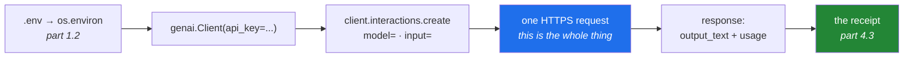

# 2.1 — Gemini — the workhorse door, and the first call you make naked

## One-line answer

The first model call in this project goes through the provider's own SDK with the model id typed out
in full — no framework, no default, no wrapper — because you cannot debug a stack you have never seen
the bottom of, and every abstraction you meet from Day 172 sits directly on top of this one request.

---

## The story

A developer builds an application on a framework. It works. Four lines of code and the model answers.

Three weeks later, in front of users, it starts returning an error nobody recognises. The traceback is
eleven frames deep and every frame belongs to the framework. Somewhere at the bottom something
returned a 400.

They have no idea what request was actually sent. They do not know what model was used, because the
framework had a default and they never set one. They do not know what the prompt looked like after
three layers of templating. They do not know whether the failure was authentication, a quota, a
content filter, or a malformed payload, because the framework caught the provider's error and re-raised
its own.

They spend a day adding logging to somebody else's library to find out what their own program is
doing.

The developer who had made one raw call first — once, on the first day, before any framework — would
have recognised the shape of that error in a minute, because they had seen it come back from the
provider directly with the provider's own wording.

**Principle 2 in this plan is "from scratch before library", and this is what it buys.** Not purity.
Debuggability. You are allowed to use the framework; you are not allowed to have never seen what it is
doing.

---

## The idea in plain language

### What a provider call actually is

Underneath every framework, an LLM call is one HTTPS request. You send a model id and some input; you
get back generated text plus metadata about how many tokens were involved. That is the whole
interface. The SDK is a convenience over that request — it handles authentication, retries and
response parsing — and the framework on Day 172 is a convenience over the SDK.

Three layers, and it is worth being able to name which one a problem is in.

### Why Gemini is the workhorse here

Plan Part 2.1 assigns roles to the free doors, and Gemini's is **workhorse**: the general-purpose call
you reach for by default. Its free tier is the most generous of the three in requests per day, which
is the dimension that matters when you are running experiments rather than serving users.

It also comes with the constraint that shapes everything else in this plan: on a free tier, **your
prompts may be used to improve the provider's models.** That is a completely reasonable trade for a
free service, and it means one hard rule for this project — *fixtures and public data only, never
private data, ever.* This is not caution about the provider; it is the honest consequence of the deal,
and it applies to every free tier you will ever use.

### The two things you always type out

Principle 4 says nothing floats, and for a model call that means two specific values are never left to
a default:

- **The model id.** `model="gemini-3.7-flash"`, typed out, every time. A framework default silently
  changes when the framework updates; a provider's "latest" alias silently changes when the provider
  ships. Either one moves your results without a commit, which makes an experiment
  unreproducible — the same disease as an unpinned dependency on
  [Day 1](../../../day-01-pins/LESSON.md).
- **The key's source.** Read from the environment ([1.2](../01-secrets/1.2-dotenv-and-os-environ.md)),
  never hard-coded, never defaulted.

Model ids also *retire*. A model you pinned will eventually stop being served, which is a loud failure
rather than a silent one, and is exactly why Principle 13's freshness check exists.

### The API shape, verified today

The SDK's current recommended entry point is the **Interactions API**. Verified against the live
documentation on 2026-08-24:

```text
from google import genai
client = genai.Client()
interaction = client.interactions.create(model="gemini-3.7-flash", input="...")
print(interaction.output_text)
```

Two details worth noticing before the code. `genai.Client()` with no arguments reads `GEMINI_API_KEY`
from the environment by itself — which is convenient and slightly too magical, so this project passes
it explicitly, so that the reader of any file can see where the credential comes from. And
`interaction.output_text` is a convenience: the response object also carries the structured content
and the token counts you will need in [4.3](../04-rate-budget/4.3-the-budget-as-a-receipt.md).



---

## Why Setu needs it

- **Principle 2 in its first real application.** You call the provider naked today; you meet the
  framework on Day 172, and by then you will know what it is wrapping.
- **The shared router on Day 172** tries Gemini first and falls through to the other doors. Its first
  branch is the call you write today.
- **Principle 5 has a hard edge here.** Free-tier prompts may train the provider's models, so every
  fixture in this repository is public data by construction (Principle 9's provenance rule is the
  other half of that).
- **[Day 2's](../../../day-02-quality-gate/LESSON.md) `live` marker exists for exactly this call**
  ([3.3](../../../day-02-quality-gate/parts/03-pytest/3.3-markers-and-exit-code-five.md)) — a test that
  touches this door must never run in a build.
- **Every eval from Day 233 measures a model's output**, and knowing the raw response shape — text
  plus usage — is what makes those measurements possible.

---

## The mechanism

Add the SDK on the day it is first used, with an exact pin:

```bash
uv add "google-genai==2.19.0"
uv run python -c "import google.genai as g; print('google-genai', g.__version__ if hasattr(g, '__version__') else 'imported ok')"
```

**Line by line:**

- `uv add "google-genai==2.19.0"` — the exact pin from the plan's Part 2 table, quoted so the shell
  does not interpret `==`. `uv add` writes both `pyproject.toml` and `uv.lock`
  ([Day 1, 3.2](../../../day-01-pins/parts/03-freezing/3.2-freezing-into-pyproject-and-the-lock.md)),
  which must be committed together.
- **Verify this version before trusting it.** That table was read from the index on a specific date,
  and the SDK's recommended call shape moved to the Interactions API. `uv run python scripts/check_pins.py`
  — the tool you built on Day 1 — is exactly the thing that tells you whether the pin is still current,
  and this is its first real use.
- The import check confirms the package resolves and the interpreter can find it, before any question
  about keys is involved. Separating "is it installed" from "does it authenticate" saves a
  surprising amount of confusion.

Now the call itself. This is the whole thing:

```python
"""One raw Gemini call. No framework, no defaults, no wrapper (Principle 2)."""

from __future__ import annotations

import os

from dotenv import load_dotenv
from google import genai

load_dotenv()

MODEL = "gemini-3.7-flash"  # typed out, never a default, never "latest" (Principle 4)


def ask(prompt: str) -> tuple[str, object]:
    """Send one prompt. Returns the text and the raw response for inspection."""
    key = os.environ.get("GEMINI_API_KEY")
    if not key:
        raise RuntimeError("GEMINI_API_KEY is not set - see part 1.2")

    client = genai.Client(api_key=key)
    interaction = client.interactions.create(model=MODEL, input=prompt)
    return interaction.output_text, interaction


if __name__ == "__main__":
    text, raw = ask("Reply with exactly the word: ready")
    print("model :", MODEL)
    print("output:", text.strip())
    print("type  :", type(raw).__name__)
```

**Line by line:**

- `load_dotenv()` once, at module level, as near the entry point as possible
  ([1.2](../01-secrets/1.2-dotenv-and-os-environ.md)).
- `MODEL = "gemini-3.7-flash"` as a module constant — one place to change it, and it appears in the
  output so every run records which model produced it. **A result printed without its model id is a
  result you cannot reproduce.**
- `os.environ.get(...)` then an explicit `raise` — the fail-loudly-at-start pattern. The SDK would find
  the key by itself if you omitted `api_key=`, and this project passes it anyway so that the source of
  the credential is visible in the file rather than in the library's documentation.
- `genai.Client(api_key=key)` — constructing the client is local and cheap; it does not make a network
  request. The first request happens on the next line, which matters when you are reading a traceback
  and asking *where did this go out?*
- `client.interactions.create(model=..., input=...)` — the current recommended entry point, verified
  against the live docs today. Both arguments are keywords, deliberately: a positional call here would
  be unreadable and would break on any signature change.
- `return interaction.output_text, interaction` — the convenience string **and** the raw object. The
  raw object is where token usage lives, and [4.3](../04-rate-budget/4.3-the-budget-as-a-receipt.md)
  needs it. Returning both from the start means you never have to retrofit a wrapper to get at it.
- `"Reply with exactly the word: ready"` — the smallest useful prompt. A connectivity check should cost
  the fewest tokens that still proves the whole path works, because you will run it many times.
- `text.strip()` — models add whitespace. Stripping in the caller rather than in `ask` keeps `ask`
  honest about what came back.

And inspect the response object, because that is where the next two parts live:

```python
"""What actually comes back. Run this once and read every attribute."""

from __future__ import annotations

import json

from ask_gemini import ask  # the module above

text, raw = ask("Reply with exactly the word: ready")

print("output_text:", repr(text))
print()
print("attributes on the response object:")
for name in sorted(dir(raw)):
    if not name.startswith("_"):
        print("   ", name)

usage = getattr(raw, "usage", None)
print()
print("usage:", json.dumps(usage, default=str, indent=2) if usage else "no usage attribute")
```

**Line by line:**

- `from ask_gemini import ask` — import the module you just wrote rather than duplicating it. This
  assumes both files sit in the same directory; module layout is Day 17's subject (`PY-21`).
- `dir(raw)` filtered to names not starting with `_` — list the public surface of an object you have
  never met. **This is the single most useful thing to do with an unfamiliar SDK response**, and it
  beats reading documentation for the specific question "what can I get off this?"
- `getattr(raw, "usage", None)` — ask for an attribute that may not exist, with a default instead of an
  `AttributeError`. The attribute's exact name varies between providers and between SDK versions,
  which is precisely why you are looking rather than assuming.
- `json.dumps(..., default=str)` — serialise for readable printing, falling back to `str()` for
  anything not natively JSON-serialisable. Without `default=str` this raises on the first non-trivial
  object.
- What you are hunting for is the **token counts**: input tokens, output tokens, total. Those three
  numbers are the currency of [4.1](../04-rate-budget/4.1-rpm-rpd-tpm.md) and the content of the
  receipt in [4.3](../04-rate-budget/4.3-the-budget-as-a-receipt.md). Find them today and write down
  where they live.

---

## When it breaks

**No key, or a revoked one:**

```text
google.genai.errors.ClientError: 400 INVALID_ARGUMENT.
  {'error': {'code': 400, 'message': 'API key not valid. Please pass a valid API key.',
   'status': 'INVALID_ARGUMENT'}}
```

**What it means.** The key is absent, malformed, or revoked — the provider will not distinguish
between them, deliberately. Check presence and length first with the fingerprint tool from
[1.3](../01-secrets/1.3-when-a-key-leaks.md); a key that is present and the right length has been
revoked or was never enabled for this API.

**A model id that no longer exists:**

```text
google.genai.errors.ClientError: 404 NOT_FOUND.
  {'error': {'code': 404, 'message': 'models/gemini-1.5-flash is not found for API version v1beta,
   or is not supported for interactions.create.', 'status': 'NOT_FOUND'}}
```

**What it means.** The model was retired, renamed, or is not available for this call type. This is the
loud failure that pinning a model id buys you: the alternative is an alias that silently moves to a
different model and changes your results without an error. List what is actually available rather than
guessing, and update the constant in one place.

**The quota, which is the one you will meet most:**

```text
google.genai.errors.ClientError: 429 RESOURCE_EXHAUSTED.
  {'error': {'code': 429, 'message': 'Quota exceeded for quota metric
   "Generate requests per day" ...', 'status': 'RESOURCE_EXHAUSTED'}}
```

**What it means.** You have hit a free-tier limit — and note the message names *which* limit, which
is the information [4.1](../04-rate-budget/4.1-rpm-rpd-tpm.md) is about. A per-minute limit clears in
under a minute; a per-day limit does not clear today. Retrying immediately on the second kind is how
a script spends the rest of its afternoon achieving nothing
([4.2](../04-rate-budget/4.2-429-and-real-backoff.md)).

**The response arrives with no text in it:**

```text
output_text: ''
```

**What it means.** Generation was stopped before producing content — most often a safety filter, or a
token limit reached during a preamble. The response object carries a reason; find it with the `dir()`
sweep above. **An empty string is not an error and will not raise**, which makes this the failure most
likely to reach production as a blank field in a user interface.

**And the one that is not the provider's fault:**

```text
httpx.ConnectError: [Errno -3] Temporary failure in name resolution
```

**What it means.** No network, or DNS is unavailable — commonly because you ran a `live` test inside a
build ([Day 2, 5.3](../../../day-02-quality-gate/parts/05-ci/5.3-caching-and-never-spending-a-quota.md)).
The error comes from the HTTP layer, not from the SDK, which is a useful signal in itself: the request
never left the machine.

---

## In production

**The model id belongs in configuration, and the configuration belongs in version control.** A pinned
model is reproducible; a "latest" alias is not. But pinning has the same maintenance cost as pinning a
dependency ([Day 1, 4.2](../../../day-01-pins/parts/04-drift/4.2-drift-and-the-amendment-protocol.md)):
models retire, and a retired model is an outage. The professional pairing is to pin explicitly *and*
to track deprecation announcements, treating a model migration as a planned change with an evaluation
behind it — never as an alias that moves under you at three in the morning.

**Every serious deployment records the full call, not just the answer.** Model id, prompt version,
token counts, latency, and a request identifier if the provider gives one. Without those you cannot
answer the two questions that always come: *why did this answer change?* and *what is this costing?*
That record is [4.3](../04-rate-budget/4.3-the-budget-as-a-receipt.md), and building it into the first
call you ever make is far easier than retrofitting it into a hundred.

**Free-tier data handling is a real design constraint, not a footnote.** "Prompts may be used for
training" means a free tier can never see customer data, personal information, or anything under a
confidentiality obligation. In a company this is a legal question before it is a technical one, and
the correct move when someone proposes a free tier for a prototype is to ask what data will flow
through it. This project's answer is structural: public fixtures only, so the question can never arise.

**What changes at scale:** a single synchronous call becomes hundreds concurrently, and the
constraints shift from "does it work" to rate limits, latency percentiles, and cost per request. The
techniques are batching, caching identical requests, streaming so a user sees the first token quickly,
and a fallback to a second provider when the first is degraded — which is exactly the router on Day
172. The failure that only appears with real traffic is **partial degradation**: the provider slows
down rather than failing, timeouts pile up, and a system with no timeout set exhausts its connections.
Set a timeout on every call you ever make.

**The review comment a senior engineer leaves.** On a pull request that adds a model call:
*"Pin the model id — no aliases — and log the token usage. Also: what's the timeout, and what happens
on a 429? Right now this will hang and then crash."*

**The interview question.** *"Why would you write a raw provider call before adopting a framework?"*
The answer that lands is about debuggability rather than purity: frameworks wrap the request, the
response and the error, so when something fails you are reading somebody else's abstraction instead of
the provider's own message — and you cannot tell whether the fault is authentication, quota, content
filtering or payload without having seen those errors raw at least once. Then give the concrete
version: knowing that the token counts live on the response object, and that a 429 names which limit
it hit, is what lets you build the cost and retry logic that the framework will not do for you.

---

## Check yourself

```bash
uv run python -c "
import os
from dotenv import load_dotenv
from google import genai
load_dotenv()
client = genai.Client(api_key=os.environ['GEMINI_API_KEY'])
r = client.interactions.create(model='gemini-3.7-flash', input='Reply with exactly the word: ready')
print('output:', r.output_text.strip())
print('usage :', getattr(r, 'usage', 'no usage attribute - find where the counts live'))
"
```

One request, one word back. If it prints `ready`, the first door is open. Note where the token counts
live in that output — you will need them twice more today.

**Answer out loud, without scrolling up:**

> Give the reason for typing the model id out on every call that is about *reproducibility* rather
> than about taste. Then name the three layers between your code and the provider's servers, and say
> which layer produces a 429 and which one produces a name-resolution error.

---

**Next:** [2.2 — Groq: the fast door and its token-per-minute wall](2.2-groq-and-the-token-wall.md)
