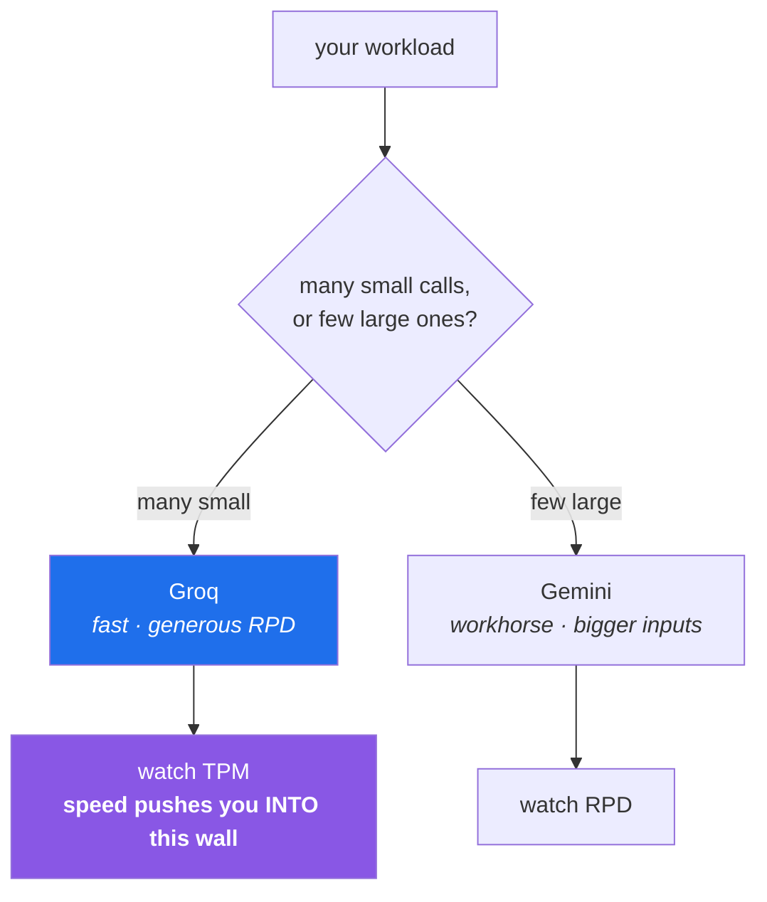

# 2.2 — Groq — the fast door, and the wall that is made of tokens

## One-line answer

Groq's free tier is generous in *requests* and tight in *tokens per minute*, which makes it the right
door for many small calls and the wrong door for a few enormous ones — and noticing that a limit can
be measured in something other than requests is the idea this part exists for.

---

## The story

A team has a document pipeline. It reads a long report, splits it into forty chunks, and asks a model
to summarise each one. Forty small requests.

They move it to a faster provider and it flies. What took minutes takes seconds. Everyone is pleased.

Then somebody points it at a longer report — three hundred pages instead of thirty. The pipeline makes
four hundred requests instead of forty, still small ones, and dies almost immediately with a limit
error.

The confusing part is the arithmetic. Their allowance is thousands of requests a day. They made four
hundred. The number in the error message is not a request count at all: it is **tokens per minute**,
and four hundred chunks of a long document is a great many tokens arriving in a very short time
precisely *because* the provider is fast.

That is the twist worth sitting with. The provider's speed is what caused the failure. A slower
service would have spread the same work across enough minutes that the per-minute ceiling never
noticed. Going faster moved them into a different limit, and nobody had asked which dimension they
were actually constrained by.

---

## The idea in plain language

### A limit is a rate on some dimension, and there is more than one dimension

You will meet all of these properly in [4.1](../04-rate-budget/4.1-rpm-rpd-tpm.md). What matters here
is that a provider does not have *a* limit; it has several, on different quantities, over different
windows:

| Dimension | What it counts | Typically binds when |
|---|---|---|
| **RPM** — requests per minute | how many calls | a tight loop with no pacing |
| **RPD** — requests per day | how many calls, all day | a long batch job or a busy CI |
| **TPM** — tokens per minute | how much *text*, in and out | few calls, but large prompts |
| **TPD** — tokens per day | total text volume | sustained heavy use |

Whichever one you hit first is the one that defines your system. **A provider is not "generous" or
"tight" — it is generous on some dimensions and tight on others, and the useful question is which one
your workload leans on.**

### What a token is, roughly, and why "roughly" is honest

A **token** is a chunk of text as the model sees it — usually a common word, a word fragment, or a
piece of punctuation. Models do not read characters or words; they read tokens.

A rough English rule of thumb is that a token averages about four characters, so a thousand tokens is
somewhere near seven hundred and fifty words. That approximation is fine for budgeting and wrong for
anything precise: code, non-English text, and unusual formatting all tokenize differently, and every
model family has its own tokenizer.

The practical consequence is that **both your prompt and the response count**. A short question with a
long document pasted into it is an expensive request, even though it is one request. Day 149 comes
back to tokenization properly; today you only need the budgeting intuition.

### Groq's role in this plan

Plan Part 2.1 assigns it: **the fast/cheap loop.** Open models running on hardware built for
inference, with latency low enough that a loop of many small calls stays interactive. Generous on
requests per day, tight on tokens per minute.

So the shape it suits is: many small prompts. Classification of a thousand short strings. A rubric
applied to a hundred short answers. A retry loop that wants a quick second opinion. The shape it does
*not* suit is one call with a hundred-page document in it — that is a job for the workhorse door
([2.1](2.1-gemini-the-workhorse.md)), or for a design that does not send a hundred pages at all.

### The API shape, and the thing worth noticing about it

Verified against the live documentation on 2026-08-24:

```text
import os
from groq import Groq

client = Groq(api_key=os.environ.get("GROQ_API_KEY"))
completion = client.chat.completions.create(
    messages=[{"role": "user", "content": "..."}],
    model="llama-3.3-70b-versatile",
)
print(completion.choices[0].message.content)
```

Compare that with Gemini's `interactions.create(model=..., input="...")` from
[2.1](2.1-gemini-the-workhorse.md). The concepts are identical — a model id, some input, generated
text back — and the shapes are completely different. Notice three specific differences:

- **Input is a list of messages with roles**, not a bare string. `{"role": "user", "content": "..."}`
  is the chat-completions convention, and it is the one most of the ecosystem uses.
- **The output is nested**: `completion.choices[0].message.content`. `choices` is a list because the
  API can return several alternatives; you almost always want the first.
- **Model ids look nothing alike.** `llama-3.3-70b-versatile` names an open model; `gemini-3.7-flash`
  names a proprietary one. Neither id is portable to the other provider.

That incompatibility is the entire reason Day 172 builds a router with one interface over all of
them — and the reason this plan makes you write both raw calls first, so you know what the router is
flattening.



---

## Why Setu needs it

- **The router on Day 172 needs a second door**, and Groq is the branch that takes over when Gemini's
  daily allowance is gone. It cannot be a drop-in substitute, which is the point of writing both
  today.
- **Principle 5 says every lab states its request budget.** After this part, "requests" stops being
  the only unit — a budget that counts calls and ignores tokens will be wrong on exactly the day it
  matters.
- **Eval judges run on a different provider than the model under test** (plan Part 2.1's standing
  rule). Two working doors is the minimum for that to be possible, and it starts today.
- **From Phase 14 there are hundreds of short classification calls** over a text dataset. That is the
  exact workload this door is for, and the exact workload that meets a token-per-minute wall.
- **Day 233's eval suite** applies a rubric across many small answers — many small calls, fast, which
  is this door again.

---

## The mechanism

Add the SDK, pinned, on the day it is first used:

```bash
uv add "groq==1.6.0"
uv run python -c "import groq; print('groq imported ok')"
```

**Line by line:**

- The exact pin from the plan's Part 2 table, committed with `uv.lock`
  ([Day 1, 3.2](../../../day-01-pins/parts/03-freezing/3.2-freezing-into-pyproject-and-the-lock.md)).
  Run `uv run python scripts/check_pins.py` afterwards — verifying a table rather than trusting it is
  Day 1's whole point.
- The import check before the key check, again: two questions, answered separately.

Now the call, deliberately laid out beside the Gemini one so the differences are visible:

```python
"""One raw Groq call. Same concepts as part 2.1, entirely different shape."""

from __future__ import annotations

import os

from dotenv import load_dotenv
from groq import Groq

load_dotenv()

MODEL = "llama-3.3-70b-versatile"  # typed out (Principle 4), and NOT portable to Gemini


def ask(prompt: str) -> tuple[str, object]:
    """Send one prompt. Returns the text and the raw response for inspection."""
    key = os.environ.get("GROQ_API_KEY")
    if not key:
        raise RuntimeError("GROQ_API_KEY is not set - see part 1.2")

    client = Groq(api_key=key)
    completion = client.chat.completions.create(
        messages=[{"role": "user", "content": prompt}],
        model=MODEL,
    )
    return completion.choices[0].message.content, completion


if __name__ == "__main__":
    text, raw = ask("Reply with exactly the word: ready")
    print("model :", MODEL)
    print("output:", text.strip())
    print("usage :", getattr(raw, "usage", None))
```

**Line by line:**

- `messages=[{"role": "user", "content": prompt}]` — a **list of one message**. The list exists because
  a conversation is a sequence: a `system` message setting behaviour, then alternating `user` and
  `assistant` turns. Sending one user message is the degenerate case, and building the habit of seeing
  it as a list stops the multi-turn version being a surprise on Day 176.
- `model=MODEL` as a keyword after `messages` — the SDK accepts them in any order because both are
  keywords. Writing `model=` explicitly, always, is the Principle 4 habit from
  [2.1](2.1-gemini-the-workhorse.md).
- `completion.choices[0]` — index into the list of alternatives. Providers can return several
  completions per request; `[0]` is the first and, unless you asked for more, the only one. An
  `IndexError` here means the response came back with no choices at all, which is the empty-generation
  case from [2.1](2.1-gemini-the-workhorse.md) in a different costume.
- `.message.content` — two more levels: the choice holds a *message* (with a role and content), and
  the content is the text. That nesting mirrors the request's shape, which is a deliberate symmetry in
  this API and a useful thing to notice.
- `getattr(raw, "usage", None)` — the token counts. On this API `usage` reliably carries prompt
  tokens, completion tokens and total, and it is the number [4.3](../04-rate-budget/4.3-the-budget-as-a-receipt.md)
  records. Compare it with what Gemini returned; they do not have the same field names, which is one
  more thing the Day 172 router has to normalise.

Then measure the thing this part is actually about — how fast you approach the token wall:

```python
"""Estimate token throughput before a loop hits a per-minute ceiling."""

from __future__ import annotations

import time

from ask_groq import ask  # the module above

PROMPT = "In one sentence, what is a token in a language model?"

start = time.perf_counter()
text, raw = ask(PROMPT)
elapsed = time.perf_counter() - start

usage = raw.usage
total = usage.total_tokens
print(f"latency        : {elapsed:.2f}s")
print(f"tokens in call : {total}")
print(f"implied rate   : {total / elapsed:,.0f} tokens/second if run back to back")
print(f"calls/minute   : {60 / elapsed:,.1f}")
print(f"tokens/minute  : {total * 60 / elapsed:,.0f}  <- compare against the TPM limit")
```

**Line by line:**

- `time.perf_counter()` — a monotonic, high-resolution clock intended for measuring durations. Not
  `time.time()`, which tracks wall-clock time and can jump backwards when the system clock is adjusted.
  For any "how long did this take" question, `perf_counter` is the correct tool.
- `usage.total_tokens` — prompt plus completion. **Both halves count against a token limit**, which is
  the fact the story's team did not have.
- `total * 60 / elapsed` — the projection: if you ran this call back to back for a minute, this many
  tokens would flow. That single number, compared against the provider's published TPM figure, tells
  you whether a naive loop will survive — **before you write the loop.**
- `{total / elapsed:,.0f}` — the `,` inserts thousands separators and `.0f` drops the decimals. A
  number you can read at a glance is a number you will actually look at.
- Look up the real limits on the provider's rate-limit page and put your projection next to them. The
  numbers change, which is why this part gives you the *method* and not a table
  ([4.1](../04-rate-budget/4.1-rpm-rpd-tpm.md)).

---

## When it breaks

**The token wall, which is the whole point of this part:**

```text
groq.RateLimitError: Error code: 429 - {'error': {'message': 'Rate limit reached for model
  `llama-3.3-70b-versatile` in organization `org_...` on tokens per minute (TPM):
  Limit 6000, Used 5900, Requested 400. Please try again in 3s.',
  'type': 'tokens', 'code': 'rate_limit_exceeded'}}
```

**What it means.** Read the message carefully, because it is unusually informative: it names the
dimension (`tokens per minute`), the limit, what you had used, what you asked for, and **how long to
wait**. That last value is the correct backoff, supplied by the server, and using it instead of
guessing is [4.2](../04-rate-budget/4.2-429-and-real-backoff.md)'s subject. Note `'type': 'tokens'` —
the same error code covers a request-count limit, and the type field is how you tell.

**The same error, different dimension:**

```text
groq.RateLimitError: Error code: 429 - {'error': {'message': 'Rate limit reached ...
  on requests per day (RPD): Limit 14400, Used 14400, Requested 1.
  Please try again in 5h32m4s.', 'type': 'requests', ...}}
```

**What it means.** A daily limit, and the wait is measured in hours. **Retrying this is pointless and
harmful** — it burns your own time and adds load for nothing. A retry policy that does not read the
dimension will happily loop for five hours; one that does will stop and tell you to come back
tomorrow, or fall through to another door.

**A model id that has been retired:**

```text
groq.NotFoundError: Error code: 404 - {'error': {'message': 'The model `llama-3.1-70b-versatile`
  does not exist or you do not have access to it.', 'type': 'invalid_request_error',
  'code': 'model_not_found'}}
```

**What it means.** Open-model rosters move faster than proprietary ones — models are added and retired
regularly. This is the loud failure that a pinned id buys, and the fix is to list the currently
available models rather than guess at a version bump.

**And the shape mistake, which is the most common first error:**

```text
TypeError: Completions.create() missing 1 required keyword-only argument: 'messages'
```

...from someone who wrote `client.chat.completions.create(prompt, model=MODEL)` out of habit from the
other door. **What it means.** The two SDKs do not share a call signature. This error is trivial and
worth meeting deliberately, because it is the concrete version of why a router exists: the same
intention needs different code per provider, and something has to hold that difference.

---

## In production

**Match the door to the workload, and know which dimension binds.** The professional habit is to
estimate, before writing the loop, roughly how many requests and how many tokens per minute a job will
generate, and to compare that against each candidate provider's published limits. That estimate takes
five minutes and routinely changes the design — chunk sizes, concurrency, which provider — where
discovering it from a 429 in production changes it under pressure.

**Speed changes which limit you hit, which is genuinely counter-intuitive.** A slow provider paces you
for free. A fast one lets a naive loop reach a per-minute ceiling in seconds. The engineering
consequence is that **client-side pacing becomes your responsibility as latency falls**: a token
bucket or a small concurrency limit in your own code, sized from the provider's TPM, rather than
firing as fast as the network allows and treating 429s as normal. Systems that rely on 429s as their
pacing mechanism are wasteful and fragile.

**Streaming changes the user experience and not the budget.** With streaming, tokens arrive as they are
generated, so a person sees output immediately — a large perceived improvement. The total token count
is identical, so it buys nothing against a limit. Knowing which problem a technique solves — latency
perception, not throughput — keeps you from reaching for it when the constraint is capacity.

**What changes at scale:** limits are usually per organisation rather than per key, so several
services sharing an account contend with each other, and one team's batch job becomes another team's
outage. The mature arrangements are separate accounts or projects per workload, a shared client-side
rate limiter when they must share, and monitoring on *how close to the ceiling* you are rather than
only on errors. By the time you are seeing 429s you are already degraded; the useful alert fires at
seventy per cent.

**The review comment a senior engineer leaves.** On a pull request adding a batch loop: *"What's the
token throughput of this at full speed, and what's the provider's TPM? Add a concurrency limit sized
from that — right now this will 429 on the first large input and the retry will make it worse."*

**The interview question.** *"You're rate-limited by a provider. Walk me through what you do."* The
weak answer is "add retries". The answer that lands starts by reading the error to find out *which*
dimension was hit, because the response differs completely: a per-minute limit means pace and retry
with backoff, while a per-day limit means retrying is pointless and you either fall back to another
provider or stop. Then name the fix that is not retrying at all — reduce tokens by sending less
context, batch several items into one request, cache repeated prompts — and finish with client-side
pacing sized from the published limit, so 429s are an exception rather than the mechanism.

---

## Check yourself

```bash
uv run python -c "
import os, time
from dotenv import load_dotenv
from groq import Groq
load_dotenv()
c = Groq(api_key=os.environ['GROQ_API_KEY'])
t0 = time.perf_counter()
r = c.chat.completions.create(
    messages=[{'role': 'user', 'content': 'Reply with exactly the word: ready'}],
    model='llama-3.3-70b-versatile',
)
dt = time.perf_counter() - t0
print('output       :', r.choices[0].message.content.strip())
print('usage        :', r.usage)
print('projected TPM:', f'{r.usage.total_tokens * 60 / dt:,.0f}')
"
```

One request, one word back, and one number that matters more than the word: the tokens per minute a
back-to-back loop of that call would generate. Compare it with the provider's published limit.

**Answer out loud, without scrolling up:**

> Explain how a faster provider can cause a rate-limit failure that a slower one would not. Then name
> the four dimensions a limit can be measured on, and say which two of them make retrying the wrong
> response.

---

**Next:** [2.3 — OpenRouter: the second opinion, and a roster that perishes](2.3-openrouter-perishable-free.md)
