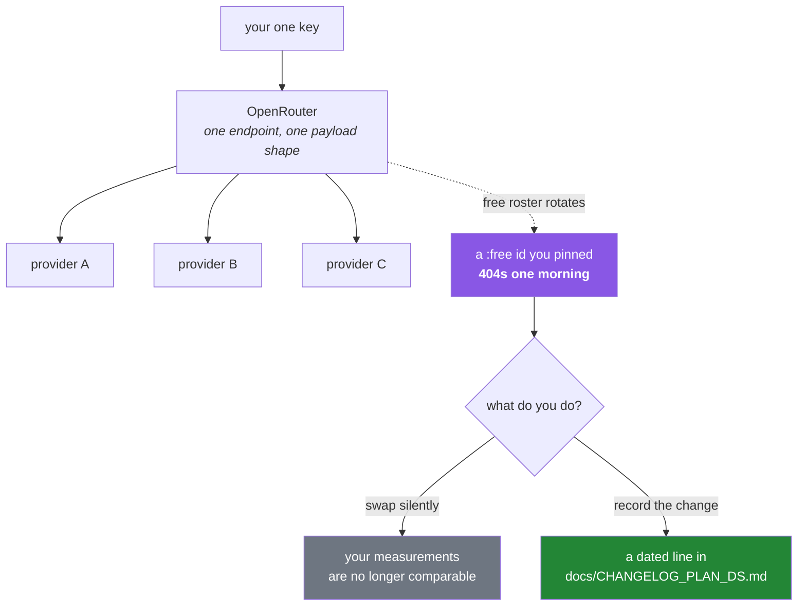

# 2.3 — OpenRouter — the second opinion, and a roster that perishes

## One-line answer

OpenRouter is one endpoint in front of many providers, which makes it the natural place to get a
**second opinion from a different model family** — and its free roster is *perishable*, so every free
model id must be treated as best-effort rather than as a pin, which is the first thing in this project
that Principle 4 cannot fully protect.

---

## The story

A team builds an evaluation harness. A model produces answers; a second model scores them against a
rubric. The judge runs on a free model id found on an aggregator, because the harness runs often and
free is the point.

For two months it works. The scores go into a dashboard. A decision gets made partly on the strength
of a rising line on that dashboard.

Then the harness starts failing: the model id returns a 404. The free listing has changed — the
particular free offering was withdrawn, as free offerings routinely are. Somebody swaps in a different
free model id, the harness goes green, and the dashboard continues.

The line on the dashboard now means something else. Half of it was scored by one model and half by
another, with no marker anywhere saying where the change happened. Nobody notices for weeks, because
the numbers are plausible on both sides of the join.

That is the real failure, and it is not the 404. **The outage was loud and cheap. The silent change of
measuring instrument was quiet and expensive.** Any time the thing doing your measuring can change
without your deciding, your measurements are not comparable across time — and a free roster is a thing
that changes without your deciding, by design.

---

## The idea in plain language

### What an aggregator is

OpenRouter sits in front of many model providers and exposes one API. You send a request naming a
model like `vendor/model-name`, it routes to whoever serves that model, and returns a response in one
consistent shape.

The value is real: one key, one endpoint, one payload format, access to model families you have no
individual account with. For this project that last point is the important one — plan Part 2.1 gives
it the role of **second opinion and judge**, and the standing rule is that an eval judge always runs
on a *different provider* than the model under test.

That rule exists because a model asked to grade its own output is not an independent measurement.
Diversity of provider is the cheap approximation of independence, and an aggregator is how you get it
with one credential.

### It speaks the chat-completions shape

The convenient part: OpenRouter is compatible with the widely-used chat-completions API, so you call
it with the **same SDK and the same code shape** you used for Groq in
[2.2](2.2-groq-and-the-token-wall.md) — just pointed at a different base URL.

Verified against the live documentation on 2026-08-24:

```text
from openai import OpenAI

client = OpenAI(base_url="https://openrouter.ai/api/v1", api_key="<OPENROUTER_API_KEY>")
completion = client.chat.completions.create(
    model="<vendor>/<model>",
    messages=[{"role": "user", "content": "..."}],
)
print(completion.choices[0].message.content)
```

Note what this means for the project's dependency list: the package installed is the OpenAI SDK, and
it is **not pointed at OpenAI**. It is a client library for a protocol that several services
implement, which is a genuinely useful thing to understand — the library name describes its origin,
not its destination. Plan Part 2's table says exactly this, and it surprises people every time.

### The perishable part

Free offerings on an aggregator come and go. A model is offered free while a provider is promoting it
or while capacity is spare, and withdrawn when that stops. Ids get renamed. Limits change without
announcement.

This collides directly with Principle 4. You *can* type the model id out — and you should, for the
reproducibility reason from [2.1](2.1-gemini-the-workhorse.md) — but you cannot make it stable, because
stability is not yours to grant. What you can do is make the change **visible**:

- **Record which model produced every result**, so a change in the instrument appears in your data
  rather than only in your memory.
- **Treat a 404 as a decision point**, not as something to patch past. Swapping one free id for
  another is a change of measuring instrument and deserves a line in a changelog.
- **Never let a judge model change silently**, because a benchmark whose grader changed is a benchmark
  that has been reset.

That is Principle 14 — reality changed, so amend deliberately — applied to something that will change
every few months rather than every few years.



---

## Why Setu needs it

- **Eval judges must run elsewhere.** This is the door that makes plan Part 2.1's standing rule
  possible, and it is used from Day 233's eval suite through the capstone.
- **The Day 172 router has this as its third branch** — after Gemini and Groq, before falling back to
  a local model ([2.4](2.4-ollama-the-keyless-door.md)). Its low daily allowance is exactly why it is
  third.
- **Principle 4 meets its first genuine limit here**, and saying so out loud is better than pretending.
  Some things cannot be pinned; for those, the answer is recording and detecting change rather than
  preventing it — which is Principles 13 and 14 from
  [Day 1, 4.2](../../../day-01-pins/parts/04-drift/4.2-drift-and-the-amendment-protocol.md).
- **Day 154's grounding-versus-hallucination write-up** compares answers across model families. That
  comparison needs more than one family, from one key.
- **Principle 10 wants interview-ready artifacts** — decision records. "Why did the judge model change
  on this date" is exactly the kind of question an ADR answers, and the habit starts with the first
  404.

---

## The mechanism

Add the SDK — noting what it is and is not:

```bash
uv add "openai==3.3.1"
uv run python -c "import openai; print('openai sdk imported - pointed at OpenRouter, not at OpenAI')"
```

**Line by line:**

- The exact pin from the plan's Part 2 table. Verify it with `uv run python scripts/check_pins.py`
  rather than trusting the table ([Day 1](../../../day-01-pins/LESSON.md)).
- The print says the thing worth remembering: **the package is a client for a protocol.** Nothing about
  installing it implies an account with, or a request to, the company whose name is on it. Every
  request goes to the `base_url` you set.

Before writing any call, ask the service what is actually available today:

```python
"""Ask the aggregator what it is offering right now. Never trust a model id from a lesson."""

from __future__ import annotations

import json
import os
import urllib.request

from dotenv import load_dotenv

load_dotenv()

request = urllib.request.Request(
    "https://openrouter.ai/api/v1/models",
    headers={"User-Agent": "setu-day3/1.0"},
)
with urllib.request.urlopen(request, timeout=15) as response:
    catalogue = json.load(response)["data"]

free = [m for m in catalogue if m["id"].endswith(":free")]
print(f"models listed : {len(catalogue)}")
print(f"free-suffixed : {len(free)}")
for model in sorted(free, key=lambda m: m["id"])[:10]:
    context = model.get("context_length", "?")
    print(f"  {model['id']:<50} context={context}")
```

**Line by line:**

- `urllib.request` from the standard library rather than the SDK — this is a plain public catalogue
  endpoint and the same tool you used on
  [Day 1, 2.1](../../../day-01-pins/parts/02-pypi-index/2.1-the-pypi-json-api.md). The instinct is
  identical: **ask the service, do not trust a table**, including the table in this document.
- `headers={"User-Agent": ...}` and `timeout=15` — the politeness rules from that same day. A request
  with no timeout is a program that can hang forever.
- `m["id"].endswith(":free")` — the aggregator's convention for a free offering is a suffix on the
  model id. **Confirm this against the service's own documentation rather than taking it from here**,
  because it is exactly the kind of convention that changes, and this part is about not trusting
  perishable facts.
- `model.get("context_length", "?")` — `.get` with a default, because catalogue entries are not
  guaranteed to carry every field and a listing tool should not crash on one odd row
  ([Day 1, 2.1](../../../day-01-pins/parts/02-pypi-index/2.1-the-pypi-json-api.md)).
- `sorted(...)[:10]` — a readable sample, not the whole list. You are learning the shape.
- **Run this today and again in a month.** The difference between the two outputs is this part's entire
  argument, and seeing it yourself is worth more than being told.

Now the call, with the id chosen from that listing rather than from here:

```python
"""One raw OpenRouter call. Same SDK as any chat-completions service, different base_url."""

from __future__ import annotations

import os

from dotenv import load_dotenv
from openai import OpenAI

load_dotenv()

BASE_URL = "https://openrouter.ai/api/v1"
# Chosen from the live catalogue above on a date you should record. PERISHABLE - expect a 404
# eventually, and treat that as a decision (part 2.3), not as a patch.
MODEL = "<vendor>/<model>:free"


def ask(prompt: str) -> tuple[str, object]:
    """Send one prompt. Returns the text and the raw response for inspection."""
    key = os.environ.get("OPENROUTER_API_KEY")
    if not key:
        raise RuntimeError("OPENROUTER_API_KEY is not set - see part 1.2")

    client = OpenAI(base_url=BASE_URL, api_key=key, timeout=30.0)
    completion = client.chat.completions.create(
        model=MODEL,
        messages=[{"role": "user", "content": prompt}],
    )
    return completion.choices[0].message.content, completion


if __name__ == "__main__":
    text, raw = ask("Reply with exactly the word: ready")
    print("model :", MODEL)
    print("output:", (text or "").strip())
    print("usage :", getattr(raw, "usage", None))
```

**Line by line:**

- `MODEL = "<vendor>/<model>:free"` — a **placeholder you must fill in** from the catalogue you just
  listed. This is deliberate: a lesson that hard-codes a perishable id teaches you to trust a
  perishable id, and it would be wrong within months.
- The comment above it says *record the date you chose it*. That single habit is what separates the
  story's dashboard from a defensible one.
- `OpenAI(base_url=BASE_URL, ...)` — the same class, a different destination. Everything after this
  line is identical to a call against any other chat-completions service, which is the whole appeal of
  a shared protocol.
- `timeout=30.0` — set explicitly. Aggregators route to a third party, so latency is less predictable
  than with a direct provider, and the default in an SDK is not a decision you made
  ([2.1](2.1-gemini-the-workhorse.md)).
- `messages=[{"role": "user", ...}]` — identical to Groq ([2.2](2.2-groq-and-the-token-wall.md)). Two
  of the three doors share a shape; the third does not. That two-out-of-three is what makes people
  assume the shape is universal, which is the mistake the router on Day 172 exists to absorb.
- `(text or "").strip()` — guard against `None`. Some routed providers return a null content field when
  generation was stopped, and calling `.strip()` on `None` is an `AttributeError` at the least
  convenient moment.
- Record the model id in your output, every run. **A result without its instrument is not a result.**

---

## When it breaks

**The perishable id, gone:**

```text
openai.NotFoundError: Error code: 404 - {'error': {'message': 'No endpoints found for
  vendor/model-name:free.', 'code': 404}}
```

**What it means.** The free offering was withdrawn, or the id was renamed. This is the expected end of
life for a free model id and not a bug. The correct response is to re-list the catalogue, choose a
replacement deliberately, **record the swap with its date**, and re-run any benchmark whose numbers
must remain comparable. The incorrect response is to paste in a new id and carry on.

**The free tier's daily ceiling:**

```text
openai.RateLimitError: Error code: 429 - {'error': {'message': 'Rate limit exceeded:
  free-models-per-day', 'code': 429}}
```

**What it means.** Free roster limits are low — this is the tightest of the three doors on requests per
day, which is why plan Part 2.1 makes it the *second opinion* rather than the workhorse. There is
nothing to fix; use it sparingly, and design any loop so that the judge runs on a sample rather than on
every item ([4.3](../04-rate-budget/4.3-the-budget-as-a-receipt.md)).

**Routed to a provider that is having a bad day:**

```text
openai.InternalServerError: Error code: 502 - {'error': {'message':
  'Provider returned error', 'code': 502, 'metadata': {'provider_name': '...'}}}
```

**What it means.** The aggregator reached the upstream provider and the upstream failed. Note the
`metadata` naming which one — that is the aggregator being genuinely helpful about a failure that is
not its own. A 502 is usually transient and is the one case here where a retry with backoff is right
([4.2](../04-rate-budget/4.2-429-and-real-backoff.md)); a 404 is not.

**Content that never arrives:**

```text
output: ''
usage : CompletionUsage(completion_tokens=0, prompt_tokens=14, total_tokens=14)
```

**What it means.** Zero completion tokens: generation produced nothing. A content filter, a routing
failure that degraded to an empty response, or a model that returned only a stop token. Because it is
not an exception, **this passes through code that only handles errors** — which is why the empty case
deserves an explicit check in anything that matters, and why `(text or "").strip()` above is not
paranoia.

**And the configuration mistake:**

```text
openai.AuthenticationError: Error code: 401 - {'error': {'message':
  'Incorrect API key provided: sk-...', 'type': 'invalid_request_error'}}
```

**What it means.** Either the key is wrong, or — the interesting case — `base_url` was not set and the
SDK went to its own default host with an OpenRouter key. The tell is the error's *wording*: it does not
match the aggregator's error format. **Reading which service an error came from, by its shape, is a
genuinely useful debugging skill** with any multi-provider setup.

---

## In production

**An aggregator adds a hop, and a hop has consequences.** More latency, one more thing that can be
down, and less visibility into which upstream actually served you. In exchange you get one integration
instead of five, fallback across providers, and access without individual accounts. That is a real
trade rather than an obvious win, and the deciding question is usually whether provider diversity is a
requirement — for an eval judge it is, which is exactly why this project uses one here and direct
providers elsewhere.

**Pin what you can, record what you cannot, and detect the difference.** Some inputs to a system are
outside your control: a free model roster, a third-party API's behaviour, a dataset that gets updated.
For those, reproducibility comes from **recording** rather than from pinning — every result stored with
the model id, the date, and the provider that served it. Then a change of instrument is visible in your
data. This is the same shape as Principle 13's freshness check: you cannot stop the world moving, so
you make the movement observable.

**A model that judges output is a measuring instrument and must be treated as one.** Changing a judge
invalidates comparisons across the change, exactly as recalibrating a scale does. Mature evaluation
setups pin the judge harder than anything else, keep a small human-labelled set to re-validate a new
judge against the old one, and version the benchmark whenever the judge changes. The story's dashboard
had none of that, and its rising line was partly an artifact.

**What changes at scale:** cost and routing policy become the interesting problem — which requests may
go to which provider, what to do when the cheapest is degraded, how to avoid sending sensitive data
through a route you have not vetted. That last one is a compliance question with a technical
implementation, and it is why organisations often forbid aggregators outright for anything but public
data. This project sends only public fixtures, so the question is closed by construction — but knowing
*why* it would otherwise be open is the point.

**The review comment a senior engineer leaves.** On a pull request swapping a model id: *"Was this a
404 or a choice? If the old one was withdrawn, say so in the commit message and note which results
were produced by which model — otherwise our benchmark has a join in it that nobody can see."*

**The interview question.** *"You're using a third-party model API whose free model list changes
regularly. How do you keep your results reproducible?"* The answer that lands admits the limit first:
you cannot pin what the provider can withdraw, so reproducibility has to come from recording rather
than from pinning — every result stored with the model id, the provider and the date, so a change of
instrument shows up as a visible discontinuity instead of a silent one. Then add the operational half:
treat a 404 on a pinned id as a decision requiring a written record and, if it is a judge model, a
re-validation against a held-out labelled set before any numbers on either side are compared. That
last detail is the one that shows you have actually run an evaluation rather than read about one.

---

## Check yourself

```bash
uv run python -c "
import json, urllib.request
req = urllib.request.Request('https://openrouter.ai/api/v1/models',
                             headers={'User-Agent': 'setu-day3/1.0'})
with urllib.request.urlopen(req, timeout=15) as r:
    data = json.load(r)['data']
free = sorted(m['id'] for m in data if m['id'].endswith(':free'))
print('free ids today:', len(free))
for i in free[:8]:
    print('  ', i)
"
```

Write today's date and the id you chose next to it in your lab notes. When one of these disappears —
and one will — that note is the difference between a swap and a silent change of instrument.

**Answer out loud, without scrolling up:**

> Explain why the 404 on a withdrawn free model is the *cheap* failure and what the expensive one is.
> Then say why this project installs a package named after one company and points it somewhere else,
> and give the rule about which provider an eval judge must run on.

---

**Next:** [2.4 — Ollama: the door that needs no key](2.4-ollama-the-keyless-door.md)
