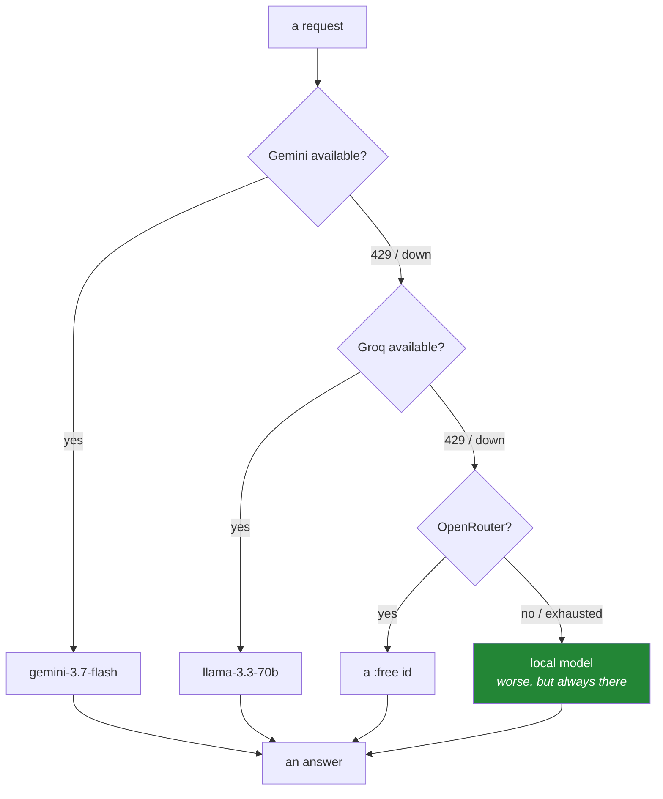

# 2.4 — Ollama — the door that needs no key, and the outage branch

## One-line answer

A model running on your own machine has no key, no quota and no network dependency, which makes it
the branch a system takes when every other door is closed — and its constraint is not rate limits but
**RAM**, which is a completely different kind of ceiling.

---

## The story

Someone is on a train, working on a project that classifies short text. There is no usable network for
two hours.

Everything that touches a provider is dead. Not slow — dead, with name-resolution errors. Two hours of
a journey that was going to be productive turn into two hours of writing code that cannot be run.

A colleague on the same project has a local model installed. Their pipeline notices the provider is
unreachable, falls through to the local model, and keeps working. The answers are noticeably worse —
a small model on a laptop is not a large one in a data centre — but the *pipeline* runs end to end,
the code paths get exercised, the bugs that are about plumbing rather than about quality all surface
and get fixed.

Same two hours. One person debugged their system; the other waited for a network.

The second half of the story is less romantic and more common. Months later, in an ordinary week with
excellent connectivity, a provider has an incident. Everything that depends on it stops. The one
service that keeps serving — worse, but serving — is the one with a local fallback, and the reason is
identical: **it has a path that does not depend on anybody else.**

---

## The idea in plain language

### Local inference, in one paragraph

You download a model's weights onto your machine and run it there. A local runner such as Ollama
handles the awkward parts — fetching weights, loading them into memory, exposing a small HTTP API on
localhost — so calling a local model looks almost exactly like calling a remote one, except the
request never leaves the machine.

No key. No quota. No per-request cost. No provider to be down.

### What you trade for that

Nothing is free, and the trades here are large enough to be the whole design question:

| | Hosted door | Local door |
|---|---|---|
| Credential | required | none |
| Rate limit | requests and tokens | **none** |
| Cost per call | free tier, then money | zero |
| Quality | large models | markedly smaller models |
| Speed | fast, and not yours to control | depends entirely on your hardware |
| The ceiling | rate limits | **RAM** |
| Privacy | data leaves your machine | data never leaves |
| Availability | someone else's uptime | yours |

The two rows worth dwelling on are the last two and the one about RAM.

### RAM is the limit, and it is a hard one

A model must fit in memory to run. The rough arithmetic: a model's memory requirement is
approximately its **parameter count times the bytes per parameter**, plus overhead for the context
being processed.

Weights are usually distributed **quantized** — stored at reduced precision to shrink them. At roughly
four bits per parameter, a seven-billion-parameter model needs somewhere near four gigabytes of RAM
plus context overhead; at eight bits, roughly double that. Those numbers are approximations to reason
with, not specifications.

The consequence is unlike anything in the hosted world. A rate limit says *wait and try again*. RAM
says **no**. Either the model fits or it does not, and the failure is immediate, total, and unaffected
by patience. When it *nearly* fits, the operating system starts swapping to disk and the model
technically runs at a speed that makes it useless — which is arguably worse than a clean failure,
because it looks like it is working.

### Privacy is the underrated half

Because the request never leaves the machine, a local model is the only one of the four doors that can
see data you are not allowed to send anywhere. Recall from
[2.1](2.1-gemini-the-workhorse.md) that free-tier prompts may be used for training — that rules out
private data on any of the hosted doors in this project.

So the honest framing is not "local is the fallback for when things break". It is: **local is the door
for data that cannot leave, and it happens to also be the door that works when nothing else does.**



That cascade is the Day 172 router. Today you build its last branch, because the last branch is the
one that determines whether the system has a floor at all.

---

## Why Setu needs it

- **Plan Part 2.1 names this the offline fallback** — "the provider outage branch" — and the Day 172
  router's final `else` is this call.
- **Principle 5 is zero budget, and this door cannot cost anything by construction.** For any loop
  that would otherwise burn a daily allowance to test its own plumbing, the local model is the right
  place to develop against.
- **Day 200's human-in-the-loop work** and Day 232's checkpointed graph both need a model that answers
  reliably while you interrupt, resume and time-travel a run dozens of times. Doing that against a
  daily quota is painful; doing it locally is free.
- **Embeddings in this plan are always local** (`sentence-transformers`, plan Part 2). This part is
  where the idea of "the model runs on your machine" first appears, and the whole RAG phase from Day
  155 rests on it.
- **The RAM ceiling is the same constraint** you will meet fitting a neural network on Day 130 and
  loading a transformer on Day 138. Meeting it on a language model first, where the arithmetic is
  simple, makes it familiar.

---

## The mechanism

This door is **optional** — it needs a several-gigabyte download and enough RAM, and neither is
guaranteed on every machine. Skipping it does not block the day's gate
([5.1](../05-the-gate/5.1-the-phase-0-gate.md)); it does mean the router's last branch is missing
until you come back to it.

First, find out whether your machine can host a model at all:

```bash
uv run python -c "
import shutil, os
total, used, free = shutil.disk_usage('.')
print(f'disk free : {free / 1e9:,.1f} GB')
try:
    if hasattr(os, 'sysconf') and 'SC_PAGE_SIZE' in os.sysconf_names:
        ram = os.sysconf('SC_PAGE_SIZE') * os.sysconf('SC_PHYS_PAGES')
        print(f'RAM total : {ram / 1e9:,.1f} GB')
    else:
        print('RAM total : check your system monitor (no portable API here)')
except Exception as exc:
    print('RAM total : could not determine -', exc)
print()
for params_b, bits in ((3, 4), (7, 4), (7, 8), (13, 4)):
    need = params_b * 1e9 * bits / 8 / 1e9
    print(f'{params_b}B params at {bits}-bit  ->  ~{need:,.1f} GB of weights, plus context overhead')
"
```

**Line by line:**

- `shutil.disk_usage('.')` — total, used and free bytes for the filesystem holding the current
  directory. Model weights are large; running out of disk mid-download is a slow way to learn this.
- `os.sysconf('SC_PAGE_SIZE') * os.sysconf('SC_PHYS_PAGES')` — physical memory, on systems that expose
  it. **This is not portable**, which is why it sits behind a check and falls back to telling you to
  look yourself. Pretending a portable API exists would be a lie in the lesson.
- `except Exception as exc` — deliberately broad here, because this block is a *diagnostic* and any
  failure inside it must not stop the useful part below. That is the narrow case where a broad catch
  is right, and it is worth naming as an exception to the rule from
  [Day 2, 1.2](../../../day-02-quality-gate/parts/01-linting/1.2-choosing-rule-families.md).
- `params_b * 1e9 * bits / 8 / 1e9` — parameters times bits per parameter, divided by eight for bytes,
  divided by a billion for gigabytes. **Do this arithmetic yourself once**; after that you can look at
  any model name and know immediately whether it fits.
- The table it prints is the whole decision. If your free RAM is under the number for a size, that
  model will not run usefully — not slowly, not eventually. Choose a smaller one.

Then install the runner and pull one small model. This is a system tool rather than a Python package,
so it does not go in `pyproject.toml`:

```bash
# Install from the project's own instructions - a system binary, not a Python dependency.
# See https://ollama.com/download ; then:

ollama --version
ollama pull llama3.2:3b        # a small model chosen to fit; check the size table above first
ollama list
```

**Line by line:**

- `ollama --version` first — confirm the binary is installed and on your `PATH` before asking it to
  download several gigabytes.
- `ollama pull <model>:<tag>` — fetch weights. The tag after the colon names the size and quantization
  variant, and it is a **pin** in exactly the sense of
  [Day 1, 1.2](../../../day-01-pins/parts/01-versions/1.2-version-specifiers.md): `llama3.2` alone
  would take whatever the default is today, while `llama3.2:3b` names what you chose.
- `3b` — three billion parameters, which by the table above needs somewhere near two gigabytes at
  four-bit quantization. Deliberately small: this door's job is *availability*, not quality, and a
  model that fits comfortably is worth more here than one that nearly does not.
- `ollama list` — what is on disk, with sizes. Run it occasionally; model files accumulate and each is
  gigabytes.
- Note this is **not** in `pyproject.toml`. It is a system dependency like git or uv from
  [Day 0](../../../day-00-setup/parts/01-toolchain/1.3-uv-the-one-binary.md), and it belongs in the
  README's prerequisites rather than in the lockfile.

Now call it — with no key, over localhost:

```python
"""One local call. No key, no quota, no network beyond this machine."""

from __future__ import annotations

import json
import urllib.error
import urllib.request

ENDPOINT = "http://localhost:11434/api/generate"
MODEL = "llama3.2:3b"  # typed out, tag included (Principle 4)


def ask(prompt: str, timeout: float = 120.0) -> str:
    """Send one prompt to the local runner. Raises if it is not running."""
    payload = json.dumps({"model": MODEL, "prompt": prompt, "stream": False}).encode("utf-8")
    request = urllib.request.Request(
        ENDPOINT,
        data=payload,
        headers={"Content-Type": "application/json"},
    )
    try:
        with urllib.request.urlopen(request, timeout=timeout) as response:
            return json.load(response)["response"]
    except urllib.error.URLError as exc:
        raise RuntimeError(
            f"the local runner is not answering on {ENDPOINT} - is it running? ({exc.reason})"
        ) from exc


if __name__ == "__main__":
    print("model :", MODEL)
    print("output:", ask("Reply with exactly the word: ready").strip())
```

**Line by line:**

- `http://localhost:11434/api/generate` — plain HTTP, to your own machine, on the runner's default
  port. **`http` rather than `https` is correct here** and only here: the request never leaves the
  loopback interface, so there is nothing between you and the server to encrypt against. The same URL
  pointed at another machine would need TLS.
- `urllib.request` from the standard library — no SDK needed for one JSON endpoint, and adding a
  dependency for it would violate the "packages arrive when first genuinely needed" rule from
  [Day 1](../../../day-01-pins/LESSON.md).
- `"stream": False` — ask for the complete response in one payload. The streaming mode returns
  newline-delimited JSON objects, which is better for a user interface and much more code; explicitly
  turning it off is a decision rather than a default
  ([2.1](2.1-gemini-the-workhorse.md)).
- `.encode("utf-8")` — the request body must be bytes. Forgetting this produces a
  `TypeError: POST data should be bytes`, which is the single most common mistake with `urllib`.
- `timeout: float = 120.0` — far longer than the hosted doors' thirty seconds. A small model on a
  laptop CPU is genuinely slow, and a timeout tuned for a data centre will abort a working local call.
  **The right timeout is a property of the backend, not a constant**, which is a thing the Day 172
  router has to carry per branch.
- `except urllib.error.URLError` — the specific error for "could not reach the server", re-raised with
  a message that names the actual cause. Connection refused here means the runner is not started, and
  saying so saves the reader a search.
- `json.load(response)["response"]` — this API's field name for the generated text. A fourth door, a
  fourth response shape ([2.3](2.3-openrouter-perishable-free.md)) — and the clearest possible
  argument for a router.

---

## When it breaks

**The runner is not running:**

```text
RuntimeError: the local runner is not answering on http://localhost:11434/api/generate -
  is it running? ([Errno 111] Connection refused)
```

**What it means.** Connection refused is specific: something tried to reach that port and nothing was
listening. Start the service. Note that this is a *different* failure from a name-resolution error —
`localhost` always resolves — and that difference is genuinely useful: a DNS failure means no network,
while a refused connection means the network is fine and the process is absent.

**The model was never pulled:**

```text
{"error":"model 'llama3.2:3b' not found, try pulling it first"}
```

**What it means.** The runner is up but has no such weights on disk. `ollama pull llama3.2:3b`. Watch
for the tag: `llama3.2` and `llama3.2:3b` are different entries, and pulling one does not give you the
other.

**The one that is unique to this door:**

```text
Error: model requires more system memory (5.6 GiB) than is available (3.2 GiB)
```

**What it means.** RAM, and there is no retry that helps. This is the ceiling from the arithmetic
above, stated by the runner. The options are all of the form *use less*: a smaller model, a more
aggressively quantized variant, a shorter context, or closing other applications. **This failure is
categorically different from a 429** — waiting changes nothing.

**The worse version, which does not raise at all:**

```text
$ time ollama run llama3.2:3b "hello"
...
real    4m51.203s
```

**What it means.** The model *nearly* fits, so the operating system is swapping pages to disk to keep
it resident. Everything works and nothing is usable. Watch for disk activity and a load average that
does not match the work. The fix is the same as above, and the lesson is that **the dangerous
resource failure is the one that degrades instead of stopping.**

**And the quality surprise:**

```text
output: I'd be happy to help! Here's the word you requested:

ready
```

...where the prompt said "reply with exactly the word: ready". **What it means.** Nothing is broken. A
three-billion-parameter model follows instructions less precisely than a large hosted one, and any
code that string-matches an exact response will fail against it while passing against the others. This
is the real cost of the fallback branch, and it is why a router must not assume the branches are
interchangeable — a downstream parser that works on one door may not work on another.

---

## In production

**A fallback that is never exercised is not a fallback.** The branch that only runs during an incident
is the branch that has never been tested, and it fails at exactly the moment it was supposed to help.
Mature systems force traffic down the fallback path deliberately and regularly — a percentage of
requests, or a scheduled drill — so that its bugs are found on an ordinary Tuesday. If you build the
Day 172 router with a local branch, put a test on that branch that runs every day.

**Degraded is a first-class state, and it must be visible.** Silently answering from a much weaker
model is worse than failing, because the caller believes they got the normal answer. Every response
should carry which door produced it, downstream consumers should be able to see that, and the
switch should raise an alert rather than only a log line. This is the same principle as recording the
model id in [2.3](2.3-openrouter-perishable-free.md): **a result without its provenance is not a
result.**

**Local inference has a genuine production role that has nothing to do with outages.** Data that
cannot legally leave a boundary — medical, financial, personal — can only be processed by a model
inside that boundary. That is a growing category, and it is why local and self-hosted inference is a
serious engineering discipline rather than a hobbyist's corner. The trade is explicit: you accept a
smaller model and you own the hardware, in exchange for the data never moving.

**What changes at scale:** on a server, the ceiling becomes GPU memory rather than system RAM, and the
new problems are batching (several requests through one model load), keeping the model resident so you
do not pay the load time per request, and deciding how many concurrent requests one instance can hold
given that each one's context consumes memory too. The arithmetic is the same arithmetic you did
above, with a different number for the total — which is why doing it once by hand today is worth more
than reading a deployment guide later.

**The review comment a senior engineer leaves.** On a router with a local fallback: *"Is anything
testing this branch? And does the response say which backend answered — because if we silently drop to
the 3B model, our downstream parser breaks and nobody will know why."*

**The interview question.** *"When would you run a model locally instead of calling an API?"* The weak
answer is "to save money". The answer that lands names three distinct reasons and their trade-offs:
**data that cannot leave the boundary**, which is a requirement rather than a preference;
**availability**, as a fallback that works when a provider is down, provided it is exercised regularly;
and **cost at high volume**, where per-request pricing eventually loses to owned hardware. Then name
what you give up — a much smaller model, your own hardware ceiling, and the operational burden of
running it — and finish with the RAM arithmetic, because a candidate who can say "a 7B model at 4-bit
is roughly 4 GB of weights plus context" has clearly loaded one.

---

## Check yourself

```bash
ollama list
curl -s http://localhost:11434/api/generate -d '{"model":"llama3.2:3b","prompt":"Reply with exactly the word: ready","stream":false}' | head -c 400; echo
```

The first shows what is on disk and how large it is. The second is the whole door, in one command, with
no key anywhere in it. If you skipped this part, note in your lab log that the router's last branch is
still missing — it is a real gap, not a finished decision.

**Answer out loud, without scrolling up:**

> Give the two reasons to run a model locally that are *not* about saving money. Then explain why a
> RAM failure is categorically different from a 429, and describe the local failure mode that is worse
> than an error.

---

**Next:** [3.1 — Supabase: a Postgres that pauses](../03-databases/3.1-supabase-a-postgres-that-pauses.md)
