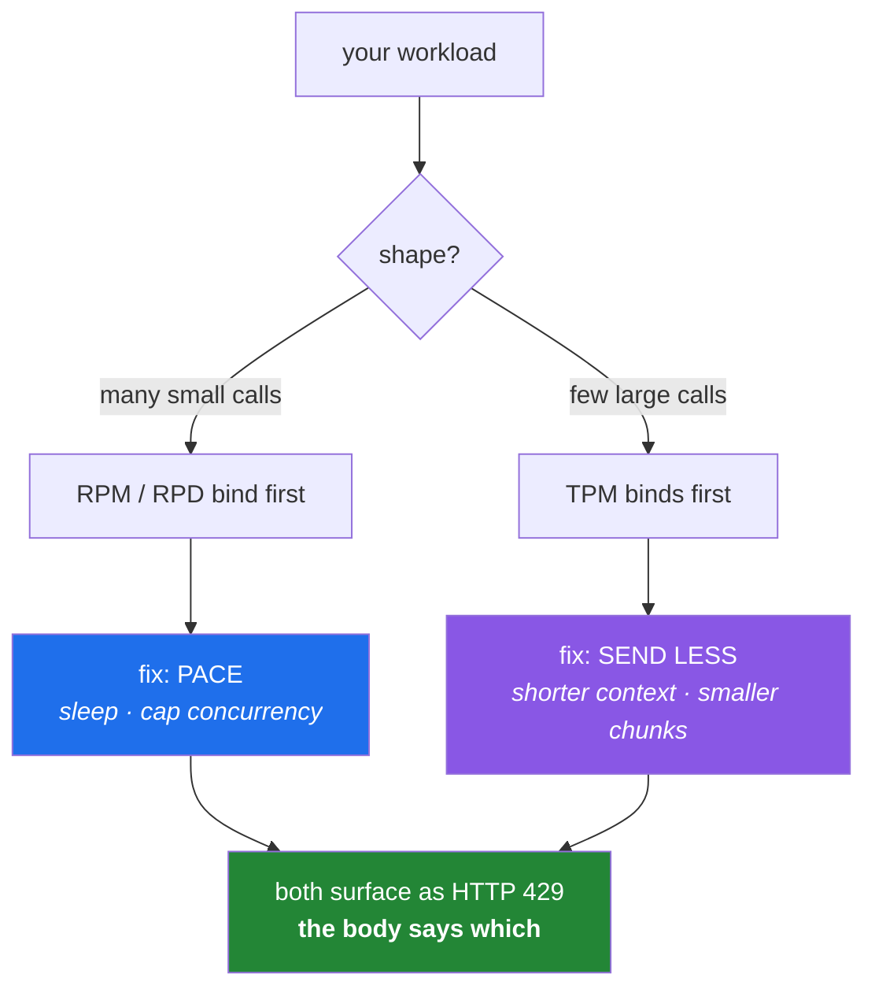

# 4.1 — RPM, RPD, TPM — the three limits, and which one you hit first

## One-line answer

A provider does not have one limit; it has several, counting different things over different windows —
and the one that binds your particular workload is the only one that matters, so the useful skill is
**estimating which it will be before you write the loop**.

---

## The story

Two people are building on the same free tier, on the same day.

The first is running a classification job: three thousand short strings, one call each, a few dozen
tokens per call. Their code runs for four minutes and stops with a limit error. The number in the
message is a **requests per minute** ceiling. They add a small pause between calls and it completes.

The second is summarising forty long documents. Forty calls — nothing, by any request-count measure —
and it fails on the eighth. The number in *their* message is **tokens per minute**, because each of
their calls carries thirty thousand tokens of document. Adding a pause between calls helps, but the
real fix is to send less: summarise sections rather than whole documents.

Same provider. Same free tier. Same day. Two completely different failures, and — this is the part
that matters — **two completely different fixes.** Pausing between calls would have done almost
nothing for the second person if their documents had been twice as long.

Neither had estimated anything in advance. Both discovered their binding constraint by hitting it,
which is the expensive way, and both then applied the fix that had worked for the *other* kind of
failure before working out that they had a different kind.

---

## The idea in plain language

### A limit is three things: a quantity, a window, and a scope

Every rate limit answers three questions, and confusing any of them produces the story:

- **What is counted?** Requests, or tokens. Sometimes both, separately.
- **Over what window?** A minute, a day. Sometimes both, separately.
- **Scoped to what?** A key, a project, an organisation, a model. This one is the least visible and
  the most surprising.

Combine the first two and you get the vocabulary:

| Abbreviation | Counts | Window | Binds when |
|---|---|---|---|
| **RPM** | requests | per minute | a tight loop of small calls |
| **RPD** | requests | per day | a long batch job; a busy CI |
| **TPM** | tokens | per minute | few calls, large prompts |
| **TPD** | tokens | per day | sustained volume of large calls |

All four can be in force at once. **You are constrained by whichever you reach first**, and that
depends entirely on the shape of your workload rather than on the provider's generosity.

### The two shapes, and their two different fixes

This is the whole part, in a table:

| | Many small calls | Few large calls |
|---|---|---|
| Binds on | RPM, then RPD | TPM |
| Feels like | "I'm being throttled" | "I've barely made any calls" |
| The fix | **pace**: sleep between calls, cap concurrency | **send less**: shorter context, chunk smaller, summarise first |
| The wrong fix | sending less (barely helps) | pacing (helps a little, not enough) |

The reason the wrong fix is tempting is that both failures produce the same HTTP status. `429` covers
every rate limit there is, so the code tells you nothing about which one you hit. **The message body
tells you, and reading it is the skill** — you saw exactly that in
[2.2](../02-llm-doors/2.2-groq-and-the-token-wall.md), where the error named `tokens per minute`, the
limit, the amount used, and how long to wait.

### The scope trap

Limits are often applied per **organisation** or per **project**, not per key. So a second key on the
same account does not double your allowance, and a colleague's batch job can exhaust the limit your
service depends on.

The practical implications are worth stating plainly:

- Creating another key to "get more quota" usually does nothing.
- Two workloads sharing an account contend, invisibly to each other.
- On a shared account, your available headroom is not a number you control.

For this project — one person, one account — scope is simple. Knowing that it will not stay simple is
what stops it being a surprise later.

### Per-day limits behave completely differently from per-minute ones

Worth separating, because it changes what your code should do:

- A **per-minute** limit clears in under a minute. Waiting is a correct and cheap response.
- A **per-day** limit clears at a reset time that may be many hours away. Waiting is not a strategy;
  it is a program that achieves nothing until tomorrow.

Code that treats both the same will retry a daily limit in a loop for hours. That distinction is the
core of [4.2](4.2-429-and-real-backoff.md).



---

## Why Setu needs it

- **Principle 5 says every lab declares its request budget**, and after this part that declaration has
  units. A budget counting only calls is wrong for exactly the workloads where it matters.
- **The plan's Part 2.1 describes each door in these terms** — Gemini "tens of RPM, hundreds–low
  thousands RPD"; Groq "very fast, generous RPD, tight TPM"; OpenRouter "low RPD". Those sentences are
  now readable rather than jargon.
- **Phase 14 classifies a text dataset** — thousands of small calls, the first shape. **Phase 19's RAG
  work** sends retrieved context with every question — the second shape. Both arrive within this plan.
- **Day 233's eval suite** runs a rubric across many answers on every change; without an estimate first,
  it is a daily allowance spent in one run.
- **The Day 172 router's fallback logic** decides *which door* based on which limit was hit, so the
  distinction is not academic — it is a branch in code you will write.

---

## The mechanism

Read the actual limits, from the provider, today — they change, which is why this part gives you a
method and not a table:

```bash
echo "Open each of these and write today's numbers into your lab notes:"
echo "  Gemini     https://ai.google.dev/gemini-api/docs/rate-limits"
echo "  Groq       https://console.groq.com/docs/rate-limits"
echo "  OpenRouter https://openrouter.ai/docs/api-reference/limits"
echo
echo "For each, record: RPM, RPD, TPM, TPD (where published), and the SCOPE."
```

**Line by line:**

- These are links rather than fetched values because **a rate limit written into a lesson is wrong
  within months**. Recording today's numbers with today's date is the Day 1 habit
  ([Day 1, 3.3](../../../day-01-pins/parts/03-freezing/3.3-regenerating-pins-from-evidence.md)):
  generated facts carry a verification date, and this is a fact you generate by reading.
- **Record the scope**, not only the numbers. "Sixty RPM" means something different per key than per
  organisation, and the page usually says which.
- Some dimensions are not published at all. Write "not published" rather than leaving a blank —
  the absence is information, and it means you will have to discover that limit empirically.

Now the estimate, which is the actual skill. Do this *before* writing any loop:

```python
"""Estimate which limit a planned workload will hit first - before writing the loop."""

from __future__ import annotations

from dataclasses import dataclass


@dataclass(frozen=True)
class Limits:
    """One provider's published ceilings. Fill from the pages above, with today's date."""

    name: str
    rpm: int | None
    rpd: int | None
    tpm: int | None


@dataclass(frozen=True)
class Workload:
    """What you are about to run."""

    calls: int
    tokens_in_per_call: int
    tokens_out_per_call: int
    seconds_per_call: float

    @property
    def tokens_per_call(self) -> int:
        return self.tokens_in_per_call + self.tokens_out_per_call

    @property
    def total_tokens(self) -> int:
        return self.calls * self.tokens_per_call


def binding_limit(work: Workload, limits: Limits) -> list[str]:
    """Every ceiling this workload would breach at full speed, worst first."""
    if work.seconds_per_call <= 0:
        raise ValueError("seconds_per_call must be positive")

    calls_per_minute = 60.0 / work.seconds_per_call
    tokens_per_minute = calls_per_minute * work.tokens_per_call

    breaches: list[tuple[float, str]] = []
    if limits.rpm and calls_per_minute > limits.rpm:
        breaches.append(
            (calls_per_minute / limits.rpm, f"RPM: {calls_per_minute:,.0f} > {limits.rpm:,}")
        )
    if limits.tpm and tokens_per_minute > limits.tpm:
        breaches.append(
            (tokens_per_minute / limits.tpm, f"TPM: {tokens_per_minute:,.0f} > {limits.tpm:,}")
        )
    if limits.rpd and work.calls > limits.rpd:
        breaches.append((work.calls / limits.rpd, f"RPD: {work.calls:,} > {limits.rpd:,}"))

    breaches.sort(reverse=True)
    return [text for _, text in breaches] or ["none - this workload fits"]


if __name__ == "__main__":
    provider = Limits(name="example", rpm=30, rpd=1_500, tpm=15_000)

    classify = Workload(
        calls=3_000, tokens_in_per_call=40, tokens_out_per_call=5, seconds_per_call=0.4
    )
    summarise = Workload(
        calls=40, tokens_in_per_call=30_000, tokens_out_per_call=300, seconds_per_call=6.0
    )

    for label, work in (("many small calls", classify), ("few large calls", summarise)):
        print(f"\n{label}: {work.calls:,} calls, {work.total_tokens:,} tokens total")
        for line in binding_limit(work, provider):
            print("   breach ->", line)
```

**Line by line:**

- `@dataclass(frozen=True)` — a class whose fields are set once and cannot be reassigned. `frozen`
  makes it clear these are *records of facts*, not mutable state, and it is the shape Day 19 uses for
  every configuration object in this project (`PY-23`).
- `rpm: int | None` — a limit that may not be published. `None` is meaningfully different from `0`, and
  every check below skips a `None` rather than treating it as a ceiling of zero.
- `@property def tokens_per_call` — computed from the two halves. **Both input and output tokens count**
  against a token limit, and separating them in the input while summing them here is what makes that
  visible ([2.2](../02-llm-doors/2.2-groq-and-the-token-wall.md)).
- `calls_per_minute = 60.0 / work.seconds_per_call` — the projection: if you fire these back to back,
  this is your rate. Measure `seconds_per_call` from one real call rather than guessing, which is what
  [2.2](../02-llm-doors/2.2-groq-and-the-token-wall.md)'s timing block was for.
- `breaches.append((ratio, text))` — store **how badly** each ceiling is breached alongside the
  description, so sorting puts the worst first. A workload can breach several at once, and the largest
  ratio is the one that will bite first and hardest.
- `breaches.sort(reverse=True)` — sorts tuples by their first element, the ratio. This works because
  tuple comparison compares element by element; it is a neat idiom and worth recognising.
- `return [...] or ["none - this workload fits"]` — an empty list is falsy, so `or` supplies the
  message. Compact, and readable once you know that every empty container in Python is falsy — Day 5's
  subject (`PY-04`).
- The two example workloads are the story's two people. Run it: the first breaches RPM and RPD, the
  second breaches TPM on forty calls. **Two shapes, two verdicts, from the same provider.**

Then check the estimate against reality, cheaply:

```python
"""One real call, to replace the guesses in the estimate above with measurements."""

from __future__ import annotations

import time

from ask_groq import ask  # part 2.2

PROMPT = "Classify the sentiment of this sentence as positive or negative: 'the train was late'"

start = time.perf_counter()
text, raw = ask(PROMPT)
elapsed = time.perf_counter() - start

print(f"seconds_per_call     : {elapsed:.2f}")
print(f"tokens_in_per_call   : {raw.usage.prompt_tokens}")
print(f"tokens_out_per_call  : {raw.usage.completion_tokens}")
print(
    f"-> at full speed     : {60 / elapsed:,.0f} calls/min, "
    f"{raw.usage.total_tokens * 60 / elapsed:,.0f} tokens/min"
)
```

**Line by line:**

- One call, one measurement, then arithmetic. **The cost of estimating is a single request**, which is
  the entire argument for doing it: you spend one request to find out whether a job of three thousand
  will survive.
- `raw.usage.prompt_tokens` and `completion_tokens` — the measured values that replace the guesses in
  the `Workload`. Guessing token counts from character counts is fine for an order of magnitude and
  wrong by enough to matter near a ceiling.
- `time.perf_counter()` — the monotonic timer, for the reason given in
  [2.2](../02-llm-doors/2.2-groq-and-the-token-wall.md).
- Feed these three numbers back into the estimator and re-run it. **That loop — measure one, project
  many, compare against published limits — is the whole method**, and it takes about a minute.

---

## When it breaks

**A per-minute limit, which is the recoverable kind:**

```text
429 - {'error': {'message': 'Rate limit reached ... on requests per minute (RPM):
  Limit 30, Used 30, Requested 1. Please try again in 2.1s.', 'type': 'requests'}}
```

**What it means.** You are going faster than permitted; wait the stated time and continue. The correct
long-term response is pacing — put a small sleep in the loop or cap concurrency so you sit under the
ceiling by design rather than bouncing off it
([4.2](4.2-429-and-real-backoff.md)).

**A token limit, on very few calls:**

```text
429 - {'error': {'message': 'Rate limit reached ... on tokens per minute (TPM):
  Limit 6000, Used 5800, Requested 900. Please try again in 7s.', 'type': 'tokens'}}
```

**What it means.** Your prompts are large. Pacing helps a little; the real fix is to send less —
shorter context, smaller chunks, or a cheaper first pass that decides what is worth sending. Note
`Requested 900`: **a single request can exceed a per-minute token limit all by itself**, in which case
no amount of waiting will ever let it through and the request must be made smaller.

**A daily limit, which is not the same thing at all:**

```text
429 - {'error': {'message': 'Quota exceeded for quota metric "Generate requests per day".
  Retry in 5h32m4s.'}}
```

**What it means.** You are done for the day on this door. **Retrying is actively harmful** — it wastes
your time and adds load. The right responses are: fall through to another provider
([2.2](../02-llm-doors/2.2-groq-and-the-token-wall.md), [2.4](../02-llm-doors/2.4-ollama-the-keyless-door.md)),
or stop and resume tomorrow. A retry policy that cannot tell this from the previous case will loop for
five and a half hours.

**The scope surprise:**

```text
429 - Rate limit reached for model X in organization org_abc123
```

...on a brand-new key you made specifically to avoid this. **What it means.** The limit is per
organisation, not per key. `organization org_abc123` in the message is the tell. Making more keys does
not make more quota, and on a shared account somebody else's job is consuming yours.

**And the one that is not a rate limit at all:**

```text
400 - {'error': {'message': "This model's maximum context length is 8192 tokens,
  however you requested 9500 tokens."}}
```

**What it means.** A **context window** limit, not a rate limit — the model cannot accept a prompt that
large in one request, ever, regardless of pacing. It is a 400, not a 429, which is the distinction to
read: *400 means never, 429 means not now.* The fix is chunking, and it is the reason Day 165 exists.

---

## In production

**Estimate before you build, and write the estimate down next to the code.** A comment saying "this
loop runs at roughly X calls/min and Y tokens/min against a limit of Z, measured on this date" is
worth more than any amount of retry logic, because it lets the next person see immediately whether a
change — bigger inputs, more concurrency, a second consumer — will break the assumption. Systems fail
at limits far more often because an assumption changed than because it was wrong originally.

**Design to sit under the limit, not to bounce off it.** Treating 429s as your pacing mechanism is
wasteful (every rejected request costs a round trip), fragile (retry storms), and antisocial. The
professional tool is a **token bucket** on the client side, sized from the published limit with a
margin: requests draw from a bucket that refills at a fixed rate, so you are self-limiting and 429s
become exceptional rather than routine. That margin matters — target seventy or eighty per cent of the
ceiling, because your estimate of token counts is approximate.

**Instrument headroom, not just errors.** By the time you are seeing 429s you are already degraded.
The useful signal is *how close to the ceiling you are running*, tracked over time, alerting when it
crosses a threshold. This is the same instinct as
[Day 2, 5.3](../../../day-02-quality-gate/parts/05-ci/5.3-caching-and-never-spending-a-quota.md)'s
observation that a suite which suddenly got slower has changed what it does: **watch the leading
indicator, not the failure.**

**What changes at scale:** limits become a capacity-planning problem rather than a coding one. You
negotiate higher ceilings, spread load across providers, queue work so that bursts flatten, and
prioritise — an interactive user request should get the quota before a background batch job. That last
one is worth naming: without explicit prioritisation, a batch job will happily starve your users,
because the limit does not know which request mattered.

**The review comment a senior engineer leaves.** On a new batch loop: *"What's the token throughput
here, and against which published limit? Add the estimate as a comment and a concurrency cap sized from
it. And check whether the limit is per key or per org — we already have two services on this
account."*

**The interview question.** *"How do you design a system around a third-party rate limit?"* The answer
that lands starts with measurement rather than with retries: estimate requests per minute and tokens
per minute from one real call, compare against each published dimension, and find which binds — because
the fix differs completely (pace for a request limit, reduce payload for a token limit). Then: pace
client-side with a token bucket sized to a fraction of the ceiling so 429s are exceptional; distinguish
per-minute from per-day, because retrying the latter is pointless; and monitor headroom rather than
errors. Mentioning that limits are often per organisation rather than per key — so a second key buys
nothing and a neighbouring service can starve you — is the detail that shows you have operated one of
these rather than read about it.

---

## Check yourself

```bash
uv run python -c '
seconds_per_call, tokens_per_call, total_calls = 0.4, 45, 3000
rpm, tpm, rpd = 30, 15000, 1500
cpm = 60 / seconds_per_call
verdict = lambda got, cap: "BREACH" if got > cap else "ok"
print(f"projected RPM: {cpm:,.0f} vs limit {rpm:,} -> {verdict(cpm, rpm)}")
print(f"projected TPM: {cpm * tokens_per_call:,.0f} vs limit {tpm:,} -> {verdict(cpm * tokens_per_call, tpm)}")
print(f"total calls  : {total_calls:,} vs RPD {rpd:,} -> {verdict(total_calls, rpd)}")
'
```

Substitute the real numbers you wrote into your lab notes and your own measured call, and read which
line says `BREACH`. That line names the fix.

**Answer out loud, without scrolling up:**

> Two people hit a 429 on the same free tier on the same day; one made three thousand calls and one
> made eight. Say which limit each hit and what the correct fix is for each — and why swapping the two
> fixes would mostly not work. Then give the difference between a `400` context-length error and a
> `429`.

---

**Next:** [4.2 — 429, and the backoff that is not a busy loop](4.2-429-and-real-backoff.md)
