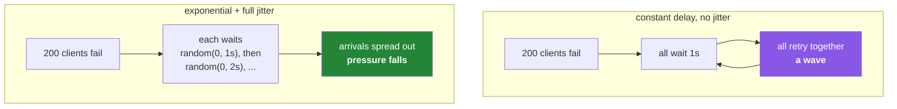

# 4.2 — 429, and the backoff that is not a busy loop

## One-line answer

A correct retry has four properties — it retries only what is **retryable**, waits **longer each
time**, adds **randomness** so many clients do not return together, and **stops** — and leaving any
one of them out turns a brief problem into a longer one.

---

## The story

A service depends on an upstream API. One afternoon the upstream slows down under load and starts
rejecting some requests.

The service has retry logic: on failure, wait one second and try again, up to fifty times. It seems
prudent. It was written by someone careful.

Two hundred instances of the service are running. All of them start retrying. Every one of them waits
exactly one second, so all two hundred return at the same instant — and then again a second later,
and again. The upstream, which was struggling with normal traffic, is now receiving a synchronised
wave of retries at a far higher rate than the original load.

It goes from slow to completely down.

When it eventually comes back, every instance is still retrying, so the recovery is met with the same
synchronised wave and it goes down again. This is a **retry storm**, and it is one of the classic ways
a partial outage becomes a total one.

The fix has three parts, and all three are one line each. Wait *longer* each time, so pressure falls
as the problem persists. Add a *random* component, so two hundred clients do not return in unison.
And *stop* after a few attempts, so a hopeless request does not occupy a worker for a minute.

The person who wrote that loop was being careful. Careful was not enough — the failure only appears
when many clients do the same careful thing at the same time, which is a property of the *system*
rather than of the code in front of you.

---

## The idea in plain language

### Retryable and non-retryable

Before anything about timing, the first question: **could this succeed if I tried again?**

| Failure | Retry? | Why |
|---|---|---|
| `429` per-minute limit | **yes** | The window clears in seconds |
| `429` per-day limit | **no** | It clears tomorrow ([4.1](4.1-rpm-rpd-tpm.md)) |
| `500`, `502`, `503` | **yes** | Server-side and usually transient |
| Connection timeout | **yes** | The network or a paused database ([3.1](../03-databases/3.1-supabase-a-postgres-that-pauses.md)) |
| `401` bad key | **no** | The key will not become valid |
| `404` model gone | **no** | It will not come back ([2.3](../02-llm-doors/2.3-openrouter-perishable-free.md)) |
| `400` context too long | **no** | The request is too big, permanently |

Two of those rows are the ones people get wrong. A `429` is **not always retryable** — the same status
covers "wait two seconds" and "come back in five hours". And a `400` is never retryable, however
temporary it feels: `400 means never, 429 means not now`.

Retrying a non-retryable failure is worse than not retrying at all, because it turns an instant, clear
error into a slow, misleading one.

### Exponential backoff

Wait longer after each failure: one second, then two, then four, then eight. The delay for attempt *n*
is `base * 2**(n-1)`.

The reason is that a persisting failure usually means the far side is under pressure, and pressure is
relieved by *less* traffic. A constant retry interval applies the same pressure forever; an
exponential one backs off in proportion to how bad things seem to be.

### Jitter — the line everybody omits

Exponential backoff alone does not fix the story. Two hundred clients that all fail at the same moment
will all wait one second, then all wait two, then all wait four — **synchronised the whole way down.**
The waves get further apart and they are still waves.

**Jitter** is randomness added to the delay so the clients spread out. The simplest effective form is
*full jitter*: instead of waiting exactly the computed delay, wait a random amount between zero and
that delay.

```text
delay = random.uniform(0, base * 2 ** (attempt - 1))
```

That single change converts a synchronised wave into a smooth spread. It is one line, it is the least
intuitive part of the whole pattern, and it is the part most retry code is missing.



### Respect `Retry-After` when you are given it

Many providers say exactly how long to wait — in a `Retry-After` header, or in the error body as you
saw in [2.2](../02-llm-doors/2.2-groq-and-the-token-wall.md) (`Please try again in 3s`).

**When the server tells you, use its number.** It knows when your window resets and your exponential
formula does not. Your own backoff is the fallback for when nothing was said.

### And it must stop

A bounded number of attempts, or a deadline. Unbounded retrying holds a worker, hides an outage from
your monitoring, and turns "one request failed" into "the system is wedged". When the attempts are
exhausted, fail — clearly, with the original error attached.

The four properties, together: **retryable only · exponential · jittered · bounded.** Any three of
them is a bug waiting for enough clients.

---

## Why Setu needs it

- **Every door in section 2 returns 429s**, and the free tiers this plan runs on return them routinely
  rather than exceptionally (Principle 5).
- **The Day 172 router is built on this decision.** Its logic is exactly the table above: retry here,
  fall through to another door there, stop entirely for a daily limit.
- **[3.1](../03-databases/3.1-supabase-a-postgres-that-pauses.md)'s `wake_db` is a retry** with a fixed
  delay, which is correct there because the wait is roughly known. This part is what to do when it is
  not.
- **Day 14 builds `@retry(3)` as a decorator** (`PY-16`), reused in every later phase. The decorator is
  the packaging; the four properties are the content, and it is worth knowing them before you wrap them
  in syntax.
- **Principle 12 gates external writes behind a human.** A retry is an *automatic* repeat of a request,
  so a retried write is a repeated side effect — which is why idempotency appears in the production
  section below rather than being an advanced topic.

---

## The mechanism

First, see the shape of the delays, with and without jitter:

```python
"""What the four properties actually do to the numbers."""

from __future__ import annotations

import random

BASE = 1.0
ATTEMPTS = 6

random.seed(0)  # Principle 4: even randomness is pinned

print(f"{'attempt':>8} {'exponential':>12} {'full jitter':>12}")
for attempt in range(1, ATTEMPTS + 1):
    exponential = BASE * 2 ** (attempt - 1)
    jittered = random.uniform(0, exponential)
    print(f"{attempt:>8} {exponential:>11.2f}s {jittered:>11.2f}s")

print()
print("total wait, exponential:", sum(BASE * 2 ** (n - 1) for n in range(1, ATTEMPTS + 1)), "s")
```

**Line by line:**

- `random.seed(0)` — Principle 4 says `random_state=` on every estimator, and the same instinct applies
  here: a demonstration whose numbers change every run cannot be discussed. In *production* retry code
  you would **not** seed, because unseeded randomness is the entire point of jitter — two clients
  seeded identically are back in unison.
- `BASE * 2 ** (attempt - 1)` — the exponential schedule: 1, 2, 4, 8, 16, 32. Note the `- 1` so the
  first attempt waits `BASE` rather than `2 * BASE`.
- `random.uniform(0, exponential)` — **full jitter**: anywhere between zero and the computed delay.
  Some implementations use "equal jitter" (half the delay plus a random half), which spreads slightly
  less but never waits near zero. Full jitter is the simplest and performs well.
- The total-wait line is the number people forget. Six attempts at this base is more than a minute of
  waiting — which is far too long for a request a user is waiting on, and possibly fine for a
  background job. **The schedule must be chosen against the caller's patience**, not copied from a
  blog post.

Now the retry itself, with all four properties and nothing else:

```python
"""A retry that retries only what is retryable, backs off, jitters, and stops."""

from __future__ import annotations

import random
import time
from collections.abc import Callable
from typing import TypeVar

T = TypeVar("T")


class Retryable(Exception):
    """Raised by a caller's classifier when a failure is worth another attempt."""

    def __init__(self, message: str, retry_after: float | None = None) -> None:
        super().__init__(message)
        self.retry_after = retry_after


def with_backoff(
    operation: Callable[[], T],
    *,
    attempts: int = 5,
    base: float = 1.0,
    cap: float = 30.0,
) -> T:
    """Call operation, retrying only Retryable failures. Everything else propagates."""
    last: Retryable | None = None
    for attempt in range(1, attempts + 1):
        try:
            return operation()
        except Retryable as exc:
            last = exc
            if attempt == attempts:
                break
            if exc.retry_after is not None:
                delay = exc.retry_after
                source = "server"
            else:
                delay = random.uniform(0, min(cap, base * 2 ** (attempt - 1)))
                source = "backoff"
            print(f"attempt {attempt}/{attempts} failed; waiting {delay:.2f}s ({source})")
            time.sleep(delay)
    raise RuntimeError(f"gave up after {attempts} attempts") from last
```

**Line by line:**

- `class Retryable(Exception)` — the caller decides what is retryable and signals it by raising this.
  The retry helper stays ignorant of any provider's error taxonomy, which is what lets one helper serve
  four different doors. Custom exceptions are Day 18's subject (`PY-22`); this is the shape.
- `retry_after: float | None` — carries the server's own instruction when there was one. **The server's
  number always wins**, because it knows when your window resets.
- `*` in the signature — everything after it is **keyword-only**. `with_backoff(op, 5, 1.0, 30.0)` is
  unreadable and cannot be reviewed; forcing `attempts=5` makes every call site self-documenting.
- `except Retryable` and nothing else — a `401` or a `400` is not a `Retryable`, so it propagates
  immediately on the first attempt. **This is the most important line in the file**: the narrowness is
  the correctness.
- `if attempt == attempts: break` — do not sleep after the final attempt. Sleeping and then giving up
  wastes the caller's time for no possible benefit, and it is an extremely common off-by-one.
- `min(cap, base * 2 ** (attempt - 1))` — a ceiling on the delay. Without it, attempt ten waits over
  eight minutes; the exponential must be bounded or it stops being a schedule and becomes a hang.
- `random.uniform(0, ...)` — full jitter, **unseeded**. This is where the demonstration's `random.seed`
  must not appear.
- `raise RuntimeError(...) from last` — fail clearly, chaining the last real error so the traceback
  still shows what actually went wrong. Losing the original exception is how a retry wrapper turns a
  diagnosable failure into "gave up".

And the classifier, which is where provider knowledge lives:

```python
"""Turn one provider's errors into a retryable/not decision. Per provider, deliberately."""

from __future__ import annotations

import re

DAILY = re.compile(r"per\s*day|RPD|requests per day|Generate requests per day", re.I)
WAIT_HINT = re.compile(r"try again in\s*([0-9.]+)\s*s", re.I)


def classify(status: int, body: str) -> tuple[bool, float | None]:
    """Return (is_retryable, retry_after_seconds)."""
    if status in (500, 502, 503, 504):
        return True, None
    if status == 429:
        if DAILY.search(body):
            return False, None  # clears tomorrow - retrying is pointless (part 4.1)
        hint = WAIT_HINT.search(body)
        return True, float(hint.group(1)) if hint else None
    return False, None  # 400, 401, 403, 404 - none of these improve with time
```

**Line by line:**

- `status in (500, 502, 503, 504)` — server-side failures, transient by nature. Note `501` is absent:
  "not implemented" will not become implemented.
- `if status == 429:` then the **daily check first** — the most specific condition before the general
  one, the same ordering discipline as
  [Day 1, 4.2](../../../day-01-pins/parts/04-drift/4.2-drift-and-the-amendment-protocol.md)'s
  `classify`. Getting this backwards means every daily limit is retried as if it were a per-minute one.
- `DAILY` as a compiled pattern with alternatives — different providers word it differently
  ([2.1](../02-llm-doors/2.1-gemini-the-workhorse.md) says "Generate requests per day",
  [2.2](../02-llm-doors/2.2-groq-and-the-token-wall.md) says "requests per day (RPD)"). This is
  string-matching an error message, which is genuinely fragile — prefer a structured field where the
  SDK exposes one, and treat this as the fallback.
- `WAIT_HINT` extracting the number from "try again in 3s" — the server's own instruction, turned into
  a float. Capturing it is what makes the `retry_after` path above possible.
- `return False, None` as the final line — **default to not retrying.** An unrecognised failure is not
  known to be transient, and the safe assumption is the one that fails fast rather than the one that
  loops.
- This function is **pure**: no network, no clock, no sleeping. That makes it directly testable, which
  is why the day's build brief asks for a test of it rather than of the sleeping wrapper
  ([Day 2, 3.1](../../../day-02-quality-gate/parts/03-pytest/3.1-the-test-that-can-go-red.md)).

---

## When it breaks

**The busy loop, seen from outside:**

```text
attempt 1/50 failed; waiting 1.00s
attempt 2/50 failed; waiting 1.00s
attempt 3/50 failed; waiting 1.00s
...
```

**What it means.** Constant delay, no jitter, far too many attempts — the story. Even alone this is
wasteful; with many clients it is an attack on the upstream. Three fixes, one line each: make the delay
grow, make it random, make the count small.

**Retrying something that will never work:**

```text
attempt 1/5 failed; waiting 0.62s
attempt 2/5 failed; waiting 1.41s
attempt 3/5 failed; waiting 3.10s
attempt 4/5 failed; waiting 5.88s
RuntimeError: gave up after 5 attempts
  ... caused by: 401 Unauthorized: API key not valid
```

**What it means.** The classifier let a `401` through as retryable. Eleven seconds spent to reach a
conclusion available in the first millisecond, and the final message says "gave up" rather than "your
key is wrong". **A too-broad retry makes diagnosis worse, not just slower.**

**A daily limit, retried:**

```text
attempt 1/5 failed; waiting 0.88s
...
RuntimeError: gave up after 5 attempts
  ... caused by: 429 Quota exceeded ... Retry in 5h32m4s
```

**What it means.** The classifier did not detect the daily case. With a larger `attempts` this loop
would run for hours. Note that the provider **told you** the wait was five and a half hours — the
information was there and was not read.

**And the one that is not visible in a log at all:**

```text
$ grep -c "order placed" audit.log
3
```

...for one customer who clicked once. **What it means.** A write was retried after a response that was
lost in transit — the server had processed it, the reply never arrived, the client retried, and it was
processed again. **This is the reason a retry on a non-idempotent operation is dangerous**, and it is
the failure that does not raise, does not log an error, and is found by a customer.

---

## In production

**Idempotency is the precondition for retrying anything that writes.** An operation is idempotent when
doing it twice has the same effect as doing it once. Reads are naturally idempotent; writes are not,
unless you make them so — typically with an **idempotency key**, a client-generated identifier sent
with the request so the server can recognise a repeat and return the original result rather than acting
again. Before adding a retry to any call, ask what happens if it succeeds *and* the response is lost.
If the answer is "it happens twice", either make it idempotent or do not retry it. Principle 12's human
gate on external writes exists partly for this reason.

**A circuit breaker is what retries cannot do.** Retrying handles a failure of *this* request; a
circuit breaker handles the fact that *every* request is failing. After a threshold of failures it
stops trying at all for a period, failing immediately, then allows a trickle through to test recovery.
This protects both sides: the upstream gets a chance to recover, and your service stops holding workers
on calls that cannot succeed. Retry and circuit-break are complementary — the first is per-request, the
second is per-dependency.

**Every retry needs a deadline, not only an attempt count.** Five attempts with exponential backoff can
take a minute; if the caller is a person waiting for a page, that is a failure regardless of whether it
eventually succeeds. Mature clients carry a *budget* — "you have three seconds total for this
operation" — and stop when it is spent, whatever attempt they are on. Attempt counts are easy; deadlines
are correct.

**What changes at scale:** retries interact with each other in ways single-client reasoning does not
predict. A three-layer system where each layer retries three times means one user request can become
twenty-seven upstream calls, which is how a small blip becomes an amplified flood. Mature architectures
**retry at one layer only** — usually the outermost — and pass a deadline down so inner layers know how
much time remains. If you take one thing from this section into a real job, make it that.

**The review comment a senior engineer leaves.** On a retry loop: *"No jitter, and it retries every
exception. Add full jitter, restrict it to the transient classes, and cap total time rather than
attempts. Also — is this operation idempotent? If the response is lost we'll place the order twice."*

**The interview question.** *"Implement retry logic for a flaky API call."* The code is the easy half.
What is being tested is whether you mention jitter unprompted — most candidates write exponential
backoff and stop, and the follow-up is "what happens when a thousand clients do this at once?" The
answer that lands covers all four properties, then goes further: honour `Retry-After` when the server
sends it, distinguish a per-minute 429 from a per-day one because retrying the second is pointless,
bound by deadline rather than attempt count, retry at one layer only to avoid amplification, and check
idempotency before retrying anything that writes. Getting to idempotency without being asked is the
strongest signal in the whole answer.

---

## Check yourself

```bash
uv run python -c '
import random
random.seed(7)
base, cap = 1.0, 30.0
total = 0.0
for attempt in range(1, 7):
    exponential = min(cap, base * 2 ** (attempt - 1))
    jittered = random.uniform(0, exponential)
    total += jittered
    print(f"attempt {attempt}: exponential {exponential:5.1f}s  jittered {jittered:5.2f}s")
print(f"total wait: {total:.1f}s  <- is that acceptable to whoever is waiting?")
'
```

Read the last line and answer its question for two callers: a person staring at a page, and a nightly
batch job. The same schedule is right for one and wrong for the other.

**Answer out loud, without scrolling up:**

> Name the four properties of a correct retry, and say which one most retry code omits and what
> happens without it. Then give two failures that return `429` where one should be retried and the
> other must not — and the question you ask before adding a retry to anything that writes.

---

**Next:** [4.3 — The request budget as a receipt](4.3-the-budget-as-a-receipt.md)
