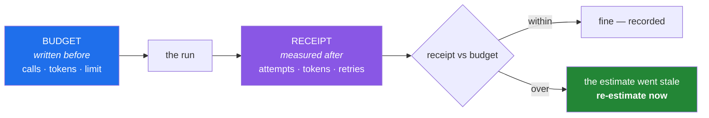

# 4.3 — The request budget as a receipt

## One-line answer

A **budget** is a prediction made before the run and a **receipt** is a measurement produced by it,
and a system only stays inside its limits when the two are compared — because a prediction nobody
checks is a wish, and a measurement nobody predicted is a bill.

---

## The story

A team runs an evaluation nightly. It scores a hundred answers against a rubric. Somebody estimated,
once, that this was about two hundred calls a night, comfortably inside the allowance.

That estimate was made when the rubric had two criteria. Over eight months the rubric grows to five.
Then a retry wrapper is added — sensible, after a flaky week. Then the eval set grows from a hundred
answers to two hundred and forty, because more test cases is obviously better.

Nobody re-estimates. Every change was small and each one was clearly an improvement.

The nightly job is now making thousands of calls. It has been for weeks. Nobody knows, because the job
succeeds — it finishes, the numbers appear, the dashboard is green — and nothing anywhere prints how
many requests it made.

They find out when the allowance runs out mid-morning and unrelated work starts failing. The
investigation takes a day, because there is no record of consumption anywhere: no log line, no
counter, no per-run summary. They cannot even confirm the eval is responsible without adding
instrumentation and waiting a night.

**The original estimate was not wrong. It went stale**, silently, one reasonable change at a time. The
missing thing was never a better estimate. It was a receipt: every run saying what it actually
consumed, so the drift between prediction and reality was visible from the first week.

---

## The idea in plain language

### Two artifacts, and you need both

**The budget** is written before the run: how many calls, roughly how many tokens, against which
published limit ([4.1](4.1-rpm-rpd-tpm.md)). It is a *prediction*, and its job is to catch a bad plan
before it costs anything.

**The receipt** is produced by the run: how many calls were actually made, how many tokens actually
moved, how many failed, how many were retried. It is a *measurement*, and its job is to catch a
prediction that has gone stale.

Neither works alone. A budget with no receipt is the story. A receipt with no budget is a number
nobody can judge — three hundred calls is fine or catastrophic depending on what you expected.

This plan already carries the first half: **every hub has a §6 Request budget** stating calls, network
and cost, and `0` is an answer. Today adds the other half.

### Retries multiply everything

Two lines in a receipt that people forget, and both come from
[4.2](4.2-429-and-real-backoff.md):

- **A retried request is a request.** It counts against RPM and RPD even when it fails. A job with
  three attempts per call has a worst case of three times its nominal budget.
- **A failed request may still cost tokens.** A call rejected after the prompt was processed can count
  its input tokens against a token limit.

So a receipt must count **attempts**, not successes. Counting only what worked is how a job that
retried everything twice reports half its true consumption.

### What belongs on a receipt

| Field | Why it is there |
|---|---|
| requests **attempted** | the thing limits actually count |
| requests succeeded / failed | the failure rate, which is the health signal |
| retries | how much of the total was rework |
| tokens in / out | the other dimension ([4.1](4.1-rpm-rpd-tpm.md)) |
| wall-clock duration | lets you compute per-minute rates |
| per-provider breakdown | which door absorbed the work |
| the model id | the instrument ([2.3](../02-llm-doors/2.3-openrouter-perishable-free.md)) |

And the derived line that makes it actionable: **peak requests and tokens per minute**, because those
are what a limit is expressed in, not totals.

### Print it every run, even when it is zero

The habit that would have saved the story is trivially cheap: **every run ends by printing what it
consumed.** Even `0 requests` — especially `0 requests`, because a run that was supposed to make none
and made some is exactly the failure you want to see immediately
([Day 2, 5.3](../../../day-02-quality-gate/parts/05-ci/5.3-caching-and-never-spending-a-quota.md)'s
suddenly-slower build is the same signal).



That loop is Principle 13 and Principle 14 again, in a third costume: **detect the drift, then respond
deliberately** ([Day 1, 4.2](../../../day-01-pins/parts/04-drift/4.2-drift-and-the-amendment-protocol.md)).

---

## Why Setu needs it

- **Principle 5 says every lab states its budget.** After today, every lab can also state what it
  actually spent, which is the only way to know whether the stated budget was ever true.
- **Day 233's eval suite is the story's job**, precisely. It grows over the capstone phase, and without
  a receipt it grows silently.
- **The Day 172 router routes across four doors**, so "how many requests did we make" becomes "to
  whom" — a per-provider breakdown is not a nicety once there is more than one door.
- **Day 237 builds an observability and cost dashboard.** It is this receipt, aggregated over time,
  and building the record now means there is something to aggregate then.
- **Principle 10 wants defensible artifacts.** "This pipeline runs on a free tier and here is a
  month of consumption records proving it" is a far better portfolio claim than "it should be fine".

---

## The mechanism

A small counter that any call path can record into:

```python
"""A receipt: what a run actually consumed. Counts attempts, not successes."""

from __future__ import annotations

import json
import time
from collections import defaultdict
from dataclasses import dataclass, field


@dataclass
class Receipt:
    """Accumulates one run's real consumption, per provider."""

    started: float = field(default_factory=time.perf_counter)
    attempts: dict[str, int] = field(default_factory=lambda: defaultdict(int))
    succeeded: dict[str, int] = field(default_factory=lambda: defaultdict(int))
    retries: dict[str, int] = field(default_factory=lambda: defaultdict(int))
    tokens_in: dict[str, int] = field(default_factory=lambda: defaultdict(int))
    tokens_out: dict[str, int] = field(default_factory=lambda: defaultdict(int))
    models: dict[str, set[str]] = field(default_factory=lambda: defaultdict(set))

    def record(
        self,
        provider: str,
        model: str,
        *,
        ok: bool,
        was_retry: bool = False,
        tokens_in: int = 0,
        tokens_out: int = 0,
    ) -> None:
        """Record one ATTEMPT. Call this for failures and retries too."""
        self.attempts[provider] += 1
        self.models[provider].add(model)
        if ok:
            self.succeeded[provider] += 1
        if was_retry:
            self.retries[provider] += 1
        self.tokens_in[provider] += tokens_in
        self.tokens_out[provider] += tokens_out

    def summary(self) -> dict[str, object]:
        elapsed = max(time.perf_counter() - self.started, 1e-9)
        total_attempts = sum(self.attempts.values())
        total_tokens = sum(self.tokens_in.values()) + sum(self.tokens_out.values())
        return {
            "elapsed_seconds": round(elapsed, 2),
            "attempts_total": total_attempts,
            "succeeded_total": sum(self.succeeded.values()),
            "retries_total": sum(self.retries.values()),
            "tokens_total": total_tokens,
            "implied_rpm": round(total_attempts * 60 / elapsed, 1),
            "implied_tpm": round(total_tokens * 60 / elapsed, 1),
            "by_provider": {
                name: {
                    "attempts": self.attempts[name],
                    "succeeded": self.succeeded[name],
                    "retries": self.retries[name],
                    "tokens_in": self.tokens_in[name],
                    "tokens_out": self.tokens_out[name],
                    "models": sorted(self.models[name]),
                }
                for name in sorted(self.attempts)
            },
        }

    def print_summary(self) -> None:
        print("--- request receipt ---")
        print(json.dumps(self.summary(), indent=2))
```

**Line by line:**

- `field(default_factory=...)` — a dataclass field whose default is **built fresh per instance**.
  Writing `attempts: dict = {}` would share one dictionary across every `Receipt` ever created, which
  is the mutable-default bug ([Day 4, 3.1](../../../day-04-objects/parts/03-identity-trap/3.1-the-mutable-default-argument.md))
  and exactly what `B006` catches ([Day 2, 1.2](../../../day-02-quality-gate/parts/01-linting/1.2-choosing-rule-families.md)).
- `defaultdict(int)` — a dictionary returning `0` for a key it has never seen, so `+= 1` works without
  checking first. `defaultdict(set)` does the same with an empty set.
- `default_factory=lambda: defaultdict(int)` — the lambda is required because `default_factory` wants a
  zero-argument callable, and `defaultdict(int)` is already a *constructed* object rather than a
  factory.
- `started: float = field(default_factory=time.perf_counter)` — the clock starts when the receipt is
  created. `perf_counter` for the reason in [4.1](4.1-rpm-rpd-tpm.md).
- `record(..., *, ok, was_retry, ...)` — keyword-only after the `*`, so `record("gemini", m, True, True)`
  is impossible and every call site reads as English.
- **`self.attempts[provider] += 1` happens unconditionally**, before the `ok` check. This is the whole
  point: the limit counts the request whether or not it worked.
- `models[provider].add(model)` — a set, so several models used against one provider are recorded once
  each. A receipt that does not say which model ran is missing the instrument
  ([2.3](../02-llm-doors/2.3-openrouter-perishable-free.md)).
- `max(elapsed, 1e-9)` — guard against dividing by zero on a run so fast the timer has not moved. A
  diagnostic that crashes on the trivial case is a diagnostic people disable.
- `implied_rpm` and `implied_tpm` — the derived numbers. **Totals cannot be compared against a limit;
  rates can.** These two lines are what let you put the receipt next to
  [4.1](4.1-rpm-rpd-tpm.md)'s published ceilings.
- `sorted(self.attempts)` — deterministic ordering, so two receipts can be diffed. Unordered output is
  output nobody compares.

Wire it into a call, so that recording is not something to remember:

```python
"""Every call path records. The receipt is a parameter, not a global."""

from __future__ import annotations

from receipt import Receipt  # the module above


def ask_recorded(prompt: str, receipt: Receipt) -> str:
    """One Gemini call (part 2.1), with the attempt recorded whatever happens."""
    from ask_gemini import MODEL, ask

    try:
        text, raw = ask(prompt)
    except Exception:
        receipt.record("gemini", MODEL, ok=False)
        raise

    usage = getattr(raw, "usage", None)
    receipt.record(
        "gemini",
        MODEL,
        ok=True,
        tokens_in=getattr(usage, "input_tokens", 0) or 0,
        tokens_out=getattr(usage, "output_tokens", 0) or 0,
    )
    return text


if __name__ == "__main__":
    receipt = Receipt()
    for question in ("Reply with the word: one", "Reply with the word: two"):
        print(ask_recorded(question, receipt).strip())
    receipt.print_summary()
```

**Line by line:**

- `receipt: Receipt` as a **parameter**, not a module-level global. A global counter is shared state,
  which makes it untestable and unsafe under concurrency — the same lesson as
  [Day 2, 3.2](../../../day-02-quality-gate/parts/03-pytest/3.2-fixtures-and-tmp-path.md)'s
  module-level list.
- `except Exception: receipt.record(..., ok=False); raise` — **record the attempt, then re-raise
  unchanged.** The bare `raise` preserves the original traceback. A wrapper that swallows the exception
  to keep counting would be hiding the failure it is meant to measure.
- `getattr(usage, "input_tokens", 0) or 0` — the field names differ between providers
  ([2.2](../02-llm-doors/2.2-groq-and-the-token-wall.md) uses `prompt_tokens`), and `usage` may be
  absent. The `or 0` also converts a `None` to zero. **Read the real field names from your own
  `dir()` sweep in [2.1](../02-llm-doors/2.1-gemini-the-workhorse.md) and adjust** — this is the exact
  place where copying from a lesson rather than checking will produce a receipt of zeros.
- The `for` loop and `print_summary()` at the end — two calls, one receipt, one summary. **The summary
  is unconditional**, at the end of every run, which is the habit the story was missing.

And the comparison, which is the part that closes the loop:

```python
"""Compare a receipt against the budget that was written before the run."""

from __future__ import annotations

BUDGET = {"attempts_total": 4, "tokens_total": 500}  # from this day's hub, section 6


def check(summary: dict[str, object], budget: dict[str, int]) -> int:
    """Print a verdict per budgeted line. Returns non-zero if anything overran."""
    overran = 0
    for key, allowed in budget.items():
        actual = int(summary.get(key, 0))
        ratio = actual / allowed if allowed else float("inf")
        verdict = "OVER" if actual > allowed else "ok"
        if actual > allowed:
            overran = 1
        print(f"{key:16} budget {allowed:>7,}  actual {actual:>7,}  ({ratio:.0%})  {verdict}")
    return overran
```

**Line by line:**

- `BUDGET` as a literal with a comment naming where it came from — this day's hub §6. **A budget with
  no stated source is a number somebody made up**, and in six months nobody can tell which.
- `int(summary.get(key, 0))` — a budgeted key that the receipt does not carry reads as zero rather than
  raising, so adding a budget line before the receipt records it degrades gracefully.
- `ratio` as a percentage with `{ratio:.0%}` — *how close to the limit* is more useful than over or
  under. Eighty per cent is the number that should prompt a conversation, and it is invisible in a
  pass/fail.
- `return overran` — an exit code, so this can join a gate
  ([Day 2, 2.2](../../../day-02-quality-gate/parts/02-formatting/2.2-format-check-and-the-ci-split.md)).
  A budget check that only prints is one people stop reading.
- Run this after every lab from today onward. When `actual` drifts above `budget`, the honest response
  is to **update the budget in the hub with a note saying why** — the amendment protocol from
  [Day 1, 4.2](../../../day-01-pins/parts/04-drift/4.2-drift-and-the-amendment-protocol.md), not a
  silent edit.

---

## When it breaks

**A receipt of zeros:**

```text
--- request receipt ---
{
  "attempts_total": 2,
  "tokens_total": 0,
  ...
}
```

**What it means.** Two calls were recorded and no tokens. Almost always the attribute names: the usage
object on that provider does not call them `input_tokens`. Run the `dir()` sweep from
[2.1](../02-llm-doors/2.1-gemini-the-workhorse.md) and use the real names. **A receipt that
under-reports is worse than none**, because it produces false confidence.

**Attempts higher than the number of calls you wrote:**

```text
"attempts_total": 47,
"succeeded_total": 20,
"retries_total": 27
```

...from a loop of twenty. **What it means.** More than half the work was rework. The job "succeeded" —
every call eventually returned — and it consumed two and a half times its budget doing so. This is the
line that makes a retry policy visible ([4.2](4.2-429-and-real-backoff.md)); without a retries counter
this run looks identical to a clean one.

**Under budget on totals, over on rate:**

```text
"attempts_total": 120,     (budget 500)     ok
"implied_rpm": 240.0       (limit 30)       <- the problem
```

**What it means.** You made few calls, very fast. Totals are fine and you will be rate-limited anyway,
because a limit is a **rate** ([4.1](4.1-rpm-rpd-tpm.md)). This is why the receipt derives per-minute
figures rather than reporting totals alone, and it is the most common way a budget check gives a false
pass.

**And the story's version, which produces no error text at all:**

```text
(no output about requests, anywhere, ever)
```

**What it means.** There is no receipt. The job succeeds, the numbers look right, and consumption is
invisible until an allowance runs out during unrelated work. There is no traceback to paste here
because that is precisely the problem: **the failure mode of missing instrumentation is silence.**

---

## In production

**Consumption is a first-class output of a run, alongside its results.** Serious systems emit
structured records for every external call — provider, model, tokens in and out, latency, status,
retry count, a request id — into the same logging pipeline as everything else. That gives you the
receipt aggregated across all runs rather than per script, and it is what Day 237's cost dashboard is
built from. The cost of adding it at the first call site is minutes; the cost of retrofitting it
across a codebase is weeks.

**Alert on the leading indicator, not the failure.** By the time requests are being rejected you are
already degraded. The useful signal is consumption as a fraction of the ceiling, alerting somewhere
around seventy or eighty per cent — the same argument as
[4.1](4.1-rpm-rpd-tpm.md)'s headroom monitoring and
[Day 2, 5.3](../../../day-02-quality-gate/parts/05-ci/5.3-caching-and-never-spending-a-quota.md)'s
slower-but-green build. **Watch the trend, not the wall.**

**Budgets go stale by accretion, so they need a review trigger.** The story's estimate was correct when
written and wrong eight months later, and no single change caused it. The countermeasures are: keep
the budget next to the code that spends it, print the receipt every run so the drift is visible
continuously, and re-estimate whenever anything changes the multiplier — more items, more criteria,
more retries, a new caller. Principle 13's weekly check is the scheduled version of the same instinct.

**What changes at scale:** consumption becomes an attribution problem. When many features share one
account, "we used four million tokens" is useless without knowing which feature, which customer, and
which model. Mature systems tag every call with that context and can answer "what does this feature
cost per user". The failure that only appears at scale is a **feedback loop** — an agent that retries
by calling itself, or a summarisation step whose output becomes another prompt — where consumption
grows non-linearly with input, and a linear budget estimate is not merely stale but structurally wrong.

**The review comment a senior engineer leaves.** On a new batch job: *"Where does this print what it
consumed? And count attempts rather than successes — with the retry wrapper this could be three times
what the estimate says."*

**The interview question.** *"How do you keep an LLM feature's costs under control?"* The weak answer
is "use a cheaper model". The answer that lands names the loop: estimate before building, instrument
every call so each run reports actual consumption, and compare the two continuously so a stale estimate
shows up as drift rather than as a bill. Then the details that show experience: count attempts rather
than successes because retries consume quota, express both budget and receipt as *rates* rather than
totals because limits are rates, alert on percentage of ceiling rather than on failures, and tag calls
so consumption can be attributed to a feature. Ending with the observation that budgets go stale by
accretion — no single change is to blame — is the sentence that says you have watched one happen.

---

## Check yourself

```bash
uv run python -c '
import time
started = time.perf_counter()
attempts, tokens = 2, 60          # replace with your own two calls from today
elapsed = max(time.perf_counter() - started, 1e-9)
print(f"attempts : {attempts}")
print(f"tokens   : {tokens}")
print(f"implied RPM: {attempts * 60 / elapsed:,.0f}")
print(f"implied TPM: {tokens * 60 / elapsed:,.0f}")
print("compare those two against the limits you wrote down in part 4.1")
'
```

Then open this day's hub, read its §6 Request budget, and write next to it what today actually cost.
If the two disagree, the hub is what changes — with a note saying why.

**Answer out loud, without scrolling up:**

> Explain the difference between a budget and a receipt and why neither works without the other. Then
> say why a receipt must count attempts rather than successes, and why totals alone can pass a budget
> check on a run that will be rate-limited anyway.

---

**Next:** [5.1 — The Phase 0 gate: one command that proves every door](../05-the-gate/5.1-the-phase-0-gate.md)
