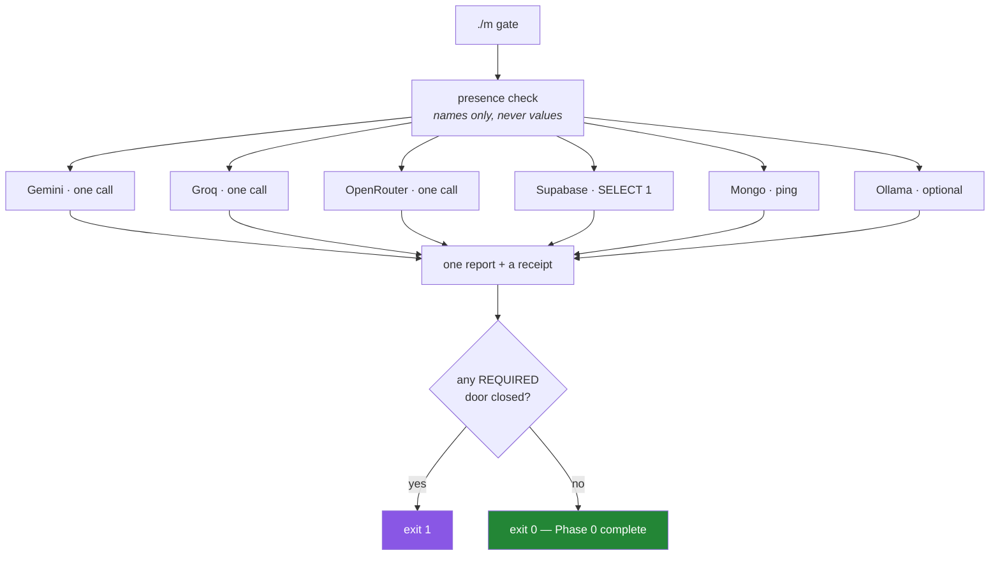

# 5.1 — The Phase 0 gate — one command that proves every door

## One-line answer

A gate is a **single command that produces evidence**, not a feeling — and Phase 0's gate is one
script that opens every door in turn, reports what worked without printing a single secret, and exits
non-zero if anything the next phase depends on is missing.

---

## The story

Someone finishes a setup week. Repo created, dependencies pinned, keys obtained, databases
provisioned. They tick the last box and move on to real work.

Two weeks later, deep in a data-loading task, a script fails to connect to the document database. It
turns out the cluster was created but the database user was never added — the console showed a green
cluster, which looked like success. They had never actually connected to it. The credential in `.env`
had been copied from the console and pasted, and pasting is not the same as testing.

That is one door. It costs an hour.

The more expensive version is subtler. Everything *did* work on setup day, and the reason it does not
work now is that something expired, rotated, or paused. Nobody knows when it stopped, because nothing
has checked since. A setup verified once is a claim about a moment that has passed.

The remedy for both is the same and it is not a longer checklist. It is **one command that proves the
whole thing, cheap enough to run any time you have a doubt.** Run it on setup day, and run it again on
the morning of Day 42 before spending an hour debugging code that was never the problem.

---

## The idea in plain language

### A gate produces evidence

Phase 0's gate, from the plan's Part 5, is: *repo + pins frozen + `./m check` green + three free keys
answering.*

Three of those you already have. `./m check` is [Day 2](../../../day-02-quality-gate/LESSON.md)'s
four-gate command. The pins were frozen on [Day 1](../../../day-01-pins/LESSON.md). Today's addition
is the fourth clause — and note its wording. Not "three keys obtained". **Answering.** The difference
between those two words is the story.

### What the script must do, and must not

**Must:**

- Check each credential is *present* ([1.2](../01-secrets/1.2-dotenv-and-os-environ.md)).
- Make one **minimal real call** per door, proving it answers.
- Report per door, so a partial failure is legible.
- Emit a receipt of what it consumed ([4.3](../04-rate-budget/4.3-the-budget-as-a-receipt.md)).
- Exit non-zero when a **required** door is closed.

**Must not:**

- Print any secret, or any part of one ([1.3](../01-secrets/1.3-when-a-key-leaks.md)).
- Stop at the first failure. **A gate that reports one problem when there are three costs three round
  trips.** This is the opposite of `./m check`'s fail-fast ordering
  ([Day 2, 4.1](../../../day-02-quality-gate/parts/04-the-gate/4.1-what-m-check-actually-runs.md)) — and
  the reason for the difference is worth understanding, below.
- Run in CI. It makes real calls, so it is `live` by definition
  ([Day 2, 3.3](../../../day-02-quality-gate/parts/03-pytest/3.3-markers-and-exit-code-five.md)).

### Why this gate gathers and `./m check` fails fast

[Day 2, 4.1](../../../day-02-quality-gate/parts/04-the-gate/4.1-what-m-check-actually-runs.md) argued
that stopping at the first failure gives the narrowest diagnosis. That was correct there and is wrong
here, and the difference is instructive.

`./m check`'s gates are **dependent**: a parse error makes the formatter's opinion meaningless, so
there is nothing useful to learn from continuing. This gate's doors are **independent**: whether Groq
answers tells you nothing about whether Mongo does. When the checks are independent, running them all
and reporting together is strictly better — you get one round trip instead of five.

**Fail fast when later steps depend on earlier ones; gather when they do not.** That is the general
rule, and being able to state it is worth more than either instance.

### Required and optional

Not every door blocks the phase. Ollama ([2.4](../02-llm-doors/2.4-ollama-the-keyless-door.md)) needs
hardware not everyone has, and skipping it does not stop Phase 1. Marking it optional — reported, not
fatal — keeps the gate honest instead of encouraging people to weaken it.

**A gate you are tempted to bypass is a gate that is measuring the wrong thing.**



---

## Why Setu needs it

- **This is the Phase 0 gate.** Plan Part 5 makes it the condition for entering Phase 1, and a gate
  without a command is an intention.
- **Principle 5 needs a receipt.** The gate consumes a small, known number of requests; printing it is
  the smallest possible instance of [4.3](../04-rate-budget/4.3-the-budget-as-a-receipt.md)'s habit.
- **Day 42 and Day 51 open with a database connection.** Running this first turns "is my setup broken
  or is my code wrong?" into a ten-second question.
- **Day 172's router needs every door.** Its fallback chain is only as good as the doors behind it, and
  this script is how you know they are open before writing branching logic against them.
- **Principle 13's weekly check** covers pins; this covers credentials. Keys expire, projects pause,
  free rosters rotate ([2.3](../02-llm-doors/2.3-openrouter-perishable-free.md)) — all of which this
  catches on a Friday rather than on Day 42.

---

## The mechanism

The script's skeleton — a uniform result per door, so the report writes itself:

```python
"""scripts/gate.py - prove every Phase 0 door answers. Prints no secrets, ever."""

from __future__ import annotations

import os
import sys
import time
from dataclasses import dataclass

from dotenv import load_dotenv

load_dotenv()


@dataclass(frozen=True)
class DoorResult:
    """What one check found. `detail` must never contain a credential."""

    name: str
    required: bool
    present: bool
    answered: bool
    seconds: float
    detail: str

    @property
    def status(self) -> str:
        if self.answered:
            return "OK"
        if not self.present:
            return "ABSENT"
        return "FAILED"

    @property
    def blocks_the_phase(self) -> bool:
        return self.required and not self.answered


def timed(name: str, required: bool, env_var: str | None, probe) -> DoorResult:
    """Run one probe, catching everything, and return a uniform result."""
    present = True if env_var is None else bool(os.environ.get(env_var))
    if not present:
        return DoorResult(name, required, False, False, 0.0, f"{env_var} is not set")

    start = time.perf_counter()
    try:
        detail = probe()
        return DoorResult(name, required, True, True, time.perf_counter() - start, detail)
    except Exception as exc:
        return DoorResult(
            name, required, True, False, time.perf_counter() - start, f"{type(exc).__name__}: {exc}"
        )
```

**Line by line:**

- `@dataclass(frozen=True)` — a result is a fact, recorded once. Immutability makes that visible and
  stops a later stage quietly amending a verdict.
- The docstring on `detail` — **"must never contain a credential"** — because that field is the one
  place a secret could realistically leak, via an exception message that echoed a connection string.
  Writing the constraint next to the field is how it survives the next edit.
- `status` as a property with three values, not a boolean. `ABSENT` (never configured) and `FAILED`
  (configured but not working) demand completely different actions, and collapsing them into "not ok"
  throws away the more useful half.
- `blocks_the_phase` — the required/optional distinction, computed rather than remembered, so the exit
  code cannot disagree with the report.
- `except Exception` — **deliberately broad, and correct here.** This is the exact opposite of
  [3.1](../03-databases/3.1-supabase-a-postgres-that-pauses.md)'s narrow `except psycopg.OperationalError`,
  and the reason is that this function's job is *to survive every probe*. One door's exotic failure must
  not prevent the other five being checked — the same reasoning as the per-package `try` inside the loop
  on [Day 1, 2.3](../../../day-01-pins/parts/02-pypi-index/2.3-the-check-pins-script.md). A broad catch
  is right when the alternative is losing the run, and wrong everywhere else.
- `f"{type(exc).__name__}: {exc}"` — the exception's class name **and** its message. The class alone is
  too vague; the message alone loses the type, which is often the most diagnostic part.
- `probe` is passed in as a callable, so this function knows nothing about any provider. Each door
  supplies its own one-line probe, and adding a seventh door means adding a probe rather than editing
  this.

Each probe is one minimal call, returning a **safe** one-line summary:

```python
"""One probe per door. Each returns a short string with NOTHING sensitive in it."""

from __future__ import annotations

import os
from urllib.parse import urlsplit


def probe_gemini() -> str:
    from google import genai

    model = "gemini-3.7-flash"
    client = genai.Client(api_key=os.environ["GEMINI_API_KEY"])
    reply = client.interactions.create(model=model, input="Reply with the word: ok")
    return f"{model} -> {reply.output_text.strip()[:20]!r}"


def probe_supabase() -> str:
    import psycopg

    dsn = os.environ["SUPABASE_DB_URL"]
    with psycopg.connect(dsn, connect_timeout=15) as conn, conn.cursor() as cur:
        cur.execute("select current_user, current_database()")
        user, database = cur.fetchone()
    return f"host={urlsplit(dsn).hostname} user={user} db={database}"


def probe_mongo() -> str:
    from pymongo import MongoClient

    uri = os.environ["MONGODB_URI"]
    client = MongoClient(uri, serverSelectionTimeoutMS=8000)
    try:
        client.admin.command("ping")
        return f"host={urlsplit(uri).hostname} ping=ok"
    finally:
        client.close()
```

**Line by line:**

- Every import is **inside** its probe. A machine with no Mongo driver installed still runs the Gemini
  probe; a missing import becomes one door's `FAILED` rather than the whole script's crash. This is the
  same instinct as [2.2](../02-llm-doors/2.2-groq-and-the-token-wall.md)'s local import, applied for
  resilience rather than for speed.
- `os.environ["GEMINI_API_KEY"]` with brackets, not `.get` — presence was already checked by `timed`
  before the probe runs, so a `KeyError` here would mean a bug in the gate rather than a missing key.
  Using the strict form where absence is impossible documents that.
- `"Reply with the word: ok"` — the smallest prompt that proves the full path. Every token here is one
  you spend every time you run the gate.
- `reply.output_text.strip()[:20]!r` — truncated and `repr`'d. Truncation because a chatty model should
  not flood the report; `!r` because it makes whitespace and emptiness visible, so an empty answer
  ([2.1](../02-llm-doors/2.1-gemini-the-workhorse.md)'s silent failure) is not mistaken for a blank
  field.
- `urlsplit(dsn).hostname` — **the host, never the string.** The redaction habit from
  [3.1](../03-databases/3.1-supabase-a-postgres-that-pauses.md), applied at the one place the report
  could have leaked.
- `current_user` in the Supabase probe — the report states the blast radius of the credential it just
  used ([1.3](../01-secrets/1.3-when-a-key-leaks.md)). A gate that tells you *which role* you connect as
  is a gate that makes a bad decision visible every time you run it.
- `try: ... finally: client.close()` — release the connection pool even when the ping raises. A gate
  that leaks connections on every failure will eventually exhaust a free tier's connection slots
  ([3.1](../03-databases/3.1-supabase-a-postgres-that-pauses.md)).

Then the report and the exit code:

```python
"""Render the report, print the receipt, and decide the exit code."""

from __future__ import annotations

import sys


def report(results: list) -> int:
    width = max(len(r.name) for r in results)
    print(f"{'door':<{width}}  {'status':<7} {'req':<4} {'secs':>6}  detail")
    print("-" * (width + 40))
    for r in results:
        flag = "yes" if r.required else "opt"
        print(f"{r.name:<{width}}  {r.status:<7} {flag:<4} {r.seconds:>6.2f}  {r.detail}")

    blocked = [r.name for r in results if r.blocks_the_phase]
    calls = sum(1 for r in results if r.present and r.name != "ollama")
    print()
    print(f"--- receipt: {calls} live requests, $0 (Principle 5) ---")

    if blocked:
        print(f"\nPHASE 0 INCOMPLETE - required doors closed: {', '.join(blocked)}")
        return 1
    print("\nPHASE 0 GATE: every required door answered.")
    return 0


if __name__ == "__main__":
    sys.exit(report(run_all()))  # run_all() is yours to write - see the hub's build brief
```

**Line by line:**

- `width = max(len(r.name) ...)` and `f"{r.name:<{width}}"` — a **nested** format spec: the width is
  computed and interpolated into the format string. Columns that line up are columns people read.
- The `req`/`opt` column — the required/optional distinction is visible in the report, not only in the
  exit code, so a failing optional door does not read as a problem.
- `r.seconds` per door — a door that answers in eleven seconds is answering, and is also telling you
  something. Latency in a gate's output is free diagnostics.
- `blocks_the_phase` filtered into `blocked` — the exit code is derived from the same property the
  report printed, so they cannot disagree.
- The receipt line — small, unconditional, and stating `$0`. This is
  [4.3](../04-rate-budget/4.3-the-budget-as-a-receipt.md)'s habit at its smallest possible scale, and
  the point is that it prints **every run**, including when the number is boring.
- `sys.exit(report(...))` — the exit code, so `./m gate` can be chained and so a future scheduled run
  can fail out loud ([Day 2, 2.2](../../../day-02-quality-gate/parts/02-formatting/2.2-format-check-and-the-ci-split.md)).
- `run_all()` is **not written here.** Assembling the probes into a list of `timed(...)` calls is the
  day's build brief, and doing it for you would be doing the rep (Principle 6).

---

## When it breaks

**Partial success, which is what the gate is for:**

```text
door        status  req   secs  detail
------------------------------------------------
gemini      OK      yes   0.84  gemini-3.7-flash -> 'ok'
groq        OK      yes   0.31  llama-3.3-70b-versatile -> 'ok'
openrouter  ABSENT  yes   0.00  OPENROUTER_API_KEY is not set
supabase    OK      yes   3.12  host=db.xxx.supabase.co user=postgres db=postgres
mongodb     FAILED  yes   8.01  ServerSelectionTimeoutError: cluster0... [Errno 110]
ollama      FAILED  opt   0.00  RuntimeError: the local runner is not answering

--- receipt: 4 live requests, $0 (Principle 5) ---

PHASE 0 INCOMPLETE - required doors closed: openrouter, mongodb
```

**What it means.** Three distinct problems in one run, with three different fixes: a key never added, a
cluster timing out (allowlist, [3.2](../03-databases/3.2-mongodb-atlas-m0.md)), and an optional local
runner that is not running and does not block anything. **One round trip, three diagnoses** — which is
precisely why this gate gathers rather than failing fast.

**Everything absent:**

```text
gemini      ABSENT  yes   0.00  GEMINI_API_KEY is not set
groq        ABSENT  yes   0.00  GROQ_API_KEY is not set
...
```

**What it means.** Almost certainly `.env` was not found rather than five keys being missing. Running
from a subdirectory is the usual cause ([1.2](../01-secrets/1.2-dotenv-and-os-environ.md)). When
*every* check fails identically, suspect the thing they share, not five coincidences.

**Present but not answering, on every door:**

```text
gemini      FAILED  yes  30.02  ConnectError: [Errno -3] Temporary failure in name resolution
groq        FAILED  yes  30.01  ConnectError: [Errno -3] Temporary failure in name resolution
```

**What it means.** No network. Again the shared cause: identical failures across independent doors are
one problem, not many. Note that the *optional* local door would still pass here, which is the entire
argument for [2.4](../02-llm-doors/2.4-ollama-the-keyless-door.md).

**And the failure that matters most, because it is silent:**

```text
gemini      OK      yes   0.90  gemini-3.7-flash -> ''
```

**What it means.** The door answered and produced nothing
([2.1](../02-llm-doors/2.1-gemini-the-workhorse.md)'s empty-generation case). The gate says `OK`
because a response came back. Whether an empty answer should count as a working door is a design
decision, and it is one to make deliberately: **the `!r` in the report is what makes the emptiness
visible at all** — without it that line reads as a normal success with a short answer.

---

## In production

**A gate that produces evidence beats a checklist that produces confidence.** The general form is a
*health check* or a *smoke test*: a small, cheap, real exercise of every dependency, runnable on
demand. Real systems expose one as an endpoint so a load balancer can ask; deployment pipelines run
one after every release before sending traffic. The property is always the same — it does the real
thing, in miniature, rather than asserting that configuration exists.

**Distinguish liveness from readiness, because they demand different responses.** *Am I running?* is a
different question from *can I serve requests?* — and a service whose database is unreachable is alive
but not ready. Conflating them causes an orchestrator to restart a healthy process because a
dependency was briefly down, which is a well-known way to turn a small outage into a large one. This
gate is a readiness check: it asks whether the *dependencies* answer.

**Health checks must be cheap, or they become the load.** An endpoint polled every few seconds by a
dozen monitors that opens a database connection each time is a self-inflicted denial of service. The
usual arrangement is to cache the result for a short window and to keep the check shallow — a `ping`,
not a query over real data. This gate is run by a human occasionally, so it can afford a real call;
the moment anything polls it, that changes.

**What changes at scale:** with many dependencies, the interesting question stops being "is everything
up" — something is always degraded — and becomes "is anything *I need* down". That means a dependency
graph with criticality attached, exactly the required/optional distinction here, generalised. The
failure that only appears in a large system is the **cascading health check**: service A's check calls
B, whose check calls C, so one slow leaf makes the whole tree report unhealthy and everything restarts
at once. Health checks should be shallow by design for the same reason retries should happen at one
layer only ([4.2](../04-rate-budget/4.2-429-and-real-backoff.md)).

**The review comment a senior engineer leaves.** On a health endpoint: *"This returns 200 as long as
the process is up — it doesn't check the database, so we'll route traffic to an instance that can't
serve. And when it does check, make sure the error text can't include the connection string."*

**The interview question.** *"How do you know your environment is correctly configured?"* The answer
that lands rejects the checklist: you run a command that exercises every dependency for real and
reports per dependency, because a credential that was pasted but never used is not a working
credential. Then the details that show experience: gather rather than fail fast when the checks are
independent, so one run yields every diagnosis; distinguish required from optional so the gate is not
something people learn to bypass; never let a diagnostic print a secret, including inside an exception
message; and re-run it whenever something is unexplained, because a setup verified once is a statement
about a moment that has passed.

---

## Check yourself

```bash
./m gate; echo "exit: $?"
```

Every required door `OK`, one receipt line, exit `0`. Read the `detail` column and confirm that not one
character of any credential appears in it — then paste the whole output somewhere and notice that you
can, safely, which is the design.

**Answer out loud, without scrolling up:**

> Explain why this gate gathers every failure while `./m check` stops at the first, and give the
> general rule that decides between them. Then say why `ABSENT` and `FAILED` are separate statuses,
> and why the report prints `current_user` for the database door.

---

**Next:** back to the hub — [`LESSON.md`](../../LESSON.md) §4, to write `scripts/gate.py` and wire it
into `./m`.
