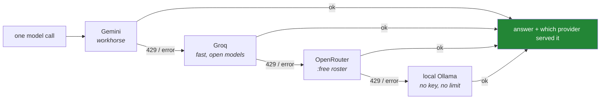

# Day 3 — Foundry III: three free keys, two free databases, one rate budget

**Phase 0 gate** · Principles served: **5 (zero budget)**, **9 (provenance)**, **13 (freshness)**

> **Yesterday:** ruff, the offline/live test split, and CI that cannot spend a quota.
> **Today:** the three free model providers, the two free databases you will need in forty days, and
> the number that is actually your budget. **This closes Phase 0.**
> **Tomorrow:** Phase 1 begins — objects, types, and mutability.

```bash
./m start 3 && ./m scaffold 3
```

**Time:** 90 minutes, most of it account creation. **Request budget: exactly 3 model calls.**

---

## §1 The story

Every other curriculum in this space assumes a card on file. This one does not, and that constraint
is going to make you a better engineer than the version of you with a corporate key would have been.

Here is why. With a paid key, the failure mode of a bad loop is a surprising invoice at the end of
the month — annoying, survivable, and invisible while it happens. On a free tier, the failure mode is
**a wall at 3pm**. You hit your requests-per-day, and nothing works until tomorrow. There is no
top-up. There is no "just this once".

So on this project the budget is not dollars. It is **RPM** (requests per minute) and **RPD**
(requests per day). And because you cannot buy your way past a wall, you have to design around it:
you declare each lab's request budget before you spend it, you back off on 429, and you keep more
than one provider so that one being exhausted is a *degradation* rather than an *outage*.

That last habit — treating provider rotation as a resilience pattern rather than a cost trick — is
worth keeping even when someone else is paying.



You **build** that router on Day 172. Today you only prove all three doors open, and you write down
what each one actually allows.

The second half of today is slower and less interesting, and it is here on purpose: **create the
Supabase project and the MongoDB Atlas cluster now.** You do not need them until Day 42. Free-tier
provisioning is slow, email verification loops are slow, and discovering on Day 42 that your region
has no capacity is a wasted evening forty days from now.

---

## §2 Setup — run this

```bash
uv add "openai==3.3.1"
mkdir -p days/day-03/lab
touch days/day-03/lab/verify_keys.py
touch src/setu/models.py
touch tests/test_models.py
touch docs/RATE_BUDGET_DS.md
```

**Line by line:**

- `uv add "openai==3.3.1"` — the official OpenAI Python client. **You are not using OpenAI models.**
  You are using this library as a generic client for any **OpenAI-compatible** endpoint, and Groq,
  Gemini and OpenRouter all provide one. One library, three free providers, zero spend. Pin whatever
  your Day-1 verify run reported.
- `src/setu/models.py` — model ids behind **role names**, not provider names. §5 explains why that
  matters more than it sounds.

### Confirm `.env` is still ignored, before a key exists

```bash
grep -n '^\.env$' .gitignore && echo "SAFE" || echo "STOP - add .env to .gitignore first"
```

- `grep -n '^\.env$'` — a line that is **exactly** `.env`. `^` anchors the start, `$` the end, and
  `\.` is a literal dot (a bare `.` in a regex means "any character").
- `&& echo "SAFE"` runs only if grep found it; `|| echo "STOP..."` only if it did not.

If it says STOP, fix `.gitignore` first. A key in git history outlives the commit that deleted it.

```bash
cp .env.example .env
```

`.env.example` holds **names only, never values**, and is committed. `.env` holds values and is not.

---

## §3 The three keys

Create all three accounts. None asks for a card.

| Provider | Where | Env var | Role in this plan |
|---|---|---|---|
| **Gemini (AI Studio)** | <https://aistudio.google.com/apikey> | `GEMINI_API_KEY` | Daily workhorse — most labs, most of the capstone |
| **Groq** | <https://console.groq.com/keys> | `GROQ_API_KEY` | Fast loops and tool-calling drills; many small calls |
| **OpenRouter** | <https://openrouter.ai/keys> | `OPENROUTER_API_KEY` | Diversity and **eval judges** — a judge must not run on the provider being judged |

> ⚠️ **Gemini free tier and your data.** Free-tier prompts may be used by Google to improve their
> products. This plan therefore uses **fixtures and public data only** — never anything private,
> never a real customer record, never a scraped document you do not have the right to send. That rule
> holds for all 240 days. Write it in your own words in `docs/RATE_BUDGET_DS.md` so future-you cannot
> claim not to have known.

Paste each into `.env`, then confirm it is invisible to git:

```bash
git status --porcelain
```

Empty output, or output that does **not** mention `.env`. If `.env` appears here, stop everything and
fix `.gitignore`.

---

## §4 Verify all three, in exactly three requests

`days/day-03/lab/verify_keys.py`:

```python
"""Prove all three free providers answer. Budget: 3 requests total, ever."""

from __future__ import annotations

import sys

from openai import OpenAI

from setu.config import load_keys
from setu.models import PROVIDERS


def check(name: str, base_url: str, api_key: str, model: str) -> bool:
    client = OpenAI(api_key=api_key, base_url=base_url)
    try:
        response = client.chat.completions.with_raw_response.create(
            model=model,
            messages=[{"role": "user", "content": "Reply with the single word: ok"}],
            max_tokens=5,
        )
    except Exception as exc:  # noqa: BLE001 - one bad provider must not hide the other two
        print(f"{name:<12} FAIL  {type(exc).__name__}: {exc}")
        return False

    parsed = response.parse()
    text = (parsed.choices[0].message.content or "").strip()
    interesting = {
        k: v for k, v in response.headers.items() if "ratelimit" in k.lower() or "retry" in k.lower()
    }
    print(f"{name:<12} ok    reply={text!r}")
    for key, value in sorted(interesting.items()):
        print(f"{'':<12}       {key}: {value}")
    return True


def main() -> int:
    keys = load_keys()
    results = [
        check(name, spec.base_url, getattr(keys, spec.key_attr), spec.probe_model)
        for name, spec in PROVIDERS.items()
    ]
    return 0 if all(results) else 1


if __name__ == "__main__":
    sys.exit(main())
```

**Line by line:**

- `OpenAI(api_key=..., base_url=...)` — the same client class, pointed somewhere else. `base_url` is
  the whole trick: every provider here speaks the OpenAI wire format.
- `with_raw_response.create(...)` — returns the **HTTP response** rather than only the parsed object,
  which means you can read the headers. That is the point of today: the rate-limit headers are the
  only authoritative statement of your budget.
- `max_tokens=5` — a probe, not a conversation. Keep it tiny; on Groq your tokens-per-minute is
  tighter than your requests-per-day.
- `except Exception` — deliberately broad **here** (a `# noqa` records that it is intentional), so one
  dead provider still lets you see the other two. Compare with the narrow `except MissingKey` in
  `config.py`.
- `response.parse()` — turn the raw response into the typed object.
- `parsed.choices[0].message.content or ""` — `content` can be `None`; `or ""` makes `.strip()` safe.
- The `interesting` dict comprehension — filters headers to the rate-limit and retry ones. You write
  comprehensions properly on Day 9 (PY-09); read this one as *"keep the headers whose name mentions
  ratelimit or retry"*.
- `getattr(keys, spec.key_attr)` — looks up an attribute **by name at runtime**. That is why
  `models.py` stores the string `"gemini"` rather than the key itself: the key stays in exactly one
  place.
- `return 0 if all(results) else 1` — a non-zero exit code makes failure visible to `&&` chains and CI.

Run it **once**:

```bash
uv run python days/day-03/lab/verify_keys.py
```

Three `ok` lines. **Do not loop it "to be sure".** Three requests is the entire budget for the day.

---

## §5 `models.py` — roles, not vendors

```python
"""Model ids behind role names, so a roster rotation is a one-line change."""

from __future__ import annotations

from dataclasses import dataclass


@dataclass(frozen=True)
class Provider:
    base_url: str
    key_attr: str
    probe_model: str


# TODO(me): fill probe_model from the LIVE provider console today. No placeholders.
PROVIDERS: dict[str, Provider] = {
    "gemini": Provider(
        base_url="https://generativelanguage.googleapis.com/v1beta/openai/",
        key_attr="gemini",
        probe_model="<fill from aistudio.google.com>",
    ),
    "groq": Provider(
        base_url="https://api.groq.com/openai/v1",
        key_attr="groq",
        probe_model="<fill from console.groq.com>",
    ),
    "openrouter": Provider(
        base_url="https://openrouter.ai/api/v1",
        key_attr="openrouter",
        probe_model="<fill from openrouter.ai/models?q=free>",
    ),
}

# Roles, not vendors. Every lab imports one of these; none hard-codes a model id.
WORKHORSE = ("gemini", PROVIDERS["gemini"].probe_model)
FAST_LOOP = ("groq", PROVIDERS["groq"].probe_model)
JUDGE = ("openrouter", PROVIDERS["openrouter"].probe_model)
OFFLINE = ("ollama", "<a small local model, or empty if you skip Ollama>")
```

**Line by line:**

- `@dataclass(frozen=True)` — immutable configuration. Nothing should reassign a base URL at runtime.
- `key_attr: str` — the **name** of the attribute on `Keys`, not the key. A secret stored in two
  places is a secret leaked in one of them.
- `PROVIDERS: dict[str, Provider]` — annotated module constant. `dict[str, Provider]` is the modern
  builtin-generic form; `typing.Dict` is legacy and unused here.
- `WORKHORSE` / `FAST_LOOP` / `JUDGE` / `OFFLINE` — **this is the important idea.** Free rosters
  rotate without notice. If Day 47's lab says `model="some-free-model-v3"` and that id is retired in
  November, you are grepping ninety folders. If it says `WORKHORSE`, you edit one line here.
- `JUDGE` deliberately lives on a **different provider** from `WORKHORSE`. From Day 169 onward you
  will grade model output with a model; a judge running on the same provider as the thing it judges
  is not an independent measurement.

**Fill the three `probe_model` values from the live consoles.** Not from this file, not from a
tutorial, not from memory. Model ids are the single most perishable thing in this repo.

---

## §6 The rate budget

`docs/RATE_BUDGET_DS.md` — fill from **your** consoles and from the headers §4 printed:

```markdown
# Rate budget — recorded <today's date>

Source: each provider's own console + the rate-limit headers from verify_keys.py.
These change without notice. The Friday freshness check (Principle 13) re-verifies them.

| Provider | Model id | RPM | RPD | TPM | Notes |
|---|---|---|---|---|---|
| Gemini |  |  |  |  | free-tier prompts may be used for training - fixtures only |
| Groq |  |  |  |  | tight TPM, generous RPD - many small calls |
| OpenRouter |  |  |  |  | :free roster rotates without notice |
| Ollama | — | — | — | — | local, no limit, lower quality |

## Data rule
<Write in your own words: what you will and will not send to a free tier, and why.>

## Ledger
| Date | Day | Lab | Requests | Provider |
|---|---|---|---|---|
| <today> | 3 | verify_keys.py | 3 | all three |
```

Every model-touching lab from Day 172 onward adds a row. That ledger is how you notice a runaway loop
the same evening rather than the next morning at the wall.

---

## §7 The two free databases — start them now

You do not need these until Day 42. Provisioning is slow. Do it today.

**Supabase** (<https://supabase.com>) — free Postgres:
1. Create a project. Pick the region nearest you (Delhi users: Mumbai / `ap-south-1`).
2. Copy the project URL, the anon key, and the direct Postgres connection string into `.env`.
3. Note that a free project **pauses when idle**. That is not a bug; Day 42's lab builds a
   wake-and-retry around it.

**MongoDB Atlas** (<https://www.mongodb.com/cloud/atlas>) — free M0 cluster:
1. Create an M0 cluster (512 MB, free forever).
2. Add a database user; add your IP to the access list.
3. Copy the connection string into `.env` as `MONGODB_URI`.

Do **not** connect from Python today. Today's budget is three model requests and nothing else.

---

## §8 The eval that must be able to fail

`tests/test_models.py`:

```python
import pytest

from setu.models import FAST_LOOP, JUDGE, PROVIDERS, WORKHORSE


@pytest.mark.parametrize("role", [WORKHORSE, FAST_LOOP, JUDGE])
def test_no_placeholder_model_ids(role):
    _, model_id = role
    assert "<" not in model_id, f"{model_id} is still a placeholder - fill from the live console"


def test_every_provider_has_an_https_base_url():
    for name, spec in PROVIDERS.items():
        assert spec.base_url.startswith("https://"), name


def test_judge_is_a_different_provider_from_workhorse():
    assert JUDGE[0] != WORKHORSE[0], "an eval judge must not run on the provider it is judging"


def test_no_key_material_in_the_module():
    import inspect

    from setu import models

    source = inspect.getsource(models)
    assert "sk-" not in source and "AIza" not in source, "an API key leaked into models.py"
```

**Line by line:**

- `@pytest.mark.parametrize("role", [...])` — one test body, three reported tests.
- `assert "<" not in model_id` — **these are red right now**, because the file ships with
  `<fill from ...>` placeholders. Making them green is today's work, and it is impossible to fake
  without visiting the console.
- `test_judge_is_a_different_provider_from_workhorse` — encodes a *methodological* rule as a test.
  It will still be protecting you on Day 169 when you have forgotten why it exists.
- `inspect.getsource(models)` — reads the module's own source. A crude but effective guard against
  someone pasting a key inline "temporarily". Both prefixes are common API-key shapes.

```bash
uv run python -m pytest -q
```

---

## §9 Request budget

| Resource | Spent today |
|---|---|
| **LLM calls** | **3** — one per provider, once |
| Accounts created | 5 (3 model providers, 2 databases) |
| Cost | $0 |

---

## §10 Traps

- **Creating `.env` before `.gitignore` ignores it.** §2 exists for this.
- **Looping `verify_keys.py`.** Three requests is the whole budget.
- **A trailing newline on a pasted key.** Day 2's `.strip()` handles it; without that you get a 401
  that looks exactly like a wrong key.
- **Trusting a model id from anywhere but the live console** — including from this file. Rosters rotate.
- **Writing a model id into a lab file** instead of importing a role from `models.py`.
- **Putting the judge on the same provider as the workhorse.** Not an independent measurement.
- **Leaving `docs/RATE_BUDGET_DS.md` empty "for now".** You will not fill it later, and on Day 165
  you will burn a day's Gemini quota on something that never needed an API.
- **Skipping the databases because they are forty days away.** That is precisely why to do them today.
- **Sending anything private to a free tier.** Fixtures and public data. Forever.

---

## §11 Verify before you code

Written **2026-08-21**. Check all four:

- <https://aistudio.google.com/apikey> — live Gemini model ids and limits.
- <https://ai.google.dev/gemini-api/docs/openai> — confirm the OpenAI-compatibility `base_url` is
  still `.../v1beta/openai/`. **This path has changed before.**
- <https://console.groq.com/docs/openai> — Groq's compatibility notes, including which parameters it
  silently ignores.
- <https://openrouter.ai/models?q=free> — today's `:free` roster.

---

## §12 Say it in an interview

> "That whole project runs on $0 — three free tiers plus a local fallback, no card anywhere. Which
> means the budget is requests per day, not dollars, and you can't top that up at 11pm. So every lab
> declares its request budget before it spends it, there's a ledger of actual usage, and every call
> goes through a router that falls back Gemini → Groq → OpenRouter → local on a 429. Model ids sit
> behind role names — workhorse, fast-loop, judge — because free rosters rotate without notice and I
> wanted a rotation to be a one-line change rather than a grep across ninety folders. The judge is
> pinned to a different provider from the model under test, and there's a unit test that fails if
> someone changes that."

---

## §13 Done when — **Phase 0 gate**

Tick [`CHECKLIST.md`](CHECKLIST.md), then:

```bash
./m check
./m done 3
./m status
```

**Gate criteria:** pins frozen with evidence · `./m check` green · CI green · three providers
answering · rate budget recorded · both databases provisioned.

Phase 1 starts tomorrow with actual Python.
