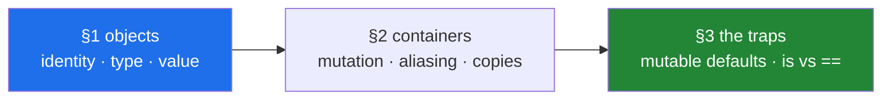

# Day 4 — Objects, types, and mutability

**Phase 1 · Python foundations · Module 1** · `PY-01` (objects: numbers, booleans, strings) and
`PY-02` (container objects and mutability). The first day of the curriculum proper, and the day that
explains most of the surprising things Python will do to you for the next eight months.

> **Yesterday:** Phase 0 closed — five credentials, four model doors, two databases, and one gate that
> proves every one of them answers.
> **Today:** what an object actually is, why two names can point at one, and the two traps — the
> mutable default and `is` versus `==` — that come out of it.
> **Tomorrow:** operators, precedence and conditionals, including `if df:` and why it raises.

> **Read this hub first**, then work through `parts/` in order. No time estimate here or anywhere —
> a day is a unit of subject, not of hours (Principle 17).

---

## §1 The story

There is one shopping list stuck to the fridge, and two people live in the house.

If Priya tells her flatmate "the list is on the fridge", and the flatmate walks over and writes *milk*
at the bottom, then Priya sees milk. She did not write it. It is there because there was only ever one
piece of paper and both of them were talking about it.

If instead Priya copies the list onto a fresh sheet, takes the fresh sheet to the shop and writes
*milk* there, the fridge list has no milk on it. Two pieces of paper now. She wrote on the other one.

Nothing about the words changed. Both times somebody said "the list" and both times somebody wrote
*milk*. What changed is whether there was **one piece of paper with two people looking at it, or two
pieces of paper**.

Today is that sentence, and its consequences. Python never copies a piece of paper unless you ask it
to, and it will happily let two names, or a name and a function's parameter, mean the same sheet. So
the only question that ever matters is: did somebody **write on the sheet**, or did they **swap in a
new one**?

Once that question is in your head, a whole pile of unrelated-looking bugs turn out to be one bug:

- A function puts your list in order and your own copy comes back reordered, because it never had a
  copy — it had your sheet.
- A "backup" made with `.copy()` changes whenever the original does, because the copy duplicated the
  folder and not the documents inside it.
- A helper collecting warnings keeps yesterday's warnings, because everybody was handed the same
  sheet of paper.
- A grid built with `[[0] * 3] * 3` has three rows that are one row wearing three hats.
- A status check written `if code is 200` passes every test and fails on real traffic, because the
  tests typed the number in and the traffic parsed it from text.
- A cache key that is a list is refused, gets "fixed" by turning it into text, and quietly stops
  matching searches whose words are in a different order.

Six bugs, one idea: **every value lives somewhere, a name is only a label pointing at it, and some
values can be written on while others cannot.**

The day is arranged so that idea arrives first and everything else follows from it. Section 1 is what
a value actually is — where it lives, what kind of thing it is, what it holds — and the three
everyday types whose behaviour that decides: whole numbers that are exact, decimals that are
approximations, and text that cannot be written on. Section 2 is the four containers, what "written
on" really means, and the two things that go wrong when several names find the same one. Section 3 is
where the two ideas meet, which is where the famous traps live.

Nothing here is advanced, and all of it holds weight later. Day 21's NumPy views, Day 26's pandas
Copy-on-Write, Day 76's leak-proof pipeline and Day 192's saved graph state are this day again, at a
size where getting it wrong is expensive.



---

## §2 The map

**What the section numbers mean today.** This is a `lab` day with two IDs, so the sections are one per
ID plus a synthesis: **1.x** is `PY-01` — what an object is and the three scalar types built on that;
**2.x** is `PY-02` — the container types and what mutability does to them; **3.x** is where the two
meet, which is where the famous bugs live. One of those scalar types, `float`, behaves the way it does
because of a published standard rather than a Python decision; [1.3](parts/01-objects/1.3-numbers-and-bool.md)
names it where it matters.

### Section 1 — objects, and the scalar types (`PY-01`)

| Part | What it answers | Level |
|---|---|---|
| [1.1 Everything is an object — identity, type, and value](parts/01-objects/1.1-identity-type-value.md) | What are the only three things an object has, and which can change? | `foundation` |
| [1.2 Names are labels, not boxes](parts/01-objects/1.2-names-are-labels.md) | Why does assignment never copy anything? | `foundation` |
| [1.3 Numbers and booleans](parts/01-objects/1.3-numbers-and-bool.md) | Why is `0.1 + 0.2 != 0.3` correct arithmetic? | `working` |
| [1.4 Strings are immutable, and what that costs](parts/01-objects/1.4-strings-are-immutable.md) | Why is building a string with `+=` in a loop quadratic? | `working` |
| [1.5 Why `"3" + 3` is a `TypeError` and not a guess](parts/01-objects/1.5-why-str-plus-int-is-a-typeerror.md) | What do "dynamically typed" and "strongly typed" each mean? | `production` |

### Section 2 — containers and mutability (`PY-02`)

| Part | What it answers | Level |
|---|---|---|
| [2.1 The four containers — list, tuple, dict, set](parts/02-containers/2.1-the-four-containers.md) | Why does changing one word turn four seconds into instant? | `foundation` |
| [2.2 Mutable versus immutable, and what "in place" means](parts/02-containers/2.2-what-in-place-means.md) | What single signal tells you an operation mutated rather than returned? | `working` |
| [2.3 Aliasing — two names, one object](parts/02-containers/2.3-aliasing-two-names-one-object.md) | Which ordinary lines create an alias without anyone deciding to? | `working` |
| [2.4 Shallow copy, deep copy, and the nested list](parts/02-containers/2.4-shallow-and-deep-copy.md) | Why is a real copy still not a backup? | `production` |
| [2.5 Hashability — why a list cannot be a dictionary key](parts/02-containers/2.5-hashability.md) | Why is `unhashable type` a guarantee rather than a limitation? | `production` |

### Section 3 — where identity and mutability meet

| Part | What it answers | Level |
|---|---|---|
| [3.1 The mutable default argument, reproduced then fixed](parts/03-identity-trap/3.1-the-mutable-default-argument.md) | When exactly is `[]` in a parameter list evaluated, and how many times? | `production` |
| [3.2 `is` versus `==`, and why interning is not a promise](parts/03-identity-trap/3.2-is-versus-equals.md) | Why does `code is 200` pass every test and fail in production? | `production` |

---

## §3 Setup — run this

**No new packages today.** Everything is the language itself plus `copy`, `sys`, `math`, `decimal`,
`dataclasses` and `timeit` from the standard library. That is the point of Module 1: before any
library, the language.

```bash
mkdir -p src/setu tests notebooks
touch src/setu/objects.py tests/test_objects.py

# a scratchpad for today's experiments - a notebook is a scratchpad, never the deliverable (P6)
touch notebooks/day-04-scratch.ipynb

# the two tools you will use most today
uv run python -c "print('id and is are builtins - nothing to install'); x=[1]; y=x; print(x is y, id(x)==id(y))"

# confirm the linter that protects you from today's headline bug is active
uv run ruff check --select B006 --statistics src/ tests/ scripts/ || true
```

| What | Where it comes from | Part |
|---|---|---|
| `id()`, `is`, `type()` | builtins | [1.1](parts/01-objects/1.1-identity-type-value.md) |
| `decimal`, `math.isclose` | standard library | [1.3](parts/01-objects/1.3-numbers-and-bool.md) |
| `copy.deepcopy` | standard library | [2.4](parts/02-containers/2.4-shallow-and-deep-copy.md) |
| `dataclasses` (`frozen=True`, `field`) | standard library | [2.5](parts/02-containers/2.5-hashability.md), [3.1](parts/03-identity-trap/3.1-the-mutable-default-argument.md) |
| `sys.intern` | standard library | [3.2](parts/03-identity-trap/3.2-is-versus-equals.md) |
| ruff's `B006` | already selected on [Day 2](../day-02-quality-gate/parts/01-linting/1.2-choosing-rule-families.md) | [3.1](parts/03-identity-trap/3.1-the-mutable-default-argument.md) |

---

## §4 Build brief

Two files are yours, and this is the first time `src/setu/` gets real functions
(Principle 6 — anything worth keeping graduates out of the notebook the same day).

**1. `src/setu/objects.py`** — small, tested helpers that make today's traps *visible* rather than
theoretical. Each one is short; the value is in getting the semantics exactly right.

```python
"""Tools for reasoning about object identity, mutability and copying.

Every function here is pure unless its name says otherwise (part 2.2).
"""

from __future__ import annotations

from typing import Any


def shares_object(left: object, right: object) -> bool:
    """True when both names refer to ONE object - not merely equal ones (part 1.1)."""
    # TODO(me): one line. Use the operator that asks about identity, not value.
    raise NotImplementedError


def is_deeply_immutable(value: Any) -> bool:
    """True when nothing reachable from `value` can be mutated (parts 2.2, 2.5).

    A tuple of tuples is deeply immutable. A tuple containing a list is not.
    """
    # TODO(me): handle the scalar cases, then recurse into tuple and frozenset.
    # Part 2.5 explains why immutability has to go all the way down - and hash()
    # is a tempting shortcut here. Decide whether to use it, and write a comment
    # saying why. (Hint: what does hash() do to a custom class by default?)
    raise NotImplementedError


def independent_copy(value: list[dict]) -> list[dict]:
    """A copy of a list of flat dicts that shares NO mutable object with the original.

    Build it - do not reach for deepcopy. Part 2.4 explains why the rebuild is both
    faster and clearer when you know the shape of the data.
    """
    # TODO(me): a comprehension. The result must satisfy
    # shares_object(out[0], value[0]) is False for every index.
    raise NotImplementedError


def count_shared(rows: list[Any]) -> int:
    """How many elements of `rows` are the SAME object as some earlier element.

    `[[0] * 3] * 3` returns 2; three independently built rows return 0 (part 2.4).
    """
    # TODO(me): you cannot put the rows in a set - they may be unhashable (part 2.5).
    # Think about what you CAN collect that identifies an object uniquely (part 1.1).
    raise NotImplementedError
```

**2. Reproduce and fix the headline bug, in the notebook, then throw the notebook away.**
[3.1](parts/03-identity-trap/3.1-the-mutable-default-argument.md) requires you to *reproduce* the
mutable-default bug before fixing it — the plan names this explicitly for `PY-02`. Do it in
`notebooks/day-04-scratch.ipynb`, watch the list grow across three calls, print
`func.__defaults__`, then write the fixed version into `src/setu/objects.py`'s docstrings as a
worked example. **The notebook is not committed** (Principle 6); the understanding is.

---

## §5 The eval that must be able to fail

Create `tests/test_objects.py`. All of these run offline and belong in `./m check`.

```python
"""Day 4: prove the identity and mutability rules, rather than believing them."""

from __future__ import annotations

import copy

import pytest

from setu.objects import count_shared, independent_copy, is_deeply_immutable, shares_object


def test_assignment_aliases_and_rebinding_does_not() -> None:
    """Part 1.2: the whole day in one test."""
    # TODO(me): make b = a, assert they share an object, mutate through b and
    # assert a sees it. Then rebind b and assert a does NOT see that. Use
    # shares_object, not ==. A test using == would pass for a copy too (part 1.1).
    raise NotImplementedError


def test_shallow_copy_shares_inner_objects() -> None:
    """Part 2.4: a real copy that is not a backup."""
    # TODO(me): build a list of dicts, .copy() it, and assert the OUTER lists
    # differ while the INNER dicts are shared. Then assert independent_copy()
    # shares nothing. Both halves matter - a test that only checks the second
    # never proves the first was a problem.
    raise NotImplementedError


def test_mutable_default_accumulates_and_the_fix_does_not() -> None:
    """Part 3.1: reproduce the bug, then prove the fix."""
    # TODO(me): define BOTH functions inside the test - the buggy one with a
    # mutable default and the fixed one with None. Call each THREE times and
    # assert the results. One call proves nothing; that is why this bug
    # survives testing (Day 2, part 3.1).
    raise NotImplementedError


def test_deep_immutability_goes_all_the_way_down() -> None:
    """Part 2.5: a tuple containing a list is not immutable."""
    # TODO(me): assert (1, (2, 3)) is deeply immutable and (1, [2]) is not.
    # Add the case that decides your hash() question from the build brief.
    raise NotImplementedError


def test_count_shared_finds_the_multiplied_grid() -> None:
    """Part 2.4: [[0] * 3] * 3 has one row, three times."""
    # TODO(me): assert count_shared([[0] * 3] * 3) == 2 and that the
    # comprehension version is 0. Explain the 2 in a comment - why not 3?
    raise NotImplementedError


@pytest.mark.parametrize("value", [257, "built at runtime", (1, 2)])
def test_equal_values_need_not_be_the_same_object(value: object) -> None:
    """Part 3.2: `is` on values is an accident of caching."""
    # TODO(me): build a second object with the same value WITHOUT using a
    # literal (round-trip through str/eval-free construction), then assert
    # == holds and is may not. Write the assertion so it cannot depend on
    # whether the interpreter happens to intern this value.
    raise NotImplementedError
```

Run them and watch every one fail before you write a line:

```bash
uv run python -m pytest tests/test_objects.py -v
```

Then implement, then **break each one on purpose**:

- Change `shares_object` to use `==` → the aliasing test and the shallow-copy test both go red, for
  different reasons. Work out why *both*. Restore it.
- Make `independent_copy` return `value.copy()` → the shallow-copy test goes red. Restore it.
- Make `is_deeply_immutable` return `True` for any tuple → the deep-immutability test goes red.
  Restore it.
- In the mutable-default test, reduce three calls to one → **the test passes against the buggy
  function.** Do not "restore" this one until you can say out loud why one call proves nothing.

That last item is the most important line in this section. It is
[Day 2, 3.1](../day-02-quality-gate/parts/03-pytest/3.1-the-test-that-can-go-red.md)'s lesson meeting
today's bug: a test that cannot fail is not a test, and this bug is specifically invisible to a
single-call test.

---

## §6 Request budget

| Resource | Today |
|---|---|
| LLM API calls | **0** — no model is called on this day |
| Network requests | **0** — nothing today leaves your machine |
| Free-tier quota | none consumed |
| Cost | **$0** (Principle 5) |

Yesterday's gate stays green without spending anything: `./m check` runs `-m "not live"`, so today's
work adds tests to the free path only
([Day 2, 5.3](../day-02-quality-gate/parts/05-ci/5.3-caching-and-never-spending-a-quota.md)).

---

## §7 Traps

- **Thinking a variable is a box.** It is a label; assignment never copies —
  [1.2](parts/01-objects/1.2-names-are-labels.md).
- **`for r in rows: r = r + [0]`** changes nothing, because it rebinds a local label —
  [1.2](parts/01-objects/1.2-names-are-labels.md).
- **`0.1 + 0.2 == 0.3`** is `False`, and the arithmetic is correct —
  [1.3](parts/01-objects/1.3-numbers-and-bool.md).
- **`bool("false")` is `True`.** Every environment variable is a string —
  [1.3](parts/01-objects/1.3-numbers-and-bool.md).
- **`nan != nan`.** Test with `math.isnan` — [1.3](parts/01-objects/1.3-numbers-and-bool.md).
- **`title.strip()` on its own line does nothing** — [1.4](parts/01-objects/1.4-strings-are-immutable.md).
- **Building a string with `+=` in a loop is quadratic.** Collect and join —
  [1.4](parts/01-objects/1.4-strings-are-immutable.md).
- **`sorted(["10", "9"])` puts `"10"` first.** Convert at the boundary —
  [1.5](parts/01-objects/1.5-why-str-plus-int-is-a-typeerror.md).
- **`(3)` is not a tuple.** The comma makes it — [2.1](parts/02-containers/2.1-the-four-containers.md).
- **`if x not in a_list` inside a loop is quadratic.** Use a set —
  [2.1](parts/02-containers/2.1-the-four-containers.md).
- **`items.sort()` returns `None`.** Capturing it gives you nothing —
  [2.2](parts/02-containers/2.2-what-in-place-means.md).
- **`+=` mutates a list and rebinds a tuple** — [2.2](parts/02-containers/2.2-what-in-place-means.md).
- **Putting an object in a list does not copy it** —
  [2.3](parts/02-containers/2.3-aliasing-two-names-one-object.md).
- **A module-level "constant" in capitals is not constant** —
  [2.3](parts/02-containers/2.3-aliasing-two-names-one-object.md).
- **`.copy()` on a list of dicts is not a backup** —
  [2.4](parts/02-containers/2.4-shallow-and-deep-copy.md).
- **`[[0] * 3] * 3` has one row, three times** —
  [2.4](parts/02-containers/2.4-shallow-and-deep-copy.md).
- **`(1, [2])` is unhashable**, even though it is a tuple —
  [2.5](parts/02-containers/2.5-hashability.md).
- **Defining `__eq__` without `__hash__`** makes your class unhashable —
  [2.5](parts/02-containers/2.5-hashability.md).
- **`def f(x, acc=[])`** shares one list across every call —
  [3.1](parts/03-identity-trap/3.1-the-mutable-default-argument.md).
- **`if not acc:` instead of `if acc is None:`** silently discards a caller's empty list —
  [3.1](parts/03-identity-trap/3.1-the-mutable-default-argument.md).
- **`code is 200`** passes every test and fails on parsed input —
  [3.2](parts/03-identity-trap/3.2-is-versus-equals.md).
- **`x == None`** is a check the class controls; `x is None` is not —
  [3.2](parts/03-identity-trap/3.2-is-versus-equals.md).

---

## §8 Verify before you code

Written **2026-08-24**. This day is about the language itself, so the authority is the language
reference rather than any library's documentation — and unlike a package version, these pages change
rarely:

- <https://docs.python.org/3/reference/datamodel.html> — the definition of an object as identity, type
  and value, in the language's own words. The first two paragraphs are
  [1.1](parts/01-objects/1.1-identity-type-value.md).
- <https://docs.python.org/3/reference/expressions.html#is-not> — what `is` compares.
- <https://docs.python.org/3/library/stdtypes.html#typesseq-mutable> — which operations on mutable
  sequences return `None`.
- <https://docs.python.org/3/tutorial/floatingpoint.html> — the canonical explanation of
  `0.1 + 0.2`, better than most articles on the subject.
- <https://docs.python.org/3/library/copy.html> — shallow versus deep, and what `deepcopy` cannot copy.
- <https://docs.python.org/3/glossary.html#term-hashable> — the hashability contract in one paragraph.
- <https://docs.python.org/3/faq/programming.html> — the official answer to "why are default values
  shared between objects", which is worth reading for its tone as well as its content.
- `uv run ruff rule B006` and `uv run ruff rule E711` — the two rules that enforce today's lessons.

---

## §9 Say it in an interview

> "In Python every value is an object with an identity, a type and a value, and only the value can
> ever change — so the first question about any type is whether it is mutable. A name is a label bound
> to an object, not a container, which means assignment never copies and passing an argument gives the
> callee a second name for the caller's object. That one fact explains a whole family of bugs that
> otherwise look unrelated: a function that reorders its caller's list, a `.copy()` that protects the
> outer list and shares the inner dicts, a mutable default argument that accumulates across calls
> because defaults are evaluated once when the `def` runs, and a grid built with list multiplication
> that has one row three times. My defaults are to return new values rather than mutating arguments,
> to copy at module boundaries rather than everywhere, and to prefer immutable types for anything
> shared — which also gives me hashability for free, since a dictionary locates a key by a number
> derived from its value and that number must never change. And I use `is` only for `None` and other
> singletons: `is` on values appears to work because small integers and short strings are cached, so
> it passes every test written with literals and fails the first time the value is parsed from input."

---

## §10 Done when

Every box in [`CHECKLIST.md`](CHECKLIST.md) is ticked, `./m check` is green, and you have
**reproduced** the mutable-default bug with your own hands before fixing it — not when a particular
amount of time has passed. Then:

```bash
./m done 4
```

Tomorrow is operators, precedence and conditionals — including `is` versus `==` on two equal lists as
an interview question, and why `if df:` raises while `if len(df):` does not.
