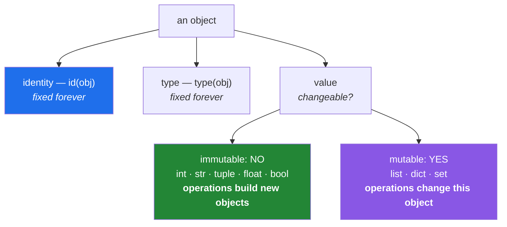

# 1.1 — Everything is an object — identity, type, and value

## One-line answer

Every value in Python is an **object**, and every object has exactly three things — an **identity**
(where it lives, fixed for life), a **type** (what it is, also fixed), and a **value** (what it holds,
which may or may not be changeable) — and almost every confusing thing Python does becomes obvious
once you know which of the three you are looking at.

---

## The story

Someone is learning Python and writes what seems like a harmless line:

```text
>>> x = 5
>>> y = x
>>> y = y + 1
>>> x
5
```

Fine. `x` is still 5. Exactly what anyone would expect.

The next day, doing the same thing with a list:

```text
>>> a = [1, 2, 3]
>>> b = a
>>> b.append(4)
>>> a
[1, 2, 3, 4]
```

`a` changed. Nobody touched `a`.

They spend twenty minutes convinced Python has a bug. They try it again with different names, and it
happens again. They ask a colleague, who says "oh, lists are mutable" and walks away, and that
sentence explains nothing at all, because *mutable* is just a word for the thing that already
happened.

Here is what is actually worth knowing: **both examples are the same rule, applied consistently.** In
both, `y = x` and `b = a` made a second name point at the *same object*. The difference is what
happened next. `y + 1` built a **new** object and pointed `y` at it. `b.append(4)` changed the object
**in place**, and `a` was looking at that same object the whole time.

Nothing about names differed. Something about the operations did. Telling those two kinds of
operation apart is what the next twelve documents are for, and it starts with knowing what an object
is.

---

## The idea in plain language

### An object has three properties, and only three

In Python, every single value — a number, a string, a list, a function, a module, a class, `None` —
is an **object**. There are no exceptions and there is no "simple value" category that behaves
differently. This is unusual among programming languages and it is why Python's rules are so uniform
once you learn them.

Every object has three things:

| Property | What it is | Can it change? | How to see it |
|---|---|---|---|
| **identity** | which object this is — conceptually its address | **never**, for the object's whole life | `id(obj)` |
| **type** | what kind of thing it is | **never**, in practice | `type(obj)` |
| **value** | what it currently holds | **sometimes** — this is the whole question | `print(obj)` |

Read the third column carefully, because it is the entire subject of today. Identity and type are
fixed for an object's lifetime. **Value is the only one that can ever change**, and whether it can
depends on the type.

### Identity — `id()`

`id(obj)` returns a number that uniquely identifies that object while it exists. In the usual Python
implementation it happens to be a memory address, but the only guarantee is: **unique among objects
that exist at the same time, and constant for that object's lifetime.**

Two names that give the same `id` are looking at **one object**. That is not "equal" and it is not
"similar" — it is the same thing, and a change made through one name is visible through the other.

The `is` operator compares identity. `==` compares value. Those are different questions, and
[3.2](../03-identity-trap/3.2-is-versus-equals.md) is entirely about when people confuse them.

### Type — `type()`

`type(obj)` gives the object's type: `int`, `str`, `list`, `dict`. The type determines what the object
can do — what operations are legal, what methods exist, and crucially whether the value can be
changed.

Python is **dynamically typed**, meaning a *name* has no type; only an object does. `x = 5` then
`x = "hello"` is fine, because you have not changed anything's type — you have pointed `x` at a
different object.

It is also **strongly typed**, meaning the object's type is enforced and not silently worked around.
`"3" + 3` raises rather than guessing, which is [1.5](1.5-why-str-plus-int-is-a-typeerror.md)'s
subject. Those two words get confused constantly; they answer different questions.

### Value, and the one question that matters

Whether an object's value can be changed after creation splits every type in Python into two groups:

- **Immutable** — the value can never change. `int`, `float`, `bool`, `str`, `tuple`, `frozenset`,
  `None`. Any operation that looks like a change actually **builds a new object**.
- **Mutable** — the value can change in place, keeping the same identity. `list`, `dict`, `set`, and
  most objects you define yourself.

That distinction is [2.2](../02-containers/2.2-what-in-place-means.md), and it is the single most
consequential fact in this entire day.



---

## Why Setu needs it

- **[2.3](../02-containers/2.3-aliasing-two-names-one-object.md) and
  [3.1](../03-identity-trap/3.1-the-mutable-default-argument.md) are both direct consequences** of
  identity being a real, observable thing. Neither makes sense without `id()`.
- **Day 21's NumPy view trap** (`NP-03`) is this idea with an array: a slice shares memory with its
  parent, so writing to the slice changes the parent. Same rule, larger object.
- **pandas 3.0's Copy-on-Write** (Day 26, `PD-01`) exists precisely because chained assignment
  modifies a temporary object rather than the one you meant. That entire breaking change is an
  identity problem.
- **[Day 2, 3.2](../../../day-02-quality-gate/parts/03-pytest/3.2-fixtures-and-tmp-path.md)'s flaky
  test** — a module-level list shared between tests — is aliasing, met before it was explained. Today
  is the explanation.
- **Every `Paper` object from Day 12** and every piece of graph state from Day 192 is a mutable object
  passed between functions. Knowing what that means is not optional there.

---

## The mechanism

Look at all three properties of one object:

```python
"""The three properties every object has."""

value = [1, 2, 3]

print("value   :", value)
print("type    :", type(value))
print("identity:", id(value))
print("type of the type:", type(type(value)))
```

**Line by line:**

- `type(value)` prints `<class 'list'>` — the type is itself an object, which is why the fourth line
  works and prints `<class 'type'>`. "Everything is an object" includes types, which is not a trick;
  it is what makes `isinstance` and class creation ordinary rather than magic.
- `id(value)` prints a large integer. **The specific number is meaningless** — it will differ on every
  run and on every machine. What is meaningful is comparing two ids with each other.
- Nothing here is a "primitive". A list, an integer and a function all answer these three questions
  identically, which is the uniformity that makes Python's rules learnable.

Now reproduce the story, watching identity rather than guessing:

```python
"""The story's two cases, with identity made visible."""

print("--- immutable: int ---")
x = 5
y = x
print(f"x={x} id={id(x)}")
print(f"y={y} id={id(y)}   same object: {x is y}")

y = y + 1
print("after y = y + 1")
print(f"x={x} id={id(x)}")
print(f"y={y} id={id(y)}   same object: {x is y}")

print("\n--- mutable: list ---")
a = [1, 2, 3]
b = a
print(f"a={a} id={id(a)}")
print(f"b={b} id={id(b)}   same object: {a is b}")

b.append(4)
print("after b.append(4)")
print(f"a={a} id={id(a)}")
print(f"b={b} id={id(b)}   same object: {a is b}")
```

**Line by line:**

- `y = x` — **both names now refer to one object.** `x is y` prints `True`, and the two ids match. This
  is identical in both halves; the assignment does not copy anything, which is
  [1.2](1.2-names-are-labels.md)'s subject.
- `y = y + 1` — `y + 1` computes a **new** integer object and `y = ...` points `y` at it. `x` still
  points where it always did. Watch `id(y)` change and `id(x)` stay the same: that is the proof.
- `b.append(4)` — a **method call on the object**, not an assignment. There is no `b = ...` here.
  The object mutates, and both names see it because both names were always looking at one object.
  Watch `id(a)` and `id(b)` stay identical and equal to each other throughout.
- The `is` column is the point of the whole listing: **in both halves it starts `True`.** What differs
  is whether the second operation rebinds a name or mutates an object.
- `f"{...}"` — an f-string, evaluating the expression inside the braces and inserting the result. Day
  7 covers formatting properly (`PY-06`); today it is a printing convenience.

And the distinction that becomes a trap in [3.2](../03-identity-trap/3.2-is-versus-equals.md):

```python
"""Equal is not the same as identical."""

first = [1, 2, 3]
second = [1, 2, 3]

print("first == second :", first == second)  # same VALUE
print("first is second :", first is second)  # same OBJECT
print("id(first) :", id(first))
print("id(second):", id(second))

third = first
print("third is first  :", third is first)

first.append(99)
print("second after mutating first:", second)
print("third  after mutating first:", third)
```

**Line by line:**

- `first == second` is `True` — the two lists hold equal values. `==` asks *does this hold the same
  thing?*
- `first is second` is `False` — they are **two separate objects** that happen to contain the same
  values. `is` asks *is this literally the same object?*
- Two different ids confirm it. Two lists written out separately are always two objects, however
  identical their contents.
- `third = first` makes a third name for the **first** object, so `third is first` is `True`.
- After `first.append(99)`, `second` is unchanged and `third` shows `[1, 2, 3, 99]`. **That one line
  contains the whole lesson**: mutating an object is visible through every name for it, and invisible
  to a different object that merely happens to be equal.
- **Almost every bug in the next twelve documents is somebody expecting the `second` behaviour and
  getting the `third` behaviour.**

---

## When it breaks

**A number that will not compare the way you expect:**

```text
>>> 0.1 + 0.2 == 0.3
False
>>> 0.1 + 0.2
0.30000000000000004
```

**What it means.** Not an identity problem — a **value** problem. Floats store binary fractions and
`0.1` has no exact binary representation, so the stored value is very slightly off and the arithmetic
compounds it. This is not a Python quirk; it is how essentially all hardware floating point works.
[1.3](1.3-numbers-and-bool.md) covers it and the fix (compare within a tolerance, or use a decimal
type for money).

**A comparison that works today and fails tomorrow:**

```text
>>> a = 256
>>> b = 256
>>> a is b
True
>>> a = 257
>>> b = 257
>>> a is b
False
```

**What it means.** The interpreter caches small integers, so two names for `256` may land on one
cached object while two names for `257` do not. **This is an implementation detail and never
something to rely on.** It is also the single most common way `is` gets misused: it appears to work
during testing on small numbers and fails on real data.
[3.2](../03-identity-trap/3.2-is-versus-equals.md) is entirely about this.

**Trying to change something that cannot change:**

```text
>>> name = "setu"
>>> name[0] = "S"
Traceback (most recent call last):
  File "<stdin>", line 1, in <module>
TypeError: 'str' object does not support item assignment
```

**What it means.** Strings are immutable — the value cannot change, ever
([1.4](1.4-strings-are-immutable.md)). The message is precise: not "you can't do that", but *this type
does not support item assignment*. Build a new string instead. Note that
`name = name.upper()` works fine, because that is an **assignment** rebinding the name, not a mutation.

**And the one that looks like nothing happened:**

```text
>>> items = [3, 1, 2]
>>> sorted_items = items.sort()
>>> sorted_items
>>> print(sorted_items)
None
```

**What it means.** `list.sort()` sorts **in place** and returns `None`. You captured the return value
of a mutation, which is nothing. `sorted(items)` is the one that returns a new list. This mistake
produces `None` flowing quietly through your program until something far away raises
`TypeError: 'NoneType' object is not iterable` — a classic case of the error appearing a long way from
the cause ([2.2](../02-containers/2.2-what-in-place-means.md)).

---

## In production

**"Which object is this?" is a real debugging tool, not a teaching exercise.** When a value changes and
nothing in the visible code changed it, printing `id()` at a few points identifies whether you have
one object with several names or several objects. That takes seconds and settles a question that
otherwise consumes an afternoon. The same reasoning scales up: pandas' `_is_view` and NumPy's `.base`
attribute exist because professionals need to ask exactly this question about large arrays, where
"is this a copy or a view" is a performance *and* a correctness question (Day 21, Day 25).

**Immutability is a design tool, and mature codebases reach for it deliberately.** An object that
cannot change is safe to share between functions, safe to use as a dictionary key
([2.5](../02-containers/2.5-hashability.md)), safe across threads without a lock, and impossible to
corrupt from a distance. The cost is allocation — every "change" makes a new object. The professional
default is **immutable unless you have a reason**, and the reasons are usually performance on large
data or a genuinely stateful entity. From Day 19 this project uses frozen dataclasses and validated
models for exactly this (`PY-23`), and by Day 192 the state of a running graph is deliberately handled
as a value that is replaced rather than edited.

**Identity has consequences for memory that only appear at scale.** Python objects carry overhead —
a list of a million integers is not a million integers' worth of memory, it is a million *pointers* to
integer objects plus the objects. That is why NumPy exists (Day 20, `NP-01`): one contiguous block of
raw numbers, no per-element objects. The measurement on that day — a Python list of a million floats
against an `ndarray` — is this document's subject expressed as megabytes.

**The review comment a senior engineer leaves.** On a function that takes a list and modifies it:
*"Does the caller expect this to be mutated? Either return a new list or name it so the mutation is
obvious — `sort_in_place`, not `sort`. Right now a caller two files away is going to be surprised."*

**The interview question.** *"What's the difference between `is` and `==`?"* Everyone answers "identity
versus equality" and stops. The answer that lands goes on to say *why it matters*: `is` asks whether
two names refer to one object, which determines whether a mutation through one is visible through the
other — so it is really a question about aliasing, not about comparison. Then give the trap: small
integers and short strings are cached, so `is` appears to work on test data and fails on real data,
which is why `==` is correct for values and `is` is correct only for singletons like `None`. If you can
add that `id()` is a debugging tool for "why did this change when nothing touched it", you are
describing a bug you have actually chased.

---

## Check yourself

```bash
uv run python -c "
a = [1, 2, 3]
b = a
c = [1, 2, 3]
print('b is a:', b is a, '| c is a:', c is a, '| c == a:', c == a)
a.append(4)
print('after a.append(4)  ->  b:', b, '| c:', c)
"
```

Predict all five outputs **before** running it. If `b` and `c` surprise you, read the mechanism again —
this single result is the foundation of the next eleven documents.

**Answer out loud, without scrolling up:**

> Name the three properties every object has and say which of them can change. Then explain, using
> the story's two examples, why `y = y + 1` leaves `x` alone but `b.append(4)` does not leave `a`
> alone — without using the word "mutable".

---

**Next:** [1.2 — Names are labels, not boxes](1.2-names-are-labels.md)
