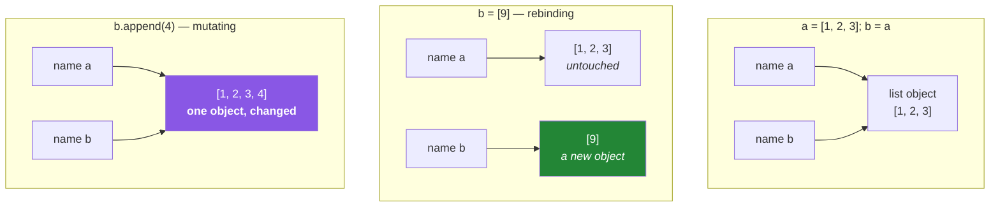

# 1.2 — Names are labels, not boxes

## One-line answer

A Python name is a **label stuck onto an object**, not a box containing a value — so assignment never
copies anything, a name can be moved to a different object at any time, and an object can wear as many
labels as you like.

---

## The story

Think about a suitcase at an airport.

The suitcase has a paper tag looped through the handle with a name on it. If you tie a second tag to
the same handle with a different name, you do not now have two suitcases. You have one suitcase and
two tags. If somebody reads the second tag, finds the bag, opens it and takes out a jacket, then the
first tag still points at that same bag — and the jacket is gone from it. There was never a second
jacket to protect.

Most people arrive at Python carrying a different picture, and it is a perfectly reasonable one. In
that picture a variable is a **box**. You make a box, you put something in it, and writing
`second = first` tips the contents of one box into another, so you end up with two boxes holding two
copies. Change one, and the other is untouched.

The box picture and the tag picture agree almost all the time, which is why the mistake survives for
weeks. They only disagree when somebody reaches into the thing itself and changes it. Numbers and
text cannot be changed once made, so beginners — who mostly use numbers and text — never see the
difference.

Then comes a function that takes a list of names and, trying to be helpful, puts them in alphabetical
order before doing its work. The caller's list comes back alphabetised. The caller never asked for
that, and does not notice until a printed report comes out in an order that makes a subtotal wrong.

The box picture says the function got its own copy. The tag picture says the function got a second
tag tied to the caller's bag. **Python is the tag picture**, always, with no exceptions.

The fix is not a rule to memorise. It is swapping the picture in your head. Once the picture is
right, the behaviour stops being surprising and starts being the only thing that could have happened.

---

## The idea in plain language

### Two pictures, one of which is wrong

**The box model:** a variable is a container. `x = 5` puts 5 into the box called `x`. `y = x` copies
what is in `x` into a different box called `y`. Two boxes, two values.

**The label model:** an object exists somewhere, and a name is a sticky label pointing at it. `x = 5`
creates an integer object and sticks the label `x` on it. `y = x` sticks a **second label on the same
object**. One object, two labels.

Python is the second picture, always, for every type without exception.

Everything follows from it:

- **Assignment never copies an object.** It only ever binds a name to an object that already exists.
- **A name has no type**, because the label is not the thing. `x = 5` then `x = "hello"` moves the
  label; the integer was never "converted".
- **One object can have many names**, and any of them can be used to reach it.
- **Rebinding a name affects only that name.** Moving one label leaves every other label where it was.
- **Mutating an object affects every name for it**, because there is only one object.

Those last two lines are the whole of [1.1](1.1-identity-type-value.md)'s story, restated as a rule.

### What actually happens in `x = expr`

Two steps, in this order:

1. Evaluate `expr` — producing an object. It may be new (`[1, 2]`, `5 + 3`) or existing (`y`).
2. Bind the name `x` to that object.

Note what is *not* in that list: copying. There is no step where the object is duplicated. Ever.

### Rebinding versus mutating — the distinction the whole day rests on

| | Rebinding | Mutating |
|---|---|---|
| Looks like | `name = ...` | `name.method(...)`, `name[i] = ...`, `name += ...` on a list |
| What changes | which object the **name** points at | the **object** itself |
| Other names for the old object | **unaffected** | **all see the change** |
| Works on immutable types | yes, always | no — there is nothing to change |
| Identity | `id(name)` changes | `id(name)` stays the same |

The reliable test, when you cannot tell: **is there a bare `=` with just a name on the left?** If yes,
it is rebinding. If the left-hand side is `name[...]` or `name.attr`, or there is no `=` at all, it is
mutating.



### And the consequence for functions

Passing an argument is an assignment. `process(rows)` binds the parameter name inside the function to
**the caller's object** — not to a copy.

So a function can change its caller's data, and often does so by accident. Python's argument passing
is sometimes called "pass by object reference", and the practical summary is:

- **Rebinding a parameter inside a function** changes nothing for the caller.
- **Mutating the object a parameter points at** changes everything for the caller.

The story's sorted list is the second case, and [2.3](../02-containers/2.3-aliasing-two-names-one-object.md)
takes it further.

---

## Why Setu needs it

- **[3.1](../03-identity-trap/3.1-the-mutable-default-argument.md) is unexplainable without this
  picture.** A default argument is an object created once and labelled by the parameter name on every
  call.
- **Day 10 writes your first `src/setu/` module** (`PY-10`), full of functions taking data. Whether
  those functions mutate their arguments is a design decision you will make on that day, and this is
  where you learn there is a decision.
- **[Day 2, 3.2](../../../day-02-quality-gate/parts/03-pytest/3.2-fixtures-and-tmp-path.md)'s flaky
  test** is two tests sharing one label on one list. The fix — a fixture — works because it creates a
  new object per test.
- **Day 26's pandas Copy-on-Write** (`PD-01`) is entirely about whether an operation gave you a new
  object or another label on the old one. The whole 3.0 breaking change is this document at scale.
- **From Day 192, graph state is passed between nodes** (`LG-`). A node that mutates shared state
  instead of returning a new value is the hardest class of bug in that phase.

---

## The mechanism

Watch a label move, and watch an object change, with identity as the witness:

```python
"""Rebinding moves a label. Mutating changes an object."""

a = [1, 2, 3]
b = a
print(f"start      a={a} b={b}  ids equal: {id(a) == id(b)}")

b = [9, 9]
print(f"after b=[9,9]  a={a} b={b}  ids equal: {id(a) == id(b)}")

c = [1, 2, 3]
d = c
d.append(4)
print(f"after d.append  c={c} d={d}  ids equal: {id(c) == id(d)}")
```

**Line by line:**

- `b = a` — a second label on one object. `id(a) == id(b)` is `True`.
- `b = [9, 9]` — the right-hand side builds a **new** list object; the `=` moves the label `b` onto it.
  `a` never moved, so it still shows `[1, 2, 3]`. **The `=` acted on the name, not on the object.**
- `d.append(4)` — no `=` at all. A method call on the object both names point at, so both show
  `[1, 2, 3, 4]` and the ids stay equal.
- Two lines that look similar in shape produce opposite outcomes, and the tell is the bare `=`.

Now the version that costs people real time — a function:

```python
"""What a function can and cannot change about its caller's data."""


def rebind(items: list[int]) -> None:
    """Points the LOCAL name at a new list. The caller sees nothing."""
    items = items + [99]
    print("   inside rebind  :", items)


def mutate(items: list[int]) -> None:
    """Changes the caller's object. The caller sees everything."""
    items.append(99)
    print("   inside mutate  :", items)


rows = [1, 2, 3]
print("before rebind:", rows)
rebind(rows)
print("after  rebind:", rows)

rows = [1, 2, 3]
print("before mutate:", rows)
mutate(rows)
print("after  mutate:", rows)
```

**Line by line:**

- `def rebind(items)` — calling `rebind(rows)` binds the local name `items` to the caller's list. At
  that instant there are two labels on one object, one of which is local to the function.
- `items = items + [99]` — `+` on two lists builds a **new** list, and the `=` moves the local label
  onto it. The caller's object is untouched, and the local label vanishes when the function returns.
  The caller sees `[1, 2, 3]`.
- `items.append(99)` — mutates the object itself. There is only one object, and the caller is holding
  a label on it, so the caller sees `[1, 2, 3, 99]`.
- **The two functions differ by one character of syntax and completely in consequence.** Being able to
  look at a function and say which one it is doing is the skill.
- `-> None` on both — they return nothing, which is itself a signal: a function returning `None` and
  taking a mutable argument is almost certainly mutating it. That reading is a genuinely useful habit
  when reviewing unfamiliar code ([1.1](1.1-identity-type-value.md)'s `list.sort()` returning `None`).

And the one that surprises people, because the syntax looks like rebinding:

```python
"""`+=` is mutation on a list and rebinding on a tuple. Same operator, different rule."""

lst = [1, 2]
alias = lst
lst += [3]
print(f"list  : lst={lst} alias={alias}  same object: {lst is alias}")

tup = (1, 2)
alias_t = tup
tup += (3,)
print(f"tuple : tup={tup} alias_t={alias_t}  same object: {tup is alias_t}")
```

**Line by line:**

- `lst += [3]` — on a list, `+=` calls the object's in-place add, which **mutates** and keeps the same
  identity. `alias` sees `[1, 2, 3]` and `lst is alias` is still `True`.
- `tup += (3,)` — a tuple is immutable and has no in-place add, so Python falls back to
  `tup = tup + (3,)`: a new tuple, and the label moves. `alias_t` still shows `(1, 2)`.
- `(3,)` — the trailing comma is what makes it a tuple. `(3)` is just the number 3 in parentheses, and
  `tup + 3` would raise. This catches everyone once
  ([2.1](../02-containers/2.1-the-four-containers.md)).
- **The same operator does two different things depending on the type of the object on the left.**
  That is not an inconsistency: `+=` means "add in place if you can, otherwise rebind", and the type
  decides. Knowing that rule is what makes the output predictable.
- Run it and read the `same object` column. Those two booleans are the entire point of this block.

---

## When it breaks

**The function that helpfully ruined your data:**

```text
>>> rows = [3, 1, 2]
>>> top = summarise(rows)
>>> rows
[1, 2, 3]
```

**What it means.** `summarise` sorted its argument in place. Nothing raised, nothing warned, and the
caller's list is now in a different order. **This is the story**, and it is why a function that mutates
an argument should say so in its name or in a docstring — or, better, not do it.

**A name used before it points anywhere:**

```text
>>> print(total)
Traceback (most recent call last):
  File "<stdin>", line 1, in <module>
NameError: name 'total' is not defined
```

**What it means.** In the box model this might be an "empty box". In the label model there is no box —
a name that has never been bound simply does not exist. This is also why there is no way to declare a
variable without giving it a value; a label with nothing to stick to is meaningless.

**The loop variable that everybody rebinds by accident:**

```text
>>> rows = [[1], [2], [3]]
>>> for r in rows:
...     r = r + [0]
...
>>> rows
[[1], [2], [3]]
```

**What it means.** `r = r + [0]` rebinds the loop's local label on each pass; the lists inside `rows`
are never touched. Change it to `r.append(0)` and every inner list changes. Same loop, one character
different, opposite result — and this is the single most common "my loop does nothing" question in
Python.

**And the aliasing bug wearing a comprehension:**

```text
>>> grid = [[0] * 3] * 3
>>> grid[0][0] = 1
>>> grid
[[1, 0, 0], [1, 0, 0], [1, 0, 0]]
```

**What it means.** `[x] * 3` makes a list containing **three labels on the same object**, not three
objects. Writing through one is writing through all of them. The fix is
`[[0] * 3 for _ in range(3)]`, which evaluates the inner list expression three times and therefore
builds three objects. This is the label model producing a result that is genuinely startling until the
picture is right, and it is worth typing out yourself.

---

## In production

**Whether a function mutates its arguments is part of its contract, and it must be visible from the
call site.** Professional codebases pick one convention and hold it: either functions never mutate
their inputs and always return new values, or the ones that do are named unmistakably
(`normalise_in_place`, `sort_in_place`). The standard library itself models the distinction —
`list.sort()` mutates and returns `None`, `sorted()` returns a new list — and copying that pairing is
a good default. The failure mode of no convention is a caller who cannot tell without reading the
implementation, which does not scale past one file.

**Defensive copying is the blunt instrument, and it has a real cost.** A function that starts with
`items = list(items)` cannot surprise its caller. That is genuinely useful at a module boundary or a
public API. It is also an allocation on every call, which matters when the argument is large or the
call is hot. The professional judgement is to copy at the **boundary** — where data enters your
control — and to share freely inside it, which keeps the guarantee where it is worth paying for.

**Immutability removes the question entirely, which is why it keeps winning.** A frozen dataclass or a
tuple cannot be mutated by a callee, so "does this function change my data?" stops being askable.
That is why functional-style pipelines, and this project's approach to graph state from Day 192,
prefer replacing values over editing them. The trade is allocation, and for anything except large
arrays it is almost always worth it.

**What changes at scale:** with concurrency, a shared mutable object is not merely surprising — it is a
**data race**. Two threads mutating one list can interleave, and while Python's interpreter lock makes
individual operations atomic, sequences of them are not, so read-modify-write patterns corrupt state.
This is the same aliasing fact with a much worse failure mode: intermittent, unreproducible, and
dependent on timing. Day 19's concurrency work (`PY-24`) meets this directly, and the defence is the
same — do not share mutable state.

**The review comment a senior engineer leaves.** On a function taking a list and returning `None`:
*"This mutates the caller's list. Either return a new one or rename it so the call site says so — I
had to read the body to find out."*

**The interview question.** *"Is Python pass by value or pass by reference?"* It is a trick question and
the answer is "neither, as those terms are usually meant" — arguments are bound to the same objects
the caller holds, so mutating one is visible to the caller and rebinding the parameter is not. The
answer that lands demonstrates it rather than asserting it: describe a function that appends to its
argument and one that reassigns it, and say what the caller sees in each case. Then generalise to the
rule: **assignment binds names, it never copies objects**, so every question of this kind reduces to
whether the operation rebinds a name or mutates an object.

---

## Check yourself

```bash
uv run python -c "
grid = [[0] * 3] * 3
grid[0][0] = 1
print('shared rows :', grid)
grid2 = [[0] * 3 for _ in range(3)]
grid2[0][0] = 1
print('separate rows:', grid2)
print('row 0 is row 1 in grid :', grid[0] is grid[1])
print('row 0 is row 1 in grid2:', grid2[0] is grid2[1])
"
```

Predict all four lines before running. The two `is` results are the explanation for the two grids.

**Answer out loud, without scrolling up:**

> Explain the label model to somebody who thinks a variable is a box, and use it to say why
> `for r in rows: r = r + [0]` changes nothing. Then give the one-glance test for whether a line
> rebinds a name or mutates an object.

---

**Next:** [1.3 — Numbers and booleans: the values that are not what they look like](1.3-numbers-and-bool.md)
