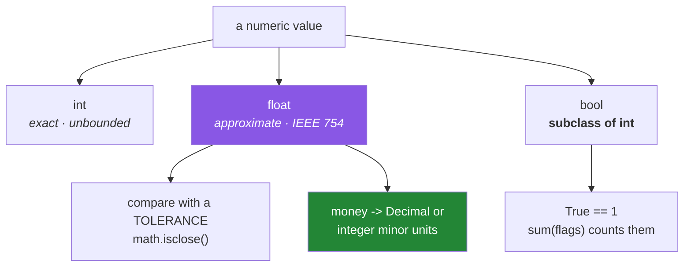

# 1.3 — Numbers and booleans — the values that are not what they look like

> **The source.** `float` is not Python's invention — it is a standard, taught in
> full in [*IEEE 754*](../../papers/01-ieee-754.md).

## One-line answer

`int` is exact and unbounded, `float` is an *approximation* of a real number stored in binary — so
`0.1 + 0.2 != 0.3` is correct arithmetic rather than a bug — and `bool` is a subclass of `int`, which
means `True` genuinely equals `1` and can be summed.

---

## The story

A billing system totals a customer's charges. Three items at 0.10, 0.20 and 0.30 of a currency unit.
The total should be 0.60. A check somewhere asserts it equals 0.60, and it fails.

The developer prints the total and sees `0.6000000000000001`.

Their first response is that the addition is broken, which it is not. Their second is to round the
output for display, which hides it. The check still fails, because the stored value is still wrong by
a tiny amount. Over a million transactions those tiny amounts accumulate into a reconciliation
difference that somebody in finance notices and nobody in engineering can explain.

The cause is not Python and not a bug. **`0.1` cannot be represented exactly in binary**, in the same
way `1/3` cannot be written exactly in decimal. The computer stores the nearest representable value,
which is very slightly off, and arithmetic on slightly-off values compounds.

Every language using standard hardware floating point does this. The developers who avoid the problem
are the ones who know that money is not a float, and comparison of floats is not `==`.

---

## The idea in plain language

### `int` — exact, and as big as you like

Python's integers are **arbitrary precision**: they grow to whatever size is needed, limited only by
memory. There is no 32-bit or 64-bit ceiling, no overflow, no wraparound. `2 ** 1000` is an ordinary
integer that prints in full.

Integer arithmetic is **exact**. `a + b`, `a * b`, `a - b` on integers give exactly the right answer,
always.

Two division operators, and the distinction matters:

- `/` is **true division** and always produces a `float`, even when it divides evenly. `6 / 3` is
  `2.0`, not `2`.
- `//` is **floor division**, producing the largest integer not greater than the result. `7 // 2` is
  `3`. On negative numbers it floors toward negative infinity, so `-7 // 2` is `-4`, not `-3` — which
  surprises people and is consistent with `%`.

### `float` — an approximation, by design

A `float` is a binary fraction with fixed precision, following the IEEE 754 double-precision standard.
It stores a number in the form of a sign, a set of binary digits, and an exponent — about 15 to 17
decimal digits of precision.

The crucial consequence: **a number that is simple in decimal may have no exact binary
representation.** One tenth is such a number. In binary, 0.1 is a repeating fraction, exactly as 1/3
is in decimal, so what gets stored is the nearest representable value.

That means three things you must simply know:

- `0.1 + 0.2 == 0.3` is `False`, and the arithmetic is correct.
- Floats should be compared with a **tolerance**, not with `==`.
- **Money is not a float.** Use `decimal.Decimal`, or integers of the smallest unit.

Floats are also immutable ([1.1](1.1-identity-type-value.md)) — every operation makes a new object.

### `bool` — an integer wearing a costume

`bool` is a **subclass of `int`**. This is not an analogy; it is the actual class hierarchy. `True` is
`1` and `False` is `0`, and they behave as such everywhere:

```text
True + True      ->  2
sum([True, False, True])  ->  2
isinstance(True, int)     ->  True
```

That last property is genuinely useful — `sum(flags)` counts the true ones — and occasionally
surprising, because a function checking `isinstance(x, int)` accepts `True`.

### Truthiness — every object is usable in a condition

Any object can be used where a boolean is expected, and Python defines which ones count as false:

| Falsy | Truthy |
|---|---|
| `False`, `None` | everything else |
| `0`, `0.0`, `0j` | any non-zero number |
| `""`, `[]`, `()`, `{}`, `set()` | any non-empty container |

Two consequences worth carrying:

- **`bool("false")` is `True`**, because it is a non-empty string. This is the environment-variable
  trap from [Day 3, 1.2](../../../day-03-keys-and-budget/parts/01-secrets/1.2-dotenv-and-os-environ.md),
  and it is the most common bug in this whole area.
- **`if items:` and `if items is not None:` are different questions.** The first is false for an empty
  list; the second is true. Choosing the wrong one is how an empty result gets treated as a missing
  result. Day 5 covers conditionals properly (`PY-04`); the distinction starts here.



---

## Why Setu needs it

- **Day 58 onward is statistics**, and every mean, variance and probability is a float. A test
  asserting a computed statistic with `==` will fail on a value that is correct.
- **Principle 15 says never demo on the training set**, and the metrics that prove it are floats
  compared against thresholds — which is a comparison you must get right from Day 91.
- **Day 130's gradient check** matches a hand-derived gradient against autograd "to six decimal
  places". That phrase is a tolerance, and this document is why it is phrased that way rather than as
  equality.
- **`sum(flags)` over booleans is how you count matches**, which appears constantly from Day 84's EDA
  onward — `(df["col"] > 5).sum()` is exactly this property in pandas.
- **[Day 3's](../../../day-03-keys-and-budget/LESSON.md) environment variables** are strings, and
  `bool(os.environ["DEBUG"])` is truthy for `"false"`. That bug is this document.

---

## The mechanism

See the representation problem directly, rather than being told about it:

```python
"""Why 0.1 + 0.2 is not 0.3, shown rather than asserted."""

from decimal import Decimal

print("0.1 + 0.2      :", 0.1 + 0.2)
print("== 0.3         :", 0.1 + 0.2 == 0.3)
print()
print("what 0.1 really is:", Decimal(0.1))
print("what 0.2 really is:", Decimal(0.2))
print("what 0.3 really is:", Decimal(0.3))
print()
print("float can hold about", len(str(Decimal(0.1))) - 2, "digits before it stops being 0.1")
```

**Line by line:**

- `Decimal(0.1)` — constructing a `Decimal` **from a float** shows the float's exact stored value in
  decimal, which is `0.1000000000000000055511151231257827021181583404541015625`. That is not Python
  being awkward; that is genuinely what the hardware holds.
- Note this is `Decimal(0.1)` with a float argument, deliberately. `Decimal("0.1")` with a **string**
  gives exactly one tenth, which is the whole reason `Decimal` exists — and the difference between
  those two calls is the most important thing on this page.
- `0.1 + 0.2 == 0.3` prints `False`. Both sides are approximations, and the approximation of the sum
  is not the approximation of `0.3`.
- **Run this once and the mystery is gone permanently.** Every later float surprise reduces to what
  you just printed.

Now the two correct ways to work with them:

```python
"""Compare floats with a tolerance. Handle money with exact types."""

import math
from decimal import Decimal, getcontext

total = 0.1 + 0.2

print("naive equality :", total == 0.3)
print("isclose        :", math.isclose(total, 0.3))
print("isclose, tight :", math.isclose(total, 0.3, rel_tol=1e-15))
print("abs difference :", abs(total - 0.3))

print()
getcontext().prec = 28
prices = [Decimal("0.10"), Decimal("0.20"), Decimal("0.30")]
print("Decimal sum    :", sum(prices))
print("== Decimal 0.60:", sum(prices) == Decimal("0.60"))

print()
cents = [10, 20, 30]
print("integer cents  :", sum(cents), "->", f"{sum(cents) / 100:.2f}")
```

**Line by line:**

- `math.isclose(a, b)` — the standard-library comparison. It uses a **relative** tolerance by default,
  meaning it scales with the magnitude of the values, which is what you want when comparing numbers
  that might be `0.3` or might be `3_000_000.0`.
- `rel_tol=1e-15` — tightening it until the comparison fails again, which demonstrates that
  `isclose` is not magic: it is a threshold, and choosing the threshold is your job. For a value near
  zero you also want `abs_tol`, because relative tolerance is meaningless when the expected value is 0.
- `abs(total - 0.3)` — the actual difference, around `5.5e-17`. Seeing the size of the error is what
  makes a sensible tolerance choosable rather than guessed.
- `Decimal("0.10")` — **constructed from a string**, so it is exactly ten hundredths. This is the
  correct way to build a `Decimal` for money, and passing a float instead reintroduces the entire
  problem.
- `getcontext().prec = 28` — decimal arithmetic has configurable precision. Setting it explicitly
  rather than relying on a default is Principle 4 applied to arithmetic: **never accept a framework
  default.**
- `cents = [10, 20, 30]` — the other correct approach: store money as an integer count of the smallest
  unit and divide only for display. Integer arithmetic is exact
  ([1.1](1.1-identity-type-value.md)), so nothing can drift. Many payment systems do exactly this.
- `f"{x:.2f}"` — format with two decimal places, for display only. **Formatting for display and
  storing a value are different jobs**, and confusing them is how rounding hides an error instead of
  fixing it.

And the bool-is-an-int property, used and misused:

```python
"""bool is a subclass of int. Useful, and occasionally surprising."""

flags = [True, False, True, True]

print("isinstance(True, int):", isinstance(True, int))
print("True + True          :", True + True)
print("sum(flags)           :", sum(flags), "of", len(flags))
print("mean                 :", sum(flags) / len(flags))

print()
print('bool("false")        :', bool("false"))
print('bool("")             :', bool(""))
print("bool([])             :", bool([]))
print("bool([0])            :", bool([0]))


def parse_flag(raw: str) -> bool:
    """The correct way to read a boolean out of a string (e.g. an env var)."""
    return raw.strip().lower() in {"1", "true", "yes", "on"}


for raw in ("true", "false", "TRUE", "0", "", "yes"):
    print(f"  parse_flag({raw!r}):{'':2}{parse_flag(raw)}")
```

**Line by line:**

- `isinstance(True, int)` is `True` — the class hierarchy, not a coincidence. A validation function
  checking `isinstance(x, int)` will accept `True`, which is worth knowing before it accepts one.
- `sum(flags)` counts the true values, because each `True` contributes 1. **This is the idiom for
  counting matches**, and it reappears constantly in pandas as `(condition).sum()`.
- `sum(flags) / len(flags)` is the *proportion* true — the mean of a boolean array, which is how you
  compute a rate. Day 91's accuracy metric is literally this expression.
- `bool("false")` prints **`True`** — non-empty string, therefore truthy. This one line is the bug from
  [Day 3, 1.2](../../../day-03-keys-and-budget/parts/01-secrets/1.2-dotenv-and-os-environ.md).
- `bool([0])` is `True` while `bool(0)` is `False` — a **non-empty list containing a falsy value** is
  still non-empty. Emptiness is the question for containers, not contents.
- `parse_flag` — the correct conversion: an explicit membership test against a set of accepted
  spellings. `.strip()` handles stray whitespace, `.lower()` handles case, and a set gives fast
  membership. Anything not listed is `False`, which is the safe default for a flag.
- `{raw!r}` — `repr` in an f-string, so the empty string prints as `''` rather than as nothing. When
  printing values that might be empty or whitespace, `!r` is what makes them visible
  ([Day 3, 5.1](../../../day-03-keys-and-budget/parts/05-the-gate/5.1-the-phase-0-gate.md)).

---

## When it breaks

**The story's assertion:**

```text
>>> assert 0.1 + 0.2 == 0.3
Traceback (most recent call last):
  File "<stdin>", line 1, in <module>
AssertionError
```

**What it means.** Correct arithmetic, wrong comparison. Use `math.isclose`, or compare rounded values,
or — if this is money — stop using floats. Note the assertion message is empty, which is
[Day 2, 3.1](../../../day-02-quality-gate/parts/03-pytest/3.1-the-test-that-can-go-red.md)'s point
about assertion quality: this failure tells you nothing about the values involved.

**Integer division where you expected an integer:**

```text
>>> 6 / 3
2.0
>>> items[6 / 3]
TypeError: list indices must be integers or slices, not float
```

**What it means.** `/` always returns a float, even on an exact division. Use `//` for an index, or
`int()` to convert. The error is clear and the cause is one character away.

**Negative floor division:**

```text
>>> -7 // 2
-4
>>> -7 % 2
1
```

**What it means.** Floor division rounds **toward negative infinity**, not toward zero, and `%`
follows so that `a == (a // b) * b + (a % b)` always holds. If you wanted truncation toward zero, that
is `int(-7 / 2)`, which is `-3`. The two conventions differ only on negatives, which is why this
usually surfaces on real data rather than in testing.

**Accumulated drift over many additions:**

```text
>>> total = 0.0
>>> for _ in range(10):
...     total += 0.1
>>> total
0.9999999999999999
>>> total == 1.0
False
```

**What it means.** Each addition introduces a tiny error and they compound. Ten additions is enough to
see it. For a sum of many floats, `math.fsum` is more accurate than `sum` because it tracks the lost
precision. For money, use exact types.

**And the one that costs a data-cleaning afternoon:**

```text
>>> import math
>>> nan = float("nan")
>>> nan == nan
False
>>> math.isnan(nan)
True
```

**What it means.** `nan` — "not a number" — is the float value produced by undefined operations and by
missing data. **It does not equal itself**, by specification, which means `x in [nan]` fails, sorting
misbehaves, and a filter comparing values silently drops it. Test with `math.isnan(x)`. You will meet
this constantly from Day 30 (`PD-07`, missing data), and knowing it now saves that day.

---

## In production

**Money is never a float, in any system, ever.** The two correct representations are a decimal type
with explicit precision and rounding rules, or an integer count of the smallest unit. This is not a
stylistic preference — accumulated float error in financial calculations produces reconciliation
differences that are genuinely difficult to trace, and the rounding rules (round half up, round half
to even, per-line or per-total) are business decisions that must be explicit. When a code review sees
a float holding a currency amount, that is a blocking comment.

**Float comparison in tests always has a tolerance, and choosing it is a real decision.** Test
frameworks provide an approximate comparison for exactly this reason, and `math.isclose` is the
standard-library equivalent. The judgement is in the tolerance: too tight and the test is flaky across
platforms and library versions, too loose and it stops detecting regressions. State the tolerance
explicitly with a comment saying why, rather than accepting a default — the same instinct as Principle
4. Day 130's "matched to six decimal places" is a tolerance chosen and written down.

**Numerical stability is its own discipline once the data gets large.** Summing a million floats in
input order accumulates error differently from summing them sorted, and subtracting two nearly-equal
large numbers loses most of the significant digits (*catastrophic cancellation*). This is why
statistical libraries compute variance with algorithms that look needlessly complicated, and why you
compute a log-probability by summing logs rather than multiplying probabilities — the naive version
underflows to zero. You will implement that log-sum trick around Day 100, and it is this document's
subject at production scale.

**`nan` propagates, which is either a feature or a silent disaster.** Any arithmetic involving `nan`
produces `nan`, so one missing value can turn an entire computed column into nothing. In data work
that propagation is often *desirable* — it makes missingness visible rather than silently substituting
a wrong number — but only if something checks for it. The professional habit is to assert on the count
of `nan` values at the boundary of a pipeline rather than discovering them in a final metric.

**The review comment a senior engineer leaves.** On a test asserting a computed metric: *"Use an
approximate comparison with an explicit tolerance. This will pass on your machine and fail in CI on a
different BLAS build."* And on a currency field: *"This is a float. Use minor units as an integer, or a
decimal type — and write down the rounding rule."*

**The interview question.** *"Why does `0.1 + 0.2` not equal `0.3`?"* The answer that lands explains
the cause rather than restating the effect: floats are binary fractions with fixed precision, and one
tenth is a repeating fraction in binary exactly as one third is in decimal, so the stored value is the
nearest representable one and arithmetic compounds the difference. Then give the three practical
consequences — compare with a tolerance, never store money as a float, and be aware that error
accumulates over many operations — and, for the strongest answer, mention that `nan` does not equal
itself, because that is the same standard biting in a way most people have not thought about.

---

## Check yourself

```bash
uv run python -c "
import math
from decimal import Decimal
print('0.1+0.2      :', 0.1 + 0.2)
print('exact 0.1    :', Decimal(0.1))
print('isclose      :', math.isclose(0.1 + 0.2, 0.3))
print('Decimal sum  :', Decimal('0.1') + Decimal('0.2') == Decimal('0.3'))
print('sum of bools :', sum([True, False, True]))
print('bool(\"false\"):', bool('false'))
n = float('nan')
print('nan == nan   :', n == n, '| isnan:', math.isnan(n))
"
```

Predict every line before running. The two that most people get wrong are the last two.

**Answer out loud, without scrolling up:**

> Explain to a colleague why `0.1 + 0.2 != 0.3` without saying "floating point is imprecise" — give
> the actual reason, using one third in decimal as the analogy. Then name the two correct ways to
> represent money, and say what `bool("false")` returns and why.

---

**Next:** [1.4 — Strings are immutable, and what that costs](1.4-strings-are-immutable.md)
