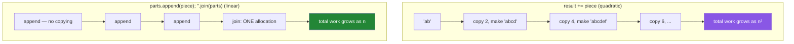

# 1.4 — Strings are immutable, and what that costs

## One-line answer

A string's value can never change, so every method that looks like it edits a string actually
**returns a new one** — which makes strings safe to share and to use as dictionary keys, and makes
building a large string by repeated `+=` quadratically slow.

---

## The story

A script cleans a log file. For each of the file's lines it appends the cleaned text to a growing
result:

```text
result = ""
for line in lines:
    result += clean(line) + "\n"
```

On the developer's test file of two hundred lines it is instant. It ships.

In production the log has eight hundred thousand lines. The script does not crash. It does not error.
It simply does not finish — still running after twenty minutes, with the processor busy and no output.

The bug is invisible because the code is correct. It produces the right answer, eventually. What is
wrong is the *cost*: because a string cannot be modified, `result += text` cannot append. It must
**build an entirely new string** containing everything `result` already held plus the new piece, then
point the name at it.

So the first iteration copies almost nothing, and the four hundred thousandth copies four hundred
thousand lines' worth of characters. The total work grows with the **square** of the number of lines.
Two hundred lines is instant; eight hundred thousand is effectively forever.

The fix is two lines and makes it instant again. But the fix is only findable if you know why a string
cannot be appended to — which is the same immutability that makes strings safe everywhere else.

---

## The idea in plain language

### Immutable means the value never changes

You met the classification in [1.1](1.1-identity-type-value.md): `str` is immutable. Concretely, once
a string object exists, its characters can never be altered. `name[0] = "S"` raises, because there is
no operation to alter it.

Every string method that appears to modify — `.upper()`, `.strip()`, `.replace()` — **returns a new
string** and leaves the original untouched. This is the single most common beginner mistake in Python:

```text
name = "  Setu  "
name.strip()          # computes a new string and throws it away
print(name)           # "  Setu  " - unchanged

name = name.strip()   # the assignment is what makes it stick
```

There is no `=` in the first version, so nothing was rebound ([1.2](1.2-names-are-labels.md)) and
nothing could have been mutated. The line was legal, did work, and discarded the result.

### What immutability buys

It is a genuine trade, and the benefits are large:

- **Safe to share.** Passing a string to a function cannot result in the caller's string changing —
  the entire class of bug from [1.2](1.2-names-are-labels.md) does not exist for strings.
- **Hashable, so usable as a dictionary key.** A dict key must not change, or the dict could never
  find it again ([2.5](../02-containers/2.5-hashability.md)). Every keyword argument name, every JSON
  field, every column name relies on this.
- **Cacheable.** Because the value cannot change, the interpreter can compute a string's hash once and
  reuse it, and can share one object between several identical literals.
- **Safe across threads** with no locking, because there is nothing to race on.

### What it costs

- **Every "modification" allocates.** A chain of five methods creates five strings, four of which are
  immediately garbage.
- **Repeated concatenation is quadratic.** The story. Building a string of *n* pieces with `+=` copies
  roughly *n²/2* characters in total.

The fix is to collect the pieces and join once:

```text
parts = []
for line in lines:
    parts.append(clean(line))
result = "\n".join(parts)
```

`.join` computes the total size once, allocates one string, and fills it. That is linear work rather
than quadratic, and on the story's file it is the difference between twenty minutes and a second.

**The general principle is worth more than the specific fix: when a value is immutable, accumulate in
a mutable container and convert once at the end.** The same shape appears with NumPy arrays on Day 20
and with DataFrames on Day 29 — building a DataFrame by repeatedly concatenating one row is the exact
same mistake with the same fix.



---

## Why Setu needs it

- **Day 7 is entirely string methods** (`PY-06`) — normalising five hundred messy paper titles with
  one chained expression. Every link in that chain returns a new string, and knowing so is what makes
  the chain readable rather than mysterious.
- **The join-not-concatenate rule reappears** on Day 29 (`PD-05`, iteration versus vectorisation) and
  Day 165 (chunking documents for retrieval), where the same quadratic mistake costs far more.
- **[2.5](../02-containers/2.5-hashability.md) needs immutability** to explain why a string can be a
  dict key and a list cannot.
- **Every dictionary in this project is keyed by strings** — configuration, JSON payloads, DataFrame
  columns — and that only works because strings cannot change under the dictionary.
- **Day 149's tokenization** (`SEQ-`) splits text into millions of pieces. Doing that with `+=` in a
  loop is the story at a scale where it genuinely does not finish.

---

## The mechanism

Prove that methods return rather than modify:

```python
"""Every string method returns a new string. The original never changes."""

original = "  Project Setu  "

print(f"original          : {original!r}  id={id(original)}")
stripped = original.strip()
print(f"after .strip()    : {stripped!r}  id={id(stripped)}")
print(f"original is still : {original!r}  id={id(original)}")
print(f"same object       : {original is stripped}")

print()
chained = original.strip().lower().replace(" ", "-")
print(f"chained           : {chained!r}")
print("intermediate strings created and discarded: 2")
```

**Line by line:**

- `{original!r}` — `repr`, so the leading and trailing spaces are visible as quotes rather than
  invisible whitespace. When a bug involves whitespace, `!r` is the difference between seeing it and
  not.
- `original.strip()` returns a **new** object with a different `id`, and `original` keeps its own.
  `original is stripped` is `False` — two objects, as in
  [1.1](1.1-identity-type-value.md)'s `first`/`second`.
- `original.strip().lower().replace(" ", "-")` — each call operates on the result of the previous one,
  so three calls create three strings. Two of them exist only long enough to be passed to the next
  method and are then garbage. **This is fine and idiomatic**; it becomes a problem only in a hot loop
  over large strings.
- Note there is no `=` on the `original.strip()` line in the first block, and `original` is therefore
  unchanged — [1.2](1.2-names-are-labels.md)'s rule, applied.

Now measure the story rather than believing it:

```python
"""The quadratic concatenation, timed against the linear join."""

import time

PIECES = ["line of text " * 4 for _ in range(20_000)]


def by_concatenation(pieces: list[str]) -> str:
    result = ""
    for piece in pieces:
        result += piece + "\n"
    return result


def by_join(pieces: list[str]) -> str:
    parts = []
    for piece in pieces:
        parts.append(piece)
    return "\n".join(parts) + "\n"


for name, function in (("+=  concat", by_concatenation), ("join      ", by_join)):
    start = time.perf_counter()
    out = function(PIECES)
    elapsed = time.perf_counter() - start
    print(f"{name}: {elapsed:7.4f}s   result length {len(out):,}")
```

**Line by line:**

- `["line of text " * 4 for _ in range(20_000)]` — twenty thousand pieces. `"text" * 4` repeats a
  string, which is one of the few operators strings support. `_` as a name is the convention for a
  loop variable you do not use.
- `result += piece + "\n"` — **the story's line.** Each iteration builds a whole new string containing
  everything so far. The work is quadratic even though the code reads as if it appends.
- `parts.append(piece)` — appending to a **list** is genuinely cheap, because a list is mutable
  ([2.2](../02-containers/2.2-what-in-place-means.md)) and appending does not copy what is already
  there.
- `"\n".join(parts)` — the separator is the string you call the method **on**, which is the correct
  and frequently-forgotten shape. It computes the total length, allocates once, and copies each piece
  exactly once.
- `time.perf_counter()` — the monotonic timer, as in
  [Day 3, 4.1](../../../day-03-keys-and-budget/parts/04-rate-budget/4.1-rpm-rpd-tpm.md).
- Run it, then **change `20_000` to `40_000`.** The join version takes about twice as long, which is
  linear. The concatenation version takes about four times as long, which is quadratic. That doubling
  experiment is the proof, and it is far more convincing than the single measurement.

And the property that makes strings usable as keys:

```python
"""Immutability is what allows hashing, which is what allows dict keys."""

key = "gemini"
print("hash is stable:", hash(key) == hash("gemini"))

config = {"gemini": 1, "groq": 2}
print("lookup        :", config["gemini"])

try:
    {["gemini"]: 1}
except TypeError as exc:
    print("list as key   :", exc)

interned_a = "setu"
interned_b = "setu"
print("two identical literals share an object:", interned_a is interned_b)

built = "se" + "tu"
runtime = "".join(["s", "e", "t", "u"])
print("compile-time joined literal is shared :", built is interned_a)
print("runtime-built string is shared        :", runtime is interned_a)
print("but they are all EQUAL                :", built == runtime == interned_a)
```

**Line by line:**

- `hash(key)` — a number derived from the value. Because a string's value can never change, its hash
  can never change, which is what lets a dictionary find it again
  ([2.5](../02-containers/2.5-hashability.md)).
- `{["gemini"]: 1}` raises `TypeError: unhashable type: 'list'`. A list's value *can* change, so its
  hash would be a moving target and the dictionary would lose track of it. **The restriction is a
  consequence of mutability, not an arbitrary rule.**
- `interned_a is interned_b` is typically `True` — the interpreter shares one object for identical
  short literals, an optimisation called **interning** that immutability makes safe.
- `built is interned_a` is typically `True` because the interpreter folds `"se" + "tu"` into one
  literal at compile time; `runtime is interned_a` is typically `False` because a string assembled at
  run time is a fresh object.
- **All three are `==`.** That last line is the point: interning is an implementation detail that
  affects `is` and never affects `==`, which is exactly why you compare strings with `==` and never
  with `is` ([3.2](../03-identity-trap/3.2-is-versus-equals.md)).

---

## When it breaks

**Trying to change a character:**

```text
>>> name = "setu"
>>> name[0] = "S"
Traceback (most recent call last):
  File "<stdin>", line 1, in <module>
TypeError: 'str' object does not support item assignment
```

**What it means.** Exactly what it says. Build a new string:
`name = name[0].upper() + name[1:]`, or `name.capitalize()`. Note that both produce a new object and
require an assignment to be visible.

**The method call that did nothing:**

```text
>>> title = "  Attention Is All You Need  "
>>> title.strip()
'Attention Is All You Need'
>>> len(title)
29
```

**What it means.** The method returned a stripped string, the interactive prompt printed it, and
nothing was assigned — so `title` still has its spaces. In a script there is not even the printed
output to hint at it; the line runs and vanishes. **A string method call whose result is not assigned
or passed is always a bug.** A linter's `B018`-style checks catch some of these
([Day 2, 1.2](../../../day-02-quality-gate/parts/01-linting/1.2-choosing-rule-families.md)).

**The story, as a symptom rather than an error:**

```text
$ time uv run python clean_logs.py
^C
real    21m14.882s
```

**What it means.** No traceback, no error, just a program that will not finish. When code is correct
and slow, the question is what operation is being repeated and what it costs each time — and
quadratic string building is one of the classic answers. The diagnostic is to run it on a tenth of the
input: if it takes a hundredth of the time, the cost is quadratic.

**And the encoding one, which is a different kind of surprise:**

```text
>>> s = "café"
>>> len(s)
4
>>> len(s.encode("utf-8"))
5
```

**What it means.** A `str` is a sequence of **characters**; `bytes` is a sequence of **bytes**, and a
non-ASCII character may take several. They are different types and neither converts implicitly
([1.5](1.5-why-str-plus-int-is-a-typeerror.md)). This is why every file read in this project passes
`encoding="utf-8"` explicitly
([Day 2, 3.2](../../../day-02-quality-gate/parts/03-pytest/3.2-fixtures-and-tmp-path.md)), and why a
character limit and a byte limit are different limits.

---

## In production

**"Accumulate in a mutable container, convert once" is a rule that outgrows strings immediately.**
Building a list by repeated concatenation, a NumPy array by repeated `append`, or a DataFrame by
repeatedly concatenating one row — all three are the same quadratic mistake, and all three appear in
this plan (Days 20, 29, 165). Recognising the *shape* is worth far more than remembering the string
case: whenever a loop rebuilds a whole collection each iteration, the cost is quadratic in disguise.

**Immutability is why strings are safe to use as identifiers everywhere.** Dictionary keys, cache keys,
column names, message-queue routing keys — all of them depend on the value being fixed for the
lifetime of the object. Languages with mutable strings have to defensively copy at every boundary, and
the bugs from forgetting are miserable. This is the same argument as
[1.2](1.2-names-are-labels.md)'s production section, from the other side: immutability removes a class
of question rather than answering it.

**Sensitive strings cannot be wiped, which is a real security consideration.** Because a string cannot
be modified, a password or a key held in a `str` stays in memory until it is garbage collected, and
you cannot overwrite it. Security-conscious code holds secrets in a mutable `bytearray` so it can be
zeroed, and avoids keeping them around at all. For this project's scale that is theory rather than
practice, but it is the reason
[Day 3, 1.3](../../../day-03-keys-and-budget/parts/01-secrets/1.3-when-a-key-leaks.md) is about
minimising exposure rather than about scrubbing.

**What changes at scale:** with very large text, memory becomes the binding constraint rather than
time, because every intermediate string in a chain exists simultaneously. Streaming processing —
handling one line at a time rather than loading a file — is the standard answer, and it is Day 11's
subject (`PY-11`, generators, streaming a 2 GB log line by line). The failure that only shows with
real data is the one where a 50 MB file works fine and a 5 GB file exhausts memory during an
intermediate step nobody thought of as a copy.

**The review comment a senior engineer leaves.** On a loop that builds a string with `+=`: *"Collect
into a list and join at the end. This is quadratic — fine for the test fixture, not for the real
file."*

**The interview question.** *"Why is building a string in a loop with `+=` slow, and what would you do
instead?"* The answer that lands explains rather than asserts: strings are immutable, so `+=` cannot
append — it allocates a new string containing everything so far plus the new piece, which makes the
total work grow with the square of the number of pieces. The fix is to accumulate in a list and
`join` once, which allocates once. Then generalise it — the same quadratic shape appears with arrays
and DataFrames — and, for the strongest version, mention that immutability is not a flaw being worked
around: it is what makes strings hashable, shareable and safe across threads, and the concatenation
cost is the price of those properties.

---

## Check yourself

```bash
uv run python -c "
import time
pieces = ['x' * 50] * 20000
t = time.perf_counter(); s = ''
for p in pieces: s += p
concat = time.perf_counter() - t
t = time.perf_counter(); s2 = ''.join(pieces)
join = time.perf_counter() - t
print(f'concat: {concat:.4f}s   join: {join:.4f}s   ratio: {concat / max(join, 1e-9):,.0f}x')
print('same result:', s == s2)
"
```

Then double `20000` to `40000` and run it again. The join time roughly doubles; the concat time
roughly quadruples. **That ratio changing is the proof that one is linear and the other is not.**

**Answer out loud, without scrolling up:**

> Explain why `title.strip()` on its own line does nothing, using the label model. Then say why `+=`
> on a string cannot append, and name two things immutability buys you that make the cost worth paying.

---

**Next:** [1.5 — Why `"3" + 3` is a `TypeError` and not a guess](1.5-why-str-plus-int-is-a-typeerror.md)
