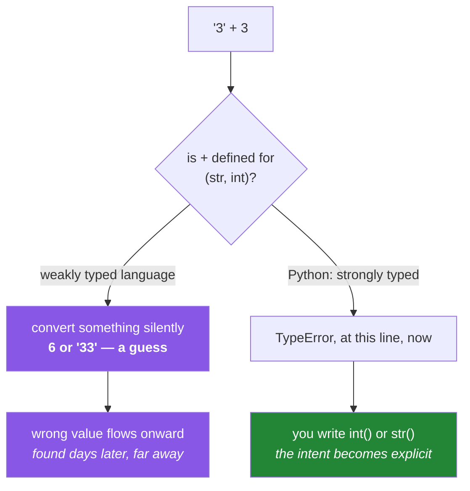

# 1.5 — Why `"3" + 3` is a `TypeError` and not a guess

## One-line answer

Python is **dynamically typed** — a name has no type, only objects do — and **strongly typed** — an
object's type is enforced rather than silently worked around — so `"3" + 3` raises immediately instead
of quietly deciding whether you meant `6` or `"33"`.

---

## The story

A form on a website collects a quantity. The value arrives as text, because everything from a web form
arrives as text. Somewhere downstream it is added to a running total.

In a language that converts types silently, `"3" + 3` produces something. Which something depends on
the language: some give `6`, some give `"33"`. Either way the program continues.

Suppose it gives `"33"`. The total is now a string. The next addition appends to it. The one after
that appends again. By the end of the batch the "total" is a forty-character string of concatenated
digits, and it gets written to a report field that happens to be text, so nothing complains.

Nobody notices for a week. When somebody does, the bug is at the *display* layer — a nonsense number
in a report — and the cause is a type conversion that happened silently, on one line, several
subsystems away, with no error and no log entry.

In Python that line raises:

```text
TypeError: can only concatenate str (not "int") to str
```

...immediately, at the exact line, on the first bad input, before anything downstream exists. **The
program stops instead of being wrong**, and the developer fixes it in a minute.

That is what "strongly typed" buys, and it is worth being able to explain why it is a feature rather
than an inconvenience.

---

## The idea in plain language

### Two independent axes, constantly confused

People say "typed" as if it were one property. It is two, and they are independent.

**Static versus dynamic** — *when* are types checked?

- **Static:** at compile time. The compiler knows every expression's type before the program runs and
  refuses to build code that misuses one.
- **Dynamic:** at run time. Types are attached to objects and checked when an operation happens.

Python is **dynamic**. As you saw in [1.2](1.2-names-are-labels.md), a name is a label with no type of
its own; `x = 5` then `x = "hello"` is legal because the type belongs to the object.

**Strong versus weak** — *how much* implicit conversion happens?

- **Strong:** the type is enforced. Mixing types that have no defined combination is an error.
- **Weak:** the language converts silently to make an operation work.

Python is **strong**. It will not guess.

Combining them gives four quadrants, and Python sits in the one people find least intuitive:
**dynamically and strongly typed.** Checked late, but checked properly.

|  | Weakly typed | Strongly typed |
|---|---|---|
| **Statically typed** | some older systems languages | many modern compiled languages |
| **Dynamically typed** | languages where `"3" + 3` silently produces something | **Python** |

### Why refusing is the right behaviour

`"3" + 3` has two defensible meanings — arithmetic on the number three, or concatenation producing
`"33"` — and no way to tell which was intended. A language that picks one is right roughly half the
time and silent about the other half.

Python's `+` is defined for two strings (concatenate) and for two numbers (add). For one of each it is
not defined, so it raises. **The error is the design**, not a gap in it.

The rule generalises: where an operation has no unambiguous meaning, Python raises rather than
choosing. The conversion is then yours to write, and writing it forces the decision to be explicit:

```text
int("3") + 3      # 6   - you said arithmetic
"3" + str(3)      # "33" - you said concatenation
```

### Where Python *does* convert, and why that is not a contradiction

Python converts implicitly in exactly one numeric case: mixing `int` and `float` promotes to `float`,
because the numeric tower has a defined, lossless-in-the-usual-direction ordering. `1 + 2.0` is `3.0`.

And `bool` is an `int` ([1.3](1.3-numbers-and-bool.md)), so `True + 1` is `2`. That is not a
conversion at all — `True` *is* an integer by inheritance.

Both are cases where the meaning is unambiguous. Nothing else converts.

### Type hints are not type checking

From Day 19 (`PY-23`) this project writes annotations like `def clean(title: str) -> str:`. It is worth
knowing now what they do at run time: **nothing.** Python does not check them, and passing an integer
to that function raises no error at the boundary.

They exist for a separate static checker, for editors, and for readers. They are documentation the
tooling can verify — which is genuinely valuable — but they do not make Python statically typed.



---

## Why Setu needs it

- **Everything from outside is a string.** Environment variables
  ([Day 3, 1.2](../../../day-03-keys-and-budget/parts/01-secrets/1.2-dotenv-and-os-environ.md)), CSV
  fields (Day 27), JSON from an API, form input. Every one of them needs a deliberate conversion, and
  Python's refusal to guess is what makes you write it.
- **Day 27 reads CSVs typed at read time** (`PD-02`) — the entire point of that day is that a column
  of digits is text until somebody says otherwise, and getting that wrong turns numeric analysis into
  string sorting.
- **pandas 3.0 infers strings to a real `str` dtype** rather than `object` (plan Part 2.2), which
  makes the type visible instead of hidden. Day 26 opens with it.
- **Day 19's Pydantic models** (`PY-23`) validate and convert at the boundary, which is this
  document's production answer, and the contract reused from Day 172 to Day 240.
- **`TypeError` is the error you will see most often for the next month**, and reading it precisely —
  which type, which operation — is a skill worth building on the day it first appears.

---

## The mechanism

Meet the refusal, and the three ways out:

```python
"""Python refuses to guess. You state the intent."""

quantity_text = "3"
quantity_number = 3

try:
    quantity_text + quantity_number
except TypeError as exc:
    print("str + int  ->", exc)

try:
    quantity_number + quantity_text
except TypeError as exc:
    print("int + str  ->", exc)

print()
print("arithmetic    :", int(quantity_text) + quantity_number)
print("concatenation :", quantity_text + str(quantity_number))
print("formatting    :", f"{quantity_text}{quantity_number}")
```

**Line by line:**

- `except TypeError as exc` — catching the specific class and printing its message. The two messages
  **differ by direction**: `can only concatenate str (not "int") to str` versus
  `unsupported operand type(s) for +: 'int' and 'str'`. Reading which one you got tells you which
  operand was on the left, which is a genuinely useful clue in a long expression.
- `int(quantity_text)` — an explicit conversion. It raises `ValueError` on text that is not a number,
  which is a *different* error from `TypeError` and a distinction worth holding: `TypeError` is "wrong
  kind of thing", `ValueError` is "right kind, unusable content".
- `str(quantity_number)` — the other direction, which never fails.
- `f"{a}{b}"` — an f-string calls `str()` on each value automatically, which is why formatting is the
  usual way to build a message from mixed types. Day 7 covers it properly (`PY-06`).
- **Three lines, three different intentions, all explicit.** That explicitness is what the `TypeError`
  bought.

Now see the two axes separately, because they are what people conflate:

```python
"""Dynamic: names have no type. Strong: objects' types are enforced."""

value = 5
print(f"value={value!r}  type={type(value).__name__}")
value = "five"
print(f"value={value!r}  type={type(value).__name__}   <- DYNAMIC: the name moved")
value = [5]
print(f"value={value!r}  type={type(value).__name__}")

print()
try:
    "5" * "2"
except TypeError as exc:
    print("str * str ->", exc, "   <- STRONG: no guessing")

print("str * int ->", repr("5" * 2), "  <- defined, and it means REPEAT, not multiply")
print("int + float ->", 1 + 2.0, "                    <- the ONE implicit numeric promotion")
print("bool + int  ->", True + 1, "                      <- not a conversion: bool IS an int")
```

**Line by line:**

- Rebinding `value` through three types with no complaint is **dynamic typing**. Nothing was
  converted; the label moved to different objects ([1.2](1.2-names-are-labels.md)).
- `type(value).__name__` — the type's name as a plain string, which reads better than
  `<class 'int'>` in output.
- `"5" * "2"` raises — **strong typing.** Multiplication of two strings has no meaning and Python
  will not invent one.
- `"5" * 2` is `"55"` — defined, and it means **repetition**, not arithmetic. This is a good example of
  Python defining an operation for a mixed pair when the meaning is unambiguous; there is exactly one
  sensible reading of "a string times an integer".
- `1 + 2.0` is `3.0` — the single implicit numeric promotion, up the tower from `int` to `float`
  ([1.3](1.3-numbers-and-bool.md)).
- `True + 1` is `2` — not a conversion at all. `bool` inherits from `int`, so no promotion is needed.
- **Read the last three lines together**: Python converts where meaning is unambiguous and refuses
  where it is not. That is the rule, and it explains every case.

And the boundary conversion, which is where this becomes engineering:

```python
"""Convert once, at the boundary, with the failure named."""

from __future__ import annotations


def parse_quantity(raw: str, *, field: str) -> int:
    """Turn external text into an int, or fail with a message naming the field."""
    text = raw.strip()
    if not text:
        raise ValueError(f"{field}: expected a whole number, got an empty value")
    try:
        return int(text)
    except ValueError:
        raise ValueError(f"{field}: expected a whole number, got {raw!r}") from None


ROWS = [{"qty": "3"}, {"qty": " 12 "}, {"qty": ""}, {"qty": "3.5"}, {"qty": "many"}]

total = 0
for index, row in enumerate(ROWS):
    try:
        total += parse_quantity(row["qty"], field=f"row {index}.qty")
    except ValueError as exc:
        print("rejected:", exc)
print("total of the valid rows:", total)
```

**Line by line:**

- `parse_quantity(raw: str, *, field: str) -> int` — the annotation says what it expects and returns.
  At run time it is **not enforced** ([the idea section](#the-idea-in-plain-language)); it documents,
  and a static checker verifies.
- `*` before `field` — keyword-only, so every call site says `field=...` and the error messages can
  never be attributed to the wrong column.
- `raw.strip()` — external data has whitespace. `int(" 12 ")` actually succeeds, but stripping first
  makes the empty-string case detectable before the conversion.
- `if not text:` — the empty string is falsy ([1.3](1.3-numbers-and-bool.md)), so this catches a blank
  field. It is checked **separately** because "missing" and "malformed" are different problems that
  usually deserve different handling.
- `except ValueError: raise ValueError(f"...{raw!r}") from None` — re-raise with the field name and the
  original text. `int("3.5")` raises `ValueError` because it is a well-formed *float*, not an integer —
  a genuinely common surprise. `from None` suppresses the chained traceback, keeping the useful message
  at the bottom ([Day 3, 1.2](../../../day-03-keys-and-budget/parts/01-secrets/1.2-dotenv-and-os-environ.md)).
- `{raw!r}` — the **original** value, unstripped and repr'd, so `" 12 "` and `"12"` are
  distinguishable in the message.
- `enumerate(ROWS)` — index and value together, so the error can say which row. A validation message
  without a location is a message that starts an investigation rather than ending one.
- **The whole shape is the production answer**: convert once at the boundary, fail loudly with
  context, and let everything downstream trust the type.

---

## When it breaks

**The one you will see most:**

```text
>>> "3" + 3
Traceback (most recent call last):
  File "<stdin>", line 1, in <module>
TypeError: can only concatenate str (not "int") to str
```

**What it means.** Left operand is a string, right is not. The message names both, which tells you
which side to convert. Decide whether you meant arithmetic or concatenation and write the conversion.

**The same mistake, reversed, with a different message:**

```text
>>> 3 + "3"
TypeError: unsupported operand type(s) for +: 'int' and 'str'
```

**What it means.** Identical cause, different wording because a different type's `+` was consulted
first. Recognising both phrasings as the same problem saves a moment of confusion each time.

**Right type, wrong content:**

```text
>>> int("3.5")
Traceback (most recent call last):
  File "<stdin>", line 1, in <module>
ValueError: invalid literal for int() with base 10: '3.5'
```

**What it means.** A `ValueError`, not a `TypeError` — the argument is the right *kind* of thing and its
*content* is unusable. `int(float("3.5"))` gives `3` if truncation is what you want, and choosing that
should be deliberate rather than automatic. **`TypeError` versus `ValueError` is a distinction worth
being precise about**, because they call for different fixes.

**Comparison, which Python also refuses:**

```text
>>> 3 < "3"
TypeError: '<' not supported between instances of 'int' and 'str'
```

**What it means.** Ordering across unrelated types has no meaning, so sorting a list of mixed types
raises. This bites when a column read from a file contains mostly numbers and one stray text value —
the sort works on the test fixture and fails on real data.

**And the silent one, which is not an error at all:**

```text
>>> values = ["10", "9", "100"]
>>> sorted(values)
['10', '100', '9']
```

**What it means.** Sorting strings **lexicographically**, which is correct for strings and wrong for
what you meant. No exception, no warning, a plausible-looking wrong answer. This is the shape of
failure Python's strictness *cannot* protect you from — the types are consistent, the intent is not —
and it is the same trap as comparing version numbers as strings on
[Day 1, 1.1](../../../day-01-pins/parts/01-versions/1.1-semantic-versioning.md). **Convert at the
boundary and this cannot happen downstream.**

---

## In production

**Convert once, at the boundary, and trust the types inside.** The professional shape is a thin edge
where external data — a request body, a CSV row, an environment variable — is parsed, validated and
converted into typed objects, after which the rest of the system never re-checks. The alternative,
defensive conversion scattered everywhere, is both slower and less safe, because every site is a place
someone can forget. Day 19's validating models (`PY-23`) formalise exactly this, and the contract they
define is reused from Day 172 to the capstone.

**Type hints plus a static checker recover most of what static typing gives you.** Annotations are
inert at run time, but a checker run in CI reads them and refuses code where the types cannot line up
— catching the `"3" + 3` class of mistake *before* the program runs, on paths that no test exercises.
The professional position is: hints on every public function, a checker in the gate, and validation at
the boundary for anything coming from outside the program, since a checker cannot know what a network
response contains. Adding a checker to `./m check`
([Day 2, 4.1](../../../day-02-quality-gate/parts/04-the-gate/4.1-what-m-check-actually-runs.md)) is the
natural next gate for this project.

**Weak typing's real cost is distance.** In a weakly typed language, a wrong type does not stop the
program; it produces a wrong value that flows onward, and the failure surfaces far from its cause —
the story's report field, a week later. Strong typing converts a *distant, silent* failure into a
*local, loud* one, which is the same argument as
[Day 2, 4.1](../../../day-02-quality-gate/parts/04-the-gate/4.1-what-m-check-actually-runs.md)'s
ordering of gates: the value of an error is inversely proportional to how far it is from the mistake.

**What changes at scale:** with data pipelines, type errors stop being about single values and become
about **schemas**. A column that was integers last month and contains one text value this month breaks
a sort, a join, or a model — and it will not raise at the boundary unless something checks. The mature
answer is schema validation at ingestion with a contract that fails the pipeline rather than the
report: assert the dtype of every column after reading, not after aggregating. Day 27 and Day 34
(`describe()` as a data-quality report) are where this project builds that habit.

**The review comment a senior engineer leaves.** On code doing `int(row["qty"])` inline in business
logic: *"Parse this at the boundary where the row is read, with the field name in the error. Down here
we can't say which row failed, and we're doing the conversion in three places."*

**The interview question.** *"Is Python strongly or weakly typed? And statically or dynamically?"* Most
people answer one axis and blur the other. The answer that lands separates them: dynamic, because types
belong to objects rather than names and are checked at run time; and strong, because Python refuses
operations with no unambiguous meaning instead of converting silently — `"3" + 3` raises. Then give the
*reason it matters*: implicit conversion produces a wrong value that surfaces far from its cause, while
an immediate error is local and fixable in a minute. Adding that type hints are not run-time checks —
they serve a static checker — is the detail that separates people who have configured one from people
who have only read annotations.

---

## Check yourself

```bash
uv run python -c "
for expr in ('\"3\" + 3', '3 + \"3\"', '\"5\" * 2', '\"5\" * \"2\"', '1 + 2.0', 'True + 1', '3 < \"3\"'):
    try:
        print(f'{expr:12} -> {eval(expr)!r}')
    except TypeError as exc:
        print(f'{expr:12} -> TypeError: {exc}')
"
```

Predict all seven before running. Three raise and four do not, and being able to say *why* for each is
the whole of this document. (`eval` is used here only to print an expression next to its result — it is
not something to put in real code, because it executes whatever string it is given.)

**Answer out loud, without scrolling up:**

> Name the two independent typing axes and place Python on both. Then explain why raising on `"3" + 3`
> is better than converting, using how far the failure travels as the reason — and say what a type hint
> does at run time.

---

**Next:** [2.1 — The four containers: list, tuple, dict, set](../02-containers/2.1-the-four-containers.md)
