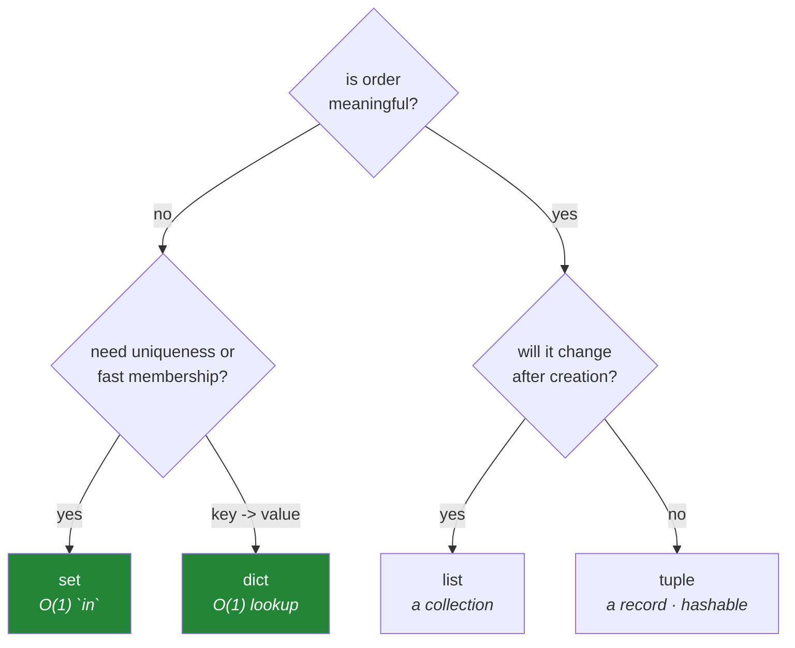

# 2.1 — The four containers — list, tuple, dict, set

## One-line answer

Python's four built-in containers differ on exactly three questions — **is it ordered, can it change,
does it allow duplicates** — and choosing the right one is not a style preference: it decides whether
a lookup takes a microsecond or a second.

---

## The story

A script de-duplicates arXiv paper identifiers. Ten thousand of them, some repeated.

The obvious version:

```text
unique = []
for paper_id in all_ids:
    if paper_id not in unique:
        unique.append(paper_id)
```

It reads perfectly. It is what anyone would write first. On the developer's sample of two hundred it
runs instantly.

On ten thousand it takes about four seconds. On a hundred thousand it does not finish while anyone is
watching.

The reason is the `in`. On a **list**, `x in items` has to check each element one at a time until it
finds a match or runs out — so as `unique` grows, every subsequent check gets slower, and the total
work grows with the square of the input.

Changing one word fixes it:

```text
unique = set()
for paper_id in all_ids:
    unique.add(paper_id)
```

A **set** answers `in` by computing a hash and looking in one place. It does not matter whether the
set holds ten items or ten million — the check costs about the same. A hundred thousand ids finish in
a fraction of a second.

Same logic. Same output. A different container, and a difference between four seconds and instant that
becomes the difference between minutes and never as the data grows.

---

## The idea in plain language

### The three questions

Every container answers three yes/no questions, and the four built-ins are four of the useful
combinations:

| | Ordered | Changeable (mutable) | Duplicates | Written as |
|---|---|---|---|---|
| **`list`** | yes | **yes** | yes | `[1, 2, 2]` |
| **`tuple`** | yes | no | yes | `(1, 2, 2)` |
| **`dict`** | yes (insertion order) | **yes** | keys unique | `{"a": 1}` |
| **`set`** | **no** | **yes** | **no** | `{1, 2}` |

Two footnotes that matter. Dictionaries preserve insertion order — that is a language guarantee since
Python 3.7, not an implementation accident. And sets have no order at all: printing one twice can give
different orders, and there is no "first" element.

### What each is actually for

**`list`** — an ordered, changeable sequence. The default when you have "several of these things" and
order means something. Fast to append and to index; slow to search.

**`tuple`** — an ordered, fixed sequence. Use it when the collection is a **record** rather than a
collection: a coordinate `(x, y)`, an RGB colour, a row returned from a database. The plan's own
phrasing is the right instinct — *a coordinate is a tuple and a to-do list is a list*. A to-do list
grows; a coordinate's second element is always the y value.

Being immutable, a tuple can be a dictionary key and a set member
([2.5](2.5-hashability.md)), which lists cannot.

**`dict`** — a mapping from keys to values. The workhorse of Python. Lookup by key is fast regardless
of size, for the same reason a set's `in` is fast: hashing.

**`set`** — an unordered collection of unique things. Two jobs: **membership testing** and **set
algebra** (union, intersection, difference). If you find yourself writing `if x not in list`, a set is
almost always the right answer.

### The performance table, which is the actual content

This is why the choice is not cosmetic:

| Operation | `list` | `set` / `dict` |
|---|---|---|
| `x in container` | scans — cost grows with size | one hash lookup — **constant** |
| append / add | fast | fast |
| index by position `c[3]` | **fast** | not supported (set) |
| look up by key | not supported | **fast** |
| keep order | **yes** | dict yes, set no |
| allow duplicates | **yes** | no |

**`in` is the row that changes programs.** Everything else is convenience; that row is the difference
between a script that finishes and one that does not.

### Big-O, in one paragraph, because you will meet the words

Computer scientists describe how cost grows with input size using "big-O" notation. `O(n)` means the
cost grows in proportion to the number of items — a list's `in`. `O(1)` means the cost is roughly
constant however many items there are — a set's `in`. `O(n²)` means it grows with the square, which is
what the story's loop does: `n` items, each doing an `O(n)` scan.

You do not need the theory. You need the reflex: **when a loop contains a search, ask what the search
costs.**



---

## Why Setu needs it

- **The plan names this exact example** (`PY-08`): de-duplicating ten thousand arXiv ids in linear
  rather than quadratic time, timed both ways. Day 8 does it properly; today is why it works.
- **[2.5](2.5-hashability.md) explains what makes a set fast**, and why the same property forbids a
  list from being a key.
- **Day 9's comprehensions** (`PY-09`) build all four of these, and building the wrong one is a
  performance bug hidden inside elegant syntax.
- **Every configuration in this project is a dict** — `pyproject.toml` parsed on
  [Day 1](../../../day-01-pins/parts/01-versions/1.2-version-specifiers.md), the receipt on
  [Day 3, 4.3](../../../day-03-keys-and-budget/parts/04-rate-budget/4.3-the-budget-as-a-receipt.md),
  every JSON payload from Day 172.
- **Day 155's vector search** is a membership-and-similarity problem at scale; the intuition that "a
  scan is fine until it is not" is the thing that makes an index feel necessary rather than arbitrary.

---

## The mechanism

Create all four and ask them the three questions:

```python
"""Four containers, three questions."""

items_list = [3, 1, 2, 3]
items_tuple = (3, 1, 2, 3)
items_dict = {"c": 3, "a": 1, "b": 2}
items_set = {3, 1, 2, 3}

for name, container in (
    ("list ", items_list),
    ("tuple", items_tuple),
    ("dict ", items_dict),
    ("set  ", items_set),
):
    kept_duplicates = len(container) == 4
    print(f"{name} {container!s:<28} len={len(container)} duplicates_kept={kept_duplicates}")

print()
print("list is indexable  :", items_list[0])
print("tuple is indexable :", items_tuple[0])
print("dict is keyed      :", items_dict["a"])
try:
    items_set[0]
except TypeError as exc:
    print("set is NOT indexable:", exc)
```

**Line by line:**

- `{3, 1, 2, 3}` — braces with bare values make a **set**, and the duplicate `3` disappears on
  creation. Braces with `key: value` pairs make a dict. `{}` alone is an **empty dict**, not an empty
  set — the empty set is `set()`, which is a genuine wart worth knowing once.
- `len(container) == 4` — the list and tuple keep the duplicate and have four elements; the set
  collapsed to three, and the dict has three keys. **Uniqueness is enforced at construction**, not by
  a later filter.
- `{container!s:<28}` — `!s` for `str()` and `:<28` to left-align in a fixed width, so the columns line
  up. Format specs combine like this, which Day 7 covers (`PY-06`).
- `items_set[0]` raises `TypeError: 'set' object is not subscriptable`. **A set has no order, so there
  is no element zero.** This is not a missing feature; positional access would have to invent an order
  that does not exist.
- Print the set a few times in a fresh interpreter each time and the ordering can differ. Never write
  code that depends on it.

Now measure the story, because the numbers are the argument:

```python
"""list `in` scans. set `in` hashes. The gap grows with the data."""

import time

for size in (1_000, 5_000, 20_000):
    ids = [f"arxiv:{n}" for n in range(size)] * 2

    start = time.perf_counter()
    unique_list: list[str] = []
    for paper_id in ids:
        if paper_id not in unique_list:
            unique_list.append(paper_id)
    list_time = time.perf_counter() - start

    start = time.perf_counter()
    unique_set: set[str] = set()
    for paper_id in ids:
        unique_set.add(paper_id)
    set_time = time.perf_counter() - start

    print(
        f"n={size:>6,}  list {list_time:7.4f}s   set {set_time:7.4f}s   "
        f"ratio {list_time / max(set_time, 1e-9):>7,.0f}x   same result: "
        f"{len(unique_list) == len(unique_set)}"
    )
```

**Line by line:**

- `[f"arxiv:{n}" for n in range(size)] * 2` — a list comprehension (Day 9's subject, `PY-09`) built and
  then repeated, so every id appears exactly twice and there is real de-duplication to do.
- `if paper_id not in unique_list` — the story's line. As `unique_list` grows, this scan gets longer
  every time.
- `unique_set.add(paper_id)` — no membership check needed at all. A set discards a duplicate silently,
  which is the second reason this version is shorter as well as faster.
- `unique_list: list[str] = []` — a type annotation on a local. Inert at run time
  ([1.5](../01-objects/1.5-why-str-plus-int-is-a-typeerror.md)), useful to a reader and a checker.
- **Read the `ratio` column across the three sizes.** It does not stay constant — it grows, because one
  side is linear and the other is quadratic. A single measurement would show a difference; the *trend*
  is what proves the difference is structural.
- `len(unique_list) == len(unique_set)` — confirming both approaches produce the same answer. A
  performance comparison between two things that do different work is meaningless.

And what the containers are *for*, beyond speed:

```python
"""A tuple is a record. A set does algebra. A dict maps."""

point = (12.5, 7.0)
x, y = point
print(f"tuple unpacks positionally: x={x} y={y}")

seen_yesterday = {"2401.001", "2401.002", "2401.003"}
seen_today = {"2401.002", "2401.004"}

print("new today      :", sorted(seen_today - seen_yesterday))
print("seen both days :", sorted(seen_today & seen_yesterday))
print("all ids        :", sorted(seen_today | seen_yesterday))
print("gone           :", sorted(seen_yesterday - seen_today))

counts: dict[str, int] = {}
for paper_id in ("a", "b", "a", "c", "a"):
    counts[paper_id] = counts.get(paper_id, 0) + 1
print("counts         :", counts)
```

**Line by line:**

- `x, y = point` — **tuple unpacking**, assigning both names in one statement. This is why a tuple is
  the right shape for a fixed-size record: the positions have meaning, so unpacking reads well. It is
  also how `cur.fetchone()` was unpacked on
  [Day 3, 3.1](../../../day-03-keys-and-budget/parts/03-databases/3.1-supabase-a-postgres-that-pauses.md).
- `seen_today - seen_yesterday` — set **difference**: in the left, not in the right. This one
  expression is "what is new", and writing it as a loop with an `if` would be three lines and slower.
- `&` intersection, `|` union — the other two operators. Set algebra turns a whole category of loop
  into a single expression, which is both faster and much easier to read correctly.
- `sorted(...)` around each — sets have no order, so printing one directly gives an arbitrary
  arrangement. **Sort at the boundary where a human or a test will read it**, or your output is
  unstable between runs.
- `counts.get(paper_id, 0) + 1` — `.get` with a default avoids a `KeyError` on the first occurrence.
  This is the counting idiom in its explicit form; `collections.Counter` does the same thing in one
  call, and Day 8 introduces it.
- `dict[str, int]` — a type annotation naming both key and value types, which is the modern spelling
  (`UP` would flag `Dict[str, int]`,
  [Day 2, 1.2](../../../day-02-quality-gate/parts/01-linting/1.2-choosing-rule-families.md)).

---

## When it breaks

**A set where you wanted order:**

```text
>>> ids = {"2401.003", "2401.001", "2401.002"}
>>> list(ids)
['2401.002', '2401.003', '2401.001']
```

**What it means.** Sets are unordered, so the output arrangement is arbitrary and may differ between
runs. A test asserting on the list form of a set is a flaky test
([Day 2, 3.2](../../../day-02-quality-gate/parts/03-pytest/3.2-fixtures-and-tmp-path.md)). Always
`sorted()` before comparing or displaying.

**Trying to change a tuple:**

```text
>>> point = (12.5, 7.0)
>>> point[0] = 13.0
Traceback (most recent call last):
  File "<stdin>", line 1, in <module>
TypeError: 'tuple' object does not support item assignment
```

**What it means.** Tuples are immutable, exactly like strings
([1.4](../01-objects/1.4-strings-are-immutable.md)) — same error wording, same reason. If the thing
needs to change, it was a list.

**The single-element tuple:**

```text
>>> not_a_tuple = (3)
>>> type(not_a_tuple)
<class 'int'>
>>> actual_tuple = (3,)
>>> type(actual_tuple)
<class 'tuple'>
```

**What it means.** Parentheses do not make a tuple; **the comma does.** `(3)` is just three in
brackets. This catches everyone once, usually via a function that receives a number where it expected
a one-element sequence.

**A key that is missing:**

```text
>>> config = {"gemini": 1}
>>> config["groq"]
Traceback (most recent call last):
  File "<stdin>", line 1, in <module>
KeyError: 'groq'
```

**What it means.** Bracket access on a dict raises when the key is absent, which is often what you
want — a required setting missing should stop the program
([Day 3, 1.2](../../../day-03-keys-and-budget/parts/01-secrets/1.2-dotenv-and-os-environ.md)). Use
`.get(key)` when absence is a legitimate state to branch on, and `.get(key, default)` when there is a
sensible fallback.

**And the one that is not an error, just slow:**

```text
$ time uv run python dedupe.py
real    6m41.203s
```

**What it means.** The story. No traceback, no warning — the code is correct and the container is
wrong. The diagnostic is the same as
[1.4](../01-objects/1.4-strings-are-immutable.md)'s: run it on a tenth of the data and see whether the
time drops by ten (linear) or by a hundred (quadratic).

---

## In production

**Choosing a container is a performance decision made at design time and very expensive to change
later.** By the time a `list`-based membership check is the bottleneck, it is usually threaded through
code that relies on ordering or indexing, and swapping it is a refactor rather than an edit. The habit
that avoids it: whenever you write a collection, say out loud what you will *do* with it — search it,
iterate it, index it, keep it unique — and pick from the table. That takes ten seconds.

**"A scan is fine until it is not" is the intuition behind every index in computing.** A database
index, a search engine's inverted index, and a vector store's approximate-nearest-neighbour index all
exist for the reason a set exists: turning a scan of everything into a direct lookup. When you meet
Day 47's database indexes and Day 155's vector stores, they are this document's idea applied to data
too large for memory. Understanding it here, where it costs four seconds, makes it obvious there.

**Insertion-ordered dictionaries are a guarantee you may now rely on, and it changed how Python code
is written.** Before it was guaranteed, code needed an ordered variant to preserve key order for JSON
output or configuration. Now a plain dict does it. The general lesson is worth noting: it is worth
knowing *which* behaviours of your tools are guaranteed and which are implementation details that
happen to work — set ordering and small-integer caching
([3.2](../03-identity-trap/3.2-is-versus-equals.md)) are the latter, and code that depends on them
breaks on an upgrade.

**What changes at scale:** memory becomes the constraint. Sets and dicts trade space for speed — they
keep a hash table with deliberate empty slots — so de-duplicating a hundred million ids in a set may
not fit in RAM, which is the same ceiling as
[Day 3, 2.4](../../../day-03-keys-and-budget/parts/02-llm-doors/2.4-ollama-the-keyless-door.md)'s.
The professional answers are to process in chunks, to use a probabilistic structure such as a Bloom
filter when an occasional false positive is acceptable, or to push the work into a database that
already solved it. And for numeric data, none of the four is the right answer at all — that is what
Day 20's `ndarray` is for (`NP-01`), where a million floats are one block of memory rather than a
million objects.

**The review comment a senior engineer leaves.** On `if item not in results:` inside a loop: *"That's
a linear scan inside a loop — quadratic on the full dataset. Use a set for the membership check and
keep the list for order if you need it."*

**The interview question.** *"How would you remove duplicates from a large list while preserving
order?"* The naive answer is the story's loop, and the follow-up is "what's the complexity?" The answer
that lands uses a set for membership and a list for order together — iterate once, check
`if item not in seen`, add to both — giving linear time with the ordering kept. Then note what it
costs: extra memory proportional to the data, which is the trade sets always make. If you add that
`dict.fromkeys(items)` does the same in one expression because dicts preserve insertion order and
enforce unique keys, you are showing that you know *why* the dictionary guarantee matters rather than
just that it exists.

---

## Check yourself

```bash
uv run python -c "
import time
ids = [f'id{n}' for n in range(15000)] * 2
t = time.perf_counter(); seen_l = []
for i in ids:
    if i not in seen_l: seen_l.append(i)
lt = time.perf_counter() - t
t = time.perf_counter(); seen_s = set(ids)
st = time.perf_counter() - t
print(f'list {lt:.4f}s   set {st:.6f}s   ratio {lt / max(st, 1e-9):,.0f}x   equal: {len(seen_l) == len(seen_s)}')
print('order-preserving one-liner:', list(dict.fromkeys(['b','a','b','c']))) 
"
```

Then change `15000` to `30000`. The set time roughly doubles; the list time roughly quadruples. That
difference in how they grow is the entire content of this document.

**Answer out loud, without scrolling up:**

> Give the three questions that distinguish the four containers, and answer them for each. Then
> explain why `x in a_list` gets slower as the list grows while `x in a_set` does not — and name the
> resource a set spends to buy that.

---

**Next:** [2.2 — Mutable versus immutable, and what "in place" actually means](2.2-what-in-place-means.md)
