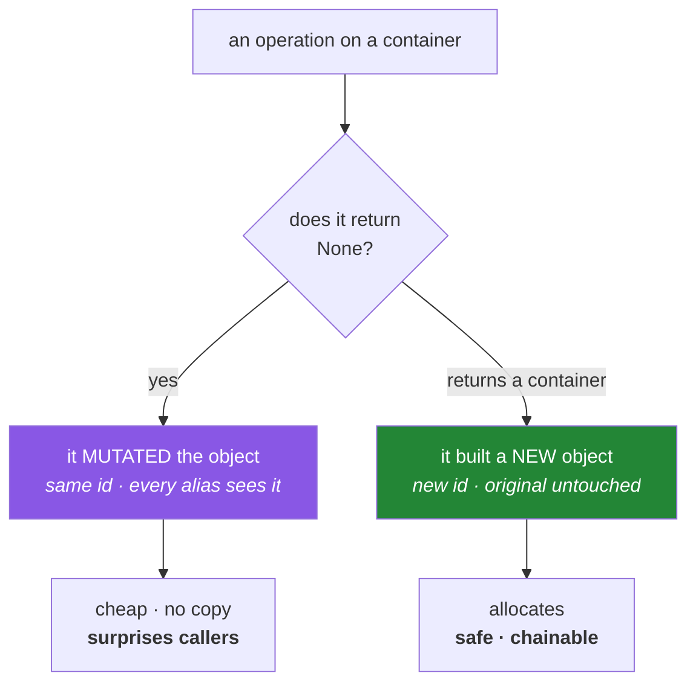

# 2.2 — Mutable versus immutable, and what "in place" actually means

## One-line answer

An operation is **in place** when it changes an existing object and returns `None`, and it is **not**
in place when it builds a new object and returns it — and Python's standard library pairs the two so
consistently (`sort`/`sorted`, `reverse`/`reversed`) that once you see the pattern you can predict
almost any method's behaviour from its name.

---

## The story

You ask a friend to put your bookshelf in alphabetical order, and you stand there with your hands
out, waiting.

They do it. They pull the books out, sort them, and slide them back. Then they turn round, and there
is nothing in their hands to give you, because the tidy shelf **is the shelf you already own**. You
are standing there holding nothing, looking slightly confused, next to a perfectly alphabetised
bookshelf.

There is another kind of friend, who takes your books away, arranges a copy on a new shelf, and hands
you the new shelf. That friend gives you something back. Your old shelf is untouched.

Both are reasonable. What matters is knowing which one you asked, because if you expect a new shelf
and got a tidied one, your hands are empty and you will not work out why by staring at the shelf.

Python has both kinds, and it never mixes them up:

```text
def top_five(names):
    ranked = names.sort()
    return ranked[:5]
```

This crashes immediately:

```text
TypeError: 'NoneType' object is not subscriptable
```

The first reaction is bafflement. `names.sort()` clearly *did* something — there is no error on that
line. So why is `ranked` empty-handed?

Because `list.sort()` is the tidying friend. It rearranges the list you gave it and hands back
nothing at all. It even rearranged the caller's list along the way, which nobody asked for
([1.2](../01-objects/1.2-names-are-labels.md)). The name `ranked` now means *nothing*, and you cannot
take the first five of nothing.

Swapping in `sorted(names)` fixes both problems at once: you get a new sorted list back, and the
caller's list stops being quietly reordered behind their back.

It is a five-second fix once you know the rule and a twenty-minute stare when you do not, because the
error names the symptom — *nothing cannot be sliced* — rather than the cause.

---

## The idea in plain language

### Two kinds of operation, one reliable signal

You know from [1.1](../01-objects/1.1-identity-type-value.md) that a mutable object's value can change
while its identity stays the same. That gives every operation two possible shapes:

|  | In place | Building a new object |
|---|---|---|
| What changes | the existing object | nothing — a new object is made |
| Identity afterwards | **same** `id` | **different** `id` |
| Return value | **`None`** | the new object |
| Other names for the object | all see the change | see nothing |
| Available on immutable types | no | yes |
| Typical spelling | `items.sort()` | `sorted(items)` |

**The return value is the signal.** A method that returns `None` almost certainly mutated something —
that is a deliberate convention in Python's standard library, and it exists so that a mistake like the
story's fails loudly instead of silently.

### The paired vocabulary

Python pairs these so consistently it is worth memorising as a table rather than case by case:

| Mutates (returns `None`) | Returns a new object | Works on |
|---|---|---|
| `items.sort()` | `sorted(items)` | any iterable → list |
| `items.reverse()` | `reversed(items)` | any sequence → iterator |
| `items.append(x)` | `items + [x]` | list |
| `items.extend(other)` | `items + other` | list |
| `d.update(other)` | `d \| other` | dict |
| `s.add(x)` | `s \| {x}` | set |
| — | `items.copy()` | any container |

Note the left column is all **methods on the object**, and the right column is mostly **functions or
operators**. That is not a coincidence: `sorted()` is a function precisely because it works on anything
iterable, including immutable things that could never have a `.sort()` method.

### Why `+=` is the confusing one

`+=` looks like assignment, so it looks like it must rebind. On a list it does not:

- On a **mutable** object, `x += y` calls the in-place add, mutating `x` and keeping its identity.
- On an **immutable** object, there is no in-place add, so Python falls back to `x = x + y` — a new
  object and a rebound name.

You met this in [1.2](../01-objects/1.2-names-are-labels.md). It is worth restating here because it is
the one place where the "look for a bare `=`" rule gives the wrong answer.

### The design question underneath

When you write a function, you choose which shape it has. The trade:

- **In place** avoids allocating a copy, which matters when the data is large.
- **Returning new** cannot surprise the caller, and lets calls be chained.

The professional default is **return new**, and mutate only when there is a reason — with a name that
says so. That is [1.2](../01-objects/1.2-names-are-labels.md)'s production advice, arrived at from the
other direction.



---

## Why Setu needs it

- **[2.3](2.3-aliasing-two-names-one-object.md) and
  [3.1](../03-identity-trap/3.1-the-mutable-default-argument.md)** are both about mutation reaching
  somewhere it was not expected. Neither is possible without an in-place operation.
- **pandas 3.0 removed `inplace=True` from most operations** (plan Part 2.2, Day 26) precisely because
  the confusion this document describes cost the ecosystem years. Knowing the underlying distinction is
  what makes that change read as a simplification rather than a removal of a feature.
- **NumPy's `arr.sort()` versus `np.sort(arr)`** on Day 23 is the identical pairing, on an array where
  a copy costs real memory.
- **Day 10's first `src/setu/` module** (`PY-10`) is where you first choose this for your own
  functions, and the choice becomes the module's contract.
- **From Day 192, a graph node returning updated state** rather than mutating it is what makes
  checkpointing and time travel work at all — a mutated object has no previous version to go back to.

---

## The mechanism

Watch identity and return value together, which is the only way to be certain:

```python
"""Same intent, two shapes. Identity and return value tell you which is which."""

papers = [{"id": "a", "score": 3}, {"id": "b", "score": 9}, {"id": "c", "score": 5}]

print("--- in place: list.sort() ---")
before = id(papers)
returned = papers.sort(key=lambda p: p["score"], reverse=True)
print("returned      :", returned)
print("same object   :", id(papers) == before)
print("papers now    :", [p["id"] for p in papers])

papers = [{"id": "a", "score": 3}, {"id": "b", "score": 9}, {"id": "c", "score": 5}]

print("\n--- new object: sorted() ---")
before = id(papers)
returned = sorted(papers, key=lambda p: p["score"], reverse=True)
print("returned      :", [p["id"] for p in returned])
print("papers is same:", id(papers) == before)
print("papers now    :", [p["id"] for p in papers])
```

**Line by line:**

- `key=lambda p: p["score"]` — the function used to derive the value each element is sorted by. A
  lambda is an anonymous one-expression function; Day 11 covers them (`PY-12`). Sorting dictionaries
  by a field is one of the few places a lambda is clearly the right tool.
- `reverse=True` — descending. Both `sort` and `sorted` take the same keyword arguments, which is part
  of the pairing being deliberate.
- `returned = papers.sort(...)` prints **`None`**. That is the story's line, isolated. The list *was*
  sorted; the method simply had nothing to give back.
- `id(papers) == before` is `True` for `sort` — same object, changed contents — and `True` for `sorted`
  as well, because `sorted` did not touch `papers` at all. **Read those two together**: in the first
  the object changed, in the second it did not.
- `[p["id"] for p in papers]` after each — in the first block the order is now `b, c, a`; in the second
  it is still `a, b, c` and the new order lives only in `returned`.
- Note the second block **rebuilds `papers`** first. A demonstration that sorts an already-sorted list
  proves nothing, and forgetting to reset state between experiments is its own recurring mistake.

Now the whole paired vocabulary at once:

```python
"""Every pair, side by side. The right column never touches the left's object."""

base = [3, 1, 2]

pairs = [
    ("sort / sorted", lambda x: x.sort(), lambda x: sorted(x)),
    ("reverse / reversed", lambda x: x.reverse(), lambda x: list(reversed(x))),
    ("append / +", lambda x: x.append(9), lambda x: x + [9]),
    ("extend / +", lambda x: x.extend([9]), lambda x: x + [9]),
]

for label, mutating, building in pairs:
    left = base.copy()
    mutated_return = mutating(left)

    right = base.copy()
    built_return = building(right)

    print(f"{label:22}")
    print(f"   mutating  -> returned {mutated_return!r:<12} object now {left}")
    print(f"   building  -> returned {built_return!r:<12} object now {right}")
```

**Line by line:**

- `base.copy()` before each experiment — a fresh list every time, so one pair's mutation cannot affect
  the next. `.copy()` is a **shallow** copy, which matters enormously for nested data and is
  [2.4](2.4-shallow-and-deep-copy.md)'s subject; for a flat list of integers it is exactly right.
- `lambda x: x.sort()` — the lambda returns whatever `x.sort()` returns, which is `None`. That is the
  point of the demonstration rather than a bug in it.
- `list(reversed(x))` — `reversed` returns an **iterator**, not a list, so it prints as
  `<list_reverseiterator object ...>` unless materialised. Iterators are Day 11's subject (`PY-11`);
  today just know that some "returns new" operations return something lazy.
- The output's left column is `None` on every mutating row and a real container on every building row.
  **That column is the rule, demonstrated four times.**
- `{mutated_return!r:<12}` — `repr` then left-align. `!r` makes `None` visibly `None` rather than an
  empty space, which is exactly the confusion the story ran into.

And `+=`, which breaks the "look for a bare `=`" rule:

```python
"""`+=` mutates a list and rebinds a tuple. The type decides, not the syntax."""

for label, start, addition in (("list ", [1, 2], [3]), ("tuple", (1, 2), (3,))):
    value = start
    alias = value
    before = id(value)
    value += addition
    print(
        f"{label}: value={value!s:<12} alias={alias!s:<12} "
        f"same object as before: {id(value) == before}"
    )
```

**Line by line:**

- `alias = value` — a second label, so a mutation is observable ([2.3](2.3-aliasing-two-names-one-object.md)).
- `value += addition` on the **list** mutates: `alias` shows `[1, 2, 3]` and the id is unchanged.
- The same line on the **tuple** rebinds: `alias` still shows `(1, 2)` and the id has changed, because
  a new tuple was built.
- `(3,)` — the comma makes it a tuple ([2.1](2.1-the-four-containers.md)).
- **One line of source, two behaviours, decided entirely by the type of the object on the left.** This
  is why the reliable question is not "what does the syntax look like" but "is this object mutable" —
  and it is the one exception to the rule of thumb from
  [1.2](../01-objects/1.2-names-are-labels.md).

---

## When it breaks

**The story, in full:**

```text
>>> ranked = papers.sort(key=lambda p: p["score"])
>>> ranked[:5]
Traceback (most recent call last):
  File "<stdin>", line 1, in <module>
TypeError: 'NoneType' object is not subscriptable
```

**What it means.** `sort` returned `None`. **Whenever a traceback says `'NoneType' object ...`, look
for a method whose result you captured that was never meant to give one.** That single reading habit
resolves a large fraction of beginner tracebacks, because the error always appears at the *use* of
`None`, not at its creation.

**The same cause, further away:**

```text
Traceback (most recent call last):
  File "pipeline.py", line 84, in summarise
    for row in ranked:
TypeError: 'NoneType' object is not iterable
```

**What it means.** `None` was produced on line 12 and passed through three functions before something
tried to iterate it. This is the *distance* problem from
[1.5](../01-objects/1.5-why-str-plus-int-is-a-typeerror.md): the error is loud but far from its cause.
The fix is at the assignment, not at the loop.

**Mutating something that cannot be mutated:**

```text
>>> point = (3, 1, 2)
>>> point.sort()
Traceback (most recent call last):
  File "<stdin>", line 1, in <module>
AttributeError: 'tuple' object has no attribute 'sort'
```

**What it means.** Immutable types do not have in-place methods, because there is nothing to change in
place. The error is `AttributeError` rather than `TypeError` — the method simply does not exist. Use
`sorted(point)`, which returns a **list**, because there is no way to produce a "sorted tuple" in
place. Note that the return type changed; that surprises people.

**Chaining a method that returns `None`:**

```text
>>> names = ["b", "a"]
>>> names.sort().reverse()
Traceback (most recent call last):
  File "<stdin>", line 1, in <module>
AttributeError: 'NoneType' object has no attribute 'reverse'
```

**What it means.** In-place methods cannot be chained, by design — returning `None` makes the attempt
fail immediately rather than silently doing the wrong thing. This is the convention working as
intended: **the loud failure is the feature.**

**And the pandas one you will meet on Day 26:**

```text
>>> df.sort_values("score", inplace=True)
TypeError: sort_values() got an unexpected keyword argument 'inplace'
```

**What it means.** pandas 3.0 removed `inplace=` from most operations, because it never actually
avoided the copy it appeared to avoid and it caused exactly the confusion in this document. The fix is
`df = df.sort_values("score")` — the "return new" shape, made the only shape. Most material online
predates the change (plan Part 2.2).

---

## In production

**Return new by default; mutate only for a reason, and name it.** The reason is almost always size —
copying a large array or DataFrame costs real memory and time. Below that threshold, the safety of
returning a new object is worth more than the allocation, because a mutating function is a function
whose effects you cannot see from the call site. When you do mutate, the name must say so:
`normalise_in_place`, `sort_in_place`. The standard library's pairing is the model to copy.

**pandas' removal of `inplace=` is a case study worth knowing.** The argument existed to avoid copies,
but in most implementations it did not — it made a copy and then rebound internally, so users paid the
memory cost *and* got the confusing semantics. Removing it made the library simpler and the behaviour
predictable. The general lesson: **an API that offers two shapes for the same operation doubles the
number of things a reader must know, and the saving must be real to justify it.**

**Mutation and concurrency are the same problem in a worse costume.** Two threads mutating one list
interleave in ways that corrupt it, and the failure is intermittent and unreproducible. Immutable data
removes the question entirely, which is why concurrent and distributed systems lean so heavily on
"produce a new value" rather than "edit in place". Day 19's concurrency work (`PY-24`) meets this, and
from Day 192 the checkpointed graph depends on it: **you cannot restore a previous state that was
overwritten.**

**What changes at scale:** the trade-off inverts. Copying a thousand-element list is free; copying a
ten-million-row DataFrame is not, and at that size in-place operations and views become necessary
rather than optional. This is why NumPy exposes both and why its slicing produces views rather than
copies (Day 21, `NP-03`) — a decision that buys enormous performance and imports every hazard in this
document. The professional position is to know which regime you are in and to be explicit about it,
rather than applying one rule everywhere.

**The review comment a senior engineer leaves.** On a function that sorts its argument and returns
`None`: *"Either return a new list or rename this to say it mutates. Also — the caller passed us their
list; do they expect us to reorder it?"*

**The interview question.** *"What's the difference between `list.sort()` and `sorted()`?"* The
one-line answer is that one mutates and returns `None` and the other returns a new list. The answer
that lands goes further: `sorted()` is a *function* because it works on any iterable including
immutable ones, while `.sort()` is a method that only a mutable sequence can offer — and the
`None` return is a deliberate convention that makes misuse fail loudly instead of silently. Then give
the design guidance: prefer the non-mutating form unless the data is large enough that the copy
matters, and if you mutate, say so in the name. Mentioning that pandas removed `inplace=` for
precisely this reason shows you have followed the argument beyond the language itself.

---

## Check yourself

```bash
uv run python -c "
items = [3, 1, 2]
print('sort returns   :', items.sort())
print('items now      :', items)
items = [3, 1, 2]
print('sorted returns :', sorted(items))
print('items now      :', items)
t = (1, 2); a = t; t += (3,)
print('tuple += rebinds:', t, a, t is a)
l = [1, 2]; b = l; l += [3]
print('list  += mutates:', l, b, l is b)
"
```

Predict all six lines. The two `+=` results are the ones worth being sure about, because they are the
same syntax with opposite outcomes.

**Answer out loud, without scrolling up:**

> Give the one-glance signal that tells you an operation mutated rather than returned something new,
> and say why Python's library chose that convention. Then explain why `+=` on a list and on a tuple
> behave differently, without saying "because tuples are immutable" — say what Python actually does in
> each case.

---

**Next:** [2.3 — Aliasing: two names, one object](2.3-aliasing-two-names-one-object.md)
